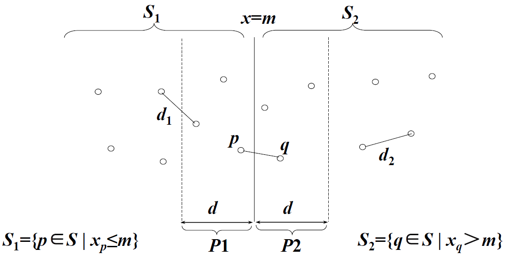
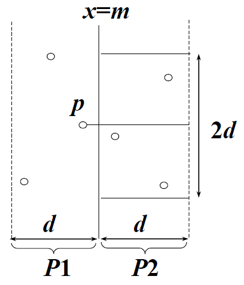

<!--more-->

## 问题描述

给定平面上 \(m\) 个点的集合 \(S\)，找其中的一对点使得在 \(n\) 个点组成的所有点对中，该点对间的距离最小。

## 问题分析

### 简单情形：一维数轴

为了使问题易于理解和分析，先来考虑一维的情形。此时 \(S\) 中的 \(n\) 个点退化为 \(x\) 轴上的 \(n\) 个实数 \(x_1, x_2, \cdots, x_n\)。最接近点对即为这 \(n\) 个实数中相差最小的 \(2\) 个实数。

假设用 \(x\) 轴上某个点 \(m\) 将 \(S\) 划分为小于 \(m\) 的子集 \(S_1\) 和大于 \(m\) 的子集 \(S_2\)。基于平衡子问题的思想，用 \(S\) 中各点坐标的中位数来作分割点。在 \(S_1\) 中找出其最近点对 \(\{p_1, p_2\} (p_1 > p_2)\)，在 \(S_2\) 中找出其最近点对 \(\{q_1, q_2\} (q_1 < q_2)\)。于是最短距离分别为

$$
\begin{aligned}
d_{S_1} &= \left | p_1 - p_2 \right | \\
d_{S_2} &= \left | q_1 - q_2 \right |
\end{aligned}
$$

递归地，\(S\) 中的最近点对要么是 \(\{p_1, p_2\}\)，要么是 \(\{q_1, q_2\}\)，要么是某个点对 \(\{p_3, q_3\}\)，其中 \(p_3 \in S_1\) 且 \(q_3 \in S_2\)。从而用线性时间就可以将 \(S_1\) 的解和 \(S_2\) 的解合并成为 \(S\) 的解。

$$
\begin{aligned}
d = \min (d_{S_1}, d_{S_2}, q_3 - p_3)
\end{aligned}
$$

### 复杂情形：二维平面

选取一垂直线 \(l:x=m\) 来作为分割直线。其中 \(m\) 为 \(S\) 中各点 \(x\) 坐标的中位数。由此将 \(S\) 分割为 \(S_1\) 和 \(S_2\) 两个半平面。

递归地在 \(S_1\) 和 \(S_2\) 上找出其最小距离 \(d_1\) 和 \(d_2\) 并设 \(d=\min(d_1, d_2)\)。\(S\) 中的最接近点对要么是 \(d\)，要么是某个 \(\{p, q\}\)，其中 \(p \in S_1\) 且 \(q \in S_2\)。如图所示：

对于点 \(p \in P_1\)，需要考察 \(P_2\) 中的各个点和点 \(p\) 之间的距离是否小于 \(d\)。显然 \(P_2\) 中这样点的 \(y\) 轴坐标一定位于区间 \([y-d, y+d]\) 之间，而且，这样的点不会超过 \(6\) 个。

**快速检查 \(6\) 个点的方法**

- 将 \(P_1\) 和 \(P_2\) 中所有 \(S\) 中点按其 \(y\) 坐标排好序（预处理）。
- 对 \(P_1\) 中所有点，对排好序的点列作一次扫描。
- 对 \(P_1\) 中每一点最多只要检查 \(P_2\) 中排好序的相继 \(6\) 个点。

## 算法分析

一维简单情形和二维情形的时间复杂度均为

$$
\begin{aligned}
T(n) &= 2 T\left( \frac{n}{2} \right) + O(n) \\
&= O(n \log {n})
\end{aligned}
$$
