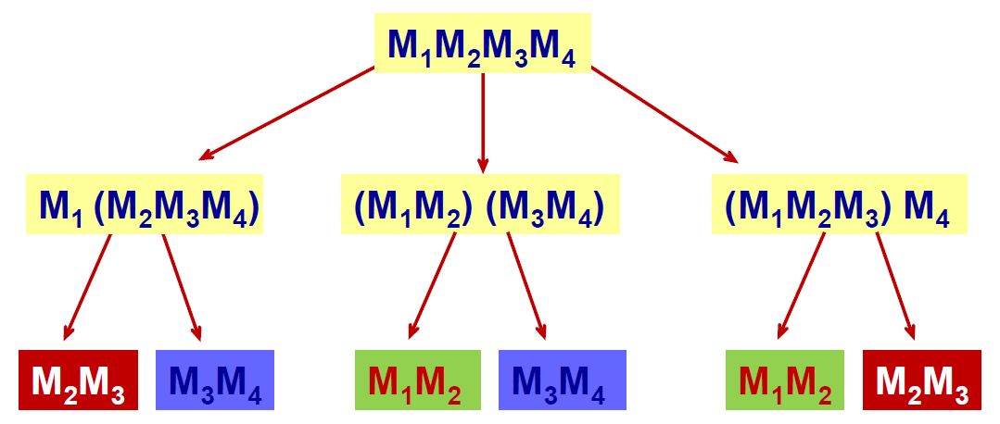

<!--more-->

## 问题描述

两矩阵 \(A\) 和 \(B\) 其维数分别是 \(p \times q\) 和 \(q \times r\)，这两个矩阵相乘需进行 \(p \times q \times r\) 次乘法。

如果是多个矩阵连乘，乘法计算次数会因为计算顺序的不同而有较大差异。矩阵乘法满足结合律，是不是可以通过结合律提高多个矩阵连乘的运算速度？那么，如何运用乘法结合律最小化 \(n\) 个矩阵连乘的乘法运算次数？

## 问题分析

首先，很容易可以证明，矩阵连乘具有子问题重叠性。如图所示：



令 \(m[i,j]\) 表示 \(M_i M_{i+1} \cdots M_j\) 的最小乘法次数，则 \(m[1,n]\) 表示 \(M_1 M_2 \cdots M_n\) 的最小乘法次数。

我们把加括号的过程想象成切割，左边加一对括号，右边加一对括号，原问题就被分解成两个子问题。考虑在 \(k\) 处断开，于是有如下状态转移方程：

$$
\begin{aligned}
m[i,j] = \min_{i \leqslant k < j}{m[i,k] + m[k+1,j] + r_i \times c_k \times c_j}
\end{aligned}
$$

其中 \(r\) 和 \(c\) 分别矩阵的行和列。

接下来确定计算顺序，自底向上计算。\(i=j\) 时，仅表示一个矩阵，乘法次数为 0。由于 \(i<j\) 恒成立，因此矩阵只用到上三角。

## 算法代码

### 动态规划算法

```cpp
int matrixMultiply(vector<int> &p) {
    int N = p.size() - 1;
    // 实际上只有N-1个矩阵，为了方便编程，0下标不用
    vector<vector<int>> D(N + 1, vector<int>(N + 1, 0));
    vector<vector<int>> res(N + 1, vector<int>(N + 1, 0));
    // 动态规划
    for (int len = 1; len <= N; ++len) // 控制长度
    {
        for (int i = 1; i + len <= N; ++i) {
            int j = i + len, k = 0;
            int min = 0x7fffffff, minK = 0;
            for (k = i; k < j; ++k) {
                if (min > D[i][k] + D[k + 1][j] + p[i - 1] * p[k] * p[j]) {
                    min = D[i][k] + D[k + 1][j] + p[i - 1] * p[k] * p[j];
                    minK = k;
                }
            }
            D[i][j] = min;
            res[i][j] = minK;
        }
    }
    // 输出结果
    printMatrixChain(res, 1, N);
    return D[1][N];
}
```

### 递归输出

```cpp
void printMatrixChain(vector<vector<int>> &res, int i, int j) {
    if (i == j) {
        cout << i;
        return;
    }
    if (i < res[i][j]) {
        cout << '(';
    }
    printMatrixChain(res, i, res[i][j]);
    if (i < res[i][j]) {
        cout << ')';
    }
    if (res[i][j] + 1 < j) {
        cout << '(';
    }
    printMatrixChain(res, res[i][j] + 1, j);
    if (res[i][j] + 1 < j) {
        cout << ')';
    }
}
```

### 主调函数

```cpp
int main() {
    vector<int> p = {2, 3, 7, 9, 5, 2, 4};
    cout << endl
         << matrixMultiply(p) << endl;
    return 0;
}
```

## 算法分析

- 时间复杂度：\(O(n^2)\)
- 空间复杂度：\(O(n^2)\)