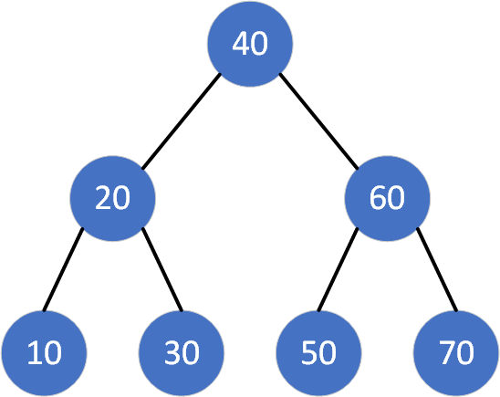

<!--more-->



## 问题描述

### 二叉搜索树

二叉搜索树满足如下性质：假设 \(x\) 是二叉搜索树中的一个结点。如果 \(l\) 是 \(x\) 的左子树的一个结点，那么 \(l.key \le x.key\)。如果 \(r\) 是 \(x\) 的右子树的一个结点，那么 \(r.key \ge x.key\)。

也就是说，二叉搜索树中的任意一个结点，它的左子树中的所有结点都不大于它，它的右子树中的所有结点都不小于它。

### 最优二叉搜索树

假设有 \(n\) 个有序的 \(key\)，每个 \(key\) 搜索概率不同，除 \(key\) 之外的值（即搜索不成功情况）搜索概率也不同，构造平均搜索长度最小的二叉树。

|  \(i\)  |  0   |  1  |  2   |  3   |
| :---: | :----: | :---: | :----: | :----: |
| \(key\) |        | 10  |  20  |  30  |
|  \(p\)  |        | \(0.5\) | \(0.1\)  | \(0.05\) |
|  \(q\)  | \(0.15\) | \(0.1\) | \(0.05\) | \(0.05\) |

上表给出了此问题的一个输入样例。\(p\) 表示搜索成功的概率，例如搜索到 10 的概率为 \(0.5\)。\(q\) 表示搜索失败的概率，落在了某两个 \(key\) 之间或者某个 \(key\) 之外。例如，小于 10 的元素的搜索概率为 \(0.15\)，大于 10 而小于 20 的元素的搜索概率为 \(0.1\)，以此类推。

## 问题分析

如果优化二叉搜索树 \(T\) 具有包含关键字集合 \(key[i:j]\) 子树 \(T'\)，则 \(T'\) 必是关于关键字集合 \(key[i:j]\) 子问题的最优解。这说明**问题的最优解包括子问题最优解**，可以运用动态规划的方法避免子问题的重复计算。

\(dp[i, j]\) 表示 \(key[i + 1:j]\) 构造的最优二叉树的代价（平均搜索长度），则 \(dp[0, n]\) 是最后结果。\(w[i, j]\) 表示权值，为 \(p[i + 1:j]\) 与 \(q[i:j]\) 之和。

$$
\begin{aligned}
w[i, j] = \sum_{k = i + 1}^{j} p[k] + \sum_{k=i}^{j} q[k]
\end{aligned}
$$

关键字 \(key[i + 1:j]\) 以 \(k\) 为根的最优二叉树代价为：

$$
\begin{aligned}
dp[i, j]_k &= p[k] + dp[i, k - 1] + w[i, k - 1] + dp[k, j] + w[k, j] \\
&= w[i, j] + dp[i, k - 1] + dp[k, j]
\end{aligned}
$$

其中，\(p[k]\) 为根的代价，\(dp[i, k - 1]\) 为左子树的代价，\(w[i, k - 1]\) 为左子树加一层的代价，\(dp[k, j]\) 为右子树的代价，\(w[k, j]\) 为右子树加一层的代价。

因而，关键字 \(key[i + 1:j]\) 的最优二叉树代价为：

$$
\begin{aligned}
dp[i, j] = w[i, j] + \min\{dp[i, k - 1], dp[k, j]\}, i < k \le j
\end{aligned}
$$

其中，\(w[i, j]\) 为树上权值和。上述方程即为本题的状态转移方程。

## 问题求解

首先各 \(key\) 自成二叉搜索树，计算平均搜索长度，保留最小值。代价数组 \(dp\) 的主对角线初始化。

接下来，计算相邻 2 个、3 个 \(key\) 的平均搜索长度，保留最小值，直至计算到第 \(n\) 个 \(key\)。代价数组 \(dp\) 开始向右上角发展，最终右上角的结果即为解。

## 算法代码

```cpp
double Optimal_BST(double *p, double *q, int n)
{
    // 初始化
    double **c = new double *[n + 1];
    double **w = new double *[n + 1];
    for (int i = 0; i < n + 1; i++)
    {
        c[i] = new double[n + 1];
        w[i] = new double[n + 1];
        c[i][i] = 0;
        w[i][i] = q[i];
    }
    // 计算
    for (int x = 1; x < n + 1; x++) // x 表示计算相邻的 x+1 个子树
    {
        for (int i = 0; i < n - x; ++i)
        {
            int j = i + x;
            c[i][j] = 65535; // 初始化为无穷大
            w[i][j] = w[i][j - 1] + p[j] + q[j];
            for (int k = i; k < j + 1; ++k) // 以 k 为根
            {
                double t = w[i][j];
                if (k - 1 >= i) // 注意边界，下同
                {
                    t += c[i][k - 1];
                }
                if (k + 1 <= j)
                {
                    t += c[k + 1][j];
                }
                if (t < c[i][j]) // 保留最小值
                {
                    c[i][j] = t;
                }
            }
        }
    }
    double res = c[0][n];
    // 释放堆空间
    for (int i = 0; i < n + 1; i++)
    {
        delete c[i];
        delete w[i];
    }
    delete c;
    delete w;
    return res;
}
```

## 算法分析

- 时间复杂度：\(O(n^3)\)
- 空间复杂度：\(O(n^2)\)