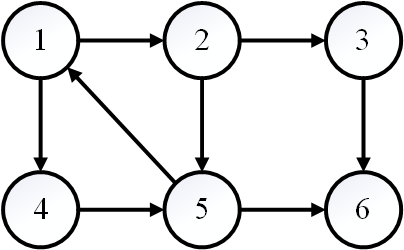
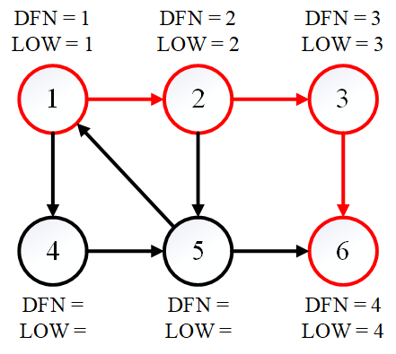
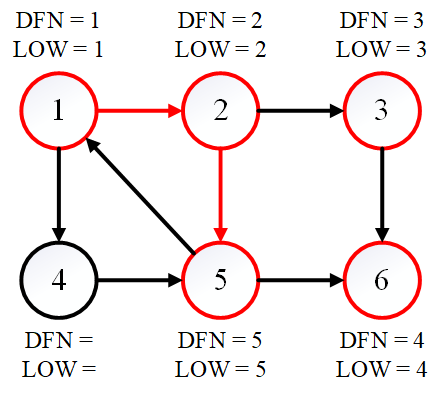
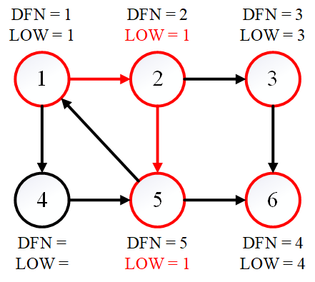
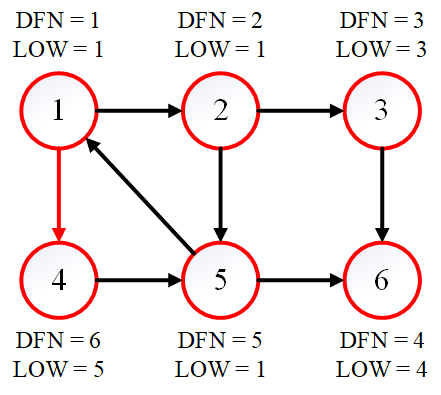
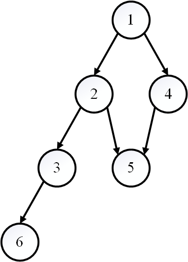

<!--more-->

## 连通分量

若图中的若干顶点之间两两可达，那么称这些顶点之间是连通的。

无向图的极大连通子图，称为连通分量。

### 深度优先搜索

可以采用 DFS 的方法快速找到无向图中的连通分量。具体做法是，只要图中有顶点没有被访问过，那么就从中选择一个顶点开始进行 DFS，DFS 完成后将当前所有遍历过的顶点组成的子图视为一个连通分量。如此下去，直到图中所有顶点均访问完毕。

#### 算法代码

辅助空间定义

```cpp
vector<bool> marked(G.numV);
vector<int> id(G.numV);
int count = 0;
```

借助深度优先搜索

```cpp
void DFS(Graph G, int v) {
    marked[v] = true;
    id[v] = count;

    for (auto w : G.adj[v]) {
        if (!marked[w]) {
            DFS(G, w);
        }
    }
}
```

求解无向图的强连通分量

```cpp
void CC(Graph G) {
    for (int v = 0; v < G.numV; ++v) {
        if (!marked[v]) {
            DFS(G, v);
            ++count;
        }
    }
}
```

```cpp
bool connected(int v, int w) {
    return id[v] == id[w];
}
```

## 强连通分量

如果同时存在从 `v` 到 `w` 的有向路径和从 `w` 到 `v` 的有向路径，则顶点 `v` 和 `w` 是强连通的。

若有向图中的若干顶点之间两两可达，那么称这些顶点之间是强连通的。若将有向图转化成无向图后，这些顶点是连通的，那么称这些顶点之间是弱连通的。

有向图的极大强连通子图，称为强连通分量。有向图转化为无向图后，若出现了新的连通分量，称为弱连通分量。

### Kosaraju-Sharir 算法

Kosaraju-Sharir 算法是一种可以在线性时间内找到有向图强连通分量的算法，需要用到[拓扑排序](../拓扑排序)的相关知识。

算法首先需要构造图 \(G\) 的反向图 \(G^R\)。显然，\(G\) 和 \(G^R\) 的强连通分量是完全相同的。

Kosaraju-Sharir 算法接下来需要将每个顶点视为单个强连通分量以完成初始化，然后在每个强连通分量内进行拓扑排序。具体来说，算法分为如下两步：

1. 计算 \(G^R\) 的反向后序。
2. 在 \(G\) 中运行 DFS，以 \(G^R\) 的反向后序访问未标记的顶点。

#### 算法代码

辅助空间定义

```cpp
vector<bool> marked(G.numV);
vector<int> id(G.numV);
int count = 0;
```

借助深度优先搜索

```cpp
void DFS(DiGraph G, int v) {
    marked[v] = true;
    id[v] = count;

    for (auto w : G.adj[v]) {
        if (!marked[w]) {
            DFS(G, w);
        }
    }
}
```

求解无向图的强连通分量

```cpp
void KosarajuSharirSCC(DiGraph G) {
    for (int v : G.reverse().topo_sort()) {
        if (!marked[v]) {
            DFS(G, v);
            ++count;
        }
    }
}
```

```cpp
bool connected(int v, int w) {
    return id[v] == id[w];
}
```

#### 算法分析

时间复杂度：\(O(E + V)\)

### Tarjan 算法

Tarjan 算法是一种由 Robert Tarjan 提出的求解有向图强连通分量的算法，它能做到线性时间的复杂度。

在 Tarjan 算法中，有如下定义：

- `DFN[i]`：在 DFS 中该节点被搜索的次序（时间戳），换而言之就是第几个被搜索到。
- `LOW[i]`：为 `i` 或 `i` 的子树能够追溯到的最早的栈中节点的次序号。
- 当 `DFN[i] == LOW[i]` 时，`i` 或 `i` 的子树可以构成一个强连通分量。

**算法自然语言描述**

首先初始化一个空的栈。每次访问一个新节点（该节点入栈），如果这个点出度不为零就继续往下找，直到找到底。每次回溯时都取子节点与这个节点的 `LOW` 值的最小值，保证最小的子树根。如果找到 `DFN == LOW` 就说明这个节点是这个强连通分量的根节点（毕竟这个 `LOW` 值是这个强连通分量里最小的）。最后找到强连通分量的节点后，就将这个栈里，比此节点后进来的节点全部出栈，它们就组成一个全新的强连通分量。

下面来举一个具体的例子说明 Tarjan 算法的执行流程。



如图所示的有向图中包含 3 个强连通分量，分别为 \(\{1, 2, 4, 5\}\)、\(\{3\}\) 和 \(\{6\}\)。



首先访问节点 \(1\)，之后陆续访问节点 \(2\)、\(3\)、\(6\)，`DFN` 的值和 `LOW` 值都相同（等于被搜索的次序）。

现在发现节点 \(6\) 没有后继，因此需要进行回溯。回溯第一步发现 `DFN[6] == LOW[6]`，因此 \(\{6\}\) 为强连通分量，出栈。同理，`DFN[3] == LOW[3]`，因此 \(\{3\}\) 也为强连通分量，出栈。



现在回溯到节点 \(2\)，发现它有后继节点 \(5\)，继续搜索。然而节点 \(5\) 的后继都已经被访问过了，因此节点 \(5\) 的 `LOW` 值需要更新，`LOW[5] = 5`，`DFN[1] = 1` 而 `DFN[4] = 4`，因此 `LOW[5] = 1`。

下面仍然回溯到节点 \(2\)。由于节点 \(5\) 已经被访问过了，节点 \(2\) 的 `LOW` 值同样也需要更新。于是 `LOW[2] = 1`。



接下来回溯到节点 \(1\)，发现它有后继节点 \(4\)，继续搜索。然而节点 \(4\) 的后继都已经被访问过了，因此节点 \(4\) 的 `LOW` 值需要更新，`LOW[4] = 5`。



最后再次回溯到节点 \(1\)，此时所有的节点都已访问，并且 `DFN[1] == LOW[1]`。因此节点 \(1\) 及其后续所有节点全部出栈，\(\{1, 2, 4, 5\}\) 为强连通分量。



整个算法的 DFS 搜索树如图所示。