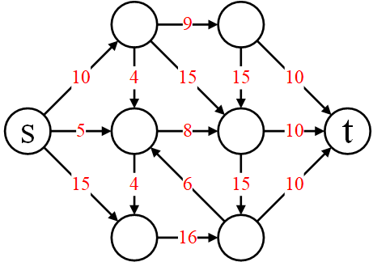
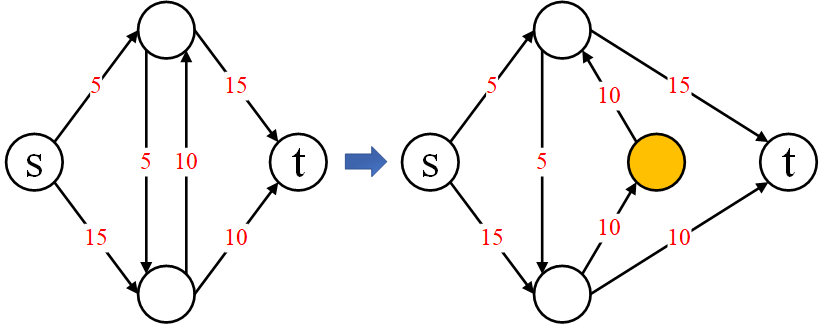
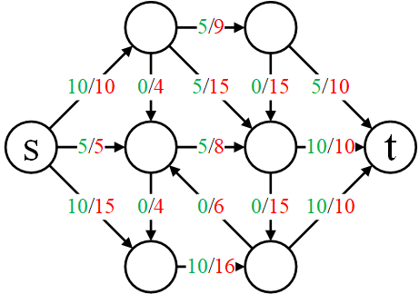

<!--more-->

## 流网络

设 \(G = (V, E)\) 是一个有向图，其中每条边 \((u, v)\) 有一个非负的容量值 \(c(u, v)\)。如果 \(E\) 中包含一条边 \((u, v)\)，那么图中就不存在它的反向边。而且，\(G\) 中有且只有一个入度为零的节点 \(s\) 和出度为零的节点 \(t\)，它们分别被称为源点和汇点。称这样的有向图 \(G\) 为**流网络**。

在流网络中，边的含义不再是有向图中的权重，而是容量 \(c(u, v)\)。实际流过节点的网络流的流量 \(f(u, v)\) 需要满足如下条件：

- 容量限制：\(0 \geqslant f(u, v) \geqslant c(u, v)\)
- 流量守恒：\(\sum_{u \in V} f(u, v)= \sum_{v \in V} f(u, v)\)

### 简单应用

流网络常见的一种应用场景是运输问题，需要将货物从 \(s\) 运输到 \(t\)，途经几个中转站，每次运输到每个中转站的货物的数量是有限制的。在实际应用中我们可能会在某条边上双向运输，这样便违反了我们之前对流网络的定义，但是我们可以将包含反平行边的图来改造成流网络，具体的方法是引入一个是虚构的中转结点，方法如下图。

考虑另外一种特殊情形，从多个工厂发出货物最终运输到别的多个工厂，这时候我们具有了多个源点和多个汇点，这也很好解决，解决的方法就是人为添加超级源点 `supersource` 和超级汇点 `supersink`，具体方法见下图。

## 最大流

如图所示，绿色的值表示流网络中的实际流量大小，它不能够超过每条边上的容量值。

现在的问题是，整个网络存在比上图中更大的流量吗？如果有，如何求解？

### Ford-Fulkerson 算法

Ford-Fulkerson 算法是求解流网络中的最大流的算法，其核心是通过引入残存网络 `residual network` 和增广路径 `augmenting path` 的概念对原先的运输方案进行纠错、改进。

## 最小割

> TODO

## 最大二部图匹配

在二部图中选择尽可能多的边，并且任意两条边不共享同一节点，这就是最大二部图匹配问题。

例如，有 \(M\) 个求职者和 \(N\) 个职位。每个求职者都有他感兴趣的工作子集。每个职位空缺只能接受一个求职者，一个求职者只能被任命为一个职位。为申请人找到工作分配，以便尽可能多的申请人获得工作。

最大二部图匹配问题最终可以转化成最大流-最小割问题进行求解。

> TODO