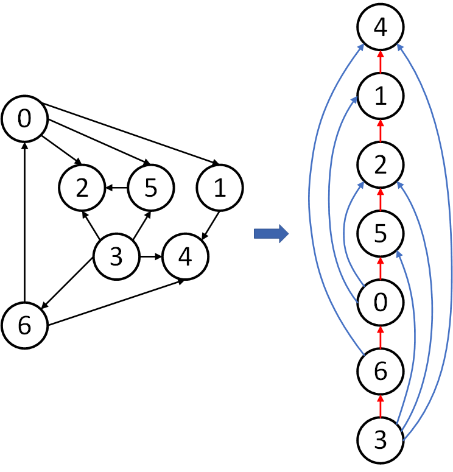

<!--more-->

## 问题描述

给定一组要完成的具有优先约束的任务，我们应该按照什么顺序来安排任务？

将这些任务建模成 DAG (Directed acyclic graph)。于是原问题可以被转换成如下图所示的问题：



## 问题分析

借助 DFS，可以让拓扑排序在线性时间复杂度内完成。

我们需要开辟一个额外的栈空间。在 DFS 的过程中，每当访问一个未访问的顶点时，将之压入栈。在 DFS 结束以后，顶点依次出栈，所得结果即为拓扑排序结果。

**为什么采用 DFS 的方法是有效的？**

- 后序的第一个顶点出度为 0
- 后续倒数第二个顶点只能指向最后一个顶点
- ……

**证明：DAG 的 DFS 后序序列等价于拓扑排序**

考虑任意边 `v` \(\rightarrow\) `w`，当 `DFS(v)` 被调用后：

1. `DFS(w)` 已经被调用并且返回。因此，`w` 在 `v` 之前完成。
2. `DFS(w)` 还没有被调用。`DFS(w)` 将被 `DFS(v)` 直接或间接调用，并将在 `DFS(v)` 之前完成。因此，`w` 在 `v` 之前完成。
3. `DFS(w)` 已经被调用，但还没有被返回。但这种情况是不可能 DAG 中发生的。

因此，`w` 一定在 `v` 之前完成。这对于任意的边来说都成立，因此整个后序序列一定是拓扑序。

## 拓展延伸

定理：若有向图不存在有向环，则必然存在拓扑序。

如果有向循环，拓扑顺序不可能。如果没有定向循环，则基于 DFS 的算法会找到一个拓扑顺序。

### 优先调度

给定一组要完成的具有优先约束的任务，我们应该以什么顺序安排这些任务？

注意：有向循环意味着调度问题是不可行的。

### 循环继承

```java
public class A extends B {
    // TODO
}

public class B extends C {
    // TODO
}

public class C extends A {
    // TODO
}
```