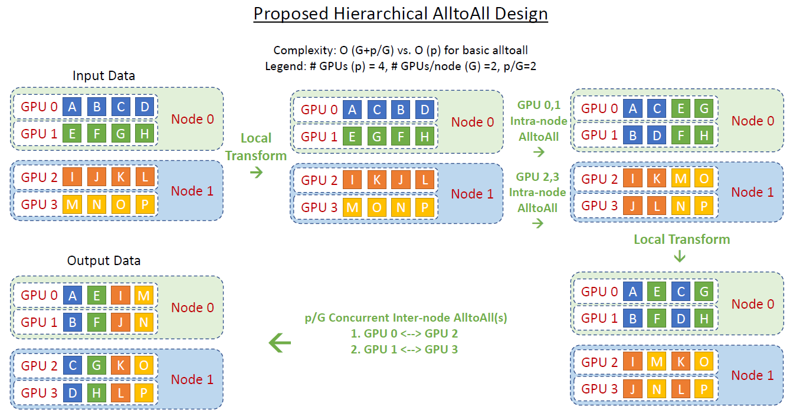

作为并行计算的一个重要概念，集合通信经常被用来构建高性能的单程序流/多数据流（Single Program-Multiple Data, SPMD）程序，譬如分布式机器学习系统。本文将介绍集合通信中的常见算子，并分析其复杂度。

<!--more-->

------

## 通信模型[^1]

假设在一个分布式的集群中，共有 \(n\) 个设备。用数组 `device[i]` 表示第 `i` 个设备。设备之间的点对点（Point-to-Point, P2P）通信由全双工传输（Full-Duplex Transmission）实现。那么，该通信模型的基本行为可以定义如下：

- 每次通信有且仅有一个发送者（Sender）和一个接收者（Receiver）。这意味着，在某个特定的时刻，每个设备仅能至多或接收一个消息（Message）。每个设备可以同时发送一个消息和接收一个消息。一个网络中可以同时传输多个来自于不同设备的消息。

- 传输一个长度为 \(l\) 个字节（Byte）的消息会花费 \(a+bl\) 的时间。
  - \(a\) 代表延迟（Latency），即一个字节通过网络从一个设备出发到达另一个设备所需的全部时间。\(a\) 的大小取决于两个设备之间的物理距离（如跨设备、跨机器、跨集群等）。
  - \(b\) 代表传输延迟（Transmission Delay），即传输一个具有 \(l\) 个字节的消息所需的全部时间。\(b\) 的大小取决于通信网络的带宽。

需要注意的是，这里简化了传输延迟的定义，并没有考虑在真实网络传输中会出现的丢失的消息（Dropped Message）和损坏的消息（Corrupted Message）的情况。

## 常见集合通信算子

### Broadcast

广播（Broadcast）是最基础的集合通信算子之一。对于 `device[i]`，广播意味着将长度为 \(l\) 字节的消息发送给其余的 \(n-1\) 个设备。由于每个设备在一个时刻只能发送一个消息，一种简单的实现方式循环发送 \(n-1\) 次，其通信开销为

$$
\begin{aligned}
    T_{b} = (n-1)(a+bl)
\end{aligned}
$$

但是很显然，这种通信方式是串行的，没有并行性。我们可以利用分治思想对上述算法进行优化，将这个问题分解为在两个子集群中进行广播，每个子集群有 \(n/2\) 个设备。然后对于每个子集群，又可以继续采用分治思想分解问题，直到每个子集群仅有一个设备。此时，只包括两种情况：

1. 子集群的这个设备上包括需要广播的消息。此时什么都不需要做。
2. 子集群的这个设备上没有需要广播的消息。此时需要给其发送消息。

每个子集群的通信是独立的，也就是可以并行的。所以把这些通信开销加起来，得到

$$
\begin{aligned}
    T_{b} = (a+bl) \log_2{n}
\end{aligned}
$$

下图展示了分治算法的过程：

其中，设备数量 \(n=8\)。第一次分治，`device[1]` 发送消息给 `device[5]`（本地就无需发送了，下同）；第二次分治，`device[1]` 发送消息给 `device[3]`，`device[5]` 发送消息给 `device[7]`；第三次分治，`device[1]` 发送消息给 `device[2]`，`device[3]` 发送消息给 `device[4]`，`device[5]` 发送消息给 `device[6]`，`device[7]` 发送消息给 `device[8]`。

### Reduce & All Reduce

在分布式机器学习系统中，另一个常见的操作是将不同设备上的计算结果进行聚合（Aggregation）。例如求和、乘积、最值等，这里我们统一用一个聚合函数 \(f\) 来表示。如果最终的结果只存在 `device[i]` 上，这就是 Reduce 算子；如果所有的设备都需要存储最终的结果，这就是 All Reduce 算子。

由于上述分治算法的并行性，Reduce 和 All Reduce 的通信开销均为

$$
\begin{aligned}
    T_{r} = (a+bl) \log_2{n} + O(f(l))
\end{aligned}
$$

其中，\(O(f(l))\) 表示聚合函数的时间复杂度，它是 \(l\) 的函数。

### Gather & All Gather

收集（Gather）也是一个常见的操作，例如张量的拼接（Concatenate）。Gather 和 All Gather 的通信开销均为

$$
\begin{aligned}
    T_{g} = a \log_2{n} + (n-1)bl
\end{aligned}
$$

这里要注意，在第 \(t\) 次分治中，传输的信息长度都为原来的 \(2^t\) 倍。所以，分治算法无法降低传输时延，和串行一样为 \((n-1)bl\)。

特别地，对于 All Gather 算子，通信开销可以通过[超立方体](https://link.springer.com/book/10.1007/978-3-030-25209-0)算法降低为和 Gather 一样。由于篇幅问题本文不再赘述，感兴趣的读者可以参考相关链接。

### Scatter

Scatter 算子可以被视为是 Gather 算子的逆运算：把 `device[i]` 上长度为 \(n\)（信息长度为 \(nl\)）的链式数据结构 `L` 中的值分散到每个设备上，使得每个 `device[i]` 上会得到 `L[i]` 的结果。

因此，Scatter 算子的通信开销为

$$
\begin{aligned}
    T_{s} = a \log_2{n} + (n-1)bl
\end{aligned}
$$

## 集合通信算子进阶

### Reduce Scatter

Reduce Scatter 算子就是 Reduce 和 Scatter 的结合，可以把 Reduce Scatter 理解为只执行 All Reduce 的聚合部分。因此，Reduce Scatter 算子的通信开销为

$$
\begin{aligned}
    T_{rs} = (a+bl) \log_2{n} + O(f(l))
\end{aligned}
$$

### All to All

All to All 是一种较为复杂的集合通信算子，将 `device[i]` 上的链式数据结构 `L[i][1:n]` 分散到每个设备上，使得每个 `device[i]` 上得到 `L[1:n][i]` 的结果。它相当于将整个集群的数据视为一个 \(n \times n\) 的矩阵，然后将这个矩阵转置。

如上图所示，All to All 和 Reduce Scatter 算子相比，仅仅只是少了最后一步的聚合操作。因此，其通信开销为

$$
\begin{aligned}
    T_{a2a} = (a+bl) \log_2{n}
\end{aligned}
$$

All to All 的通信算法一般会根据网络拓扑结构进行设计。例如，对于混合专家模型（Mixture of Expert, MoE）并行，这其中涉及到节点内和节点间的通信。一般来说，节点内通信带宽要大于节点间通信带宽。DeepSpeed-MoE[^2] 提出了一种 Hierarchical All to All 算法，如下图所示：

其中，\(p\) 表示集群内所有 GPU 的数量，这里 \(p=4\)；\(G\) 表示一个节点内的 GPU 数量，这里 \(G=2\)。那么，节点数量为 \(p/G\)。这个算法具体执行过程如下：

- 每个 GPU 上的本地数据交换
- 一次节点内 All to All 通信
- 每个 GPU 上的本地数据交换
- 一次节点间 All to All 通信

和 baseline 相比，复杂度从 \(O(p)\) 转变为 \(O(G + p/G)\)。令

$$
f(p, G) = mp - n(G + \frac{p}{G})
$$

其中，\(m,n > 0\) 为常数，因为 \(mp\) 是和 \(p\) 同阶的函数，即 \(O(p)=mp\)（后者同理）。分别对 \(p,G\) 求一阶偏导数，有

$$
\left\{\begin{aligned}
    f'_p &= m - \frac{n}{G} \\
    f'_G &= -n(1 - \frac{p}{G^2})
\end{aligned}\right.
$$

考虑到 \(f(p)\) 是一次函数，单调递增，所以不需要进一步研究，把 \(p\) 当成参数即可。令 \(f'(G) = 0\)，得到

$$
G = \sqrt{p}
$$

通过 \(f(p, G)\) 的二阶偏导数 \(f''_{GG}\)

$$
f''_{GG} = -\frac{2np}{G^3} < 0
$$

可以判断这个驻点是一个极大值点。所以，可以证明

$$
O(G) \geqslant O(G + \frac{p}{G})
$$

这说明优化的 Hierarchical All to All 算法能够降低通信开销。

## 集合通信算法性能分析

在讨论集合通信算子的性能时，人们经常会使用一些数值化指标来量化不同的算法实现。在计算 P2P 通信所需的时间时，会在信息长度上乘以一个系数 \(b\)。这个数值化指标就是算法带宽（Algorithm Bandwidth），泛指单位时间内执行操作（通信和计算等）的数量。其计算公式为

$$
b = \frac{s}{t}
$$

其中 \(s\) 为操作的大小，\(t\) 为操作指定的两个端点之间所经过的时间。对于 P2P 通信而言，可以通过衡量一个大小已知的信息 \(m\) 在执行 Send 函数所花的时间来确定两个设备之间网络的带宽。

虽然算法带宽的计算方法既简单又高效，但很难将其拓展到对于集合通信算子的带宽计算。这是因为，具体集合通信算子和算法实现不同，也就是前文所分析的。

一个集合通信算子在执行过程中测得的算法带宽往往会远远小于硬件本身的最高带宽。在实际运行的相应测试中，经常能够观测到随着设备增加，算法带宽呈下降趋势。为了解决这一问题，NCCL 提出了总线带宽（Bus Bandwidth）这一数值化指标，将根据每个集合通信算子的分析所测得的算法带宽，再乘以一个校正系数（Corrention Factor），从而更贴近实际硬件表现的带宽值。

下面给出常见算子的校正系数：

### All Reduce

All Reduce 算子可以定义为：对于 `device[1:n]` 上的值 `value[1:n]`，计算 `func(value)`，然后将计算结果回存到每个设备上。

在不考虑实际实现算法和网络拓扑的情况下，这个操作理论上只需要 \(2(n-1)\) 次数据传输。其中包含在每个设备上分开进行的 \(n-1\) 次 `func` 计算，以及最后 \(n\) 次最终数据值的广播，再减去 `device[1]` 的运算和 `device[n]` 的广播对执行时间的影响。假设每个设备对于外界所有信息处理的带宽为 \(B\)，可以得出对于 \(S\) 个在不同设备上的数据运行 All Reduce 算子的最优时延为

$$
t = \frac{2S(n-1)}{nB}
$$

将带宽 \(B\) 表示为其他参数的函数，得

$$
\begin{aligned}
    B &= \frac{S}{t} \cdot \frac{2(n-1)}{n} \\
    &= \frac{2(n-1)}{n} \cdot b
\end{aligned}
$$

这里 \(b\) 前的系数 \(2(n-1)/n\) 就是校正系数。

### Reduce Scatter

Reduce Scatter 可以看作是只执行 All Reduce 的聚合部分。仿照上面的计算方式，只需要考虑 \(n-1\) 次聚合运算，可得实际带宽为

$$
\begin{aligned}
    B &= \frac{S}{t} \cdot \frac{n-1}{n} \\
    &= \frac{n-1}{n} \cdot b
\end{aligned}
$$

即校正系数为 \((n-1)/n\)。

### All Gather

同理，All Gather 可以看作是只执行 All Reduce 的广播部分。那么同理可得

$$
\begin{aligned}
    B &= \frac{S}{t} \cdot \frac{2(n-1)}{n} \\
    &= \frac{n-1}{n} \cdot b
\end{aligned}
$$

即校正系数为 \((n-1)/n\)。

### Broadcast

Broadcast 与 All Reduce 不同，Broadcast 中所有数据都需要从算子本身的发送者发出。即使是在上面分治的情况下，也需要等待所有子问题运行结束才能保证 Broadcast 算子本身的正确性。因此，在计算带宽时，瓶颈仍为发送者对于外界所有信息处理的带宽，所以

$$
B = b
$$

即校正系数为 \(1\)。

### Reduce

类似于 Broadcast 算子，Reduce 需要将所有数据发送给算子的接收者。所以校正系数也是 \(1\)。

> 由于 Gather 和 Scatter 的带宽计算与实际聚合/分散时的数据结构相关性更高，故不给出特定的校正系数。

小结一下，通过校正系数也能看出，随着设备增加，算法带宽呈下降趋势这一现象。

[^1]: 本文参考了 [Open MLSys](https://openmlsys.github.io/) 的相关文章 [11.5 集合通信](https://openmlsys.github.io/chapter_distributed_training/collective.html)
[^2]: [Rajbhandari, Samyam, et al. “DeepSpeed-MoE: Advancing Mixture-of-Experts Inference and Training to Power Next-Generation AI Scale.” Proceedings of the 39th International Conference on Machine Learning, PMLR, 2022, pp. 18332–46.](https://proceedings.mlr.press/v162/rajbhandari22a.html)
