当前大模型的训练和推理主要采用分布式集群部署，这是由于庞大的模型参数量和以及海量输入数据及其所形成的 K/V Cache 带来的显存压力所导致的。在大模型的训练和推理过程中，因分布式的计算架构而不可避免地会产生一些数据同步。这就需要集合通信。

本文对分布式大模型集合通信的相关技术进行介绍，包括 MPI 规范、通信模型、集合通信原语、集合通信的底层算法设计等，并且对它们进行定量的分析和比较。

<!--more-->

---

## MPI

MPI（**Message Passing Interface**，消息传递接口）是一套用于**并行计算**的标准，主要用于多进程之间的数据交换。它本身不是一个程序，而是一组 API 规范。MPI 广泛用于：

- 超级计算机
- 高性能计算（High Performance Computing，HPC）
- 科学计算
- 大规模机器学习训练与推理

### MPI 的两类通信

MPI 的通信方式大致可以归结为以下两种：

1. 点对点（Point-to-Point，P2P）通信，例如 `send` 和 `recv`，其本质是进程一对一通信；
2. 集合通信（Collective Communication），即本文重点介绍的内容，其本质是进程一对多或者多对多通信。

集合通信是 MPI 对常见并行数据交换模式的封装，这样开发者就不需要自己写大量 `Send` 和 `Recv` 了。

## 通信模型

假设在一个分布式的集群中，共有 \(n\) 个设备。用数组 `device[i]` 表示第 `i` 个设备。设备之间的点对点通信由全双工传输（Full-Duplex Transmission）实现。那么，该通信模型的基本行为可以定义如下：

- 每次通信有且仅有一个发送者（Sender）和一个接收者（Receiver）。这意味着，在某个特定的时刻，每个设备仅能至多或接收一个消息（Message）。每个设备可以同时发送一个消息和接收一个消息。一个网络中可以同时传输多个来自于不同设备的消息。
- 传输一个长度为 \(l\) 个字节（Byte）的消息会花费 \(\alpha + \beta l\) 的时间，这就是 **\(\alpha\)** **-****\(\beta\)** **模型**。

  - \(a\) 代表延迟（Latency），即一个字节通过网络从一个设备出发到达另一个设备所需的全部时间。\(a\) 的大小取决于两个设备之间的物理距离（如跨设备、跨机器、跨集群等）。
  - \(\beta\) 代表传输延迟（Transmission Delay），即传输一个具有 \(l\) 个字节的消息所需的全部时间。\(\beta\) 的大小取决于通信网络的带宽。

需要注意的是，这里简化了传输延迟的定义，并没有考虑在真实网络传输中会出现的丢失的消息（Dropped Message）和损坏的消息（Corrupted Message）的情况。

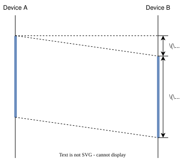

## 集合通信原语

常见集合通信原语如下图所示：

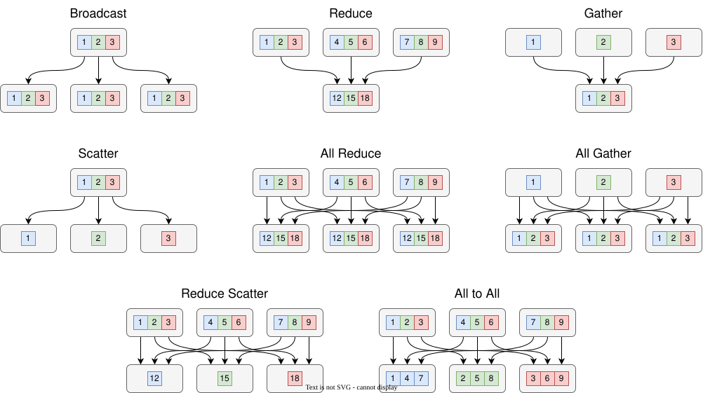

我们可以简单对这些通信原语进行一个分类：

- 一对多：Broadcast、Scatter
- 多对一：Reduce、Gather
- 多对多：All Reduce、All Gather、Reduce Scatter、All to All

实际上，参与集合通信的设备（进程）都是对等的。鲜有只会发送数据或者只会接收数据的设备（进程），也就是说每个设备（进程）都是同时参与发送和接收数据的。因此，在后面的介绍中，我们默认每个设备（进程）自己同时也是 Sender 和 Receiver。

### Broadcast

Broadcast（广播）是最基础的集合通信算子之一。对于 `device[i]`，广播意味着将长度为 \(l\) 字节的消息发送给其余的 \(n-1\) 个设备。

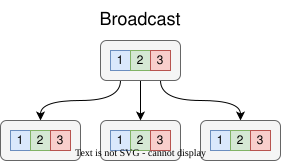

Broadcast 最常见的应用场景包括：

- 在 DP（Data Parallelism，数据并行）初始化时，在各个 rank 之间传输模型权重；
- 在 TP（Tensor Parallelism，张量并行）初始化时，在各个 rank 之间传输嵌入词元向量。

### Reduce & All Reduce

Reduce（归约）是指将不同设备上的计算结果进行聚合（Aggregation），例如求和、乘积、最值等，这里我们统一用一个聚合函数 \(f\) 来表示。如果最终的结果只存在某个 `device[i]` 上，这就是 Reduce 算子；如果所有的设备都需要存储最终的结果，这就是 All Reduce 算子。

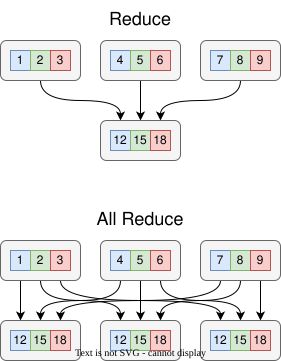

单一的 Reduce 算子并不常见，但是 All Reduce 在分布式大模型的训练和推理中非常常见，例如：

- 在 DP 反向传播时，通过 All Reduce 同步梯度；
- 在 TP 的 MLP 层前向传播时，通过 All Reduce 将分块矩阵乘法的结果相加得到完整的矩阵乘法结果。

### Gather & All Gather

Gather（收集）也是一个常见的操作，例如张量的拼接（Concatenate）。

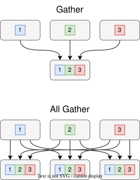

同样地，单一的 Gather 并不场景，但是 All Gather 也是非常常见，例如：

- 在 Zero-3、FSDP 中，由于采用 DP 的同时模型权重是分片的，这就需要每次在前向传播时都对当前层的模型权重进行 All Gather；
- 与 Reduce Scatter 进行算子融合，以降低 All Reduce 计算复杂度。（详见后文）

### Scatter

Scatter（分散）算子可以被视为是 Gather 算子的逆运算：把 `device[i]` 上的数组 `L[1:n]` 中的值分散到每个设备上，使得每个 `device[i]` 上会得到 `L[i]` 的结果。

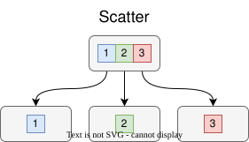

Scatter 最常见的应用场景包括：

- 在 DP 初始化时，Scatter 可以对输入的大批次数据进行切分和分发

### Reduce Scatter

Reduce Scatter 算子就是 Reduce 和 Scatter 的结合，即将各 device 归约的结果再分散到各个 device 上。也可以把 Reduce Scatter 理解为 All Reduce 只保留 \(1/n\) 的数据，即在各个 device 上切分开来。

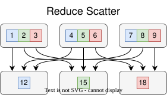

Reduce Scatter 也是很常见的集合通信原语，其应用场景包括：

- 在 ZeRO-2/3、FSDP 的反向传播中，需要通过 Reduce Scatter 进行梯度的聚合和分片。聚合是因为需要得到正确的梯度计算结果，分片是因为 ZeRO-2/3、FSDP 只保留 \(1/n\) 的模型权重。

### All to All

All to All 是一种较为复杂的集合通信算子，将 `device[i]` 上的数组 `L[i][1:n]` 分散到每个设备上，使得每个 `device[i]` 上得到 `L[1:n][i]` 的结果。它相当于将整个集群的数据视为一个 \(n \times n\) 的矩阵，然后将这个矩阵转置。

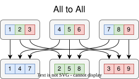

All to All 完全就是给面向 MoE 模型的 EP（Expert Parallelism，专家并行）量身定制的，它包括两个过程：

- Dispatch：Token 路由到各个专家
- Combine：Token 由各个专家回传

### 集合通信的通信量对比

从本质上说，MPI 定义了如下的这样一套规范：在一个有 \(p\) 个进程的计算过程中，每两个进程都有大小为 \(n\) 的数据需要彼此之间完成同步。

此时，单位（单进程）通信量，即每个进程发送/接收的数据量，其大小为 \(n\)。于是，总通信量就是整个系统网络上传输的数据总量。

下面给出常见集合通信原语的通信量：

|集合通信原语|总通信量|单进程通信量|
| ----------------| ----------| --------------------------------|
|Broadcast|\((p-1)n\)|Root 发送约 \((p-1)n\)，其他进程接收 \(n\)|
|Scatter|\((p-1)n\)|Root 发送 \((p-1)n\)，其他进程接收 \(n\)|
|Gather|\((p-1)n\)|Root 接收 \((p-1)n\)，其他进程发送 \(n\)|
|All Gather|\(p(p-1)n\)|每个进程发送约 \((p-1)n\)，接收 \((p-1)n\)|
|Reduce|\((p-1)n\)|非 Root 发送 \(n\)，Root最终得到 \(n\)|
|All Reduce 💡|\(2(p-1)n\)|每个进程发送 \(2(p-1)n/p\)，接收 \(2(p-1)n/p\)|
|All to All|\(p(p-1)n\)|每个进程发送 \((p-1)n\)，接收 \((p-1)n\)|
|Reduce Scatter|\((p-1)n\)|每个进程发送 \((p-1)n/p\)，接收 \(n/p\)|



对于 All Reduce，可以将之视为 Reduce + Broadcast 的算子融合。此时各阶段单进程通信量为 \((p-1)n\)，合计 \(2(p-1)n\)。

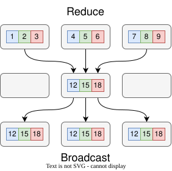

实际上，可以进一步将计算复杂度简化为 ReduceScatter + AllGather 的算子融合。此时各阶段单进程通信量为 \((p-1)n/p\)，合计 \(2(p-1)n/p\)。

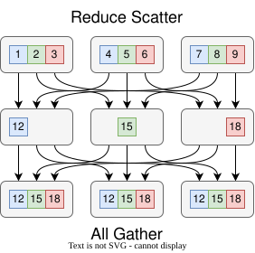



## 集合通信算法

### Mesh（网格）算法

Mesh 是 HCCL 在 **FullMesh 拓扑**下使用的集合通信算法。FullMesh 表示每两个 NPU 之间都有直接链路，而且是全双工通信。因此通信时不需要像 Ring 那样逐跳转发，所有 NPU 可以利用多条 HCCS 链路并发读写，从而把通信轮次压到常数级。

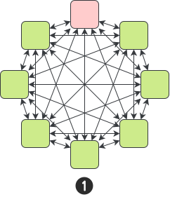

Mesh 算法要求节点间直接互联，这样带宽利用率高，延迟随 NPU 数量增长不明显。不过，它也十分依赖 FullMesh 硬件拓扑，规模扩大时互联成本和连线复杂度上升，因此更适合单机/小规模、链路充分互联的场景。

#### 性能模型

设 \(p\) 为 NPU 数量，\(n\) 为通信数据量，\(\alpha\) 为链路延迟，\(\beta\) 为单位数据传输时间，\(\gamma\) 为单位数据归约计算时间。Mesh 算法的时间复杂度为 \(O(1)\)。

|集合通信算子|Mesh 时间复杂度|
| ---------------| -----------------|
|Scatter|\(T_{\textrm{scatter}}=\alpha+\frac{1}{p}n\beta\)|
|Gather|\(T_{\mathrm{gather}}=\alpha+\frac{1}{p}n\beta\)|
|Broadcast|\(T_{\mathrm{broadcast}}=2 (\alpha+\frac{1}{p}n\beta)\)|
|Reduce|\(T_{\mathrm{reduce}}=2(\alpha+\frac{1}{p}n\beta)+\frac{p-1}{p}n\gamma\)|
|ReduceScatter|\(T_{\mathrm{rs}}=\alpha+\frac{1}{p}n\beta+\frac{p-1}{p}n\gamma\)|
|AllGather|\(T_{\mathrm{ag}}=\alpha+\frac{1}{p}n\beta\)|
|AllReduce|\(T_{\mathrm{ar}}=2(\alpha+\frac{1}{p}n\beta)+\frac{p-1}{p}n\gamma\)|

### Ring（环形）算法

Ring 是把通信域中的 \(p\) 个 rank 组织成一个逻辑环。每个 rank 只需要和左右两个邻居通信：一侧负责接收，另一侧负责发送；数据沿环逐跳流动，经过一轮或两轮循环后完成全局同步。通信机制的关键细节如下：

- **环形邻接**：rank \(i\) 通常向 \((i+1)\bmod p\) 发送，从 \((i-1+p)\bmod p\) 接收，所有 rank 并行执行同样的收发规则。
- **分片传输**：长度为 \(n\) 的数据被切成 \(p\) 份。一次环上传输通常只发送其中一个分片，因此单步传输量为 \(n/p\)。

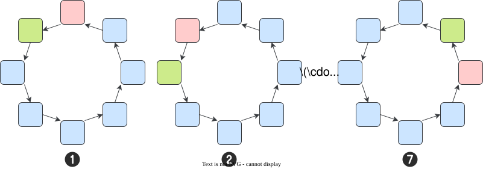

它的核心优势不是减少通信轮次，而是让每一步通信都非常规整：所有 rank 同时发送一块数据、接收一块数据，链路使用稳定，适合大张量的梯度同步或参数同步。代价是轮次随设备数线性增长，因此小消息场景会更容易被固定时延 \(\alpha\) 主导。

Ring 用邻接转发换取稳定、充分的链路利用率。和 Mesh 相比，它不依赖 FullMesh 直连拓扑，但需要更多通信轮次；和 Pairwise 相比，它更适合 AllReduce / ReduceScatter / AllGather 这类大块同步，而不是 AllToAll / AlltoAllV 的两两交换。

因此，在大模型训练中，Ring 的典型优势场景是大张量梯度同步：当 \(n\) 很大时，带宽项 \(\beta n\) 是主要成本，Ring 的规则化流水传输能较好吃满带宽；当 \(p\) 很大或消息很小时，\((p-1)\alpha\) 的线性累积会成为瓶颈。

#### Ring AllReduce

**AllReduce 流程**：Ring AllReduce 可以拆成 **ReduceScatter + AllGather**。第一轮沿环传递并累加分片，执行 \(p-1\) 步后每个 rank 得到一个已经归约完成的分片；第二轮再沿环传播这些分片，执行 \(p-1\) 步后所有 rank 都得到完整的归约结果。

#### 性能模型

设通信域中有 \(p\) 个 rank，整体数据量为 \(n\)，\(\alpha\) 表示单步链路时延，\(\beta\) 表示单位数据传输时间，\(\gamma\) 表示单位数据归约计算时间。Ring 的关键是：单个环阶段需要 \(p-1\) 步，因此时间复杂度为 \(O(p-1)\)。

|集合通信算子|Mesh 时间复杂度|
| ---------------| -----------------|
|Scatter|\(T_{\mathrm{scatter}}=(p-1)(\alpha+\frac{n}{p}\beta)\)|
|Gather|\(T_{\mathrm{gather}}=(p-1)(\alpha+\frac{n}{p}\beta)\)|
|Broadcast|\(T_{\mathrm{broadcast}}=2(p-1)(\alpha+n\beta)\)|
|Reduce|\(T_{\mathrm{reduce}}=2(p-1)\alpha+2(p-1)n\beta+(p-1)n\gamma\)|
|ReduceScatter|\(T_{\mathrm{rs}}=(p-1)(\alpha+\frac{n}{p}\beta+\frac{n}{p}\gamma)\)|
|AllGather|\(T_{\mathrm{ag}}=(p-1)(\alpha+\frac{n}{p}\beta)\)|
|AllReduce|\(T_{\mathrm{ar}}=T_{rs}+T_{ag}=2(p-1)\alpha+2\frac{p-1}{p}n\beta+\frac{p-1}{p}n\gamma\)|

### Pairwise（成对）算法

Pairwise 是 Mesh 在 **AllToAll / AlltoAllV** 场景下的分步执行版本。它的出发点是：多机场景中每个节点通常只有一个 RDMA 网口，如果直接用 Mesh 同时做多对多收发，多个流会在同一链路上争抢资源，整体性能可能反而下降。

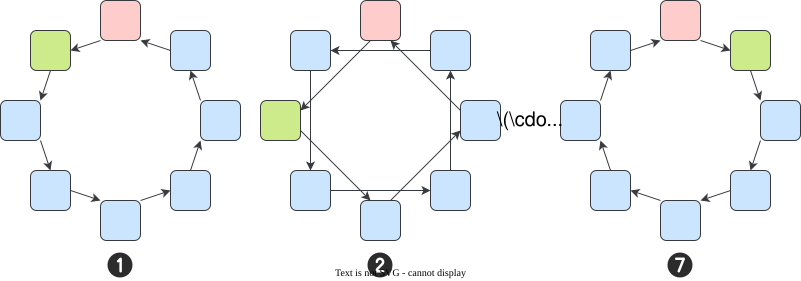

Pairwise AllToAll 的通信机制具体如下：

- **分步成对通信**：把全量 AllToAll 拆成 \(p-1\) 个步骤，每一步只和一个对端成对通信。
- **发送/接收规则**：对 rank 为 \(i\) 的节点，第 \(k\) 步发送目标为 \(j_{\mathrm{send}}=(i+k)\bmod p\)，接收来源为 \(j_{\mathrm{recv}}=(i-k+p)\bmod p\)。例如第 1 步从 \((i-1+p)\bmod p\) 接收、向 \((i+1)\bmod p\) 发送；第 2 步从 \((i-2+p)\bmod p\) 接收、向 \((i+2)\bmod p\) 发送；以此类推。

Pairwise 每一步只维护一条发送方向和一条接收方向，这样就避免 Mesh 式“多打多”导致的 RDMA 链路拥塞。不过，Pairwise 用更多通信步数换取更可控的链路使用，因此更适合小数据量、AllToAll / AlltoAllV 这类需要两两交换数据的场景。

#### 性能模型

设通信域内有 \(p\) 个节点，\(n_{i,j}\) 表示 rank \(i\) 需要发送给 rank \(j\) 的数据量，\(\alpha\) 表示固定链路时延，\(\beta\) 表示单位数据传输时间。在第 \(k\) 步时，耗时为：

$$
T_k = \alpha + \beta \cdot \operatorname*{max}_{0\le i<p} n_{i,(i+k)\bmod p}
$$

这个公式的含义是：第 \(k\) 步里，所有 rank 同时进行一组不冲突的成对传输，该步耗时由 \(\operatorname*{max}_{0\le i<p} n_{i,(i+k)\bmod p}\) 这条最慢传输决定；完整算法执行 \(p-1\) 步，所以固定时延累计为 \((p-1)\alpha\)，数据传输项按各步最大数据量求和，即

$$
T = (p-1)\alpha + \beta \cdot \sum_{k=1}^{p-1} \operatorname*{max}_{0\le i<p} n_{i,(i+k)\bmod p}
$$

### Recursive Halving-Doubling（递归二分倍增）算法

RHD（Recursive Halving-Doubling，递归二分倍增）是为大规模通信域设计的折中算法。Mesh 依赖全连接，规模到数千 rank 时链路、交换和同步资源开销太高；Ring 资源开销低，但通信轮次随环长线性增长。RHD 的思路是在这两者之间取平衡：通过递归折半和递归倍增，把通信轮次压到对数级，同时不要求所有 rank 两两直连。

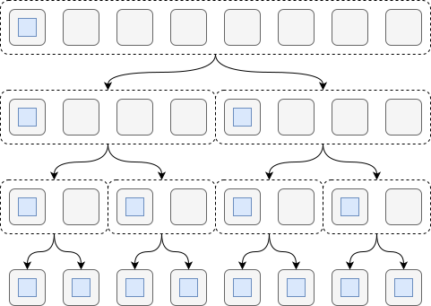

如图所示，通过递归分治算法，可以将原本的线性时间复杂度 \(O(p-1)\) 优化到对数级 \(O(\lceil \log_2 p \rceil)\)。现假设有 8 个 rank，每个 rank 的 ID 为 `0-7`，那么具体的通信过程分为以下步骤：

1. `0 --> 1`；`1 --> 2`；`2 --> 3`；`3 --> 4`；`4 --> 5`；`5 --> 6`；`6 --> 7`；`7 --> 0`；
2. `0 --> 2`；`1 --> 3`；`2 --> 4`；`3 --> 5`；`4 --> 6`；`5 --> 7`；`6 --> 0`；`7 --> 1`；
3. `0 --> 4`；`1 --> 5`；`2 --> 6`；`3 --> 7`；`4 --> 0`；`5 --> 1`；`6 --> 2`；`7 --> 3`；

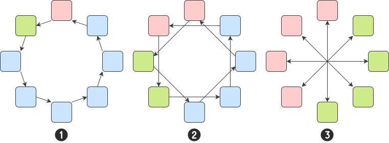

如果根据某一个 rank 上的数据（以 rank 0 为例），那么它被广播到其他各个 rank 上的过程经历如下：

1. 通过 `0 --> 1` 发送给 rank 1，现在 rank 0, 1 持有数据；
2. 通过 `0 --> 2`、`1 --> 3` 分别发送给 rank 2 和 rank 3，现在 rank 0, 1, 2, 3 持有数据；
3. 通过 `0 --> 4`、`1 --> 5`、`2 --> 6`、`3 --> 7` 分别发送给 rank 4-7，那么所有 rank 就都有了 rank 0 的数据。

Ring 的优势是链路使用规整、实现简单，但需要 \(p-1\) 轮或 \(2(p-1)\) 轮；RHD 把通信轮次降到 \(\log_2 p\) 量级，因此在大规模 rank 下更适合控制时延累计。Mesh 的优势是并发度高，但需要大量直连与同步资源；RHD 不追求全连接，而是通过递归配对逐步传播数据，因此资源压力更低。

可以把 RHD 理解为：在大规模集群里，用算法上的递归组织来替代硬件上的全连接，用对数轮次来避免 Ring 的长环流转。

#### 性能模型

设通信域中有 \(p\) 个 rank，整体通信数据量为 \(n\)，\(\alpha\) 表示单轮通信固定时延，\(\beta\) 表示单位数据传输时间，\(\gamma\) 表示单位数据规约计算时间。RHD 的关键收益是把通信轮次从 Ring 的线性级 \(O(p)\) 降到对数级 \(O(\lceil \log_2 p \rceil)\)；因此它更适合大规模 rank、星型或胖树拓扑下的集合通信。

**2 的整数次幂场景**：当 \(p\) 是 2 的整数次幂时，所有 rank 可以均匀递归二分，性能模型最清晰：

|集合通信算子|RHD 时间模型|
| ---------------| --------------|
|Broadcast|\(T_{\mathrm{broadcast}}=\lceil\log_2 p\rceil(\alpha+n\beta)\)|
|ReduceScatter|\(T_{\mathrm{rs}}=\log_2 p\cdot\alpha+\frac{p-1}{p}n\beta+\frac{p-1}{p}n\gamma\)|
|AllGather|\(T_{\mathrm{ag}}=\log_2 p\cdot\alpha+\frac{p-1}{p}n\beta\)|
|AllReduce|\(T_{\mathrm{ar}}=2\log_2 p\cdot\alpha+2\frac{p-1}{p}n\beta+\frac{p-1}{p}n\gamma\)|
|Reduce|\(T_{\mathrm{reduce}}=2\log_2 p\cdot\alpha+2\frac{p-1}{p}n\beta+\frac{p-1}{p}n\gamma\)|

其中 ReduceScatter 使用 **Vector Doubling + Distance Halving**，以保证 Scatter 后各分片的顺序；AllGather 与 ReduceScatter 的通信量对称，但没有规约计算项 \(\gamma\)。AllReduce 可以看作 ReduceScatter + AllGather，不过 HCCL 文档也强调这里不一定是完整语义上的 Scatter / Gather，因此可以采用 **Vector Halving + Distance Doubling**，在分层网络下进一步降低耗时。

**非 2 的整数次幂场景**：当 \(p\) 不是 2 的整数次幂时，RHD 需要先把通信域调整为可递归二分的 block。设

$$
r=p-2^{\lfloor\log_2 p\rfloor},\ p'=2^{\lfloor\log_2 p\rfloor}
$$

则先把 part1 中的 \(2r\) 个 rank 两两 Reduce 成 \(r\) 个 rank，使有效 block 规模变为 \(p-r=p'\)；然后在这个 \(p'\) 规模的 block 上执行 Halving-Doubling；最后再把结果恢复到 part1 中被临时合并的 rank。

非 2 幂场景的额外开销主要来自首尾修正步骤：前面多一次 Reduce，末尾多一次 Scatter / Gather / Copy。以 HCCL 表中的 AllReduce 总耗时为例，可以写成：

$$
T_{\mathrm{ar}}=\left(2\lfloor\log_2 p\rfloor+2\right)\alpha+\left(2\frac{p'-1}{p'}+2\right)n\beta+\left(\frac{p'-1}{p'}+1\right)n\gamma
$$

Reduce 的非 2 幂总耗时则为：

$$
T_{\mathrm{reduce}}=\left(2\lfloor\log_2 p\rfloor+1\right)\alpha+\left(2\frac{p'-1}{p'}+1\right)n\beta+\left(\frac{p'-1}{p'}+1\right)n\gamma
$$

直观上看，RHD 的带宽项仍然接近 ReduceScatter + AllGather 的数据移动量，真正明显变化的是时延项：Ring 会累计 \(p-1\) 或 \(2(p-1)\) 轮时延，而 RHD 只累计约 \(\log_2 p\) 或 \(2\log_2 p\) 轮时延。代价是非 2 幂 rank 需要额外合并和恢复，模型比 2 幂场景更复杂。

### Hierarchical（分层）算法

Hierarchical（分级/分层）算法不是某一种固定通信图，而是把通信域按照集群拓扑拆成 **Server 内** 和 **Server 间** 两个层级。其中的关键目标有两个：一是保证 Server 间通信的数据块尽量连续，二是把大数据量阶段尽量放到带宽更高的 Server 内链路上。

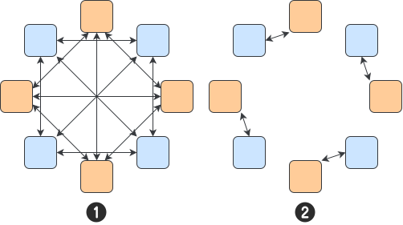

HCCL 中有三个典型流程：

- **ReduceScatter**：第 \(i\) 个 rank 最终只需要第 \(i\) 份规约结果。为了让 Server 间传输的数据块保持连续，HCCL 先在 **Server 间** 执行 ReduceScatter，再在 **Server 内** 执行 ReduceScatter。
- **AllGather**：第 \(i\) 个 rank 的输入数据最终要出现在完整结果的第 \(i\) 个位置。为了保持跨 Server 数据块连续，HCCL 先在 **Server 内** 执行 AllGather，再在 **Server 间** 执行 AllGather。
- **AllReduce**：每个 rank 都要得到完整规约结果。它虽然可以拆成 ReduceScatter + AllGather，但不需要严格照搬这两个算子的语义顺序；HCCL 选择先在 **Server 内** 做 ReduceScatter，再在 **Server 间** 做 AllReduce，最后在 **Server 内** 做 AllGather。

此外，DeepSpeed-MoE 中也提出了类似的 Hierarchical AllToAll 算法，将原本需要 \(p-1\) 轮通信的 AllToAll 的复杂度优化为 \(O(G+p/G)\)。

### 集合通信算法对比

集合通信算法的选择，本质上是在 **拓扑假设**、**通信轮次**、**带宽利用率** 和 **算子语义** 之间做权衡。没有一种算法对所有场景都最优：Mesh 依赖 FullMesh 拓扑，Ring 依赖规则流水，Pairwise 面向 AllToAll 的链路控制，RHD 用递归结构降低大规模时延，Hierarchical 则把这些思路映射到 Server 内 / Server 间的真实层次上。

|算法|核心思想|时延轮次/复杂度特征|典型适用场景|主要限制|
| --------------| ------------------------------------------------------------| ------------------------------------------------| -----------------------------------------------------------------------------------------------------------------------| --------------------------------------------------------------------------------------------------|
|Mesh|FullMesh 拓扑下任意 rank 直接互联，并发完成数据交换|常数级，典型为 \(O(1)\)|单机或小规模 FullMesh；小消息、低延迟通信；HCCS 链路充分互联的场景|依赖硬件全连接，规模扩大后链路、交换和同步资源成本高|
|Ring|把 rank 组织成逻辑环，分片沿环逐跳流水传输|线性级，典型为 \(O(p-1)\)；AllReduce 为两轮 Ring，即 \(2(p-1)\)|大张量 AllReduce / ReduceScatter / AllGather；带宽项 \(\beta n\) 主导的训练同步|rank 数大或消息小的时候，\(\alpha\) 时延累计明显；不适合 AllToAll 这类两两交换语义|
|Pairwise|把 AllToAll 拆成 \(p-1\) 轮成对通信，每轮只和一个对端收发|线性级，完整算法为 \((p-1)\alpha+\beta\sum_k \max_i n_{i,(i+k)\bmod p}\)|AllToAll / AlltoAllV；RDMA 网口或跨机链路容易拥塞的场景；MoE token dispatch / combine|轮次仍然是 \(p-1\)，大数据量下时延和长尾传输会放大|
|RHD|递归折半和递归倍增，用算法组织替代全连接硬件|对数级，典型为 \(O(\lceil\log_2 p\rceil)\)；AllReduce 约 \(2\log_2 p\) 轮|大规模 rank；星型或胖树拓扑；需要降低 Ring 长环时延的 ReduceScatter / AllGather / AllReduce|非 2 幂 rank 需要额外合并和恢复；调度和数据布局比 Ring 更复杂|
|Hierarchical|按 Server 内 / Server 间分层，把大数据量阶段放到高带宽层级|不是单一公式，取决于层级规模和每层采用的子算法|多机多卡集群；Server 内带宽显著高于 Server 间；HCCL 分级 ReduceScatter / AllGather / AllReduce；Hierarchical AllToAll|需要了解拓扑和数据布局；跨层级顺序要满足算子语义，例如 ReduceScatter 与 AllGather 的分片位置约束|

从成本项看，可以用下面的直觉来选算法：

- **小消息 / 低延迟优先**：固定时延 \(\alpha\) 更重要，优先考虑 Mesh 或 RHD 这类通信轮次少的算法。
- **大张量同步**：带宽项 \(\beta n\) 更重要，Ring 的规则分片流水通常能稳定吃满链路；如果跨 Server 带宽较弱，则应进一步使用 Hierarchical，把大流量压在 Server 内。
- **AllToAll / AlltoAllV**：通信语义是两两交换，不宜简单套 Ring AllReduce 的思路；Pairwise 通过分轮成对通信控制链路竞争，适合 RDMA 资源紧张的多机场景。
- **大规模 rank**：Ring 的 \(p-1\) 轮时延会成为瓶颈，RHD 用 \(\log_2 p\) 级轮次降低时延，但要额外处理非 2 幂 rank 的合并与恢复。
- **真实集群拓扑不均匀**：优先考虑 Hierarchical。它不是和 Ring / RHD / Pairwise 平级的单一通信图，而是一种组合策略：Server 内和 Server 间可以分别选择不同子算法。

因此，可以把这些算法理解成一组互补工具：Mesh 用硬件全连接换低延迟，Ring 用规则流水换高带宽，Pairwise 用分轮成对换链路可控，RHD 用递归组织换低时延轮次，Hierarchical 用拓扑分层把前面这些算法放到更合适的网络层级上。

---

## 参考文献

1. [HCCL简介-CANN社区版8.5.0.alpha002-昇腾社区](https://www.hiascend.com/document/detail/zh/CANNCommunityEdition/850alpha002/hccl/hcclug/hcclug_000001.html)
2. [ZeRO: Memory Optimizations Toward Training Trillion Parameter Models](https://arxiv.org/abs/1910.02054)
3. [PyTorch FSDP: Experiences on Scaling Fully Sharded Data Parallel](https://arxiv.org/abs/2304.11277)
4. [DeepSpeed-MoE: Advancing Mixture-of-Experts Inference and Training to Power Next-Generation AI Scale](https://arxiv.org/abs/2201.05596)
