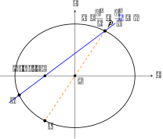
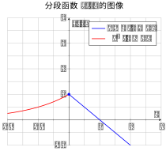
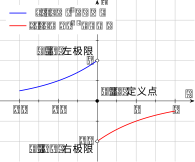
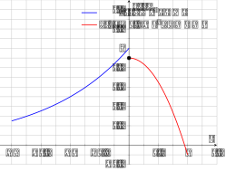
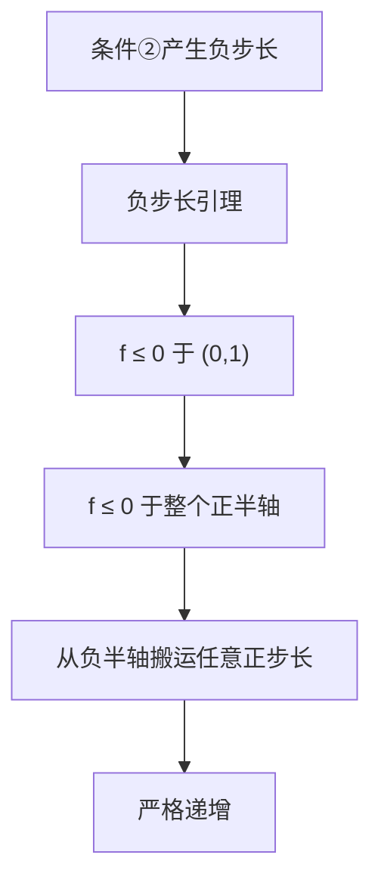

## 解析几何

已知椭圆

$$
C:\frac{x^2}{a^2}+\frac{y^2}{b^2}=1\quad (a>b>0)
$$

的左焦点为 \(F(-1,0)\)，离心率为 \(\frac12\)。

1. 求椭圆 \(C\) 的方程；
2. 设 \(O\) 为坐标原点。过 \(F\) 且斜率大于 \(0\) 的动直线 \(l\) 与 \(C\) 交于 \(P,Q\) 两点，其中 \(Q\) 在第三象限；直线 \(PO\) 与 \(C\) 的另一个交点为 \(R\)。

   1. 若 \(\triangle PQR\) 的面积是 \(\triangle PFO\) 面积的 \(3\) 倍，求直线 \(l\) 的方程；
   2. 求 \(\tan\angle PQR\) 的最小值。

### 解法一

由题意可以列出方程

$$
\begin{aligned}
c &= 1 \\
\frac{c}{a} &= \frac{1}{2} \\
a^2 &= b^2 + c^2
\end{aligned}
$$

非常容易能够解得 \(a=2, b=\sqrt{3}\)。所以椭圆 \(C\) 的方程为

$$
C:\frac{x^2}{4}+\frac{y^2}{3}=1
$$

---

在第 2 问中，由题意可以设出直线 \(l\) 的方程为

$$
y = k(x + 1) \ (k>0)
$$

我们可以联立直线 \(l\) 和椭圆 \(C\) 的方程，使用代入法得到

$$
\begin{aligned}
  3x^2 + 4k^2(x+1)^2 &= 12 \\
  (4k^2+3)x^2 + 8k^2x + 4(k^2-3) &= 0
\end{aligned}
$$

设 \(P, Q\) 两点的坐标分别为 \((x_1, y_1), (x_2, y_2)\)，由韦达定理得

$$
\begin{aligned}
  x_1 + x_2 &= -\frac{8k^2}{4k^2 + 3} \\
  x_1 x_2 &= -\frac{4(k^2 - 3)}{4k^2 + 3}
\end{aligned}
$$

对于第 2 问的第 (i) 小问，我们可以仔细观察 \(\triangle PQR\) 和 \(\triangle PFO\) 这两个三角形，看看以哪条边为底（同时高也能确定），两个三角形的面积会更好算一些。

此时不难看出，原点 \(O\) 是线段 \(PR\) 的中点。若 \(\triangle PQR\) 和 \(\triangle PFO\) 分别以线段 \(PQ\) 和线段 \(PF\) 为底，那么它们恰好都在直线 \(l\) 上，且它们的高之比正好为 \(2:1\)。

此时根据题意，\(\triangle PQR\) 的面积是 \(\triangle PFO\) 面积的 \(3\) 倍，据此可以推得 \(\triangle PQR\) 和 \(\triangle PFO\) 底之比为 \(3:2\)。

也就是说 \(PQ:PF=3:2\)，立马就可以推出 \(PF:QF = 2:1\)。平面几何的数量关系转化为解析几何的坐标表示为 \(y_1 = -2y_2\)。恰好点 \(P,Q\) 都在直线 \(l\) 上，将 \(l\) 的方程代入，可以得到

$$
\begin{aligned}
  k(x_1 + 1) &= -2k(x_2 + 1) \\
  x_1 + 2x_2 &= -3
\end{aligned} \tag{3}
$$

将刚才得到的方程再加上一开始通过韦达定理得到的方程，正好是三个三元一次方程。下面通过消元法解这个三元方程组。

首先，我们消掉 \(x_1\)。方程 \((1)\) 和 \((3)\) 联立得

$$
\begin{aligned}
  x_2 &= \frac{8k^2}{4k^2 + 3} - 3 \\
      &= -\frac{4k^2 + 9}{4k^2 + 3}
\end{aligned} \tag{4}
$$

方程 \((2)\) 和 \((3)\) 联立得

$$
2x_2 -\frac{4(k^2 - 3)}{4k^2 + 3} \cdot \frac{1}{x_2} = -3 \tag{5}
$$

将方程 \((4)\) 代入 \((5)\) 得

$$
\begin{aligned}
  -\frac{8k^2 + 18}{4k^2 + 3} -\frac{4(k^2 - 3)}{4k^2 + 3} \cdot \frac{4k^2 + 3}{4k^2 + 9} &= -3 \\
  -\frac{4(k^2 - 3)}{4k^2 + 9} &= \frac{-4k^2 + 9}{4k^2 + 3} \\
  0k^4 -36k^2 - 36 + 81 &= 0 \\
\end{aligned}
$$

可以解得 \(k= \frac{\sqrt{5}}{2}\)，即直线 \(l\) 的方程为

$$
l: y = \frac{\sqrt{5}}{2} (x+1)
$$

对于第 (ii) 小问，可以看到 \(\angle PQR\) 恰好为射线 \(QP\) 和射线 \(QR\) 分别与过 \(Q\) 且平行于 \(x\) 轴正方向的射线所成的角之和（分别称为 \(\angle 1, \angle 2\)）。由斜率的几何意义可知，不妨设射线 \(QP\) 和射线 \(QR\) 的斜率分别为 \(k_1, k_2\)，于是可以得到

$$
\begin{aligned}
  \tan \angle PQR &= \tan (\angle 1 + \angle 2) \\
  &= \frac{\tan \angle 1 + \tan \angle 2}{1 - \tan \angle 1 \tan \angle 2} \\
  &= \frac{k_1 - k_2}{1 + k_1k_2}
\end{aligned}
$$



此处要注意斜率和角度的正切值的转化。\(\angle PQR\) 是 \(\angle 1, \angle 2\) 锐角之和，但是转化为斜率进行坐标计算时，要考虑到 \(\angle 2\) 是第四象限角。



有了这样一个函数关系还不够，还需要找到 \(k_1\) 和 \(k_2\) 的函数关系，以消元求解函数的最值。前面我们设过了 \(P,Q\) 两点的坐标，不难看出 \(R\) 点的坐标为 \((-x_1, -y_1)\)。同时，显然 \(k_1 = k\)，那么下面就要找到 \(k_2\) 与 \(k\) 的函数关系。首先由两点间直线斜率的计算公式得

$$
k_2 = \frac{-y_1 - y_2}{-x_1 - x_2}
$$

代入之前韦达定理的计算结果，逐步化简

$$
\begin{aligned}
  k_2 &= \frac{k(x_1 + x_2 + 2)}{x_1 + x_2} \\
  &= k - \frac{4k^2 + 3}{4k} \\
  &= -\frac{3}{4k}
\end{aligned}
$$

于是，待求的函数

$$
\begin{aligned}
  \tan \angle PQR &= \frac{k_1 - k_2}{1 + k_1k_2} \\
  &= 4k + \frac{3}{k} \\
  &\geq 4 \sqrt{3}
\end{aligned}
$$

当且仅当 \(k = \frac{\sqrt{3}}{2}\) 时等号成立，即 \(\tan\angle PQR\) 的最小值为 \(4 \sqrt{3}\)。

### 解法二

较为简便的解法是采用焦半径公式计算弦长。对椭圆上任一点 \(M(x,y)\)，到左焦点 \(F(-1,0)\) 的焦半径为

$$
MF=a+ex=2+\frac{x}{2}
$$

根据之前基于平面几何的研究，即 \(PF:QF = 2:1\)，得到方程

$$
\begin{aligned}
  2 + \frac{x_1}{2} &= 2 \left(2 + \frac{x_2}{2}\right) \\
  x_1 - 2x_2 &= 4
\end{aligned} \tag{6}
$$

然后点 \(P,Q\) 都在直线 \(l\) 上，所以通过 \(PF:QF = 2:1\) 的关系得出 \(y_1 = -2 y_2\)，进一步就可以推出解法一得到的 \((3)\) 式：

$$
\begin{aligned}
  k(x_1 + 1) &= -2k(x_2 + 1) \\
  x_1 + 2x_2 &= -3
\end{aligned} \tag{3}
$$

联立方程 \((3)\) 和 \((6)\)，解得 \(x_1 = 1/2, x_2 = -7/4\)。不妨将 \(P(x_1, y_1)\) 代入椭圆 \(C\) 的方程：

$$
\begin{aligned}
  \frac{\frac{1}{4}}{4} + \frac{y_1^2}{3} &= 1 \\
  y_1^2 &= \frac{45}{16}
\end{aligned}
$$

显然 \(P\) 点在第一或第二象限，所以舍去负值，\(y_1 = \frac{3 \sqrt{5}}{4}\)。直线 \(l\) 的斜率为

$$
k = \frac{y_1 - 0}{x_1 - (-1)} = \frac{\sqrt{5}}{2}
$$

即求得直线 \(l\) 的方程。后续解法同解法一。

### 点评

本题题型常规，既考察考生对题意的理解，也考察一定的计算力，整体难度适中、计算量适中。

使用解法二的焦半径公式计算量会明显小于解法一通过韦达定理暴力求解。

## 函数

已知函数 \(f(x)\) 的定义域为 \(\mathbb{R}\)，且当 \(x<0\) 时，

$$
f(x)=2^x.
$$

对任意 \(x_0\in\mathbb{R}\)，定义集合

$$
D(x_0)=\{\,d\in\mathbb{R}\mid f(x_0+d)>f(x_0)\,\}.
$$

1. 若当 \(x \geq 0\) 时，\(f(x)=1-x\)，求 \(D(-1)\)；
2. 若 \(f(x)\) 是奇函数，且 \(f(x_1) \leq f(x_2)\)，且 \(x_1x_2\neq 0\)，证明：

$$
D(x_2)\subseteq D(x_1);
$$

3. 设 \(f(x)\) 满足：

   ① 若 \(f(x_1)\leq f(x_2)\)，则 \(D(x_2)\subseteq D(x_1)\)；

   ② 当 \(0<x<1\) 时，\(f(x)<f(0)\)。

   1. 证明：\(f(0)\geq 1\)；
   2. 证明：\(f(x)\) 在区间 \((0,+\infty)\) 单调递增。

### 分析

这个题目看着很复杂，有很多抽象的定义，所以需要有一定的耐心来理解题意。

这个题目的大背景主要是分为了两个部分的定义：

1. 定义了一个定义域为 \(\mathbb{R}\) 的函数，但没有给出全部定义域上的解析式；
2. 定义了一个不容易看懂的集合，看起来与函数的值域有关。

我们首先来感受一下这个集合到底定义了什么。首先可以看到这个集合被取名为 \(D(x_0)\)，这说明它一次性定义了多个集合。其次，这个集合的元素是 \(d\)，且很明显能够判断出它是实数域 \(\mathbb{R}\) 的子集。最后，注意到题目说“对于任意 \(x_0\in\mathbb{R}\)，……”。

上述种种分析表明，这一套定义看似在定义一系列集合，实际上是定义了一种映射。甚至可以说，它定义的就是从 \(\mathbb{R}\) 到若干 \(\mathbb{R}\) 的子集的映射。那这本质上不还是函数嘛！（其实这是一种多值函数）

至此，我们就完全没有必要被这么花里胡哨的抽象符号唬住了。更进一步，我们来看集合 \(D(x_0)\) 到底定义了一种怎样的映射。我们不妨就把 \(x_0\) 看作是自变量，将 \(d\) 暂时看作是参数。那么 \(f(x_0+d)\) 其实就是在将 \(f(x_0)\) 的图像向左平移 \(d\) 个单位。然后，题目要求

$$
f(x_0+d)>f(x_0)
$$

用自然语言来描述，就是在说平移后的函数图像在各个 \(x\) 取值处处处比原来都要大。最后，我们再将 \(d\) 视为因变量，于是就能够理解集合 \(D(x_0)\) 是这样一种映射：

> **给定任意一个值，找到所有满足左移函数图像能够覆盖住原图像的步长。**

既然如此，我突然想到了一点：对于在定义域 \(\mathbb{R}\) 上单调递增的函数，所定义的所有的这些集合其实都是 \(\mathbb{R}\)。那么充分利用函数单调性的定义其实极有可能就是本题想要考察的知识点。

### 第 (1) 小问

第 (1) 小问先来小试牛刀，题目给出了函数的完整定义。其函数图像如图所示：

要求 \(D(-1)\)，其实就是解一系列不等式组：

$$
\begin{cases}
  2^{d-1} > f(-1) = \frac{1}{2} \\
  d - 1 < 0
\end{cases}
$$

$$
\begin{cases}
  1 - (d - 1) > f(-1) = \frac{1}{2} \\
  d - 1 \geq 0
\end{cases}
$$

两个不等式组的解集取并集，就可以得到

$$
D(-1) = (0, 1) \cup [1, \frac{3}{2}) = (0, \frac{3}{2})
$$

### 第 (2) 小问

第 (2) 小问告诉我们 \(f(x)\) 是奇函数，这就意味着

$$
f(x) = \begin{cases}
  2^x, \ (x<0) \\
  0, \ (x=0) \\
  -2^{-x}, \ (x>0)
\end{cases}
$$

题目让我们证明包含关系。根据子集的定义，只要能够证明子集中的任意一个元素都在父集里面即可。这其中的关键在于，利用奇函数和函数的解析式，将值域的大小关系转化为定义域的大小关系。

易知，\(f(x)\) 是分段函数，在 \(x = 0\) 处不连续。所有容易想到分为如下三种情况讨论：

1. \(x_1, x_2 < 0\)，此时 \(f(x)\) 在 \((-\infty, 0)\) 上单调递增，所以 \(x_1 \leq x_2 < 0\)；

2. \(x_1, x_2 > 0\)，此时 \(f(x)\) 在 \((0, +\infty)\) 上单调递增，所以 \(0 < x_1 \leq x_2\)；

3. \(x_1 x_2 < 0\)，根据函数解析式，要想满足 \(f(x_1) \leq f(x_2)\)，只能是 \(x_2 < 0 < x_1\)。

下面再回到题目的定义：

$$
\begin{aligned}
  D(x_1) &= \{\,d\in\mathbb{R}\mid f(x_1+d)>f(x_1)\,\} \\
  &= \begin{cases}
       (0, +\infty) \cup (-\infty, -x_1), \ (x_1 > 0) \\
       (-\infty, 0), \ (x_1 = 0) \\
       (0, -x_1), \ (x_1 < 0)
     \end {cases}
\end{aligned}
$$

$$
\begin{aligned}
  D(x_2) &= \{\,d\in\mathbb{R}\mid f(x_2+d)>f(x_2)\,\} \\
  &= \begin{cases}
       (0, +\infty) \cup (-\infty, -x_2), \ (x_2 > 0) \\
       (-\infty, 0), \ (x_2 = 0) \\
       (0, -x_2), \ (x_2 < 0)
     \end {cases}
\end{aligned}
$$

根据集合包含关系的定义，还是分三种情况讨论：  

1. \(x_1 \leq x_2 < 0\)，\((0, -x_2) \subseteq (0, -x_1)\)；
2. \(0 < x_1 \leq x_2\)，\((0, +\infty) \cup (-\infty, -x_2) \subseteq (0, +\infty) \cup (-\infty, -x_1)\)；
3. \(x_2 < 0 < x_1\)，\((0, -x_2) \subseteq (0, +\infty) \cup (-\infty, -x_1)\)。

所以综上所述，\(D(x_2)\subseteq D(x_1)\) 得证。

### 第 (3)-(i) 小问

第 (3) 小问的条件变了，没有了奇函数的条件，但是和第 (2) 小问又极其相似。所以需要充分利用第 (2) 小问的思路乃至结论。

上一小问的结论这次作为条件，但是却没有 \(f(x)\) 完整的解析式，所以非常难以快速推出一些有价值的结论。当正向演绎推理难以进行时，可以考虑的证明方法就是分析法和反证法。

先尝试使用分析法。第 (i) 小问让我们证明 \(f(0) \geq 1\)，然后我们还已知当 \(0<x<1\) 时，\(f(x)<f(0)\)；同时还有 \(f(x) = 2^x \in (0, 1), \ (x < 0)\)。所以我们可以感知到间断点的意义其实是为了保证某种单调性或者题目当中集合包含的条件的。但这还是十分棘手，并没有一个非常显著的前提条件可以直接推出 \(f(0) \geq 1\)。

所以，现在再来尝试反证法。假设 \(f(0) < 1\)，那么 \(f(x) < f(0) < 1\) 对 \(\forall x \in [0, 1)\) 恒成立。我们尝试写出 \(D(x_0)\) 集合的定义：

$$
\begin{aligned}
  D(x_0) &= \{\,d\in\mathbb{R}\mid f(x_0+d)>f(x_0)\,\} \\
  &= \begin{cases}
       (0, -x_0), \ (x_0 < 0) \\
       (-\infty, 0), \ (0 \leq x_0 < 1)
     \end {cases}
\end{aligned}
$$

TODO 这部分很难求，看起来想要通过定义分析几乎不可能了。现在不妨回想一下之前分析过的内容，即

>> **给定任意一个值，找到所有满足左移函数图像能够覆盖住原图像的步长。**
>>

根据这个形象直观的解释，再结合函数图像，似乎要找到这样的步长 \(d\) 有难度了（\(d\) 显然不能是满足 \(d > 0\) 的任意小的数了）。

现在观察函数图像，发现 \(x = 0\) 的领域内有一些 gap，那么很有可能在这个地方找到矛盾点。刚才其实已经研究过 \(x = 0\) 的右领域了，现在来考察 \(x = 0\) 的左（去心）领域。不难发现：

$$
\lim_{x \rightarrow 0^{-}} f(x) = 1
$$

利用这个 gap，一定存在 \(x_0 \in U_-^\circ(x_0)\)，使得 \(f(0) < f(x_0) < 1\)。这句话有点抽象，可以这样进行直观理解：想象有一条水平直线穿过这个 gap，它交函数图像左边那支（即指数函数）于一点，该点的函数值即为 \(f(x_0)\)，满足上述关系式。

同时，再令 \(f(x'_0) = f(0) \ (x'_0 < 0)\)，显然可得 \(x'_0 < x_0 < 0\)。

根据题目给出的条件，当 \(f(0) < f(x_0)\) 时，可以推出 \(D(x_0) \subseteq D(0)\)。现在可以尝试利用定义计算一下 \(D(0)\) 和 \(D(x_0)\)：

$$
\begin{aligned}
  D(0) &= \{\,d\in\mathbb{R}\mid f(d)>f(0)\,\} \\
  &= (x'_0, 0) \cup S
\end{aligned}
$$

$$
\begin{aligned}
  D(x_0) &= \{\,d\in\mathbb{R}\mid f(x_0 + d)>f(x_0)\,\} \\
  &= (0, -x_0) \cup S
\end{aligned}
$$

这就与 \(D(x_0) \subseteq D(0)\) 的结论相矛盾了。所以原命题 \(f(0) \geq 1\) 成立。



因为我们还没有研究 \(x \in (1, +\infty)\) 的情况，所以这里为了严谨，我们定义 \(S \subseteq (1, +\infty)\) 以表示可能的 \(d\) 的取值范围。但即便如此，\(D(x_0)\) 和 \(D(0)\) 也没有包含关系，所以不影响我们判断。



### 第 (3)-(ii) 小问

最后的第 (ii) 小问要证明单调性，恰恰说明最初我们对题目的分析的意义。很显然，这里要想证明单调性，只能依靠定义，即 \(\forall x_1 < x_2\)，都有 \(f(x_1) < f(x_2)\)。根据题意，没有类似于 \(f(x_1) < f(x_2)\) 这种形式的式子，但是有 \(f(x_0+d)>f(x_0)\) 这种类型的式子。这样分析之后，不难想到，可以将证明单调性的问题转化为证明如下结论：

$$
\forall x_0 \in (0, +\infty), \ f(x_0+k)>f(x_0) \ (k>0)
$$

下面开始证明。首先要充分利用前面所得到的各种结论，比如 \(f(0) \geq 1\)。要证明的命题含有全程量词“任意”，证明任意性的结论需要保证恒成立，特别是在当前这种函数解析式不完整且抽象的条件下愈发困难，所以仍然采用反证法。那么这样一来，对要证明的结论进行否定转化为已知条件如下：

$$
\exists x_0 \in (0, +\infty), \ f(x_0+d) \leq f(x_0) \ (d>0)
$$

采用反证法的一个好处是，原先要证明的结论否定之后所得到的条件变得更简单了，仅仅只是“存在”。那么就只需要找到一个反例即可。那么根据第 (3) 小问给的已知条件，可知

$$
f(x_0 + k) \leq f(x_0) \Longrightarrow D(x_0) \subseteq D(x_0 + k)
$$

继续按照集合 \(D(x_0)\) 的定义，可以得到

$$
\begin{aligned}
  D(x_0 + k) &= \{\,d\in\mathbb{R}\mid f(x_0 + k + d)>f(x_0 + k)\,\} \\
  &= (x'_0, 0) \cup S
\end{aligned}
$$

> 至此，我已黔驴技穷。😖😱

---



以下由 GPT 5.5 模型完成证明。



第 (ii) 小问建议换一条路：不要硬算未知正半轴上的 \(D(x)\)，而是把条件①理解成一种“上升步长的搬运规则”。

#### 先把条件①翻译成人话

条件①为

$$
f(a)\leq f(b)\Longrightarrow D(b)\subseteq D(a).
$$

它表示：**函数值较低的点，拥有的“上升步长”至少和函数值较高的点一样多。**

换言之，如果某个步长 \(d\) 能使 \(b\) 点的函数值上升，即 \(d\in D(b)\)，而且 \(f(a)\leq f(b)\)，那么同一个步长也一定能使 \(a\) 点的函数值上升，即 \(d\in D(a)\)。后面的证明会不断使用条件①搬运同一个步长。



**为什么会想到“能向左增大的点函数值必须非正”？**

所谓“在 \(y\) 点能向左增大”，就是存在负步长 \(d<0\)，使

$$
f(y+d)>f(y),
$$

也就是 \(d\in D(y)\)。

现在观察题目完全已知的负半轴。当 \(u<0\) 时，\(f(u)=2^u\)。若 \(d<0\)，则

$$
u+d<u<0,
$$

从而

$$
f(u+d)=2^{u+d}<2^u=f(u).
$$

因此，在负半轴的指数函数上，向左走一定下降；任何负步长都不可能属于 \(D(u)\)：

$$
d<0\Longrightarrow d\notin D(u)\qquad(u<0).
$$

这恰好提供了一个可以和条件①的集合包含关系发生冲突的对象。



**引理：若** **\(d<0\)** **且** **\(d\in D(y)\)** **，则** **\(f(y)\leq0\)** **。**

反证。假设 \(f(y)>0\)。由于 \(2^u\to0\)（\(u\to-\infty\)），可以取充分小的 \(u<0\)，使

$$
f(u)=2^u\leq f(y).
$$

由条件①，

$$
D(y)\subseteq D(u).
$$

已知 \(d\in D(y)\)，所以应有 \(d\in D(u)\)。但 \(u<0\) 且 \(d<0\)，负半轴上的指数函数向左必下降，所以 \(d\notin D(u)\)，矛盾。

故

$$
\boxed{d<0,\ d\in D(y)\Longrightarrow f(y)\leq0.}
$$

这个引理并不是凭空构造出来的。想到它的线索有三条：

1. 条件②会自然制造一个负的上升步长；
2. 已知的负半轴排斥一切负的上升步长；
3. 条件①可以把一个上升步长从某个点搬运到函数值更低的点。

把三条线索拼起来，就会想到：如果某点既能向左增大，函数值又为正，就可以在负半轴找到一个函数值更低的点，将这个负步长搬过去，立即产生矛盾。

#### 证明 \((0,1)\) 上的函数值非正

任取 \(0<s<1\)。由条件②，

$$
f(s)<f(0)=f(s-s).
$$

从 \(s\) 移动到 \(0\) 的步长是 \(-s\)，所以

$$
-s\in D(s).
$$

又因为 \(-s<0\)，由上面的引理立刻得到

$$
\boxed{f(s)\leq0\qquad(0<s<1).}
$$

这一步把条件②给出的相对大小关系 \(f(s)<f(0)\)，强化成了明确的符号结论 \(f(s)\leq0\)。



**为什么还要证明整个正半轴上的函数值都非正？**

最终要证明严格递增，等价于对任意 \(x>0\)、\(k>0\) 证明

$$
f(x+k)>f(x),
$$

也就是证明 \(k\in D(x)\)。

在负半轴上很容易制造任意一个正的上升步长 \(k\)：只要取 \(u<-k\)，则 \(u,u+k<0\)，并且

$$
f(u+k)=2^{u+k}>2^u=f(u),
$$

即 \(k\in D(u)\)。

若想利用条件①把 \(k\) 从 \(D(u)\) 搬到 \(D(x)\)，需要满足 \(f(x)\leq f(u)\)。而 \(f(u)=2^u>0\)，所以只要先证明所有 \(x>0\) 都有 \(f(x)\leq0\)，这个包含关系就会自动成立。这正是下一步的目标。



#### 把 \(f(s)\leq0\) 从 \((0,1)\) 推广到整个正半轴

反证。假设存在 \(t>0\)，使

$$
f(t)>0.
$$

我们的目标是把 \(t\) 点的正性“搬运”到某个 \(s\in(0,1)\)，与已经证明的 \(f(s)\leq0\) 矛盾。

取

$$
0<s<\min\{t,1\}.
$$

因为 \(f(t)>0\)，而 \(2^{-h}\to0 \ (h\to+\infty)\)，可以取充分大的 \(h>0\)，使

$$
2^{-h}<f(t).
$$

令

$$
d=t+h.
$$

从点 \(-h\) 出发移动步长 \(d\)，恰好到达 \(t\)，因为 \(-h+d=t\)。于是

$$
f(-h+d)=f(t)>2^{-h}=f(-h),
$$

故

$$
d\in D(-h).
$$

接下来要把同一个步长 \(d\) 搬到另一个起点，并让它的终点恰好是 \(s\)。这个起点只能取

$$
v=s-d=s-t-h,
$$

因为 \(v+d=s\)。

又因为 \(s<t\)，所以

$$
v=s-t-h<-h<0.
$$

两点都在负半轴，而指数函数严格递增，因此

$$
f(v)=2^{s-t-h}<2^{-h}=f(-h).
$$

由条件①，

$$
D(-h)\subseteq D(v).
$$

前面已经得到 \(d\in D(-h)\)，于是 \(d\in D(v)\)。根据 \(D(v)\) 的定义，

$$
f(v+d)>f(v).
$$

代入 \(v+d=s\)，得到

$$
f(s)>f(v)=2^{s-t-h}>0.
$$

可是 \(0<s<1\)，前面已经证明 \(f(s)\leq0\)，矛盾。因此不存在函数值为正的 \(t>0\)，即

$$
\boxed{f(t)\leq0\qquad(t>0).}
$$

这里最巧妙的构造，是让同一个步长 \(d=t+h\) 完成两次移动：

$$
-h\xrightarrow{\ d\ }t,
\qquad
s-t-h\xrightarrow{\ d\ }s.
$$

第一次移动说明 \(d\in D(-h)\)；条件①再把它搬到第二个起点，从而迫使 \(f(s)>0\)。

#### 证明 \((0,+\infty)\) 上严格递增

任取 \(x>0\) 和 \(k>0\)。取 \(u<-k\)，则 \(u<0\) 且 \(u+k<0\)。因此

$$
f(u+k)=2^{u+k}>2^u=f(u),
$$

即

$$
k\in D(u).
$$

另一方面，已经证明 \(f(x)\leq0\)，而 \(f(u)=2^u>0\)，所以

$$
f(x)<f(u).
$$

由条件①，

$$
D(u)\subseteq D(x).
$$

于是 \(k\in D(x)\)，即

$$
f(x+k)>f(x).
$$

最后任取 \(0<x_1<x_2\)，令 \(k=x_2-x_1>0\)，便有

$$
f(x_2)=f(x_1+k)>f(x_1).
$$

所以 \(f(x)\) 在 \((0,+\infty)\) 上严格单调递增。

#### 证明思路梳理

整条思维链可以概括为

### 点评

本题难度非常非常大，但是它不失为近年来质量最高、最能够考察考生数学最根本的逻辑思维能力的好题。

首先，这道题用到的知识点只有集合、函数（单调性、奇偶性）。所以，这道题没有任何的超纲。其次，这道题设置了难度梯度循序渐进的 4 问。对于勤奋努力的中等生，他完全有能力通过认真审题并结合所学知识完成第 (1) 和第 (2) 小问。

最后，这道题处处体现了对数学思维和推理证明能力的考察。第 (2) 小问给定了奇函数的条件，就是在考察考生能否想到分类讨论；第 (3) 小问待证明的结论都非常抽象，且无论是综合法还是分析法都难以证明时，能否想到反证法。

总的来看，这道难度相当大的压轴题向广大师生乃至全社会宣告了一个我国未来人才选拔的一个重要方向：筛选真正有思维能力的人才，而不是刷题机器。最后这两道大题都反映出了“重思维、轻计算”考察趋势，使数学教育逐步回归到逻辑思维本质。
