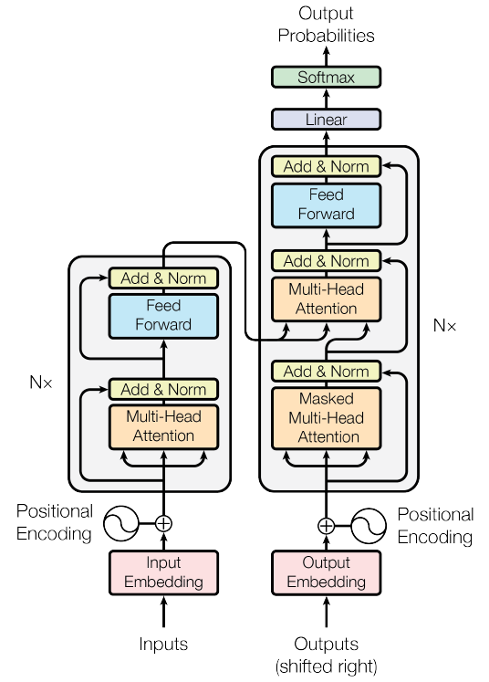
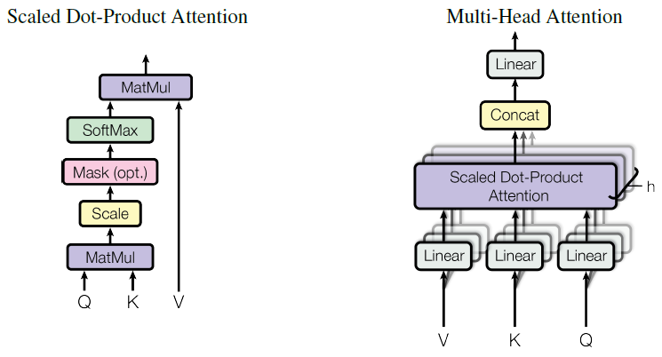

推理服务系统的根本目标在于降低时延和提高吞吐量，LLM 推理的优化也是如此。首字时延（Time To First Token, TTFT）和吐字时延（Time Per Output Token, TPOT）就是两个非常重要的指标。如何优化 LLM 推理的这两个指标成为近年来学术界热议的问题。在研究这个问题之前，有必要深入理解 LLM 架构，分析其参数量和计算访存开销。

<!--more-->

------

Transformer[^1] 是一种 Encoder-Decoder 结构的模型，它被认为是 LLM 的基础模型。此后，诸如 Encoder only 模型（BERT[^2]）、Decoder only 模型（GPT[^3]）、Encoder-Decoder 模型都是在 Transformer 基础之上的变体。但不论是何种结构的 LLM，其内部都主要包含如下 block：

- Multi-Head Self-Attention：多头自注意力
- Feed-Forward：前馈网络
- Add & LayerNorm：层归一化

此外，还包括如下一些 block：

- Token Embedding：词嵌入
- Position Embedding：位置嵌入
- Linear：输出的线性层
- Softmax：激活函数

LLM 超参数定义如下：

|         超参数          | 符号表示 | Transformer 中的大小 |
| :---------------------: | :------: | :------------------: |
| \(d_{\textrm{model} }\) |    M     |         512          |
|      \(d_k(d_v)\)       |    D     |          64          |
|          Head           |    H     |          8           |
|       \(d_{ff}\)        |    F     |         2048         |

根据论文中的定义，其中 \(M = HD\)，\(F = 4M\)。

## 参数量理论计算

### MHA

多头自注意力模块的每个 head 都需要 2 次 Self-Attention 的计算，即

$$
\text{Attention}(Q, K, V) = \text{Softmax}(\frac{QK^{\top}}{\sqrt{d_k}})V
$$

在那之前，需要将每个 token 从 \(d_{\textrm{model}}\) 维映射到 \(d_k(d_v)\) 维。（在 Transformer 模型中，\(d_{\textrm{model}} = 512\)，而 \(d_k = d_v = \frac{d_{\textrm{model}}}{h} = 64\)，这里 \(h = 8\)。）所以，输入的 \(Q, K, V\) 向量都需要进行投影操作，共需 3 个线性变换矩阵 \(W_K, W_Q, W_V\)，维度均为 `(M, D)`。

最终将每个 head 拼接起来，得到 \(d_v \times h = d_{\textrm{model}}\) 维。这个结果再投影到 \(d_{\textrm{model}}\) 维，需 1 个线性变换矩阵 \(W_O\)，维度为 `(M, M)`。即

$$
\begin{aligned}
    \text{MultiHead}(Q, K, V) &= \text{Concat}(\text{head}_1, ..., \text{head}_h)W^O \\
    \text{where } \text{head}_i &= \text{Attention}(QW^Q_i, KW^K_i, VW^V_i)
\end{aligned}
$$

因此，多头自注意力模块的总参数量为

$$
\begin{aligned}
    & (d_{\textrm{model}} \times d_{qkv} + d_{qkv}) \times 3 \times h + (d_{\textrm{model}} \times d_{\textrm{model}} + d_{\textrm{model}}) \\
    =\ & 4 (d_{\textrm{model}}^2 + d_{\textrm{model}})
\end{aligned}
$$

在 \(d_{ff}\) 很大的情况下，可以近似认为参数量为 \(4d_{\textrm{model}}^2\)。

### FFN

前馈网络模块由 2 个全连接层，即

$$
\begin{aligned}
    \text{FFN}(x) = \text{ReLU}(xW_1 + b_1)W_2 + b_2
\end{aligned}
$$

其中隐藏层 \(d_{ff}\) 的维度一般是 \(d_{\textrm{model}}\) 的 4 倍。所以参数矩阵 \(W_{in}, W_{out}\) 的维度分别为 `(M, F)` 和 `(F, M)`。因此，前馈网络模块的总参数量为

$$
\begin{aligned}
    & (d_{\textrm{model}} \times d_{ff} + d_{ff}) + (d_{ff} \times d_{\textrm{model}} + d_{\textrm{model}}) \\
    =\ & 2 d_{\textrm{model}} d_{ff} + d_{\textrm{model}} + d_{ff}
\end{aligned}
$$

### Add & LayerNorm

这一模块包含两个操作，一是 Add，即残差连接；二是 Layer Normalization，即

$$
\begin{aligned}
    y = \frac{x - \mu}{\sigma + \epsilon} \times \gamma + \beta
\end{aligned}
$$

其中，\(\mu\) 为均值，\(\sigma\) 为标准差，\(\epsilon\) 为定值，\(\gamma\) 为缩放因子，\(\beta\) 为偏移因子。\(\gamma, \beta\) 是需要学习的参数，是 `(1, M)` 维的向量。因此，这部分参数量为

$$
2 \times d_{\textrm{model}}
$$

### Embedding

Token Embedding 过程包含参数，参数量取决于训练数据 token 的数量 `vocab_size`。参数矩阵的维度为 `(vocab_size, M)`。

而 Positional Embedding 采用三角函数计算，即

$$
\begin{aligned}
    PE_{(pos, 2i)} &= \sin (pos / 10000^{2i / d_{\textrm{model}}}) \\
    PE_{(pos, 2i+1)} &= \cos (pos / 10000^{2i / d_{\textrm{model}}})
\end{aligned}
$$

此过程不需要学习，因此没有参数。

### Linear & Softmax

从最后一个编码器输出的结果需要经过一个线性层，通过 Softmax 化为概率分布后，选择最大概率的 token 输出。因此，线性层的参数矩阵具有 `(M, vocab_size)` 维。这部分的参数量为

$$
d_{\mathrm{model}} \times \mathrm{vocab_size}
$$

## 参数量估算

LLM 总参数量为上述各部分参数量之和。不考虑输入和输出，按照 GPT 的架构，即 Decoder only，每个 Decoder 共 1 个 MHA、1 个 FFN 和 2 个 Add & LayerNorm。这样我们可以得到参数量为

$$
\begin{aligned}
    & 4 (d_{\textrm{model}}^2 + d_{\textrm{model}}) + \\ 
    & 2 d_{\textrm{model}} d_{ff} + d_{\textrm{model}} + d_{ff} + \\
    & 2 \times d_{\textrm{model}} \times 2 \\
\end{aligned}
$$

这里我们继续简化，令 \(d_{ff} = 4d_{\textrm{model}} = 4d\)，得到

$$
\begin{aligned}
    & 4 (d^2 + d) + 2d \times 4d + d + 4d +2d \times 2 \\
    =\ & 12d^2 + 13d
\end{aligned}
$$

当 \(d_{\textrm{model}}\) 较大时，Encoder 和 Decoder 部分的参数量和其他部分相比远远更大。因此，要快速估计 LLM 的参数量，一般可以采用 \(12d_{\textrm{model}}^2\) 作为估计值。

## 验证参数量

### Transformer

按照上述计算方法，我们首先验证 Transformer 的参数量。

首先，计算一个 Encoder 的参数量。一个 Encoder 包含 1 个 MHA block、1 个 FFN block 和 2 个 Add & LayerNorm，即

$$
\begin{aligned}
    & 4 (d_{\textrm{model}}^2 + d_{\textrm{model}}) + \\ 
    & 2 d_{\textrm{model}} d_{ff} + d_{\textrm{model}} + d_{ff} + \\
    & 2 \times d_{\textrm{model}} \times 2 \\
    =\ & 4 \times 512 \times (512+1) + \\
    & 2 \times 512 \times 2048 + 512 + 2048 + \\
    & 2 \times 512 \times 2 \\
    =\ & 3,152,384
\end{aligned}
$$

接下来，计算一个 Decoder 的参数量。一个 Decoder 包含 2 个 MHA block、1 个 FFN block 和 3 个 Add & LayerNorm，即

$$
\begin{aligned}
    & 4 (d_{\textrm{model}}^2 + d_{\textrm{model}}) \times 2 + \\ 
    & 2 d_{\textrm{model}} d_{ff} + d_{\textrm{model}} + d_{ff} + \\
    & 2 \times d_{\textrm{model}} \times 3 \\
    =\ & 4 \times 512 \times (512+1) \times 2 + \\
    & 2 \times 512 \times 2048 + 512 + 2048 + \\
    & 2 \times 512 \times 3 \\
    =\ & 4,204,032
\end{aligned}
$$

上面计算的只是一个 Encoder 或 Decoder 的参数量。Transformer 的 Encoder-Decoder 的数量均为 6 个。

除此之外，从最后一个编码器输出的结果需要经过一个线性层，通过 Softmax 化为概率分布后，选择最大概率的 token 输出。因此，线性层的参数矩阵具有 `(M, vocab_size)` 维。在 Transformer 论文中，训练所用的英语和德语对照表的 token 数量为 37,000 个。

因此，不考虑 Embedding，Transformer 的参数量为

$$
\begin{aligned}
    & (3,152,384 + 4,204,032) \times 6 + 37,000 \times 512 \\
    =\ & 63,082,496
\end{aligned}
$$

这和论文中给出的 65M 的参数量在同一个量级上。只不过，这里没有考虑输入和输出部分的参数量。如果模型足够大，那么参数量主要取决于 Encoder 和 Decoder 部分。

### LLaMA

LLaMA[^4] 是基于 Transformer 的 Decoder only 模型。考虑到 LLaMA 是参数量远大于 Transformer 的 LLM，所以我们采用估算法，可以得到下表：

|   Model   | \(d_{\textrm{model}}\) | Layer | 采用 \(12d_{\textrm{model}}^2\) 估算 | 采用 \(12d_{\textrm{model}}^2 + 13d_{\textrm{model}}\) 估算 |
| :-------: | :--------------------: | :---: | :----------------------------------: | :---------------------------------------------------------: |
| LLaMA-7B  |          4096          |  32   |            6,442,450,944             |                        6,444,154,880                        |
| LLaMA-13B |          5120          |  40   |            12,582,912,000            |                       12,585,574,400                        |
| LLaMA-30B |          6656          |  60   |            31,897,681,920            |                       31,902,873,600                        |
| LLaMA-65B |          8192          |  80   |            64,424,509,440            |                       64,433,029,120                        |

可见，估算值和论文给定的参数量相差无几。同时也说明，LLM 参数量越大，Encoder 和 Decoder 部分的参数量占比也就越大。可以基本上忽略输入输出部分的参数。

## 计算访存开销

首先需要给出如下两个定义：

- FLOPS (Floating Point Operations Per Second): 每秒浮点运算次数，用于衡量模型计算开销。
- MOPS (Memory Operations Per Second): 每秒内存访问次数，用于衡量模型访存（I/O）开销。

一般地，如果一个系统在单位时间内访存次数越小而计算次数越多，那么该系统的吞吐量就越大。定义算术强度（Arithmetic Intensity[^5]）为

$$
\begin{aligned}
    \text{Arithmetic Intensity} = \frac{\text{FLOPS}}{\text{MOPS}}
\end{aligned}
$$

显然，算术强度越大，系统的吞吐量越高。

### 全量推理

全量推理阶段，即输入一个完整的 sequence，到输出第一个 token 的过程。其计算和访存开销与 sequence length 和 batch size 直接相关，分别用 \(S_{in}\)（下面简写为 \(S\)）和 \(B\) 来分别表示其大小。

对于 MHA 的 4 个 `proj` 算子，即 \(W_Q, W_K, W_V, W_O\)，其映射的维度都是一致的，即从 \(d_{\mathrm{model}}\) 到 \(\mathrm{head} \times d_{k}\)（或反过来）。这部分的 FLOPS 和 \(B, S, M, H, D\) 成正比，即

$$
\begin{aligned}
    \text{FLOPS} & \propto BSMHD \\
    &= BSM^2
\end{aligned}
$$

由于需要把模型权重和中间激活 tensor 都加载到显存中，其 MOPS 由 2 个部分组成，即

$$
\begin{aligned}
    \text{MOPS} & \propto 2BSM + MHD \\
    &= 2BSM + M^2
\end{aligned}
$$

其中，常数 \(2\) 表示一对显存读写操作，因为中间激活 tensor 需要先读取，再将结果写入显存。

对于 Self-Attention 计算，\(Q \times K\) 和 Score（用 \(P\) 表示）\(\times V\) 这 2 个线性算子的 FLOPS 与 \(B, S^2, H, D\) 成正比，即

$$
\begin{aligned}
    \text{FLOPS} & \propto BS^2HD \\
    &= BS^2M
\end{aligned}
$$

不过，由于 Self-Attention 没有模型参数，其 MOPS 由 2 个部分组成，即读取 \(Q\) 和 \(K\) 向量，将结果写入显存，即

$$
\begin{aligned}
    \text{MOPS} & \propto 2BSHD + BS^2H \\
    &= 2BSM + BS^2H
\end{aligned}
$$

由于 Self-Attention 本质上是计算余弦距离，每个 head 内的向量计算的实际上是内积。这个过程需要额外的多次访存，以存储中间结果。所以，这部分的访存开销和 \(B, S^2, H\) 成正比。

最后，对于 FFN 的 2 个线性算子，即 \(W_{in}, W_{out}\) 2 个 MLP 层，其 FLOPS 与 \(B, S, M, F\) 成正比，即

$$
\begin{aligned}
    \text{FLOPS} & \propto BSMF + BSMF \\
    &= 8BSM^2
\end{aligned}
$$

其中，加号两边的部分虽然一样，但它们分别表示权重矩阵 \(W_{in}, W_{out}\) 和偏置向量 \(b_{in}, b_{out}\)。

同理，和 MHA 的 4 个 `proj` 算子类似，FFN 的 MOPS 也由 2 个部分组成，即

$$
\begin{aligned}
    \text{MOPS} & \propto BSM + MF \\
    &= BSM + 4M^2
\end{aligned}
$$

综上所述，对于 Encoder 的 8 个线性算子，其 FLOPS、MOPS 和算术强度如下表[^6]所示：

|        Stage         |     FLOPS     |       MOPS        |                  Arithmetic Intensity                   |
| :------------------: | :-----------: | :---------------: | :-----------------------------------------------------: |
|   \(Q \times W_Q\)   | \(O(BSM^2)\)  |  \(O(2BSM+M^2)\)  | \(O\left(\frac{1}{\frac{2}{M}+\frac{1}{BS} }\right)\) |
|   \(K \times W_K\)   | \(O(BSM^2)\)  |  \(O(2BSM+M^2)\)  | \(O\left(\frac{1}{\frac{2}{M}+\frac{1}{BS} }\right)\) |
|   \(V \times W_V\)   | \(O(BSM^2)\)  |  \(O(2BSM+M^2)\)  | \(O\left(\frac{1}{\frac{2}{M}+\frac{1}{BS} }\right)\) |
|    \(Q \times K\)    | \(O(BS^2M)\)  | \(O(2BSM+BS^2H)\) | \(O\left(\frac{1}{\frac{1}{D}+\frac{1}{S} }\right)\)  |
|    \(P \times V\)    | \(O(BS^2M)\)  | \(O(2BSM+BS^2H)\) | \(O\left(\frac{1}{\frac{1}{D}+\frac{1}{S} }\right)\)  |
|   \(A \times W_O\)   | \(O(BSM^2)\)  |  \(O(2BSM+M^2)\)  | \(O\left(\frac{1}{\frac{2}{M}+\frac{1}{BS} }\right)\) |
| \(F \times W_{in}\)  | \(O(8BSM^2)\) |  \(O(BSM+4M^2)\)  | \(O\left(\frac{8}{\frac{1}{M}+\frac{4}{BS} }\right)\) |
| \(F \times W_{out}\) | \(O(8BSM^2)\) |  \(O(BSM+4M^2)\)  | \(O\left(\frac{8}{\frac{1}{M}+\frac{4}{BS} }\right)\) |

上表给出了 LLM 主要的 8 个线性算子的 FLOPS、MOPS 和算术强度，这些开销在 LLM 推理过程中占主导地位。具体来说，这 8 个线性算子可以分为如下两类：

- `proj`：即 Projection 投影，是激活矩阵和权重矩阵相乘的过程。包括 MHA block 的 \(Q \times W_Q, K \times W_K, V \times W_V\) 和 \(A \times W_O\) 以及 FFN block 的两个 MLP 层。
- `act-to-act`：即 MHA block 的两次自注意力计算 \(Q \times K\) 和 \(P \times V\)。

通过上表，我们可以得出如下几点结论：

1. 序列长度和批量大小对计算和访存开销的影响成正比。
2. \(d_{\textrm{model}}\) 对 `proj` 算子的 FLOPS 和 MOPS 都具有二次的影响，
3. 序列长度对 `act-to-act` 算子的 FLOPS 和 MOPS 都具有二次的影响。在序列长度较小时，`act-to-act` 算子的计算量较小；但在序列长度较大时，`act-to-act` 算子的计算量较大。
4. 增大序列长度、批量大小、\(d_{\textrm{model}}\)，以及减少 head 的数量，都有助于提高算术强度。不过，序列长度和批量大小受显存限制不可能无限增加，\(d_{\textrm{model}}\) 和 head 是超参数，可以看作是定值。所以，吞吐量提升的瓶颈在于显存。

### 增量推理

增量推理阶段，即从输出第一个 token 的过程，自回归地推理出后续的 token，直至最后一个 token 的过程。其计算和访存开销与输出的序列长度直接相关，用 \(S_{out}\) 来表示其大小。对于增量推理阶段，情况比全量推理阶段要更加复杂，我们首先给出结论——对于 Decoder 的 8 个线性算子，其 FLOPS、MOPS 和算术强度如下表所示：

|         Stage         |                  FLOPS                   |                       MOPS                        |                                       Arithmetic Intensity                                       |
| :-------------------: | :--------------------------------------: | :-----------------------------------------------: | :----------------------------------------------------------------------------------------------: |
|   \(Q \times W_Q\)   |     \(\sum_{i=1}^{S_{out} }O(BM^2)\)     |        \(\sum_{i=1}^{S_{out} }O(2BM+M^2)\)        |                      \(O\left(\frac{1}{\frac{2}{M}+\frac{1}{B} }\right)\)                       |
|   \(K \times W_K\)   |     \(\sum_{i=1}^{S_{out} }O(BM^2)\)     |  \(\sum_{i=1}^{S_{out} }O(2B[S_{in}+i-1]M+M^2)\)  | \(\frac{S_{out} }{\sum_{i=1}^{S_{out} }O\left( \frac{2(S_{in}+i-1)}{M} + \frac{1}{B} \right)}\) |
|   \(V \times W_V\)   |     \(\sum_{i=1}^{S_{out} }O(BM^2)\)     |  \(\sum_{i=1}^{S_{out} }O(2B[S_{in}+i-1]M+M^2)\)  | \(\frac{S_{out} }{\sum_{i=1}^{S_{out} }O\left( \frac{2(S_{in}+i-1)}{M} + \frac{1}{B} \right)}\) |
|    \(Q \times K\)    | \(\sum_{i=1}^{S_{out} }O(B(S_{in}+i)M)\) | \(\sum_{i=1}^{S_{out} }O(BH[(S_{in}+i)(D+1)+D])\) | \(\frac{S_{out} }{\sum_{i=1}^{S_{out} }O \left( \frac{1}{D} + \frac{1}{S_{in}+i} +1 \right)}\)  |
|    \(P \times V\)    | \(\sum_{i=1}^{S_{out} }O(B(S_{in}+i)M)\) | \(\sum_{i=1}^{S_{out} }O(BH[(S_{in}+i)(D+1)+D])\) | \(\frac{S_{out} }{\sum_{i=1}^{S_{out} }O \left( \frac{1}{D} + \frac{1}{S_{in}+i} +1 \right)}\)  |
|   \(A \times W_O\)    |     \(\sum_{i=1}^{S_{out} }O(BM^2)\)     |        \(\sum_{i=1}^{S_{out} }O(2BM+M^2)\)        |                      \(O\left(\frac{1}{\frac{2}{M}+\frac{1}{B} }\right)\)                       |
| \(F \times W_{in}\)  |    \(\sum_{i=1}^{S_{out} }O(8BM^2)\)     |        \(\sum_{i=1}^{S_{out} }O(BM+4M^2)\)        |                      \(O\left(\frac{8}{\frac{1}{M}+\frac{4}{B} }\right)\)                       |
| \(F \times W_{out}\) |    \(\sum_{i=1}^{S_{out} }O(8BM^2)\)     |        \(\sum_{i=1}^{S_{out} }O(BM+4M^2)\)        |                      \(O\left(\frac{8}{\frac{1}{M}+\frac{4}{B} }\right)\)                       |

首先注意，增量推理阶段是一个自回归的过程，因此总的 FLOPS、MOPS 和算术强度为每次推理出一个 token 的叠加，这也是表格中求和符号的由来。

其次，这里默认增量推理阶段采用 K/V Cache，因此需要 K/V Cache 的影响。K/V Cache 是一种用空间换时间的策略，因此它减少了 FLOPS，却又增加了 MOPS。具体来说，在第 \(i\) 轮迭代时，已经在显存中缓存了长度为 \(i-1+S_{in}\) 的 K/V 向量。此时，只需要计算当前 token 在 \(W_K, W_V\) 上的投影，故此时 FLOPS 的计算复杂度与序列长度无关，即

$$
\begin{aligned}
    O(BM^2)
\end{aligned}
$$

相应地，在第 \(i\) 轮迭代时，需要从显存中读取长度为 \(i-1+S_{in}\) 的 K/V 向量和计算当前 token 在 \(W_K, W_V\) 上的投影所需的权重矩阵，即

$$
\begin{aligned}
    O(2B[S_{in}+i-1]M+M^2)
\end{aligned}
$$

在后续的 MHA 计算中，第 \(i\) 轮迭代的序列长度就变为 \(S_{in}+i\)。计算完 MHA 后，序列长度就恒为 \(1\) 了，故增量推理阶段 FFN block 的相关指标与全量推理阶段相同。

通过上表，我们可以得出如下几点新的结论：

1. 输入序列长度的增加直接导致 K/V Cache 线性增加，于是访存开销随之增加。这样会降低 `proj` 的算术强度，但是却能够提升 `act-to-act` 的算术强度。

2. 输出序列长度的增加直接导致自回归解码迭代次数的增加，对计算和访存的影响一定会增加。除了对 K/V 向量的 `proj` 和 `act-to-act` 算子的 FLOPS 和 MOPS 具有二次的影响外，对其他算子的 FLOPS 和 MOPS 只是成倍增加。

3. 和全量推理的情况一样，增加批量大小和 \(d_{\textrm{model}}\) 和减少 head 的数量，都有助于提高算术强度。

4. 输出序列长度对算术强度会有怎样的影响？下面分别就 K/V 向量的 `proj` 和 `act-to-act` 算子的算术强度进行推导。

$$
\begin{aligned}
    & \frac{S_{out} }{\sum_{i=1}^{S_{out}} O \left(
        \frac{S_{in}+i-1}{M} + \frac{1}{B}
    \right)} \\
    =\ & \frac{S_{out} }{\sum_{i=1}^{S_{out}} O \left(
        \frac{S_{in}+i-1}{M} + \frac{1}{B}{}
    \right)} \\
    =\ & \frac{S_{out}}{O\left(\frac{(S_{in}-1)S_{out}}{M} + \frac{S_{out}(S_{out}+1)}{2M} + \frac{S_{out}}{B}\right)} \\
    =\ & O \left( \frac{2S_{in}+S_{out}-1}{2M} + \frac{1}{B} \right)
\end{aligned}
$$

所以，输出序列长度的增加其实可以提高 K/V 向量 `proj` 的算术强度。

不过，如果要对 `act-to-act` 算子进行算术强度分析，涉及到如下的数列求和问题：

$$
\begin{aligned}
    \sum_{i=1}^{S_{out}} \frac{1}{i+S_{in}}
\end{aligned}
$$

这相当于求调和级数的前 \(S_{out}\) 项与前 \(S_{in}\) 项的差。结合调和级数的前 \(n\) 项和公式，得到

$$
\begin{aligned}
    S(n) &= \sum_{i=1}^{n} \frac{1}{i} \\
    \sum_{i=1}^{S_{out}} \frac{1}{i+S_{in}} &= S(S_{out}) - S(S_{in}) \\
    & \approx \ln(S_{out}+1) - \ln(S_{in}+1) \\
    &= \ln{\frac{S_{out}+1}{S_{in}+1}}
\end{aligned}
$$

所以，`act-to-act` 算子进行算术强度为

$$
\begin{aligned}
    & \frac{S_{out} }{\sum_{i=1}^{S_{out} }O \left( \frac{1}{D} + \frac{1}{S_{in}+i} +1 \right)} \\
    =\ & \frac{S_{out} }{O \left( \frac{S_{out}}{D} + \ln{\frac{S_{out}+1}{S_{in}+1}} + S_{out} \right)} \\
    =\ & O \left( \frac{1}{\frac{1}{D}+1 + \frac{1}{S_{out}} \ln{\frac{S_{out}+1}{S_{in}+1}}} \right) \\
\end{aligned}
$$

容易判断其单调性，输出序列长度的增加同样也会增加 `act-to-act` 算子的算术强度。

[^1]: [Vaswani, Ashish, et al. “Attention Is All You Need.” Proceedings of the 31st International Conference on Neural Information Processing Systems, Curran Associates Inc., 2017, pp. 6000–10.](https://proceedings.neurips.cc/paper_files/paper/2017/hash/3f5ee243547dee91fbd053c1c4a845aa-Abstract.html)
[^2]: [Devlin, Jacob, et al. “BERT: Pre-Training of Deep Bidirectional Transformers for Language Understanding.” arXiv:1810.04805 [Cs], May 2019.](http://arxiv.org/abs/1810.04805)
[^3]: [Radford, Alec, and Karthik Narasimhan. Improving Language Understanding by Generative Pre-Training. 2018.](https://www.semanticscholar.org/paper/Improving-Language-Understanding-by-Generative-Radford-Narasimhan/cd18800a0fe0b668a1cc19f2ec95b5003d0a5035)
[^4]: [Touvron, Hugo, et al. LLaMA: Open and Efficient Foundation Language Models. arXiv:2302.13971, arXiv, 27 Feb. 2023.](https://doi.org/10.48550/arXiv.2302.13971)
[^5]: [Kim, Sehoon, et al. Full Stack Optimization of Transformer Inference: A Survey. arXiv:2302.14017, arXiv, 27 Feb. 2023.](https://doi.org/10.48550/arXiv.2302.14017)
[^6]: 本表根据 [剖析 GPT 推断中的批处理效应](https://abcdabcd987.com/2023/05/13/transformer-batching/) 一文进行整理。下同。
