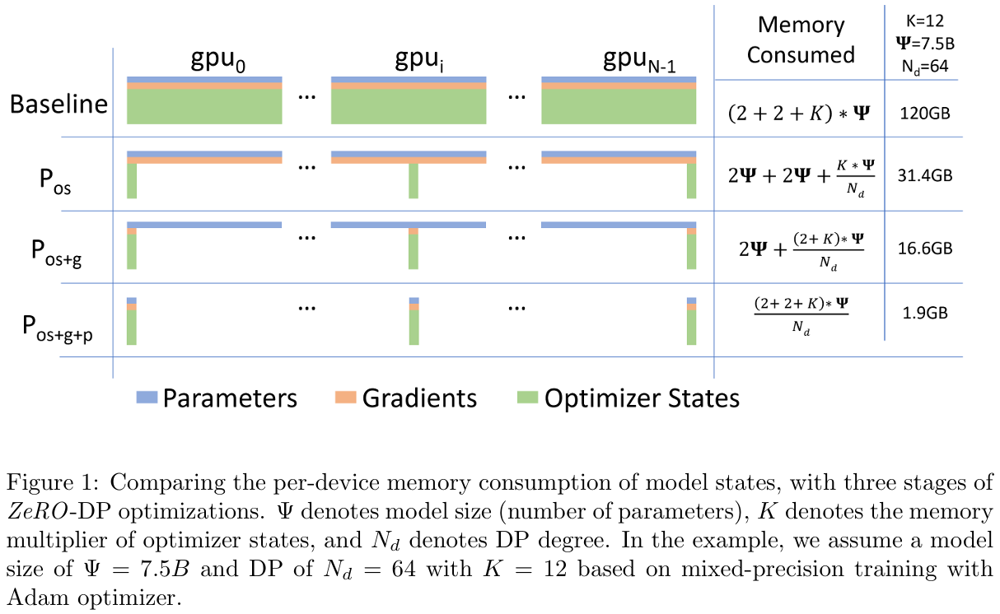

随着大模型（Large Language Model，LLM）规模的不断增大，模型参数数量和计算量也在不断增加，这使得模型的训练和推理变得越来越困难。为了应对这一挑战，研究人员提出了多种并行策略，包括数据并行（Data Parallelism，DP）、张量并行（Tensor Parallelism，TP）、流水线并行（Pipeline Parallelism，PP）、专家并行（Expert Parallelism，EP）和序列并行（Sequence Parallelism，SP）。本文将深入图解并给出这些并行策略的定量分析。

<!--more-->

## 概述

在 LLM 并行策略的相关综述[^1]中，已经对这五大并行策略及其相关工作进行了罗列与比较。

[^1]: Efficient Training of Large Language Models on Distributed Infrastructures: A Survey. [arXiv](https://arxiv.org/abs/2407.20018)



张量并行和流水线并行还可以统称为模型并行（Model Parallelism，MP）。这是因为它们都是将模型权重进行分片，只不过前者之间切分权重，而后者切分模型层。



> 关于分片的定义详见下文。

### 符号定义

下面的表格定义了模型超参数以及输入输出的维度。

| 符号  |              定义               |     注释     |
| :---: | :-----------------------------: | :----------: |
| \(b\) |     批量大小（Batch Size）      |              |
| \(s\) |   序列长度（Sequence Length）   |              |
| \(h\) |    隐藏层维度（Hidden Size）    |              |
| \(e\) |    专家数量（Expert Number）    | MoE 模型特有 |
| \(k\) | 激活专家数量（取 top-k 个专家） | MoE 模型特有 |

那么，根据以 Transformer 基础的 LLM 设计范式，一层 Decoder 总参数量可以近似认为是其线性层的参数量，包括：

-   注意力模块的 \( W_Q, W_K, W_V, W_O \)
-   前馈网络的 \( W_1, W_2 \)（或者记作 \( W_{\mathrm{up}}, W_{\mathrm{down}} \)）

而前馈网络的中间层维度通常是隐藏层的 4 倍，且单个注意力头的维度正好是隐藏层维度除以注意力头数。据此，可以计算出一层 Decoder 的参数量为：

$$
\Phi = 4 \cdot h^2 + 2 \cdot 4 h^2 = 12 h^2
$$

另外，一个 LLM 的隐藏状态通常是一个维度为 \([b, s, h]\) 的向量。

本文用 \(d\) 来表示各个并行策略的**并行度**。并行度即参与并行计算的设备数量。

## 基本概念

### 集合通信

所有的这些并行策略都需要在不同的设备之间进行通信，此时就需要一系列通信原语或者通信算子。常见的包括 All Reduce（AR）、All Gather（AG）、Reduce Scatter（RS）、All-to-All（A2A）等。

> 强烈建议读者在阅读本文时，先对这些通信原语有一个基本的了解。读者可参考[并行计算集合通信初步](../并行计算集合通信初步)一文。

### 分片与平铺



在了解了这些通信原语之后，我们希望读者首先要在头脑中建立这么一个概念：按照数据（或者可以说是张量）在 LLM 中的意义来划分，只能将参与通信的数据分为两大类，即**模型权重**（或称**模型参数**）和**中间激活**（或称**隐藏状态**）。换而言之，无论何种并行策略，有且只有权重和激活两类张量可以切分。



**分片**（Sharding）和**平铺**（Replicated）是采用了并行策略之后，权重和激活张量在各个设备的分布方式。

-   分片：将张量在某个维度上切分成多个子张量，每个子张量在不同的设备上存储。
-   平铺：将张量在所有设备上都存储一份完整的副本。



**Sharding 和 Tiling 的区别**

要注意区分 Sharding 和 Tiling 这两个概念。尽管它们都是对张量进行切分，但是 Sharding 的载体是计算设备（通常指单个 GPU），而 Tiling 的载体是计算设备内的存储（例如 HBM）。

Tiling 的核心思想是将一个大计算任务（如矩阵乘法）分解为多个小块（tiles），逐块计算，通常是为了适配硬件缓存或内存限制。例如著名的 [FlashAttention](https://arxiv.org/abs/2205.14135) 算法就采用了 Tiling 策略，减少 HBM 访问。

Tiling 不在本文的讨论范围内。



## Data Parallelism 数据并行

数据并行是指将批量数据切分成多个子批量，每个子批量在不同的设备上并行计算，最后将结果合并。由此可见，数据并行是典型将隐藏状态切分而将模型参数平铺的并行策略。

数据并行在前向传播时无需任何通信，仅在反向传播时需要通信，包括参数梯度的 AR（即我们常说的梯度平均）。在每个设备上，中间激活张量的维度为 \([\dfrac{b}{d}, s, h]\)。不过，由于梯度不是中间激活张量，所以反向传播时的通信开销与之无关，即通信量为 \( \Phi = 12 d^2 \)。

ZeRO（Zero Redundancy Optimizer）是在标准数据并行（Data Parallelism, DP） 的基础上，通过消除模型状态的冗余存储来显著降低显存占用，从而支持训练超大规模模型（如百亿、千亿参数）。它不是改变并行策略本身，而是在 DP 的通信和计算流程中对模型状态进行分片。具体来说，在 DP 中，每个设备都会完整存储：

-   参数 P
-   梯度 G
-   优化器状态 OS

ZeRO 则在此基础上按照 DP 的并行度对这些数据进行分片。ZeRO 逐步对上述三类模型状态进行分片：

1. 仅优化器状态 \( P_{\mathrm{os}} \)
2. 优化器和梯度 \( P_{\mathrm{os+g}} \)
3. 优化器、梯度和参数 \( P_{\mathrm{os+g+p}} \)

尽管 ZeRO 极大地减少了显存占用，以支持超大规模的模型训练，但是它是以引入了额外的通信开销为代价的，详见下表：

| 并行策略 |  分片内容  | 每轮通信算子 |   单位设备通信量   |  通信频次  |
| :------: | :--------: | :----------: | :----------------: | :--------: |
|    DP    |     --     |    1 × AR    |     \(2 \Phi\)     |     1      |
|  ZeRO-1  |     OS     |    1 × AR    |     \(2 \Phi\)     |     1      |
|  ZeRO-2  |   OS + G   |    1 × AR    |  \(\approx \Phi\)  |     1      |
|  ZeRO-3  | OS + G + P | 2 × AG + RS  | \(\approx 5 \Phi\) | = 模型层数 |

一般来说，越大的模型，才可以使用越高一级的 ZeRO 并行策略。

## Tensor Parallelism 张量并行

## Pipeline Parallelism 流水线并行

## Expert Parallelism 专家并行

## Sequence Parallelism 序列并行
