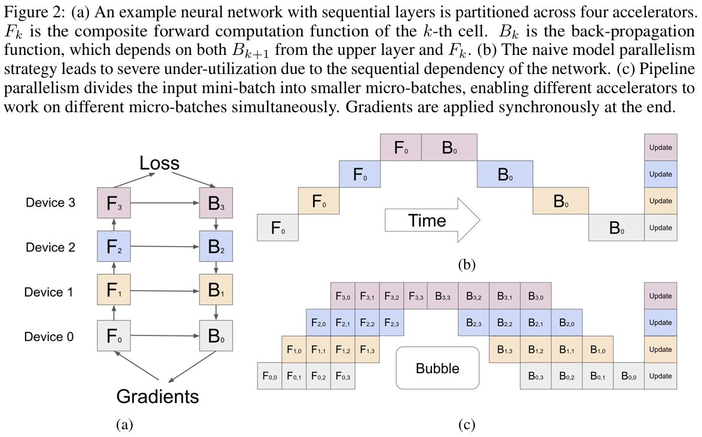
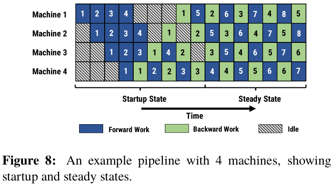
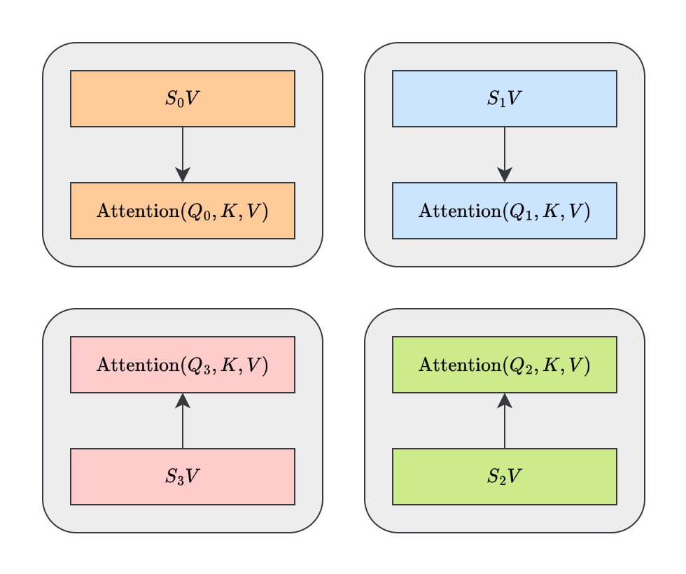
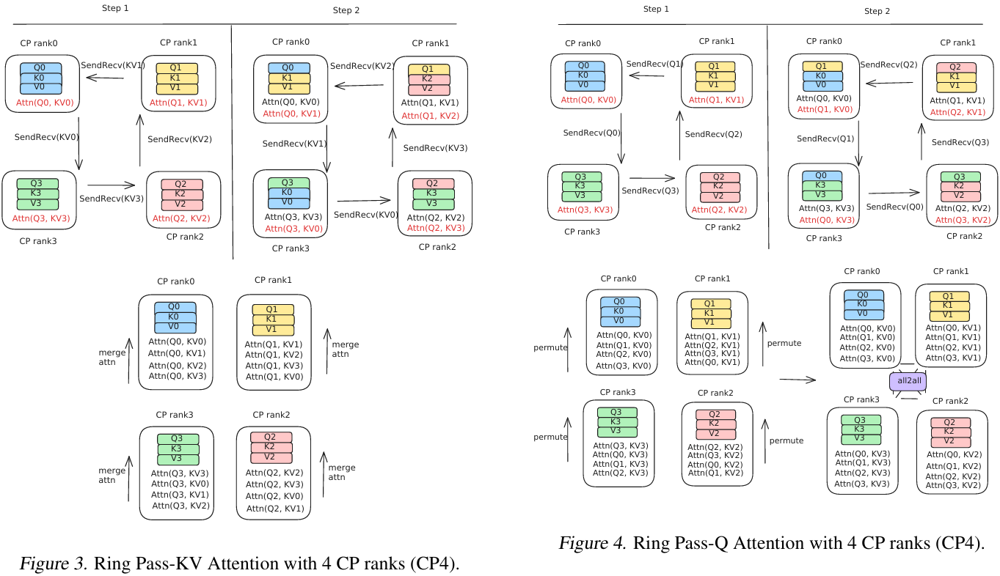
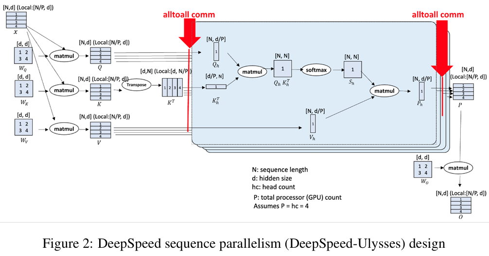

随着大模型（Large Language Model，LLM）规模的不断增大，模型参数数量和计算量也在不断增加，这使得模型的训练和推理变得越来越困难。为了应对这一挑战，研究人员提出了多种并行策略，包括数据并行（Data Parallelism，DP）、张量并行（Tensor Parallelism，TP）、流水线并行（Pipeline Parallelism，PP）、专家并行（Expert Parallelism，EP）和序列并行（Sequence Parallelism，SP）。本文将深入图解并给出这些并行策略的定量分析。

<!--more-->

## 概述

在 LLM 并行策略的相关综述[^1]中，已经对这五大并行策略及其相关工作进行了罗列与比较。

[^1]: Efficient Training of Large Language Models on Distributed Infrastructures: A Survey. [arXiv](https://arxiv.org/abs/2407.20018)



张量并行和流水线并行还可以统称为模型并行（Model Parallelism，MP）。这是因为它们都是将模型权重进行分片，只不过前者之间切分权重，而后者切分模型层。



> 关于分片的定义详见下文。

### 符号定义

下面的表格定义了模型超参数以及输入输出的维度。

| 符号  |              定义               |     注释     |
| :---: | :-----------------------------: | :----------: |
| \(b\) |     批量大小（Batch Size）      |              |
| \(s\) |   序列长度（Sequence Length）   |              |
| \(h\) |    隐藏层维度（Hidden Size）    |              |
| \(e\) |    专家数量（Expert Number）    | MoE 模型特有 |
| \(k\) | 激活专家数量（取 top-k 个专家） | MoE 模型特有 |

那么，根据以 Transformer 基础的 LLM 设计范式，一层 Decoder 总参数量可以近似认为是其线性层的参数量，包括：

-   注意力模块的 \( W_Q, W_K, W_V, W_O \)
-   前馈网络的 \( W_1, W_2 \)（或者记作 \( W_{\mathrm{up}}, W_{\mathrm{down}} \)）

而前馈网络的中间层维度通常是隐藏层的 4 倍，且单个注意力头的维度正好是隐藏层维度除以注意力头数。据此，可以计算出一层 Decoder 的参数量为：

$$
\Phi = 4 \cdot h^2 + 2 \cdot 4 h^2 = 12 h^2
$$

另外，一个 LLM 的隐藏状态通常是一个维度为 \([b, s, h]\) 的向量。

本文用 \(d\) 来表示各个并行策略的**并行度**。并行度即参与并行计算的设备数量。

## 基本概念

### 集合通信

所有的这些并行策略都需要在不同的设备之间进行通信，此时就需要一系列通信原语或者通信算子。常见的包括 All Reduce（AR）、All Gather（AG）、Reduce Scatter（RS）、All-to-All（A2A）等。

> 强烈建议读者在阅读本文时，先对这些通信原语有一个基本的了解。读者可参考[并行计算集合通信初步](../Introduction_to_Parallel_Computing_Collective_Communication/)一文。

### 分片与平铺



在了解了这些通信原语之后，我们希望读者首先要在头脑中建立这么一个概念：按照数据（或者可以说是张量）在 LLM 中的意义来划分，只能将参与通信的数据分为两大类，即**模型权重**（或称**模型参数**）和**中间激活**（或称**隐藏状态**）。换而言之，无论何种并行策略，有且只有权重和激活两类张量可以切分。



**分片**（Sharding）和**平铺**（Replicated）是采用了并行策略之后，权重和激活张量在各个设备的分布方式。

-   分片：将张量在某个维度上切分成多个子张量，每个子张量在不同的设备上存储。
-   平铺：将张量在所有设备上都存储一份完整的副本。



**Sharding 和 Tiling 的区别**

要注意区分 Sharding 和 Tiling 这两个概念。尽管它们都是对张量进行切分，但是 Sharding 的载体是计算设备（通常指单个 GPU），而 Tiling 的载体是计算设备内的存储（例如 HBM）。

Tiling 的核心思想是将一个大计算任务（如矩阵乘法）分解为多个小块（tiles），逐块计算，通常是为了适配硬件缓存或内存限制。例如著名的 [FlashAttention](https://arxiv.org/abs/2205.14135) 算法就采用了 Tiling 策略，减少 HBM 访问。

Tiling 不在本文的讨论范围内。



[^7]: FlashAttention: Fast and Memory-Efficient Exact Attention with IO-Awareness. [arXiv](https://arxiv.org/abs/2205.14135)

> 若读者对 FlashAttention[^7] 感兴趣，可参考[图解 Flash Attention](../Illustrated_Flash_Attention/) 一文。

## DP 数据并行

数据并行是指将批量数据切分成多个子批量，每个子批量在不同的设备上并行计算，最后将结果合并。由此可见，数据并行是典型将隐藏状态切分而将模型参数平铺的并行策略。

数据并行在前向传播时无需任何通信，仅在反向传播时需要通信，包括参数梯度的 AR（即我们常说的梯度平均）。在每个设备上，中间激活张量的维度为 \([\dfrac{b}{d}, s, h]\)。不过，由于梯度不是中间激活张量，所以反向传播时的通信开销与之无关，即通信量为

$$
\begin{cases}
    M_f = 0 \\
    M_b = \Phi = 12 d^2
\end{cases}
$$

ZeRO[^3]（Zero Redundancy Optimizer）是在标准数据并行（Data Parallelism, DP） 的基础上，通过消除模型状态的冗余存储来显著降低显存占用，从而支持训练超大规模模型（如百亿、千亿参数）。它不是改变并行策略本身，而是在 DP 的通信和计算流程中对模型状态进行分片。具体来说，在 DP 中，每个设备都会完整存储：

[^3]: ZeRO: Memory Optimizations Toward Training Trillion Parameter Models. [arXiv](https://arxiv.org/abs/1910.02054)

-   参数 P
-   梯度 G
-   优化器状态 OS

ZeRO 则在此基础上按照 DP 的并行度对这些数据进行分片。ZeRO 逐步对上述三类模型状态进行分片：

1. 仅优化器状态 \( P_{\mathrm{os}} \)
2. 优化器和梯度 \( P_{\mathrm{os+g}} \)
3. 优化器、梯度和参数 \( P_{\mathrm{os+g+p}} \)

尽管 ZeRO 极大地减少了显存占用，以支持超大规模的模型训练，但是它是以引入了额外的通信开销为代价的，详见下表：

| 并行策略 |  分片内容  | 每轮通信算子 |   单位设备通信量   |  通信频次  |
| :------: | :--------: | :----------: | :----------------: | :--------: |
|    DP    |     --     |    1 × AR    |     \(2 \Phi\)     |     1      |
|  ZeRO-1  |     OS     |    1 × AR    |     \(2 \Phi\)     |     1      |
|  ZeRO-2  |   OS + G   |    1 × AR    |  \(\approx \Phi\)  |     1      |
|  ZeRO-3  | OS + G + P | 2 × AG + RS  | \(\approx 5 \Phi\) | = 模型层数 |

一般来说，越大的模型，才可以使用越高一级的 ZeRO 并行策略。

## TP 张量并行

张量并行是指将模型权重切分成多个子权重，每个子权重在不同的设备上存储和计算。由此可见，张量并行是典型将模型参数切分而将隐藏状态平铺的并行策略。

使用张量并行时需要满足一个重要的条件，即模型层一定是成对出现的。例如在 Transformer 中，注意力模块里前有 \( W_Q, W_K, W_V \) 三个线性层，后有 \( W_O \) 一个线性层；前馈网络里前有 \( W_{\mathrm{up}} \) 一个线性层，后有 \( W_{\mathrm{down}} \) 一个线性层。否则，会产生十分不和谐的情况。

要解释清楚这个问题，首先我们来了解一下 Megatron-LM[^2] 的张量并行设计。

[^2]: Megatron-LM: Training Multi-Billion Parameter Language Models Using Model Parallelism. [arXiv](https://arxiv.org/abs/1909.08053)

对于 MLP 层，公式推导如下：

$$
\begin{aligned}
    Z = Y B &= X A B \\
    &= X \begin{bmatrix}
        A_1 & A_2
    \end{bmatrix}
    \begin{bmatrix}
        B_1 \\
        B_2
    \end{bmatrix} \\
    &= \begin{bmatrix}
        X A_1 & X A_2
    \end{bmatrix}
    \begin{bmatrix}
        B_1 \\
        B_2
    \end{bmatrix} \\
    &= \begin{bmatrix}
        Y_1 & Y_2
    \end{bmatrix}
    \begin{bmatrix}
        B_1 \\
        B_2
    \end{bmatrix} \\
    &= Y_1 B_1 + Y_2 B_2
\end{aligned}
$$

> 有关矩阵乘法的分块计算，读者可参考[分块矩阵的乘法](../Block_Matrix_Multiplication/)一文。

注意公式的最后一行的加法，其所需的结果来源恰好是分布在不同的设备上的，这也就是为什么 TP 需要 AR 通信的原因。

同时，TP 要求成对的两个投影层前者竖着切（Column Parallelism），后者横着切（Row Parallelism）。这样做是为了：

1. 保证中间隐藏状态的维度不变
2. 通信在计算完两个线性层后进行

对于 Attention 层也是同理。既然隐藏状态的维度为 \([b, s, h]\)，那么一层 Decoder 的通信量包括前向传播的 2 次 AR 和反向传播的 2 次 AR，每次通信的数据量为 \( bsh \)。因此，一层 Decoder 的总通信量为

$$
M_f = M_b = 2bsh (d-1)
$$

不过，在工程实践中，AR 可分解为单位通信量为 \( \dfrac{1}{d} \) 的 RS + AG。如图所示，这可以进一步降低通信开销。

据此，可以计算得出一层 Decoder 的总通信量为

$$
M_f = M_b = \dfrac{4bsh}{d} \cdot (d-1)
$$

## PP 流水线并行

流水线并行是指将模型的不同层分布在不同的设备上，形成一个计算流水线。每个设备只处理输入数据的一个子集，并将中间结果传递给下一个设备。这样可以充分利用设备的计算资源，提高训练效率。

在流水线并行中，前向传播和反向传播的计算是交替进行的。具体来说，前向传播时，输入数据首先经过第一个设备的计算，然后将中间结果传递给第二个设备，依此类推。反向传播时，梯度从最后一个设备开始，逐层向前传递。

GPipe[^4] 是一种经典的流水线并行实现。它将模型划分为多个阶段，每个阶段在不同的设备上计算。为了提高设备利用率，GPipe 引入了微批量（Micro-batch）的概念，将一个大批量数据切分为多个小批量数据，交替进行前向传播和反向传播。

[^4]: GPipe: Efficient Training of Giant Neural Networks using Pipeline Parallelism. [arXiv](https://arxiv.org/abs/1811.06965)

PP 的通信开销可以说是最低的，它仅仅只需要 \( d-1 \) 次 P2P 通信，每次通信的数据量为 \( bsh \)。这是因为每个设备只需要将中间激活传递给下一个设备，而不需要进行任何额外的计算。但是 PP 的痛点在于其致命的气泡（Bubble）率，这使得其在模型训练过程中设备利用率大打折扣。

PipeDream[^5] 是一种改进的流水线并行方法，通过引入重叠计算和通信的机制，进一步提高了设备利用率。PipeDream 本质上相当于是一种异步的流水线并行。

[^5]: PipeDream: Fast and Efficient Pipeline Parallel DNN Training. [arXiv](https://arxiv.org/abs/1806.03377)

GPipe 和 PipeDream 都是经典的流水线并行方法，但它们只是作为 PP 技术的铺垫。现代的 PP 方法通常采用 1F1B 调度策略[^6]，即每进行一次前向传播就进行一次反向传播，从而最大化设备利用率。

[^6]: Memory-Efficient Pipeline-Parallel DNN Training. [arXiv](https://arxiv.org/abs/2006.09503)

### TP-PP 混合并行

## EP 专家并行

专家并行是混合专家模型（Mixture of Experts, MoE）独有的并行策略。既然 TP 需要直接切分模型权重，那么直接将 MoE 模型中不同的专家分配到不同的设备上则是一种更简单方便的实现模型并行的方式。

## SP 序列并行

序列并行是指将输入序列切分成多个子序列，每个子序列在不同的设备上并行计算。这样可以极大地减少单个设备上的显存占用，在训练中可以支持更长的序列长度，而在推理中可以降低 K/V 缓存的显存占用。其实 SP 和 DP 一样都是对隐藏状态进行切分，不过 SP 是在序列维度上切分，而 DP 是在批量维度上切分。

使用 SP 不像 DP 那样，它以非常频繁的通信开销为代价。这其中的原因在于 Transformer 的自注意力机制。由于自注意力机制需要每个 token 都与其他 token 进行相似度的计算，在 Attention 的计算过程中，需要一边计算一边同步中间结果以保证正确性。

这个想法最初是以 Ring Self-Attention（RSA）[^8] 的形式提出的。RSA 将序列切分成多个子序列，并在多个设备上并行计算自注意力。每个设备只计算自己子序列内的注意力，然后通过环形通信将中间结果传递给下一个设备，依此类推，直到所有设备都完成计算。

[^8]: Sequence Parallelism: Long Sequence Training from System Perspective [arXiv](https://arxiv.org/abs/2105.13120)

对于 \( Q \times K \) 和 \( S \times V \) 两个矩阵乘法，RSA 都需要进行 \( d-1 \) 次 P2P 环形通信，可进一步参考下面的动画深入理解。其中，\( Q \times K \) 的结果维度为 \([b, \dfrac{s}{d}, \dfrac{s}{d}, h]\)，所以每次通信的数据量为 \( bh \cdot \left( \dfrac{s}{d} \right)^2 \)；而 \( S \times V \) 的结果维度为 \([b, \dfrac{s}{d}, h]\)，所以每次通信的数据量为 \( bh \cdot \dfrac{s}{d} \)。所以一层 Decoder 的总通信量为

$$
bh \left[ \left( \dfrac{s}{d} \right)^2 + \dfrac{s}{d} \right] (d-1) = \dfrac{bh (s^2+sd) (d-1)}{d^2}
$$

Context Parallelism（CP）[^9]也提出了类似的想法，不过它是基于 Group-Query Attention（GQA）[^10]实现的。GQA 将注意力头划分为多个组，每个组内的头只关注输入序列的一个子集，从而减少计算量和显存占用。对于不同稀疏模式的注意力机制，根据其设计的序列并行策略也有所不同。

[^9]: Context Parallelism for Scalable Million-Token Inference. [arXiv](https://arxiv.org/abs/2411.01783)

[^10]: GQA: Training Generalized Multi-Query Transformer Models from Multi-Head Checkpoints. [arXiv](https://arxiv.org/abs/2305.13245)

由于 SP 的引入会导致 Attention 计算时的多次同步通信，DeepSpeed 团队索性就一劳永逸，在 Attention 计算前后各进行一次 A2A，保证 Attention 计算时的序列是完整的。这样一来，形成了 SP-HP-SP 的混合并行模式（HP，Head Parallelism），是为 Ulysses[^11]。这里的 HP 指的是将注意力头切分到不同设备上计算，其本质和 EP 相当。

[^11]: DeepSpeed Ulysses: System Optimizations for Enabling Training of Extreme Long Sequence Transformer Models
. [arXiv](https://arxiv.org/abs/2309.14509)

在这个混合并行策略中，输入和输入的隐藏状态维度为 \([b, \dfrac{s}{d}, h]\)，而在计算 Attention 时的维度为 \([b, s, \dfrac{h}{d}]\)。由此可见，采用 Ulysses 并行策略的一层 Decoder 中，总通信量为

$$
M_f = M_b = \dfrac{2bsh}{d} \cdot (d-1)
$$
