华为超节点（CloudMatrix384）是华为在 2025 年发布的一种突破了冯·诺伊曼体系结构，将各类异构资源通过 UB（Unified Bus，统一总线）整合而成的超大规模计算节点，专为 LLM（Large Language Model，大语言模型）服务而设计。在此基础上，华为还提出了 CloudMatrix-Infer 推理系统，提出了 PDC（Prefill-Decode-Cache）分离架构、LEP（Large Expert Parallel，大规模专家并行）等创新技术，为大语言模型的高效推理提供了强大支持。

<!--more-->

> [arXiv](https://arxiv.org/abs/2506.12708) 论文链接

## 核心创新点

1. CloudMatrix 超节点架构
    - 通过 UB 互连，使多个节点在逻辑上组成一个整体计算机
2. CloudMatrix-Infer 推理系统
    - 采用 PDC 分离架构，将 prefill、decode 和 caching 三个阶段分离部署
    - 引入 LEP 大规模专家并行技术，有效支持 MoE 模型推理
    - 采用硬件感知量化方案，针对 Ascend 910 硬件特性优化 INT8 量化
3. 突破性性能指标
    - 4K 长度提示词下实现 6688 tok/s[^2]，TPOT 达到 1943 tok/s

[^2]: tok/s: Tokens per second 每秒处理的令牌数

## CloudMatrix 架构详解

### 超节点的设计理念

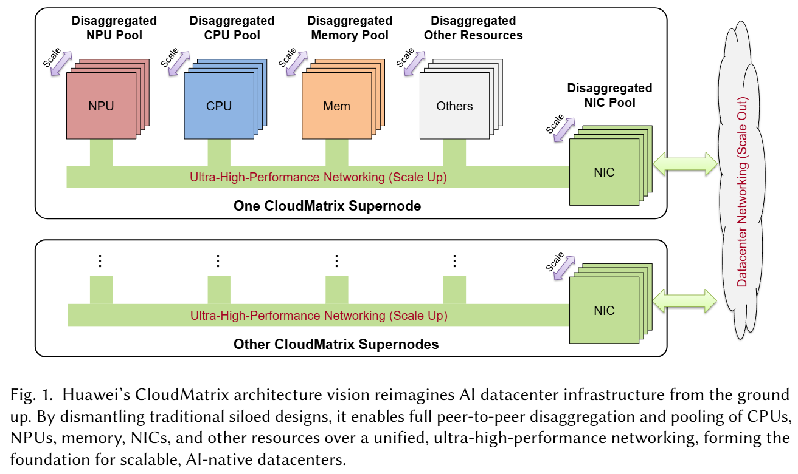

超节点设计的核心思路在于突破传统的冯·诺依曼体系结构，将各类异构资源通过 UB 统一总线整合而成的超大规模计算节点。这些异构资源包括 NPU、NPU、存储、网卡等，它们都是分离式且可扩展的。

关键的核心在于超高带宽且低延迟的 UB，优势在于：

-   消除了节点间的通信瓶颈，特别是对于 LLM（MoE）模型中的 TP 和 EP。
-   所有的异构资源解耦，可根据任务特性（如计算密集型的 prefill 和访存密集型的 decode）调整 CPU/NPU 配比。
-   使多任务负载混合流水线执行，提高资源利用率。
-   存储分离消除传统 I/O 瓶颈，支持高吞吐量的 K/V 缓存存储。

### CloudMatrix384 案例分析

CloudMatrix384 是一种搭载了 384 个 Ascend 910 NPU 和 192 个 Kunpeng CPU 的超节点，每个节点配备 8 个 NPU 和 4 个 CPU。据此可推得一个超节点内共有 48 个节点。

CloudMatrix384 的设计要点是：

-   peer-to-peer 点对点通信
-   fully interconnected 全互联
-   ultra-high-bandwidth 超高带宽

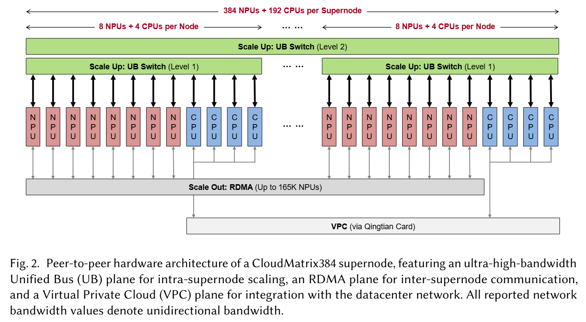

超节点的三层网络平面：

1. **UB 平面**：实现非阻塞的 NPU/CPU 全互联，支持 TP/EP （超节点内）跨节点和跨设备存储访问
    - 1 级 UB：节点内 NPU/CPU 全互联
    - 2 级 UB：超节点内跨节点 NPU/CPU 全互联
2. **RDMA 平面**：支持跨超节点的 NPU 间通信，传输因 PDC 分离产生的 K/V 缓存
3. **VPC[^1] 平面**：负责上层的部署、调度、管理和监控等功能

[^1]: VPC: Virtual Private Cloud 虚拟私有云

### 硬件组件

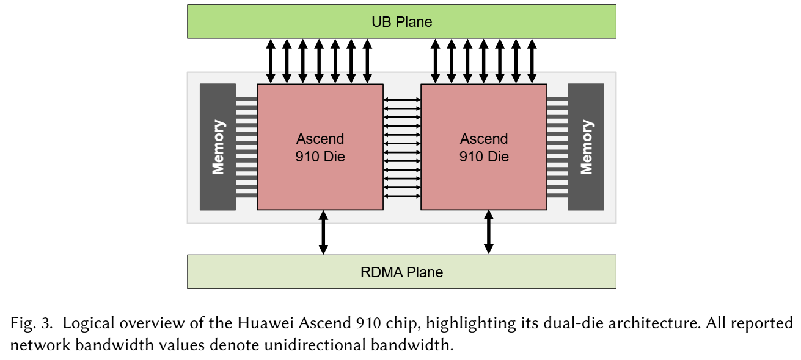

> 一块 Ascend 910C 芯片由两块 Ascend 910D[^6] 组成。

[^6]: Ascend 910D 中的“D”是“Die”的缩写，指的是 NPU 的晶粒或芯片核心。

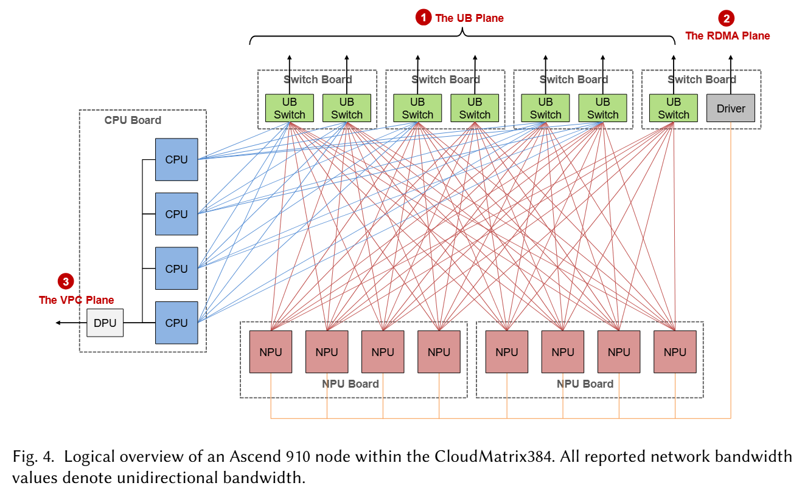

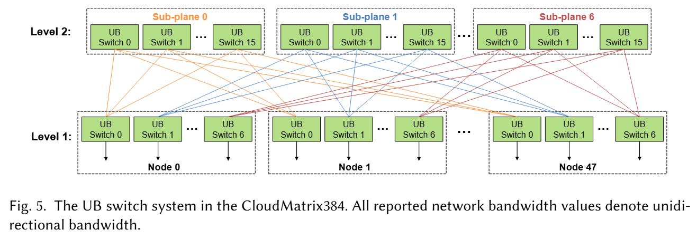

## CloudMatrix-Infer 部署 DeepSeek 模型

### 基于 P2P 的 PDC 分离部署

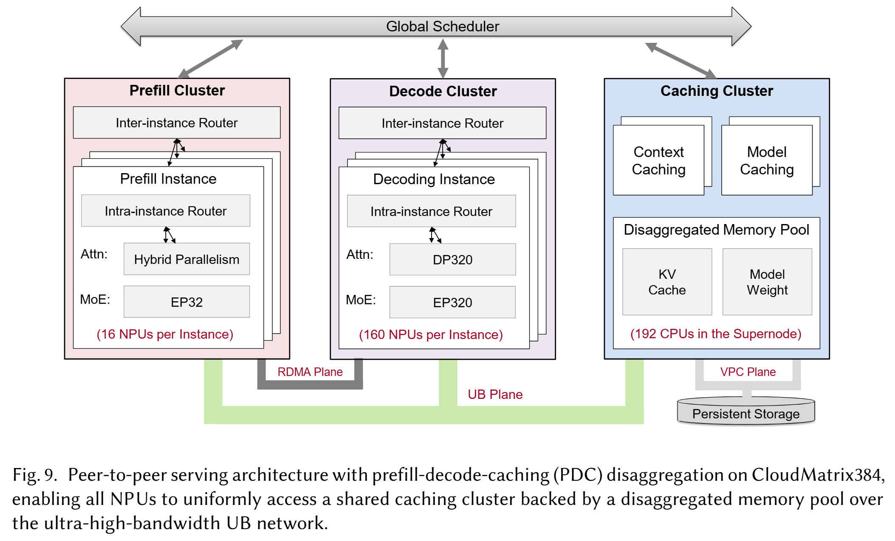

Prefill 集群：

-   每个 P 实例配备 16 块 NPU
-   并行策略：
    -   MLA：分阶段混合并行
    -   MoE：EP=32，其中每个 rank：
        -   1 个共享专家
        -   8 个路由专家
        -   1 个冗余专家

Decode 集群：

-   每个 D 实例配备 160 块 NPU
-   并行策略：
    -   MLA：DP=320
    -   MoE：EP=320，每个 rank 包含 1 个专家，共包括：
        -   32 个共享专家
        -   256 个路由专家
        -   32 个冗余专家

此外，MoE 阶段均采用了 [EPLB](https://github.com/deepseek-ai/EPLB)（Expert Parallelism Load Balancer）优化。

> P/D 分离部署的并行策略除 Prefill 的 MLA 外，其余与 [DeepSeek-V3 的技术报告](https://arxiv.org/abs/2412.19437)中所述一致。

可以进一步推得，在一个 CloudMatrix384 超节点内：

-   P 实例共有 4 个，需要共计 64 个 NPU
-   D 实例共有 2 个，需要共计 320 个 NPU

注意到 P/D 之间的 hidden states 通过 RDMA 平面通信。而 P 节点的 K/V 缓存则通过 UB 存储到远程 C 节点上，D 节点则从 C 节点远程读取之。于是，PDC 三者之间形成生产者-消费者模型。



**P2P 架构和 K/V 缓存中心化架构对比**

K/V 缓存中心化架构主要由过去一些系统（如 [Nvidia Dynamo](https://github.com/ai-dynamo/dynamo)、[Mooncake](https://github.com/kvcache-ai/Mooncake)）提出和采用。它的最大特点是请求调度与本地 K/V 缓存读写是紧耦合的。这带来的挑战是，节点内访存带宽大大高于节点间通信带宽，因此远程 K/V 缓存访问延迟成为了性能瓶颈。

如果采用 CloudMatrix 所提出的 P2P 架构，它的最大特点是扁平化的，P/D 都可以直接访问。而且，超节点内的通信都是基于 UB 的，因此不存在节点间通信瓶颈。总而言之，其优势在于：

-   轻量级、无状态的调度，不受数据局部性的限制
-   调度机制需求低
-   增加存储器资源利用率



此外，在长序列任务绘制用户会话异步到达与离开等场景中，负载通常是异步的。为了更好地提高资源利用率，CloudMatrix-Infer 会强制伪同步执行。

### Decode：大规模专家并行

#### MoE 优化：融合计算通信算子

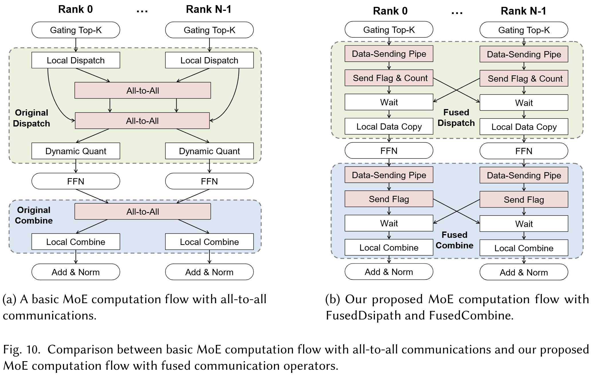

传统的基于 EP 的 MoE 计算过程，需要 2 次 Dispatch 和 1 次 Combine。其中的 2 次 Dispatch 分别是为了交换路由元数据，以及分发各个词元到不同的专家。这带来的挑战如下：

-   共计 3 次的 A2A[^3] 通信成本高
-   每个专家推理的词元数量不同，需要动态分配内存和频繁的 CPU-NPU 同步
-   算子之间存在依赖关系，顺序执行资源利用率低

[^3]: A2A: All-to-All 集合通信算子。有关集合通信的内容，可以参考[并行计算集合通信初步](../并行计算集合通信初步)。

解决方案：通信计算融合算子，包括 FusedDispatch 和 FusedCombine。这些算子使用原生的 Send/Recv 算子，取代了 A2A，并且在 UB 的加持下降低通信开销。具体来说，这其中用到了如下的优化技术：

-   AIV-Direct[^4] 取代 SDMA 实现远程 NPU 内存访问【参考图 11】
-   在 Dispatch 之前就量化，降低通信开销
-   静态预分配内存
-   数据传输流水线【参考图 12】

[^4]: AIV: AI vector，一种专为人工智能计算优化的向量处理单元或计算核心。

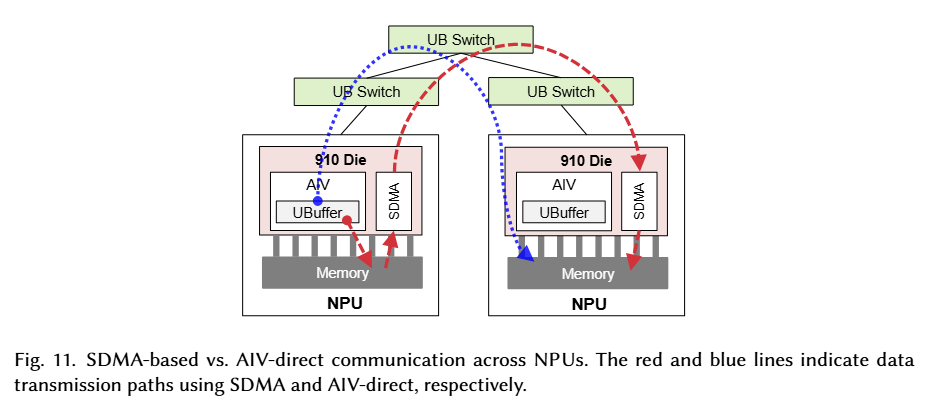

如图所示，AIV-Direct 相比于 SDMA，无需走本地 NPU 内存，可直接对远程 NPU 内存进行访问。

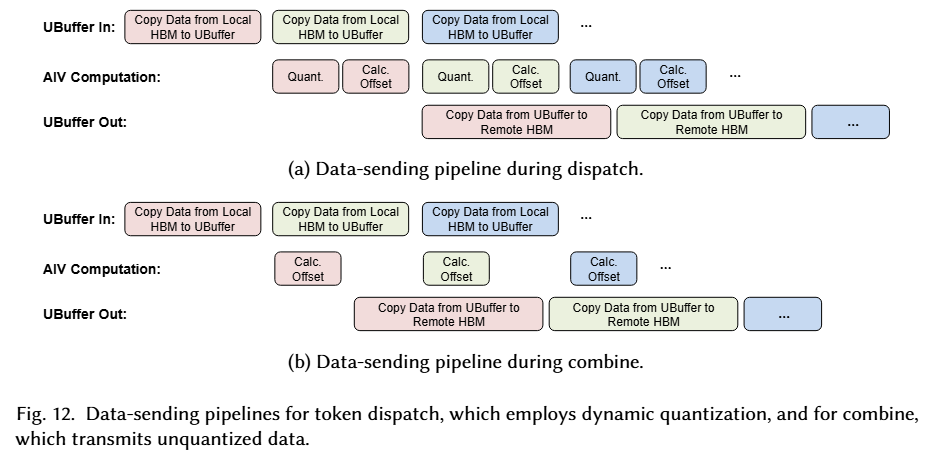

如图所示，整个融合计算通信算子要解决一个问题，把数据写到远程 NPU 的内存。首先就需要先算出写到哪里（目标偏移地址）。如果按照顺序执行（先算偏移 → 再传数据），就会产生等待，导致流水线停顿。为了解决这个问题，可以将整个过程拆分为如下三个阶段：

1. **拷贝阶段**：把下一个 token 放进本地的缓存（UBuffer）。
2. **计算阶段**：算出目标 NPU 内存中的偏移地址，如果启用了量化，就在这一步把数据转成 INT8。
3. **传输阶段**：通过 AIV-Direct 把数据写到对方 NPU 的内存中。

这样多个任务就可以流水线执行，避免了等待。

#### MLA 优化

如果直接将 DeepSeek 的算子迁移到昇腾上有几点挑战：

-   细粒度的算子启动开销
-   K/V 缓存格式转换开销
-   序列长度变化对基于 MTP 的负载均衡的影响

解决方案：

1. 融合算子【图 13】
    - 将 RMSNorm、Q/K/V projections、RoPE 融合为一个算子 MLAProlog
    - FlashAttention 和前后的切片与合并操作融合为一个算子 Fused Attention (FA)
2. N-Zigzag 格式化 K/V 缓存
3. 使用 BNSD ([Batch, NumHeads, Sequence, HeadDim]) 而不是 BSND

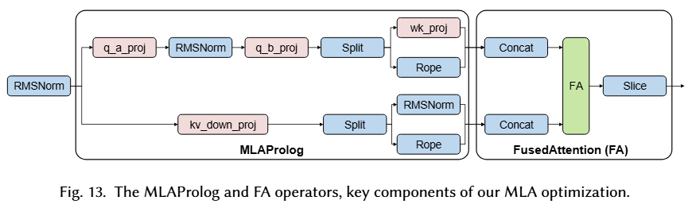

#### Pipeline & Overlapping

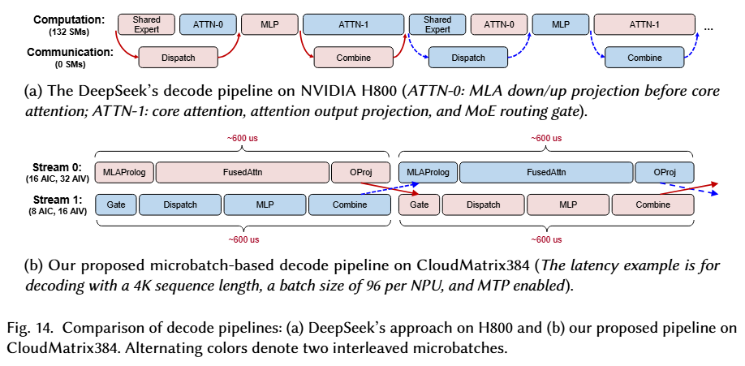

根据 [DeepSeek-V3 技术报告](https://arxiv.org/abs/2412.19437)中的内容，在 Decode 阶段，共享专家和路由专家是协同部署的。在此基础上，结合 EPLB 算法，就可以实现如果某个专家被调用频繁、负载高，就可以把这个专家在多个设备或节点上复制多个副本，以分散负载。

而在 CloudMatrix384 的设计中，每个 NPU Die 上通常只有一个专家。直观来看，这是为了降低推理时延。然而，这样做会导致注意力算子（图中所示的 ATTN-0）不足以完全掩盖 Dispatch。

解决的方案是不简单按照 DeepSeek 的通算掩盖[^5]思路，而是按照 block 来划分。具体来说：

-   Stream 0 (Attention Path)：负责计算密集型或访存密集型任务（主要是 Attention 部分）
-   Stream 1 (MoE Path)：负责 MoE 的计算和通信

[^5]: 关于 DeepSeek 的通算掩盖技术，可以参考 DeepSeek 团队在 Github 上的 [Profiling Data in DeepSeek Infra](https://github.com/deepseek-ai/profile-data)。

#### MTP 优化

MTP（Multi-Token Prediction，多词元预测）的机制是每次推理出一个词元时，还会预测接下来的几个词元，然后在后续的生成中验证。尽管它能提高解码效率，但是其带来的挑战是频繁的 CPU-NPU 同步，这会导致流水线中断的问题。

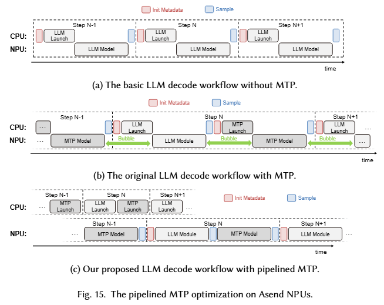

如图 15b 所示，MTP 预测多个 token 然后验证一次这个过程是串行的，其问题根源是：

-   CPU 需要频繁介入来初始化和传递动态元数据，MTP 需要用到 LLM 验证后确定的序列长度
-   CPU 介入采样（选出下一个 token）中断 NPU 执行

那么解决的方案【图 15c】就在于设置一个机制避免 NPU 的中断和频繁的 CPU-NPU 同步。具体来说可以：

-   不要等到每个 graph 执行前才由 CPU 单独准备元数据，而是在解码开始时一次性把所有需要的 metadata 全部准备好。
-   把整个采样过程完全移到 NPU 内部执行，不再依赖 CPU。

### Prefill：分阶段混合并行

Prefill 阶段面临的主要挑战：

-   输入序列长度不均匀
-   MoE 通信开销

#### MLA 优化

在传统的纯 DP 并行策略下，MLA 的现有问题主要包括：

-   序列长度不齐：短序列需要等待长序列处理完毕，导致资源浪费。
-   低效并发：如果 DP 并行度太高（假设 DP=32）时，如果一批请求没有达到 32 个，必然有设备空闲；如果硬要攒到 32 个请求，平均的 TTFT 时延显著增加。

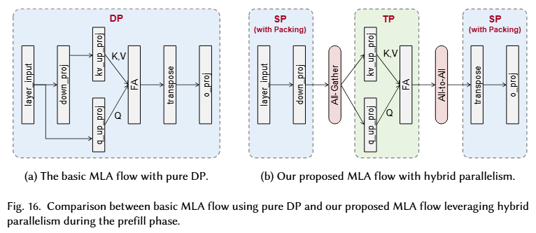

解决方案：分阶段混合并行策略。在 MLA block 内，计算 Attention 时采用 TP，前后则采用 SP。具体来说，SP 用到了序列打包：第一阶段的 down_proj 和第三阶段的 o_proj。

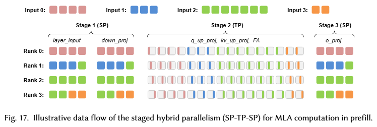

采用混合并行策略的代价在于引入了两次额外的通信：

-   阶段 1 和 2 之间 AG
-   阶段 2 和 3 之间 A2A

尽管通信次数增加了，但是单位通信量减小（得益于 TP）。

> TODO: 单位通信量减小的理论分析

#### Pipeline & Overlapping

将 [DeepSeek-V3 技术报告](https://arxiv.org/abs/2412.19437)中提出的双微批次通算掩盖的策略直接应用到 CloudMatrix384 上会存在硬件架构不适配的问题。根据 CloudMatrix384 的特点，首先可以将低强度的辅助计算卸载到 AIV，使 AIC[^7] 能够专注于计算密集型算子；其次，可以显式地路由大容量数据传输，特别是 MoE 的 A2A。【详见图 18b】

[^7]: AIC: AI cube cores，专用矩阵计算单元

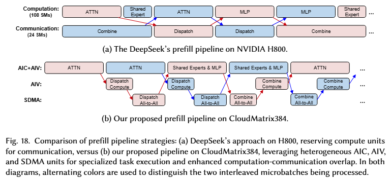

关于 P/D 的优化策略之异同，可以参考如下表格：

|   特性   |               Decode               |                   Prefill                    |
| :------: | :--------------------------------: | :------------------------------------------: |
| 核心目标 |               低延迟               |                   高吞吐量                   |
| 工作负载 |     处理短序列，逐个生成 token     |             处理长序列和大微批次             |
| 主要挑战 |     减少单个 token 的生成时间      |        避免计算单元空闲，管理资源争用        |
| 设计哲学 | 紧密耦合：通信与计算交错，快速响应 | 分离与重叠：通信与计算分离，并尽可能并行执行 |

#### P/D 低干扰传输

关于 P/D 实例之间的 K/V 缓存的传输问题，这会根据其网络拓扑决定。在 CloudMatrix384 中，是采用 RDMA 平面来传输的，且调度过程是异步的。而至于 P/D 实例之间的映射问题，存在如下定义：

- P/D 比率 \( r = \dfrac{d_{tp}^{pre}}{d_{tp}^{dec}} \)
- 组的大小 \( g = \dfrac{d_{dp}^{dec}}{r} \)

按照此定义，结合本文实验部分给出的配置，即：

|       阶段        |      Prefill      | Decode |
| :---------------: | :---------------: | :----: |
|       实例        |         6         |   1    |
| 每个实例的节点数  |         2         |   20   |
| 每个实例的 NPU 数 |        16         |  160   |
| 相应的 NPU Die 数 |        32         |  320   |
| MLA 模块并行策略  |    SP-TP-SP=32    | DP=320 |
| MoE 模块并行策略  |       EP=32       | EP=320 |

可以推得

$$
\begin{aligned}
r &= \dfrac{d_{tp}^{pre}}{d_{tp}^{dec}} = \dfrac{1}{10} \\
g &= \dfrac{d_{dp}^{dec}}{r} = 3200
\end{aligned}
$$

这说明 CloudMatrix-Infer 在一对 P/D 实例内维护 3200 个组，每个组都会负责管理 PDC 节点的一部分的存储空间。具体来说，其 rank 按照如下的计算规则：

- 组内下标 \( i_g = \lfloor \dfrac{i_{dp}^{dec}}{g} \rfloor \)，其中 \( i_{dp}^{dec} \) 表示 Decode 阶段的 DP 组内下标。
- Prefill 阶段的 TP 组内下标 \( i_{tp}^{pre} = i_g d_{tp}^{dec} + i_{tp}^{dec} \)

一般来说，解码阶段可以采用混合 TP-DP 的并行策略来提升吞吐量，而预填充阶段通常使用较大的 TP 度来加速长输入序列的处理。在两阶段不同的并行策略下，可能会产生冗余（主要是因为 Decode 阶段的 DP 和 Prefill 阶段的实例比 Decode 更多）。于是，上述定义的组可以管理一对 P/D 实例之间的 hidden states 和 K/V 缓存传输。
