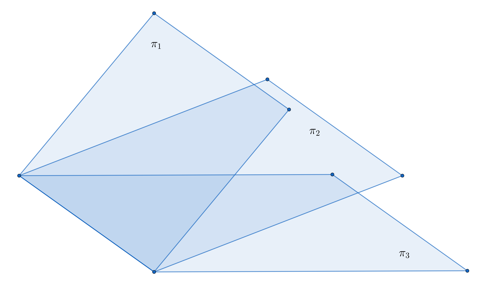

2024 年考研已落下帷幕。据报道，今年考研的人数比去年减少了 36 万（共 438 万人报考），引发社会广泛关注。在刚刚结束的数学科目考试中，不少考生哀叹今年的数学试题难如登天，特别是 301 数学（一）。

本篇博客将持续更新今年数学（一）每道题目的详细作答过程，体会莘莘学子们在考场上的不易。

<!--more-->

------

## 选择题

### 1

已知函数 \(\displaystyle f(x)=\int_{0}^{x} e^{\cos t} \mathrm{d} t\)，\(\displaystyle g(x)=\int_{0}^{\sin x} e^{t^{2}} \mathrm{d} t\)，则 \((\qquad)\)

A. \(f(x)\) 是奇函数，\(g(x)\) 是偶函数

B. \(f(x)\) 是偶函数，\(g(x)\) 是奇函数

C. \(f(x)\) 与 \(g(x)\) 均为奇函数

D. \(f(x)\) 与 \(g(x)\) 均为周期函数

【解】

本题考察变限函数的定义和积分的性质。若一个函数具有奇偶性，则其求导和积分结果的奇偶性正好相反。题干中的被积函数都是偶函数，且变限积分的上限是奇函数。因此，其导函数都是偶函数，所以原函数都是奇函数。

### 2

设 \(P=P(x, y, z), Q=Q(x, y, z)\) 均为连续函数，\(\Sigma\) 为曲面 \(z=\sqrt{1-x^{2}-y^{2}} \ (x \leqslant 0, y \geqslant 0)\) 的上侧，则 \(\displaystyle \iint_{\Sigma} P \mathrm{d}y \mathrm{d}z + Q \mathrm{d}z \mathrm{d}x = (\qquad)\)

A. \(\displaystyle \iint_{\Sigma}\left(\dfrac{x}{z} P+\dfrac{y}{z} Q\right) \mathrm{d}x \mathrm{d}y\)

B. \(\displaystyle \iint_{\Sigma}\left(-\dfrac{x}{z} P+\dfrac{y}{z} Q\right) \mathrm{d}x \mathrm{d}y\)

C. \(\displaystyle \iint_{\Sigma}\left(\dfrac{x}{z} P-\dfrac{y}{z} Q\right) \mathrm{d}x \mathrm{d}y\)

D. \(\displaystyle \iint_{\Sigma}\left(-\dfrac{x}{z} P-\dfrac{y}{z} Q\right) \mathrm{d}x \mathrm{d}y\)

【解】

本题考察第二类曲面积分的转换投影法。通过四个选项可以判断是往 \(xOy\) 平面上投影，因此分别计算 \(z\) 对 \(x, y\) 的偏导数

$$
\begin{aligned}
    z^2 &= 1 - x^2 - y^2 \\
    2z \cdot \dfrac{\partial z}{\partial x} &= -2x \\
    \Longrightarrow \dfrac{\partial z}{\partial x} &= - \dfrac{x}{z} \\
    2z \cdot \dfrac{\partial z}{\partial y} &= -2y \\
    \Longrightarrow \dfrac{\partial z}{\partial y} &= - \dfrac{y}{z}
\end{aligned}
$$

所以

$$
\begin{aligned}
    &\ \iint_{\Sigma} P \mathrm{d}y \mathrm{d}z + Q \mathrm{d}z \mathrm{d}x \\
    =&\ \iint_{\Sigma} \left( P \cdot \left(-\dfrac{\partial z}{\partial x}\right) + Q \cdot \left(-\dfrac{\partial z}{\partial y}\right) \right) \mathrm{d}y \mathrm{d}z \\
    =&\ \iint_{\Sigma} \left( \dfrac{x}{z} + \dfrac{y}{z} \right) \mathrm{d}x \mathrm{d}y
\end{aligned}
$$

### 3

已知幂级数 \(\displaystyle \sum_{n = 0}^{\infty} a_n x^n\) 的和函数为 \(\ln(2 + x)\)，则 \(\displaystyle \sum_{n = 0}^{\infty} n a_{2n} = (\qquad)\)

A. \(-\dfrac{1}{6}\)

B. \(-\dfrac{1}{3}\)

C. \(\dfrac{1}{6}\)

D. \(\dfrac{1}{3}\)

【解】

本题考察幂级数和泰勒公式。首先我们将和函数 \(\ln(2 + x)\) 泰勒展开

$$
\begin{aligned}
    \ln{(2 + x)} &= \ln{2} + \ln{(1 + \dfrac{x}{2})} \\
    &= \ln{2} + \sum_{n = 1}^{\infty} \dfrac{(-1)^{n-1}}{n} \left( \dfrac{x}{2} \right)^{n} \\
\end{aligned}
$$

易知，\(a_0 = \ln{2}\)。利用待定系数法，当 \(n \geqslant 1\) 时，数列 \(\{a_n\}\) 的通项公式为

$$
\begin{aligned}
    a_n = \dfrac{(-1)^{n-1}}{n \cdot 2^n}
\end{aligned}
$$

所以待求的和式为

$$
\begin{aligned}
    \sum_{n = 0}^{\infty} n a_{2n} &= \sum_{n = 1}^{\infty} n \dfrac{(-1)^{2n-1}}{2n \cdot 2^{2n}} \\
    &= -\dfrac{1}{2} \sum_{n = 1}^{\infty} \dfrac{1}{4^{n}} \\
    &= -\dfrac{1}{2} \lim_{n \to \infty}  \dfrac{\dfrac{1}{4} \left(1 - \dfrac{1}{4^{n}}\right)}{1 - \dfrac{1}{4}} \\
    &= -\dfrac{1}{6}
\end{aligned}
$$

### 4

设函数 \(f(x)\) 在区间 \((-1,1)\) 上有定义，且 \(\displaystyle \lim _{x \to 0} f(x)=0\)，则 \((\qquad)\)

A. 当 \(\displaystyle \lim _{x \to 0} \dfrac{f(x)}{x}=m\) 时，\(f'(0)=m\)

B. 当 \(f'(0)=m\) 时，\(\displaystyle \lim _{x \to 0} \dfrac{f(x)}{x}=m\)

C. 当 \(\displaystyle \lim _{x \to 0} f'(x)=m\) 时，\(f'(0)=m\)

D. 当 \(f'(0)=m\) 时，\(\displaystyle \lim _{x \to 0} f'(x)=m\)

【解】

本题考察导数的定义。函数在某点可导需要满足以下 2 个条件：

1. 左导数等于右导数
2. 函数在该点处连续

对于 B 选项，因为 \(f'(0) = m\)，暗含了 \(f(x)\) 在 \(x = 0\) 处连续的条件，从而极限值等于函数值，即

$$
\lim_{x \to 0} f(x) = f(0) = m
$$

由导数定义得

$$
\lim_{x \to 0} \dfrac{f(x) - f(0)}{x - 0} = \lim_{x \to 0} \dfrac{f(x)}{x} = m
$$

可以证明 B 选项正确。而 A 选项恰好是其逆命题，不一定成立。这是因为 \(f(0)\) 不一定等于 0，下面给出一个反例

$$
f(x) = \begin{cases}
    1 & x = 0 \\
    x^2 \sin{\dfrac{1}{x}} & x \in (-1, 0) \cup (0, 1)
\end{cases} \tag{1}
$$

\(f(x)\) 在 \(x = 0\) 处的极限为

$$
\lim_{x \to 0} f(x) = \lim_{x \to 0^{+}} x^2 \sin{\dfrac{1}{x}} = \lim_{x \to 0^{-}} x^2 \sin{\dfrac{1}{x}} = 0 \neq f(0)
$$

对于 C 选项，是典型的导函数极限存在但不可导的情况。下面给出一个反例

$$
\begin{aligned}
    f(x) = \begin{cases}
        1 & x = 0 \\
        x^2 & x \in (-1, 0) \cup (0, 1)
    \end{cases}
\end{aligned}
$$

其导函数为

$$
\begin{aligned}
    f'(x) = \begin{cases}
        \nexists & x = 0 \\
        2x & x \in (-1, 0) \cup (0, 1)
    \end{cases}
\end{aligned}
$$

导函数的极限

$$
\begin{aligned}
    \lim_{x \to 0} f'(x) &= \lim_{x \to 0} 2x = 0
\end{aligned}
$$

但 \(f(x)\) 在 \(x = 0\) 处的导数却不存在，因为不连续。

而 D 选项刚好相反，是典型的可导但导函数极限不存在的情况。可以采用类似 (1) 式的反例，说明如下

$$
\begin{aligned}
    f(x) = \begin{cases}
        0 & x = 0 \\
        x^2 \sin{\dfrac{1}{x}} & x \in (-1, 0) \cup (0, 1)
    \end{cases}
\end{aligned}
$$

易知

$$
\begin{aligned}
    \lim_{x \to 0^{+}} f(x) = \lim_{x \to 0^{-}} f(x) = f(0) = 0
\end{aligned}
$$

这说明 \(f(x)\) 在 \((-1, 1)\) 上连续。由导数的定义，计算 \(f(x)\) 在 \(x = 0\) 处的导数

$$
\begin{aligned}
    f'(0) &= \lim_{x \to 0} \dfrac{f(x) - f(0)}{x - 0} \\
    &= \lim_{x \to 0} \dfrac{x^2 \sin{\dfrac{1}{x}}}{x} \\
    &= 0
\end{aligned}
$$

但是导函数的极限

$$
\begin{aligned}
    \lim_{x \to 0} f'(x) &= \lim_{x \to 0} 2x \sin{\dfrac{1}{x}} - \cos{\dfrac{1}{x}} \\
    &= \nexists
\end{aligned}
$$

### 5

在空间直角坐标系 \(O-xyz\) 中，三张平面 \(\pi_i: a_ix+b_iy+c_i = d_i\) 的位置关系如图所示。记 \(\alpha_i = (a_i, b_i, c_i)\)，\(\beta_i = (a_i, b_i, c_i, d_i)\)。若

$$
r \begin{pmatrix}
    \alpha_1 \\
    \alpha_2 \\
    \alpha_3
\end{pmatrix} = m, r \begin{pmatrix}
    \beta_1 \\
    \beta_2 \\
    \beta_3 \\
\end{pmatrix} = n
$$

则 \((\qquad)\)

A. \(m=1, n=2\)

B. \(m=n=2\)

C. \(m=2, n=3\)

D. \(m=n=3\)

【解】

本题考查线性方程组解的性质。本题通过给出三维空间中平面的位置关系，考察考生对线性方程组的直观理解，颇有新意。

由图可知，平面 \(\pi_1 \cap \pi_2 \cap \pi_3 = l\)，交于一条直线。这说明，三个平面所对应的平面方程组成的三元线性方程组有无穷多解，且位于同一条直线上。所以，其基础解系只有一个向量作基。

那么，相应的齐次线性方程组的系数矩阵的秩 \(r = 3 - 1 = 2\)，相应的非齐次线性方程组的增广矩阵的秩应该和前者相同。

### 6

设向量

$$
\alpha_1 = \begin{bmatrix}
    a \\
    1 \\
    -1 \\
    1
\end{bmatrix}, \alpha_2 = \begin{bmatrix}
    1 \\
    1 \\
    b \\
    a
\end{bmatrix}, \alpha_3 = \begin{bmatrix}
    1 \\
    a \\
    -1 \\
    1
\end{bmatrix}
$$

若 \(\alpha_1, \alpha_2, \alpha_3\) 线性相关，且其中任意两个向量线性无关，则 \((\qquad)\)

A. \(a=1, b \neq -1\)

B. \(a=1, b=-1\)

C. \(a \neq -2, b=2\)

D. \(a=-2, b=2\)

【解】

本题考查向量组的关系。题目给出了 3 个 4 维向量，将之排列成 \(4 \times 3\) 的矩阵。

由题意可知，3 个向量线性相关，意味着该矩阵的任意 3 阶子式的行列式等于零，即

$$
\begin{aligned}
    \begin{vmatrix}
        a & 1 & 1 \\
        1 & 1 & a \\
        1 & a & 1
    \end{vmatrix} &= a + a + a - 1 - 1 - a^3 \\
    &= -a^3 + 3a - 2 \\
    &= (a - 1)(-a^2 - a + 2) \\
    &= -(a - 1)^2(a + 2) = 0 \\
    \Longrightarrow a &\in \{1, -2\}
\end{aligned}
$$

当 \(a=1\) 时，\(\alpha_1\) 和 \(\alpha_3\) 必然线性相关，不合题意，舍去。因此，\(a = -2\)。再计算含有 \(b\) 的 3 阶子式的行列式，以反解出 \(b\)，即

$$
\begin{aligned}
    \begin{vmatrix}
        -2 & 1 & 1 \\
        1 & 1 & -2 \\
        -1 & b & -1
    \end{vmatrix} &= \begin{vmatrix}
        1 & 1 & -2 \\
        -1 & b & -1 \\
        -2 & 1 & 1
    \end{vmatrix} \\
    &= \begin{vmatrix}
        1 & 1 & -2 \\
        0 & b+1 & -3 \\
        0 & 3 & -3
    \end{vmatrix} \\
    &= \begin{vmatrix}
        b+1 & -3 \\
        3 & -3
    \end{vmatrix} \\
    &= -3(b+1) + 9 = 0 \\
    \Longrightarrow b &= 2
\end{aligned}
$$

### 7

设 \(A\) 是秩为 2 的 3 阶矩阵，\(\alpha\) 是满足 \(A \alpha = 0\) 的非零向量。若对满足 \(\beta^{\top} \alpha = 0\) 的 3 维列向量 \(\beta\)，均有 \(A \beta = \beta\)，则 \((\qquad)\)

A. \(A^3\) 的迹为 2

B. \(A^3\) 的迹为 5

C. \(A^2\) 的迹为 8

D. \(A^2\) 的迹为 9

【解】

本题考察矩阵的特征值和特征向量。依题意，\(A \alpha = 0\) 且 \(\alpha\) 是非零向量，说明矩阵至少有一个特征值 \(\lambda = 0\)，且它是属于 \(\alpha\) 的特征值。

同理，对于任意与 \(\alpha\) 正交的向量 \(\beta\) 均满足 \(A \beta = \beta\)，说明 \(\lambda = 1\) 也是矩阵 \(A\) 的特征值。而且，\(\alpha, \beta\) 都是 3 维列向量，说明 \(\lambda = 1\) 至少是二重特征值。同时，\(A\) 的秩又等于 2，说明 \(\lambda = 1\) 恰好是二重特征值。因此

$$
A \sim \begin{bmatrix}
    1 & & \\
    & 1 & \\
    & & 0
\end{bmatrix}
$$

故 \(\operatorname{tr}(A^3) = 1+1+0 = 2\)。

### 8

设随机变量 \(X, Y\) 相互独立，且 \(X \sim N(0, 2)\)，\(Y \sim N(-2, 2)\)。若 \(P(2X+Y < a) = P(X > Y)\)，则 \(a = (\qquad)\)

A. \(-2-\sqrt{10}\)

B. \(-2+\sqrt{10}\)

C. \(-2-\sqrt{6}\)

D. \(-2+\sqrt{6}\)

【解】

本题考察正态分布的性质。易知随机变量 \(2X+Y \sim N(-2, 10)\)，\(Y-X \sim N(-2, 4)\)，于是得到

$$
\begin{aligned}
    P(2X+Y < a) &= P(Y-X < 0) \\
    \Phi(\dfrac{a+2}{\sqrt{10}}) &= \Phi(\dfrac{0+2}{2}) \\
    \Longrightarrow \dfrac{a+2}{\sqrt{10}} &= \dfrac{0+2}{2} \\
    a &= -2 + \sqrt{10}
\end{aligned}
$$

### 9

设随机变量的概率密度为

$$
f(x) = \begin{cases}
    2(1 - x) & 0 < x < 1 \\
    0 & \text{else}
\end{cases}
$$

在 \(X = x \ (0 < x < 1)\) 的条件下，随机变量 \(Y \sim U(x, 1)\)。则 \(\operatorname{Cov}(X, Y) = (\qquad)\)

A. \(-\dfrac{1}{36}\)

B. \(-\dfrac{1}{72}\)

C. \(\dfrac{1}{72}\)

D. \(\dfrac{1}{36}\)

【解】

本题考察条件概率和协方差的计算。由题意可得随机变量 \(Y\) 在 \(X = x\) 的条件下的概率密度函数为

$$
f_{Y|X}(y|x) = \begin{cases}
    \dfrac{1}{1-x} & 0 < x < 1, x < y < 1 \\
    0 & \text{else}
\end{cases}
$$

那么，由条件概率公式可得

$$
\begin{aligned}
    f(x, y) &= f_{Y|X}(y|x) \cdot f(x) \\
    &= \begin{cases}
        2 & 0 < x < 1, x < y < 1 \\
        0 & \text{else}
    \end{cases}
\end{aligned}
$$

下面分别计算随机变量 \(X, Y, XY\) 的均值

$$
\begin{aligned}
    E(X) &= \int_{0}^{1} x \cdot 2(1-x) \mathrm{d}x \\
    &= x^2 \Big|_{0}^{1} - \dfrac{2}{3} x^3 \Big|_{0}^{1} \\
    &= \dfrac{1}{3} \\
    E(Y) &= \iint_{\mathbb{R}^2} y f(x, y) \mathrm{d}x \mathrm{d}y \\
    &= \int_{0}^{1} \mathrm{d}y \int_{0}^{y} 2y \mathrm{d}x \\
    &= \dfrac{2}{3} y^3 \Big|_{0}^{1} \\
    &= \dfrac{2}{3} \\
    E(XY) &= \iint_{\mathbb{R}^2} xy f(x, y) \mathrm{d}x \mathrm{d}y \\
    &= \int_{0}^{1} y \mathrm{d}y \int_{0}^{y} 2x \mathrm{d}x \\
    &= \dfrac{1}{4} y^4 \Big|_{0}^{1} \\
    &= \dfrac{1}{4}
\end{aligned}
$$

故协方差为

$$
\begin{aligned}
    \operatorname{Cov}(X, Y) &= E(XY) - E(X)E(Y) \\
    &= \dfrac{1}{4} - \dfrac{1}{3} \times \dfrac{2}{3} \\
    &= \dfrac{1}{36}
\end{aligned}
$$

### 10

设随机变量 \(X, Y\) 相互独立，且均服从参数为 \(\lambda\) 的指数分布。令 \(Z = |X-Y|\)，则下列随机变量与 \(Z\) 同分布的是 \((\qquad)\)

A. \(X+Y\)

B. \(\dfrac{X+Y}{2}\)

C. \(2X\)

D. \(X\)

【解】

本题考查指数分布的计算。依题意，显然当 \(z < 0\) 时，概率分布函数 \(F_Z(z) = 0\)。下面计算当 \(z \geqslant 0\) 时的概率分布函数。

$$
\begin{aligned}
    F_Z(z) &= \iint_{|x-y| \leqslant z} f(x, y) \mathrm{d}x \mathrm{d}y \\
    &= \iint_{|x-y| \leqslant z} \lambda e^{-\lambda x} \cdot \lambda e^{-\lambda y} \mathrm{d}x \mathrm{d}y \\
    &= 2 \int_{0}^{+\infty} \lambda e^{-\lambda y} \mathrm{d}y \int_{y}^{y+z} \lambda e^{-\lambda x} \mathrm{d}x \\
    &= -2 \int_{0}^{+\infty} \lambda e^{-\lambda y} \cdot e^{-\lambda x} \Big|_{y}^{y+z} \mathrm{d}y \\
    &= -2 \int_{y}^{y+z} \lambda e^{-2 \lambda y} (e^{-\lambda z} - 1) \mathrm{d}y \\
    &= (e^{-\lambda z} - 1) e^{-2 \lambda y} \Big|_{0}^{+\infty} \\
    &= 1 - e^{-\lambda z}
\end{aligned}
$$

也就是说

$$
\begin{aligned}
    F_Z(z) &= \begin{cases}
        1 - e^{-\lambda z} & z \geqslant 0 \\
        0 & z < 0 
    \end{cases} \\
    f(z) &= \begin{cases}
        \lambda e^{-\lambda z} & z \geqslant 0 \\
        0 & z < 0
    \end{cases}
\end{aligned}
$$

显然 \(Z=|X-Y|\) 与 \(X\) 同分布。

## 填空题

### 11

若

$$
\lim_{x \to 0} \dfrac{(1+ax^2)^{\sin{x}} - 1}{x^3} = 6
$$

则 \(a = \underline{\qquad}\)

【解】

$$
\begin{aligned}
    \lim_{x \to 0} \dfrac{(1+ax^2)^{\sin{x}} - 1}{x^3} &= \lim_{x \to 0} \dfrac{e^{\sin{x} \ln{(1+ax^2)}} - 1}{x^3}
\end{aligned}
$$

由 \(e^x - 1 \sim 0 \ (x \to 0)\) 等价无穷小替换，可得

$$
\begin{aligned}
    \cdots &= \lim_{x \to 0} \dfrac{\sin{x} \ln{(1+ax^2)}}{x^3}
\end{aligned}
$$

由 \(\sin{x} \sim x\) 以及 \(\ln{(x+1)} \sim x \ (x \to 0)\) 等价无穷小替换，可得

$$
\begin{aligned}
    \cdots = \lim_{x \to 0} \dfrac{x \cdot ax^2}{x^3} &= 6 \\
    \Longrightarrow a &= 6
\end{aligned}
$$

### 12

设函数 \(f(u, v)\) 具有 2 阶连续偏导数，且 \(\left. \mathrm{d} f\right|_{(1,1)} = 3 \mathrm{d} u + 4 \mathrm{d} v\)，令 \(y = f\left(\cos{x}, 1+x^{2}\right)\)，则 \(\left.\dfrac{\mathrm{d}^{2} y}{\mathrm{d} x^{2}}\right|_{x = 0} = \underline{\qquad}\)
【解】

本题考察偏导数和全微分。易知

$$
\begin{aligned}
    \left. f'_u \right|_{(1,1)} &= 3 \\
    \left. f'_v \right|_{(1,1)} &= 4
\end{aligned}
$$

对 \(y\) 求导，可得

$$
\begin{aligned}
    \dfrac{\mathrm{d} y}{\mathrm{d} x} =&\ 
 \dfrac{\mathrm{d} f\left(\cos x, 1+x^{2}\right)}{\mathrm{d} x} \\
    =&\ f'_u \cdot (-\sin{x}) + f'_v \cdot 2x \\
    \dfrac{\mathrm{d}^{2} y}{\mathrm{d} x^{2}} =&\ \dfrac{\mathrm{d}^{2} f\left(\cos x, 1+x^{2}\right)}{\mathrm{d} x^{2}} \\
    =&\ [f''_{uu} \cdot (-\sin{x}) + f''_{uv} \cdot 2x] (-\sin{x}) + f'_{u} \cdot (-\cos{x}) + \\
    &\ [f''_{vu} \cdot (-\sin{x}) + f''_{vv} \cdot 2x] \cdot 2x + 2 f'_{v}
\end{aligned}
$$

于是

$$
\begin{aligned}
    \dfrac{\mathrm{d}^{2} y}{\mathrm{d} x^{2}} &= \left.\dfrac{\mathrm{d}^{2} f(\cos x, 1+x^{2})}{\mathrm{d} x^{2}}\right|_{x=0} \\
    &= \left. - f'_u \right|_{(1,1)} + \left. 2 f'_v \right|_{(1,1)} \\
    &= 5
\end{aligned}
$$

### 13

已知函数 \(f(x) = x+1\)，若

$$
\begin{aligned}
    f(x) = \dfrac{a_0}{2} + \sum_{n=1}^{\infty} a_{n} \cos{nx}, \ x \in [0, \pi]
\end{aligned}
$$

则 \(\lim_{n \to \infty} n^2 \sin{a_{2n-1}} = \underline{\qquad}\)

【解】

本题考察傅里叶级数。由公式得

$$
\begin{aligned}
    a_n &= \dfrac{2}{\pi} \int_{0}^{\pi} (x+1) \cos{\dfrac{n \pi x}{\pi}} \mathrm{d}x \\
    &= \dfrac{2}{n \pi} \left(
        \left. \sin{nx} \right|_{0}^{\pi} + \int_{0}^{\pi} x \mathrm{d} \sin{nx}
    \right) \\
    &= \dfrac{2}{n \pi} \left(
        \left. x \sin{nx} \right|_{0}^{\pi} - \int_{0}^{\pi} \sin{nx} \mathrm{d} x
    \right) \\
    &= \dfrac{2}{n^2 \pi} \left. \cos{nx} \right|_{0}^{\pi} \\
    &= -\dfrac{4}{n^2 \pi}
\end{aligned}
$$

于是

$$
\begin{aligned}
    \lim_{n \to \infty} n^2 \sin{a_{2n-1}} &= -\lim_{n \to \infty} n^2 \cdot \sin{\dfrac{4}{(2n-1)^2 \pi}} \\
\end{aligned}
$$

原式为 \(\infty \cdot 0\) 型未定式，利用倒代换，令

$$
\begin{aligned}
    t &= \dfrac{1}{2n - 1} \\
    \Longrightarrow n &= \dfrac{t+1}{2t}
\end{aligned}
$$

于是原式可化为

$$
\begin{aligned}
    \cdots &= -\lim_{t \to 0} \left( \dfrac{t+1}{2t} \right)^2 \sin{\dfrac{4t^2}{\pi}} \\
    &= -\lim_{t \to 0} \left( \dfrac{t+1}{2t} \right)^2 \cdot \dfrac{4t^2}{\pi} \\
    &= -\lim_{t \to 0} \dfrac{(t+1)^2}{\pi} \\
    &= -\dfrac{1}{\pi}
\end{aligned}
$$

### 14

微分方程

$$
y' = \dfrac{1}{(x+y)^2}
$$

满足条件 \(y(1) = 0\) 的解为 \(\underline{\qquad}\)

【解】

令 \(x+y = u\)，等式两边同时对 \(x\) 求导，得到 \(u' = 1+y'\)。代入原式得

$$
\begin{aligned}
    u' - 1 &= \dfrac{1}{u^2} \\
    \dfrac{\mathrm{d}u}{\mathrm{d}x} &= \dfrac{1+u^2}{u^2} \\
\end{aligned}
$$

采用分离变量法解这个微分方程，得

$$
\begin{aligned}
    \int \dfrac{u^2}{1+u^2} \mathrm{d}u &= \int \mathrm{d}x \\
    \Longrightarrow x &= \int \left(1 - \dfrac{1}{1+u^2}\right) \mathrm{d}u \\
    &= u - \arctan{u} + C \\
\end{aligned}
$$

即

$$
\begin{aligned}
    x &= x + y - \arctan{(x+y)} + C \\
    y &= \arctan{(x+y)} + C
\end{aligned}
$$

代入初始条件，可解得

$$
\begin{aligned}
    0 &= \arctan{1} + C \\
    \Longrightarrow C &= -\dfrac{\pi}{4}
\end{aligned}
$$

故原微分方程的解为

$$
x = \tan{(y + \dfrac{\pi}{4})} - y
$$

### 15

设实矩阵

$$
A = \begin{bmatrix}
    a+1 & a \\
    a & a
\end{bmatrix}
$$

若对任意实向量 \(\alpha = [x_1, x_2]^{\top}, \beta = [y_1, y_2]^{\top}\)，都有

$$
(\alpha^{\top} A \beta)^{2} \leqslant \alpha^{\top} A \alpha \cdot \beta^{\top} A \beta
$$

都成立，则 \(a\) 的取值范围是 \(\underline{\qquad}\)

【解】

用作差法，得到

$$
\begin{aligned}
    (\alpha^{\top} A \beta)^{2} - \alpha^{\top} A \alpha \cdot \beta^{\top} A \beta &= \alpha^{\top} A ( \beta \alpha^{\top} - \alpha \beta^{\top} ) A \beta \\
    &= \alpha^{\top} A \left(
        \begin{bmatrix}
            x_1 y_1 & x_2 y_1 \\
            x_1 y_2 & x_2 y_2
        \end{bmatrix} - \begin{bmatrix}
            x_1 y_1 & x_1 y_2 \\
            x_2 y_1 & x_2 y_2
        \end{bmatrix}
    \right) A \beta \\
    &= \alpha^{\top} A (x_1 y_2 - x_2 y_1) \begin{bmatrix}
        0 & -1 \\
        1 & 0
    \end{bmatrix} A \beta \\
    &= (x_1 y_2 - x_2 y_1) \alpha^{\top} \begin{bmatrix}
        a+1 & a \\
        a & a
    \end{bmatrix} \begin{bmatrix}
        0 & -1 \\
        1 & 0
    \end{bmatrix} \begin{bmatrix}
        a+1 & a \\
        a & a
    \end{bmatrix} \beta \\
    &= (x_1 y_2 - x_2 y_1) \alpha^{\top} \begin{bmatrix}
        a & -(a+1) \\
        a & -a
    \end{bmatrix} \begin{bmatrix}
        a+1 & a \\
        a & a
    \end{bmatrix} \beta \\
    &= (x_1 y_2 - x_2 y_1) \alpha^{\top} \begin{bmatrix}
        0 & -a \\
        a & 0
    \end{bmatrix} \beta \\
    &= a (x_1 y_2 - x_2 y_1) \begin{bmatrix}
        x_1 & x_2
    \end{bmatrix} \begin{bmatrix}
        0 & -1 \\
        1 & 0
    \end{bmatrix} \begin{bmatrix}
        y_1 \\
        y_2
    \end{bmatrix} \\
    &= -a (x_1 y_2 - x_2 y_1)^2 \leqslant 0 \\
    \Longrightarrow a &\geqslant 0
\end{aligned}
$$

### 16

设随机试验每次成功的概率为 \(p\)，现进行 3 次独立重复试验。在至少成功 1 次的情况下，3 次试验全部成功的概率为 \(\dfrac{4}{13}\)，则 \(p = \underline{\qquad}\)

【解】

本题考察二项分布以及条件概率。设随机变量 \(X\) 表示 3 次试验中成功的次数，则 \(X \sim B(3, p)\)。由题意得

$$
\begin{aligned}
    P(X=3 | X \geqslant 1) &= \dfrac{P(X=3, X \geqslant 1)}{P(X \geqslant 1)} \\
    &= \dfrac{C_3^3 p^3}{1 - C_3^0 (1 - p)^3} = \dfrac{4}{13}
\end{aligned}
$$

整理并解这个方程

$$
\begin{aligned}
    13 p^3 + 4 (1 - p)^3 &= 4 \\
    9 p^3 + 12 p^2 - 12 p &= 0 \\
    3 p^2 + 4 p - 4 &= 0 \quad (0 < p < 1) \\
    (3p - 2)(p + 2) &= 0 \\
    \Longrightarrow p &= \dfrac{2}{3}
\end{aligned}
$$

## 解答题

### 17

已知平面区域

$$
D = \{(x, y) \mid \sqrt{1-y^2} \leqslant x \leqslant 1, -1 \leqslant y \leqslant 1\}
$$

计算

$$
\iint_D \dfrac{x}{\sqrt{x^2+y^2}} \mathrm{d}x \mathrm{d}y
$$

【解】

依题意，积分区域是一个 \(y\) 型区域，且关于 \(x\) 轴对称。而被积函数关于 \(x\) 是奇函数，关于 \(y\) 是偶函数。所以原积分式可化为

$$
\begin{aligned}
    2 \iint_{D_1} \dfrac{x}{\sqrt{x^2+y^2}} \mathrm{d}x \mathrm{d}y
\end{aligned}
$$

其中

$$
D_1 = \{(x, y) \mid \sqrt{1-y^2} \leqslant x \leqslant 1, 0 \leqslant y \leqslant 1\}
$$

这仍然是一个 \(y\) 型区域。不过注意到，如果先关于 \(y\) 积分，会得到反三角函数，不利于计算。所以，应该将这个区域看成 \(x\) 型区域。于是

$$
\begin{aligned}
    \cdots &= 2 \iint_{D_1} \dfrac{x}{\sqrt{x^2+y^2}} \mathrm{d}x \mathrm{d}y \\
    &= \int_{0}^{1} \mathrm{d}y \int_{\sqrt{1-y^2}}^{1} (x^2+y^2)^{-\dfrac{1}{2}} \mathrm{d} x^2 \\
    &= \int_{0}^{1} \left. 2(x^2+y^2)^{\dfrac{1}{2}} \right|_{\sqrt{1-y^2}}^{1} \mathrm{d}y \\
    &= 2 \int_{0}^{1} \left( \sqrt{1+y^2} - 1 \right) \mathrm{d}y
\end{aligned}
$$

计算这个定积分，~~不得不~~进行三角换元。令

$$
\begin{aligned}
    y &= \tan{\theta} \\
    y \in [0, 1] & \Rightarrow \theta \in [0, \dfrac{\pi}{4}] \\
    \mathrm{d}y &= \sec^2{\theta} \mathrm{d}\theta
\end{aligned}
$$

所以原式可化为

$$
\begin{aligned}
    \cdots &= 2 \int_{0}^{\dfrac{\pi}{4}} (\sec{\theta} - 1) \sec^2{\theta} \mathrm{d}\theta \\
    &= 2 \int_{0}^{\dfrac{\pi}{4}} \dfrac{\cos{\theta}}{\cos^4{\theta}} \mathrm{d}\theta - 2 \int_{0}^{\dfrac{\pi}{4}} \sec^2{\theta} \mathrm{d}\theta \\
    &= 2 \int_{0}^{\dfrac{\pi}{4}} \left. \dfrac{\mathrm{d} \sin{\theta}}{(1 - \sin^2{\theta})^2} - 2 \tan{\theta} \right|_{0}^{\dfrac{\pi}{4}} \\
    &= 2 \int_{0}^{\dfrac{\sqrt{2}}{2}} \dfrac{\mathrm{d}t}{(t+1)^2 (t-1)^2} - 2
\end{aligned}
$$

计算至此，需要对被积的分式裂项。设

$$
\begin{aligned}
    \dfrac{1}{(t+1)^2 (t-1)^2} = \dfrac{A}{t+1} + \dfrac{B}{t-1} + \dfrac{C}{(t+1)^2} + \dfrac{D}{(t-1)^2} \tag{2}
\end{aligned}
$$

由留数法，可以首先解得

$$
\begin{aligned}
    C &= \left. \dfrac{1}{(t-1)^2} \right|_{t=-1} = \dfrac{1}{4} \\
    D &= \left. \dfrac{1}{(t+1)^2} \right|_{t=1} = \dfrac{1}{4}
\end{aligned}
$$

代入方程 (2)，得到

$$
\begin{aligned}
    \dfrac{1}{(t+1)^2 (t-1)^2} &= \dfrac{A}{t+1} + \dfrac{B}{t-1} + \dfrac{t^2+1}{2 (t+1)^2 (t-1)^2} \\
    \dfrac{1-t^2}{2 (t+1)^2 (t-1)^2} &= \dfrac{A}{t+1} + \dfrac{B}{t-1} \\
    -\dfrac{1}{2 (t+1) (t-1)} &= \dfrac{A}{t+1} + \dfrac{B}{t-1} \\
\end{aligned}
$$

再一次使用留数法，可以解得

$$
\begin{aligned}
    A &= \left. -\dfrac{1}{2} \times \dfrac{1}{t-1} \right|_{t=-1} = \dfrac{1}{4} \\
    B &= \left. -\dfrac{1}{2} \times \dfrac{1}{t+1} \right|_{t=1} = -\dfrac{1}{4}
\end{aligned}
$$

于是，原式可化为

$$
\begin{aligned}
    \cdots &= \dfrac{1}{2} \left[
        \int_{0}^{\dfrac{\sqrt{2}}{2}} \dfrac{\mathrm{d}t}{t+1} - \int_{0}^{\dfrac{\sqrt{2}}{2}} \dfrac{\mathrm{d}t}{t-1} + \int_{0}^{\dfrac{\sqrt{2}}{2}} \dfrac{\mathrm{d}t}{(t+1)^2} + \int_{0}^{\dfrac{\sqrt{2}}{2}} \dfrac{\mathrm{d}t}{(t-1)^2}
    \right] - 2 \\
    &= \dfrac{1}{2} \left[
        \ln{(t+1)} \Big|_{0}^{\dfrac{\sqrt{2}}{2}} - \ln{(1-t)} \Big|_{0}^{\dfrac{\sqrt{2}}{2}} - \dfrac{1}{t+1} \Big|_{0}^{\dfrac{\sqrt{2}}{2}} - \dfrac{1}{t-1} \Big|_{0}^{\dfrac{\sqrt{2}}{2}}
    \right] - 2 \\
    &= \dfrac{1}{2} \left[
        \ln{\dfrac{2+\sqrt{2}}{2-\sqrt{2}}} - \left(
            \dfrac{2}{\sqrt{2}+2} - 1 + \dfrac{2}{\sqrt{2}-2} + 1
        \right)
    \right] - 2 \\
    &= \dfrac{1}{2} \left[
        2 \ln{(\sqrt{2}+1)} - \dfrac{2 \times 2\sqrt{2}}{(\sqrt{2}+2)(\sqrt{2}-2)}
    \right] - 2 \\
    &= \ln{(\sqrt{2}+1)} + \sqrt{2} - 2
\end{aligned}
$$

【注】

本题最终计算定积分时，也可以采用分部积分法。分部积分法的计算更为巧妙，比直接进行三角换元计算量更小。

$$
\begin{aligned}
    \int_{0}^{1} \sqrt{1+y^2} \mathrm{d}y &= y \sqrt{1+y^2} \Big|_{0}^{1} - \int_{0}^{1} \dfrac{y \cdot 2y}{2 \sqrt{1+y^2}} \mathrm{d}y \\
    &= \sqrt{2} - \int_{0}^{1} \dfrac{y^2+1-1}{\sqrt{1+y^2}} \mathrm{d}y \\
    &= \sqrt{2} - \int_{0}^{1} \sqrt{1+y^2} \mathrm{d}y + \int_{0}^{1} \dfrac{1}{\sqrt{1+y^2}} \mathrm{d}y \\
    \Longrightarrow \int_{0}^{1} \sqrt{1+y^2} \mathrm{d}y &= \dfrac{\sqrt{2}}{2} + \dfrac{1}{2} \int_{0}^{1} \dfrac{1}{\sqrt{1+y^2}} \mathrm{d}y
\end{aligned}
$$

下面计算定积分 \(\displaystyle \int_{0}^{1} \dfrac{1}{\sqrt{1+y^2}} \mathrm{d}y\)。此时再进行三角换元，计算量相对较小。

$$
\begin{aligned}
    y &= \tan{\theta} \quad \theta \in [0, \dfrac{\pi}{4}] \\
    \int_{0}^{1} \dfrac{1}{\sqrt{1+y^2}} \mathrm{d}y &= \int_{0}^{\dfrac{\pi}{4}} \dfrac{\sec^2{\theta}}{\sec{\theta}} \mathrm{d} \theta \\
    &= \int_{0}^{\dfrac{\pi}{4}} \dfrac{1}{1-\sin^2{\theta}} \mathrm{d} \sin{\theta} \\
    &= \dfrac{1}{2} \left( \int_{0}^{\dfrac{\sqrt{2}}{2}} \dfrac{1}{1+u} \mathrm{d}u + \int_{0}^{\dfrac{\sqrt{2}}{2}} \dfrac{1}{1-u} \mathrm{d}u \right) \\
    &= \dfrac{1}{2} \ln{\dfrac{1+u}{1-u}} \Big|_{0}^{\dfrac{\sqrt{2}}{2}} \\
    &= \ln{(\sqrt{2}+1)}
\end{aligned}
$$

于是

$$
\begin{aligned}
    \int_{0}^{1} \sqrt{1+y^2} \mathrm{d}y &= \dfrac{\sqrt{2}}{2} + \dfrac{1}{2} \ln{(\sqrt{2}+1)}
\end{aligned}
$$

所以原式的结果为

$$
\begin{aligned}
    \cdots &= 2 \int_{0}^{1} \left( \sqrt{1+y^2} - 1 \right) \mathrm{d}y \\
    &= \ln{(\sqrt{2}+1)} + \sqrt{2} - 2 \\
\end{aligned}
$$

【点评】

本题形为二重积分，实际上难点在于定积分的计算过程。本题涉及到二重积分的对称性、定积分第二换元法（三角换元）、三角函数有理式的积分、分式裂项等诸多知识点，且计算量非常大，计算过程繁琐，极易出错。

在计算定积分的过程中，可以通过分部积分法简化积分计算。这样即使需要进行三角换元，不会涉及到分母次数较高的有理函数积分。

### 18

已知函数 \(f(x, y) = x^3 + y^3 - (x+y)^2 + 3\)，\(T\) 是曲面 \(z = f(x, y)\) 在 \((1,1,1)\) 处的切平面，\(D\) 为 \(T\) 与坐标平面所围成的有界区域在 \(xOy\) 平面上的投影。

(1) 求 \(T\) 的方程。

(2) 求 \(f(x, y)\) 在 \(D\) 上的最大值和最小值。

【解】

本题的第 (1) 问考察曲线的切平面和法线方程的求解。首先将曲面方程改写为隐函数，即 \(F(x, y, z) = f(x, y) - z = 0\)。然后求解 \(F(x, y, z)\) 的梯度，即

$$
\begin{aligned}
    \nabla F(x, y, z) &= \begin{bmatrix}
        3x^2 - 2x - 2y \\
        3y^2 - 2x - 2y \\
        -1
    \end{bmatrix} \\
    \nabla F(1, 1, 1) &= \begin{bmatrix}
        -1 \\
        -1 \\
        -1
    \end{bmatrix}
\end{aligned}
$$

那么，只要与 \(\nabla F(1, 1, 1)\) 线性相关的向量均为曲面切平面的法向量。于是，可以写出切平面 \(T\) 的点法式方程为

$$
(x-1) + (y-1) + (z-1) = 0
$$

本题的第 (2) 问考察多元函数的条件极值。我们首先求出区域 \(D\)，令 \(z=0\)，得到

$$
\begin{aligned}
    l: x + y - 3 &= 0 \\
\end{aligned}
$$

那么区域 \(D\) 应当是直线 \(l\) 与 \(x\) 轴和 \(y\) 轴所围成的有界区域，即

$$
\begin{aligned}
    D = \{ (x, y) \mid 0 \leqslant x \leqslant 3, 0 \leqslant y \leqslant 3-x \}
\end{aligned}
$$

下面先求出所有的驻点（可能的极值点）。首先在 \(D\) 的内部求解

$$
\begin{aligned}
    \nabla f(x, y) &= \begin{bmatrix}
        3x^2 - 2x - 2y \\
        3y^2 - 2x - 2y
    \end{bmatrix} = \begin{bmatrix}
        0 \\
        0
    \end{bmatrix} \\
    \Longrightarrow & \begin{cases}
        3x^2 - 4x = 0 \\
        3y^2 - 4y = 0
    \end{cases} \\
    \Longrightarrow & \begin{cases}
        x = \dfrac{4}{3} \\
        y = \dfrac{4}{3}
    \end{cases}
\end{aligned}
$$

接下来在 \(D\) 的边界上求解

$$
\begin{aligned}
    f'(x, 0) &= 3x^2 - 2x = 0 \\
    \Longrightarrow x &= 0 \text{ or } x = \dfrac{2}{3} \\
    f'(0, y) &= 3y^2 - 2y = 0 \\
    \Longrightarrow y &= 0 \text{ or } y = \dfrac{2}{3} \\
    f'(x, 3-x) &= \dfrac{\mathrm{d}}{\mathrm{d}x} [x^3 + (3-x)^3 - 6] \\
    &= 3x^2 - 3(3-x)^2 \\
    &= 9(2x - 3) = 0 \\
    \Longrightarrow x &= \dfrac{3}{2} \\
\end{aligned}
$$

因此，可以求出如下 3 个驻点：\((\dfrac{2}{3}, 0), (0, \dfrac{2}{3}), (\dfrac{3}{2}, \dfrac{3}{2})\)

下面，分别计算各驻点的函数值为

$$
\begin{aligned}
    f(\dfrac{4}{3}, \dfrac{4}{3}) &= \dfrac{17}{27} \\
    f(\dfrac{2}{3}, 0) &= \dfrac{77}{27} \\
    f(0, \dfrac{2}{3}) &= \dfrac{77}{27} \\
    f(\dfrac{3}{2}, \dfrac{3}{2}) &= \dfrac{3}{4}
\end{aligned}
$$

最后，由于边界顶点处完全不可导，直接代入计算得到函数值为

$$
\begin{aligned}
    f(0, 0) &= 3 \\
    f(0, 3) &= 21 \\
    f(3, 0) &= 21
\end{aligned}
$$

所以，最大值为 21，最小值为 \(\dfrac{17}{27}\)。

【点评】

本题难度并不大，但是需要非常细致的计算，特别是因漏解而失分。

### 19

设 \(f(x)\) 二阶可导，\(f'(0)=f'(1)\)，\(|f''(x)| \leqslant 1\)。求证：

(1) 当 \(x \in (0, 1)\) 时，\(\left| f(x) - f(0)(1-x) - f(1)x \right| \leqslant \dfrac{x(1-x)}{2}\)

(2) \(\displaystyle \left| \int_{0}^{1} f(x) \mathrm{d}x - \dfrac{f(0) + f(1)}{2} \right| \leqslant \dfrac{1}{12}\)

【解】

本题乍一看，完全不知道该如何入手。感觉上看，本题好像考察的是微分和积分中值定理。做证明题，思路非常之重要。下面的过程并不是答案的标准过程，它反映了我寻找证明思路的过程。

通过已知条件，好像暂时也得不出什么结论。于是，我们来看第 (1) 问待证明的目标式。绝对值内部的后面两项好像形式类似，不妨将它们看成一个整体。于是我们令

$$
\begin{aligned}
    F(x) &= f(0)(1-x) + f(1)x \\
    \Longrightarrow F(0) &= f(0) \\
    F(1) &= f(1) \\
    \Longrightarrow F'(x) &= f(1) - f(0)
\end{aligned}
$$

下面，我们再尝试令

$$
\begin{aligned}
    \varphi(x) &= f(x) - F(x) \\
    \Longrightarrow \varphi(0) &= f(0) - F(0) = 0 \\
    \varphi(1) &= f(1) - F(1) = 0 \\
    \Longrightarrow \varphi'(x) &= f'(x) - F'(x) \\
    &= f'(x) - f(1) + f(0) \\
    \Longrightarrow \varphi'(0) &= f'(0) - f(1) + f(0) \\
    \varphi'(1) &= f'(1) - f(1) + f(0) \\
    \because f'(0) &= f'(1) \\
    \therefore \varphi'(0) &= \varphi'(1) \\
\end{aligned}
$$

这样一来，我们终于知道了，原来题目的条件 \(f'(0) = f'(1)\) 是这样使用的。要证明第 (1) 问的不等式，只需保证

$$
\begin{aligned}
    \begin{cases}
        \varphi(x) - \dfrac{x(1-x)}{2} \leqslant 0 \\
        \varphi(x) + \dfrac{x(1-x)}{2} \geqslant 0
    \end{cases}
\end{aligned}
$$

我们令

$$
\begin{aligned}
    \Phi(x) &= \varphi(x) - \dfrac{x(1-x)}{2} \\
    \Longrightarrow \Phi'(x) &= \varphi'(x) + x - \dfrac{1}{2} \\
    &= f'(x) - f(1) + f(0) + x - \dfrac{1}{2} \\
    \Longrightarrow \Phi''(x) &= f''(x) + 1 \\
    \because |f''(x)| & \leqslant 1 \quad \therefore \Phi''(x) \geqslant 0 \\
\end{aligned}
$$

这说明 \(\Phi(x)\) 是凹函数。又因为 \(\Phi(0) = \Phi(1) = 0\)，所以当 \(x \in [0, 1]\) 时，\(\Phi(x) \leqslant 0\)。

同理，我们令

$$
\begin{aligned}
    \Psi(x) &= \varphi(x) + \dfrac{x(1-x)}{2} \\
    \Longrightarrow \Psi'(x) &= \varphi'(x) - x + \dfrac{1}{2} \\
    &= f'(x) - f(1) + f(0) - x + \dfrac{1}{2} \\
    \Longrightarrow \Psi''(x) &= f''(x) - 1 \\
    \because |f''(x)| & \leqslant 1 \quad \therefore \Psi''(x) \leqslant 0 \\
\end{aligned}
$$

这说明 \(\Psi(x)\) 是凸函数。又因为 \(\Psi(0) = \Psi(1) = 0\)，所以当 \(x \in [0, 1]\) 时，\(\Psi(x) \geqslant 0\)。

综合以上，即证明第 (1) 问的结论。

现在我们再来看第 (2) 问要证明的式子，其中含有 \(\dfrac{f(0)+f(1)}{2}\)。而第 (1) 问已经证明的式子可以直接用来作结论。显然，把 \(x=\dfrac{1}{2}\) 代入得

$$
\begin{aligned}
    \left| f(\dfrac{1}{2}) - \dfrac{f(0) + f(1)}{2} \right| \leqslant \dfrac{1}{8}
\end{aligned}
$$

可以看到这个式子和待证明的式子比较接近了。不过，貌似这里的 \(f(\dfrac{1}{2})\) 不好处理。但仔细一看，绝对值内的式子好像是区间 \([0, 1]\) 上中点的函数值和端点函数值的平均值之差，这与凹凸性的定义有关联。

然而，这个式子的右边的值为 \(\dfrac{1}{8}\) 而不是 \(\dfrac{1}{12}\)。可否对这个式子变形一下，使得它的右边的值为 \(\dfrac{1}{12}\) 呢？由于目标式左边含有积分，所以在第 (1) 问结论的基础上，两边在区间 \([0, 1]\) 上同时积分，得到

$$
\begin{aligned}
    \int_{0}^{1} \left| f(x) - f(0)(1-x) - f(1)x \right| \mathrm{d}x & \leqslant \int_{0}^{1} \dfrac{x(1-x)}{2} \mathrm{d}x \\
    &= \dfrac{1}{4} x^2 \Big|_{0}^{1} - \dfrac{1}{6} x^3 \Big|_{0}^{1} \\
    &= \dfrac{1}{12}
\end{aligned}
$$

这样就凑出了 \(\dfrac{1}{12}\)。下面去掉绝对值符号，分类讨论。

$$
\begin{aligned}
    \int_{0}^{1} f(x) \mathrm{d}x + f(0) \cdot \dfrac{1}{2} (x-1)^2 \Big|_{0}^{1} - f(1) \cdot \dfrac{1}{2} x^2 \Big|_{0}^{1} & \leqslant \dfrac{1}{12} \\
    \int_{0}^{1} f(x) \mathrm{d}x - \dfrac{f(0)+f(1)}{2} & \leqslant \dfrac{1}{12}
\end{aligned}
$$

同理可证

$$
\begin{aligned}
    \int_{0}^{1} f(x) \mathrm{d}x - \dfrac{f(0)+f(1)}{2} & \geqslant -\dfrac{1}{12} \\
\end{aligned}
$$

综合以上，即证明第 (2) 问的结论。

【点评】

本题是一道偏怪难的纯技巧证明题，且每个小问证明都较为麻烦，需要去绝对值符号分类讨论。实际上，这题不需要任何的微分和积分中值定理的知识，但是需要对数字、代数式特别敏感，且很多操作很难想到。个人认为，本题出得没有太大意义，且考察知识点意义不明。

### 20

已知有向曲线 \(L\) 为球面 \(x^2 + y^2 + z^2 = 2x\) 与平面 \(2x - z - 1 = 0\) 的交线，且从 \(z\) 轴正向往负向看去为逆时针方向。计算曲线积分

$$
\oint_{L} (6xyz - yz^2) \mathrm{d}x + 2x^2z \mathrm{d}y +xyz \mathrm{d} z
$$

【解】

本题求解的是空间曲线的第二类曲线积分，考察斯托克斯（Stokes）公式的运用。斯托克斯公式将空间曲线的第二类曲线积分转化为空间曲面的第二类曲面积分。

依题意，球面与平面的交线应当是一个圆，是一个封闭曲线。化为第二类曲面积分后，积分区域就是一个有界的平面。

$$
\begin{aligned}
    I &= \oint_{L} (6xyz - yz^2) \mathrm{d}x + 2x^2z \mathrm{d}y +xyz \mathrm{d} z \\
    &= \iint_{\Sigma} \begin{vmatrix}
        \mathrm{d}y \mathrm{d}z & \mathrm{d}z \mathrm{d}x & \mathrm{d}x \mathrm{d}y \\
        \dfrac{\partial}{\partial x} & \dfrac{\partial}{\partial y} & \dfrac{\partial}{\partial z} \\
        6xyz - yz^2 & 2x^2z & xyz
    \end{vmatrix} \\
    &= \iint_{\Sigma} (xz - 2x^2) \mathrm{d}y \mathrm{d}z + (6xy - 2yz - yz) \mathrm{d}z \mathrm{d}x + (4xz - 6xz + z^2) \mathrm{d}x \mathrm{d}y \\
    &= \iint_{\Sigma} (xz - 2x^2) \mathrm{d}y \mathrm{d}z + (6xy - 3yz) \mathrm{d}z \mathrm{d}x + (z^2 - 2xz) \mathrm{d}x \mathrm{d}y \\
\end{aligned}
$$

其中 \(\Sigma\) 表示平面 \(z = 2x - 1\) 的上侧。应用转换投影法，将第二类曲面积分转化为 \(xOy\) 平面内的二重积分。

$$
\begin{aligned}
    I &= \iint_{\Sigma} (xz - 2x^2) \mathrm{d}y \mathrm{d}z + (6xy - 3yz) \mathrm{d}z \mathrm{d}x + (z^2 - 2xz) \mathrm{d}x \mathrm{d}y \\
    &= \iint_{\Sigma} (xz - 2x^2) \cdot (-2) + (6xy - 3yz) \cdot 0 + (z^2 - 2xz) \mathrm{d}x \mathrm{d}y \\
    &= \iint_{\Sigma} (4x^2 - 4xz + z^2) \mathrm{d}x \mathrm{d}y \\
    &= \iint_{D} [4x^2 - 4x(2x-1) + (2x-1)^2] \mathrm{d}x \mathrm{d}y \\
    &= \iint_{D} \mathrm{d}x \mathrm{d}y
\end{aligned}
$$

联立球面和平面的方程

$$
L: \begin{cases}
    x^2 + y^2 + z^2 = 2x \\
    2x - z - 1 = 0
\end{cases}
$$

即为空间曲线 \(L\) 的方程。消去 \(z\)，得到交线在 \(xOy\) 平面内的投影

$$
\begin{aligned}
    x^2 + y^2 + (2x-1)^2 &= 2x \\
    5x^2 + y^2 - 6x + 1 &= 0 \\ 
    5 \left[ \left(x - \dfrac{3}{5} \right)^2 - \dfrac{9}{25} \right] + y^2 + 1 &= 0 \\
    5 \left( x - \dfrac{3}{5} \right)^2 + y^2 &= \dfrac{4}{5} \\
    \dfrac{\left( x - \dfrac{3}{5} \right)^2}{\left( \dfrac{2}{5} \right)^2} + \dfrac{y^2}{\left( \dfrac{2}{\sqrt{5}} \right)^2} &= 1
\end{aligned}
$$

这说明了积分区域在 \(xOy\) 平面内的投影是一个椭圆区域 \(D\)。由平面解析几何的相关知识，可以判断椭圆的半长轴和半短轴分别为 \(a = \dfrac{2}{\sqrt{5}}\) 和 \(b = \dfrac{2}{5}\)。由椭圆面积公式 \(S = \pi ab\) 得

$$
\begin{aligned}
    I &= \iint_{D} \mathrm{d}x \mathrm{d}y \\
    &= \pi \times \dfrac{2}{5} \times \dfrac{2}{\sqrt{5}} \\
    &= \dfrac{4 \sqrt{5} \pi}{25}
\end{aligned}
$$

【点评】

本题题型较为常规，但考察到了很多的知识点，包括斯托克斯公式、转换投影法、二重积分等。同时，由于斯托克斯公式需要计算三阶行列式，无形之中增加了本题的计算量。此外，计算二重积分时，由于倾斜平面截球面所得交线在 \(xOy\) 平面内的投影是椭圆，求解这个椭圆方程也需要一些计算量。如稍有不慎，二重积分的被积函数算错，由于积分区域复杂，计算量会更大。这在考场上是十分令人崩溃的。

### 21

已知数列 \(\{x_n\}, \{y_n\}, \{z_n\}\) 满足 \(x_0 = -1, y_0 = 0, z_0 = 2\)，且

$$
\begin{cases}
    x_n = -2 x_{n-1} + 2 z_{n-1} \\
    y_n = -2 y_{n-1} - 2 z_{n-1} \\
    z_n = -6 x_{n-1} - 3 y_{n-1} + 3 z_{n-1}
\end{cases}
$$

记 \(\alpha_n = [x_n, y_n, z_n]^{\top}\)，写出满足 \(\alpha_n = A \alpha_{n-1}\) 的矩阵 \(A\)，并求 \(A^n, x_n, y_n, z_n\)。

【解】

本题给出了一系列数列的递推公式，且后一项都是关于前一项的线性函数。所以，本题考察的实际上是线性代数知识的综合运用。首先，由题意得

$$
\begin{bmatrix}
    x_n \\
    y_n \\
    z_n
\end{bmatrix} = \begin{bmatrix}
    -2 & 0 & 2 \\
    0 & -2 & -2 \\
    -6 & -3 & 3
\end{bmatrix} \begin{bmatrix}
    x_{n-1} \\
    y_{n-1} \\
    z_{n-1}
\end{bmatrix}
$$

中间的 3 阶方阵即为矩阵 \(A\)。由于要求 \(A^n\)，需要将之相似对角化。令

$$
\begin{aligned}
    \det{(\lambda E - A)} &= \begin{vmatrix}
        \lambda + 2 & 0 & -2 \\
        0 & \lambda + 2 & 2 \\
        6 & 3 & \lambda - 3
    \end{vmatrix} \\
    &= (\lambda+2) \begin{vmatrix}
        \lambda + 2 & 2 \\
        3 & \lambda - 3
    \end{vmatrix} - 2 \begin{vmatrix}
        0 & \lambda + 2 \\
        6 & 3
    \end{vmatrix} \\
    &= (\lambda+2)[(\lambda+2)(\lambda-3) - 6] + 12(\lambda+2) \\
    &= \lambda (\lambda+2) (\lambda-1) = 0 \\
    & \Longrightarrow \lambda_1 = 0, \lambda_2 = -2, \lambda_3 = 1
\end{aligned}
$$

下面求解系数矩阵对应齐次线性方程组的基础解系。

$$
\begin{aligned}
    \lambda_1 = 0: \lambda_1 E - A &= \begin{bmatrix}
        2 & 0 & -2 \\
        0 & 2 & 2 \\
        6 & 3 & -3
    \end{bmatrix} \\
    & \rightarrow \begin{bmatrix}
        1 & 0 & -1 \\
        0 & 1 & 1 \\
        2 & 1 & -1
    \end{bmatrix} \\
    & \rightarrow \begin{bmatrix}
        1 & 0 & -1 \\
        0 & 1 & 1 \\
        0 & 0 & 0
    \end{bmatrix} \\
    \Longrightarrow \xi_1 &= \begin{bmatrix}
        1 \\
        -1 \\
        1
    \end{bmatrix}
\end{aligned}
$$

$$
\begin{aligned}
    \lambda_2 = -2: \lambda_2 E - A &= \begin{bmatrix}
        0 & 0 & -2 \\
        0 & 0 & 2 \\
        6 & 3 & -5
    \end{bmatrix} \\
    & \rightarrow \begin{bmatrix}
        6 & 3 & -5 \\
        0 & 0 & 1 \\
        0 & 0 & 0
    \end{bmatrix} \\
    \Longrightarrow \xi_2 &= \begin{bmatrix}
        1 \\
        -2 \\
        0
    \end{bmatrix}
\end{aligned}
$$

$$
\begin{aligned}
    \lambda_3 = 1: \lambda_3 E - A &= \begin{bmatrix}
        3 & 0 & -2 \\
        0 & 3 & 2 \\
        6 & 3 & -2
    \end{bmatrix} \\
    & \rightarrow \begin{bmatrix}
        3 & 0 & -2 \\
        0 & 3 & 2 \\
        0 & 0 & 0
    \end{bmatrix} \\
    \longrightarrow \xi_3 &= \begin{bmatrix}
        2 \\
        -2 \\
        3
    \end{bmatrix}
\end{aligned}
$$

故存在可逆矩阵

$$
\begin{aligned}
    P = \begin{bmatrix}
        \xi_1 & \xi_2 & \xi_3
    \end{bmatrix} &= \begin{bmatrix}
        1 & 1 & 2 \\
        -1 & -2 & -2 \\
        1 & 0 & 3
    \end{bmatrix} \\
    \text{s.t. } P^{-1}AP &= \begin{bmatrix}
        0 & & \\
        & -2 & \\
        & & 1
    \end{bmatrix}
\end{aligned}
$$

求出 \(P\) 的逆矩阵为

$$
\begin{aligned}
    (P \mid E) =& \begin{bmatrix}
        1 & 1 & 2 & 1 & 0 & 0 \\
        -1 & -2 & -2 & 0 & 1 & 0 \\
        1 & 0 & 3 & 0 & 0 & 1
    \end{bmatrix} \\
    \rightarrow & \begin{bmatrix}
        1 & 1 & 2 & 1 & 0 & 0 \\
        0 & -1 & 0 & 1 & 1 & 0 \\
        0 & -1 & 1 & -1 & 0 & 1
    \end{bmatrix} \\
    \rightarrow & \begin{bmatrix}
        1 & 1 & 2 & 1 & 0 & 0 \\
        0 & 1 & 0 & -1 & -1 & 0 \\
        0 & 0 & 1 & -2 & -1 & 1
    \end{bmatrix} \\
    \rightarrow & \begin{bmatrix}
        1 & 1 & 0 & 5 & 2 & -2 \\
        0 & 1 & 0 & -1 & -1 & 0 \\
        0 & 0 & 1 & -2 & -1 & 1
    \end{bmatrix} \\
    \rightarrow & \begin{bmatrix}
        1 & 0 & 0 & 6 & 3 & -2 \\
        0 & 1 & 0 & -1 & -1 & 0 \\
        0 & 0 & 1 & -2 & -1 & 1
    \end{bmatrix} = (E \mid P^{-1}) \\
\end{aligned}
$$

于是

$$
\begin{aligned}
    A^n &= (P \operatorname{diag}{(0, -2, 1)} P^{-1})^n \\
    &= \begin{bmatrix}
        1 & 1 & 2  \\
        -1 & -2 & -2 \\
        1 & 0 & 3
    \end{bmatrix} \begin{bmatrix}
        0 & & \\
        & (-2)^n & \\
        & & 1
    \end{bmatrix} \begin{bmatrix}
        6 & 3 & -2 \\
        -1 & -1 & 0 \\
        -2 & -1 & 1
    \end{bmatrix} \\
    &= \begin{bmatrix}
        0 & (-2)^n & 2 \\
        0 & (-2)^{n+1} & -2 \\
        0 & 0 & 3
    \end{bmatrix} \begin{bmatrix}
        6 & 3 & -2 \\
        -1 & -1 & 0 \\
        -2 & -1 & 1
    \end{bmatrix} \\
    &= \begin{bmatrix}
        -(-2)^n - 4 & -(-2)^2 - 2 & 2 \\
        -(-2)^{n+1} + 4 & -(-2)^{n+1} + 2 & -2 \\
        -6 & -3 & 3
    \end{bmatrix}
\end{aligned}
$$

由 \(\alpha_n = A \alpha_{n-1}\) 得

$$
\begin{aligned}
    \alpha_n = \begin{bmatrix}
        x_n \\
        y_n \\
        z_n
    \end{bmatrix} = A^n \alpha_0 &= \begin{bmatrix}
        -(-2)^n - 4 & -(-2)^2 - 2 & 2 \\
        -(-2)^{n+1} + 4 & -(-2)^{n+1} + 2 & -2 \\
        -6 & -3 & 3
    \end{bmatrix} \begin{bmatrix}
        x_0 \\
        y_0 \\
        z_0
    \end{bmatrix} \\
    &= \begin{bmatrix}
        -(-2)^n - 4 & -(-2)^2 - 2 & 2 \\
        -(-2)^{n+1} + 4 & -(-2)^{n+1} + 2 & -2 \\
        -6 & -3 & 3
    \end{bmatrix} \begin{bmatrix}
        -1 \\
        0 \\
        2
    \end{bmatrix} \\
    &= \begin{bmatrix}
        -(-2)^n + 8 \\
        -(-2)^{n+1} - 8 \\
        12
    \end{bmatrix}
\end{aligned}
$$

【点评】

本题主要考察了矩阵相似对角化及其综合应用，难度不大，但是计算量较大，需要非常细致。

### 22

设总体 \(X \sim U(0, \theta)\)，其中 \(\theta \in (0, \infty)\) 为未知参数，\(X_1, X_2, \cdots, X_n\) 是来自总体 \(X\) 的简单随机样本，记

$$
X(n) = \max \{ X_1, X_2, \cdots, X_n \}, T_c = c X(n)
$$

(1) 求 \(c\)，使得 \(T_c\) 是 \(\theta\) 的无偏估计；

(2) 记 \(h(c) = E(T_c - \theta)^2\)，求 \(c\) 使得 \(h(c)\) 最小。

【解】

第 (1) 问考察参数估计中的无偏估计。首先依题意，得到 \(X\) 的概率密度函数和概率分布函数分别为

$$
\begin{aligned}
    f(x) &= \begin{cases}
        \dfrac{1}{\theta} & 0 < x < \theta \\
        0 & \text{else}
    \end{cases} \\
    F(x) &= \begin{cases}
        0 & x \leqslant 0 \\
        \dfrac{1}{\theta} x & 0 < x < \theta \\
        1 & x \geqslant \theta
    \end{cases}
\end{aligned}
$$

而 \(X(n)\) 是一个离散型的随机变量，其分布函数为

$$
\begin{aligned}
    F_{X(n)}(x) &= P(\max \{ X_1, X_2, \cdots, X_n \} \leqslant x) \\
    &= P(X_1 \leqslant x, X_2 \leqslant x, \cdots, X_n \leqslant x) \\
    &= P(X_1 \leqslant x) \cdot P(X_2 \leqslant x) \cdot \cdots \cdot P(X_n \leqslant x) \\
    &= F^{n}(x)
\end{aligned}
$$

上面的计算过程表明，样本的最大值小于 \(x\) 的概率，等于每个样本的值都小于 \(x\) 的概率。而各个样本的值小于 \(x\) 这些事件均彼此独立，所以由独立可乘的原理，得到 \(n\) 次抽样的概率之积。所以，最终 \(X(n)\) 的概率密度函数为

$$
f_{X(n)}(x) = n F^{n-1}(x) f(x) = \begin{cases}
    \dfrac{n}{\theta^n} x^{n-1} & 0 < x < \theta \\
    0 & \text{else}
\end{cases} 
$$

要求 \(c\) 使 \(T_c\) 是 \(\theta\) 的无偏估计，即要求 \(E(T_c) = \theta\)。下面计算 \(T_c\) 的均值

$$
\begin{aligned}
    E(T_c) = c E(X(n)) &= c \int_{0}^{\theta} x \cdot \dfrac{n}{\theta^n} x^{n-1} \mathrm{d}x \\
    &= \dfrac{cn x^{n+1}}{(n+1) \theta^n} \Bigg|_{0}^{\theta} \\
    &= \dfrac{cn}{(n+1)} \theta
\end{aligned}
$$

令 \(\dfrac{cn}{(n+1)} \theta = \theta\)，解得 \(c = \dfrac{n}{n+1}\)，使得 \(T_c\) 是 \(\theta\) 的无偏估计。

对于第 (2) 问，我们首先整理出 \(h(c)\) 的表达式

$$
\begin{aligned}
    h(c) &= E(T_c - \theta)^2 \\
    &= E(T_c^2 - 2 T_c \theta + \theta^2) \\
    &= E(T_c^2) - 2 \theta E(T_c) + \theta^2 \\
    &= c^2 E(X^2(n)) - 2 \theta c E(X(n)) + \theta^2 \\
    &= c^2 \int_{0}^{\theta} x^2 \cdot \dfrac{n}{\theta^n} x^{n-1} \mathrm{d}x - 2 \theta c \int_{0}^{\theta} x \cdot \dfrac{n}{\theta^n} x^{n-1} \mathrm{d}x + \theta^2 \\
    &= \dfrac{\theta^2 n}{n+2} c^2 - \dfrac{2 \theta^2 n}{n+1} c + \theta^2
\end{aligned}
$$

易知 \(h(c)\) 是一个关于 \(c\) 的二次函数，其函数图像为开口向上的抛物线。因此，\(h(c)\) 在其对称轴处取到最小值，即

$$
c = \dfrac{\dfrac{2 \theta^2 n}{n+1}}{2 \cdot \dfrac{\theta^2 n}{n+2}} = \dfrac{n+2}{n+1}
$$

【点评】

本题的要点在于读懂题意。而且本题的随机变量服从均匀分布，这极大地简化了计算，使得本题只要理解题意就不难求解。

## 总结与评价

2024 年的考研已经落下帷幕。除去专业课之外，大家都要面临的考试科目基本上就是数学、英语和政治了。而数学承载着拉开考生差距的使命，命题上更是要精雕细琢。纵观整张数学试卷，没有任何一道题超纲。除少部分题（第 19 题）外，大多数题目对于大多数考生而言是不难理解的，也是能够找到解题思路的。然而，问题就在于很多题目的计算量特别大，特别是第 17 题和 20 题的两个积分以及第 21 题，甚至连填空题第 15 题的推导也很复杂。而第 18 题考察条件极值，需要特别细心，否则容易漏解。

因此，整张数学试卷的最大特点就是：计算量相当大。这样一来，它对广大考生，特别是中等生非常不友好。因为要想做对任何一道数学题，都需要两个过程：捋清思路和算出答案。广大考生不是不会做，而是计算容易出错，甚至算不出来。特别是对于中等生而言，题目他都能理解，也有解题的思路，但在考场上就是算不出来，这会极大地影响到他的考试状态。所以，才会出现考试当天网络上的一片哀嚎声。

纵观这个趋势，我们可以看到，研究生初试的选拔性得到了进一步的加强。反观高考，只要基础知识扎实，选择填空的难题失分，解析几何和导数的最后一问干脆不作答，也能得到 120 分左右的分数。学霸通过难题即使能够拉开和中等生的差距，也仅仅不过 30 分左右。而考研数学的情况就完全不一样了，中等生甚至有些平时具有学霸水平的考生，在考研的考场上都很有可能因为计算量大而导致发挥失常。这样一来，考生似乎必须兼具天赋和努力才能够立于不败之地了。

难道，能够在考场上有限的时间内计算出积分的结果的考生，就一定是适合做科研的研究生吗？数学考试究竟应该考察考生的什么能力？而研究生又究竟应该具备什么样的能力？