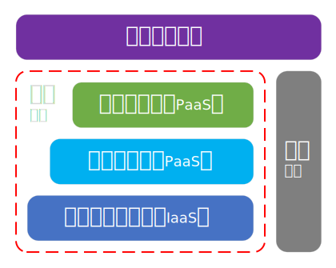
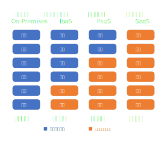
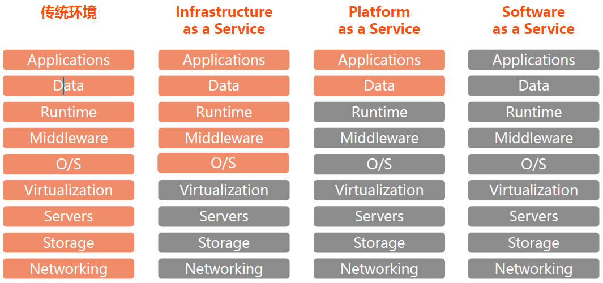

云计算是一种计算模式，其概念最早于 2006 年由 Google 公司提出，具体核心思想是将大量用网络连接的资源进行统一管理，构成一个共享资源池（包含计算设施、存储设备、应用程序等），并以按需支付、弹性扩展的方式向用户提供服务。

本文旨在生动形象地介绍云计算的体系结构，方便大家理解其中的一些抽象概念。

<!--more-->

## 概述

云计算体系结构由 IaaS、PaaS 和 SaaS 三大核心服务以及服务管理构成，并且提供用户访问接口。

IaaS（Infrastructure as a Service）提供硬件基础设施部署服务，为用户按需提供实体或虚拟的计算、存储和网络等资源。

PaaS（Platform as a Service）是一种分布式平台服务，为用户提供一个包括应用设计、应用开发、应用测试及应用托管的完整的计算机平台。

SaaS（Software as a Service）是基于云计算基础平台所开发的应用程序，以软件的形式提供服务。

服务管理层对核心服务层的可用性、可靠性和安全性提供保障。如服务质量保证、安全管理、计费管理等。

用户访问接口实现了云计算服务的泛在访问，通常包括命令行、Web 服务、Web 门户等形式。

------

不过，直接来看这些概念太过于抽象了。下面我们用一个形象的例子，并结合一些我们身边的具体例子来解释这些概念。

## 一个形象的例子：烹饪

假设我们现在想要做饭，可是却一无所有，该怎么办呢？我们可以摆路边摊，就当小推车是厨房，并且装着煤气罐。这样我们就有了做饭的基本条件了。但是所有的这些基本条件和资源都需要我们自己来管理，特别麻烦，而且还不稳定。

有了 IaaS 以后，我们就很像是在经营一家餐馆，需要考虑安装几个灶台、用几口锅才能满足经营需要，而并不需要太关心厨房和煤气还能不能使用的问题——只需要租用或购买一家门店，并且缴纳煤气费就可以使用了。

而有了 PaaS 以后，炒锅、灶台也是现成的——家庭烹饪并不需要饭店那样对烹饪工具特别大的需求，只需要考虑今天吃什么、怎么做就可以了。

那么有了 SaaS 以后，我们就彻底解放了——我们只需要考虑我们今天想吃什么，完全不需要考虑菜是怎么做出来的。

## 云计算服务模式的层次划分

云计算服务模式主要分为网络、存储、服务器、虚拟化、操作系统、中间件、运行环境、数据和应用九层。

如果我们在纯裸机上部署云计算服务，就需要考虑到上述九层。我们需要购买部署服务所需的服务器设备，并且从零开始搭建，这特别像我们一无所有摆路边摊的感觉。

有了 IaaS 以后，诸如 Vmware 的虚拟化服务帮助我们管理底层的网络、存储、服务器等资源，使得我们不再关注底层逻辑，而专注于操作系统之上的环境部署问题。于是，我们只需要找提供商租用我们需要的服务器即可，利用 IaaS 来管理这些服务器资源。

而有了 PaaS 以后，诸如 Docker 的容器技术帮助我们管理操作系统和运行环境，使得我们不再关注应用程序的运行环境，而专注于应用程序本身的开发与部署。于是，我们只需要下载相应的 Docker 镜像，并且根据需要创建相应的容器，即可进入应用程序的开发环境。

那么有了 SaaS 以后，软件的开发、管理、部署完全交给第三方，我们几乎什么都不需要关心了，专注于使用应用程序带给我们的服务。于是，我们只需要通过客户端连接到应用程序的服务端，通过一些命令和请求获取我们想要的服务。

## IaaS

IaaS 其实是云计算服务的最底层，主要提供一些基础资源。

OpenStack 就是目前公认的云计算 IaaS 平台，其管理的核心目标对象是机器（虚拟机或物理机），当然也可以管理存储和网络，但那些也大都是围绕着机器所提供的配套资源。近年来容器技术火了之后，OpenStack 也开始通过各种方式增加对容器的支持，但目前 OpenStack 还不被视为管理容器的主流平台。

## PaaS

PaaS 提供软件部署平台（runtime），抽象掉了硬件和操作系统细节，可以无缝地扩展（scaling）。开发者只需要关注自己的业务逻辑，不需要关注底层。

Docker 是一个开源的应用容器引擎，让开发者可以打包他们的应用以及依赖包到一个可移植的容器中，然后发布到任何流行的 Linux 机器上，也可以实现虚拟化。容器是完全使用沙箱机制，相互之间不会有任何接口（类似 iOS 的 app）。Docker 几乎没有性能开销，可以很容易地在机器和数据中心中运行。最重要的是，它不依赖于任何语言、框架包括系统。

Kubernetes（简称 k8s）是 Google 开源的容器集群管理系统。它构建于 Docker 技术之上，为容器化的应用提供资源调度、部署运行、服务发现、扩容缩容等整一套功能。k8s 本质上可看作是基于容器技术的 Micro-PaaS 平台，即第三代 PaaS 的代表性项目。

再比如，本文依赖的博客框架 hugo 也属于 PaaS。我并不需要关注代码托管平台安装的操作系统和运行环境，我只需要将我的博客框架 hugo 推送上去，然后在远程运行环境下编译即可部署。

## SaaS

SaaS 就是软件的开发、管理、部署都交给第三方，不需要关心技术问题，可以拿来即用。普通用户接触到的互联网服务，几乎都是 SaaS。

以百度网盘为例，我们将文件存储在百度网盘的服务器中。我们并不需要关心百度网盘是如何存储我们的文件的，而且我们使用的百度网盘客户端也不需要实现存储文件的逻辑，只需要将文件和请求发送给百度网盘服务器即可。

再比如 Gmail，我们通过 Gmail 客户端收发电子邮件。我们并不需要关心邮件服务器是如何收发我们的邮件的，而且我们使用的 Gmail 客户端或者浏览器网页也不需要实现收发邮件的功能，只需要将请求发送给 Gmail 服务器即可。