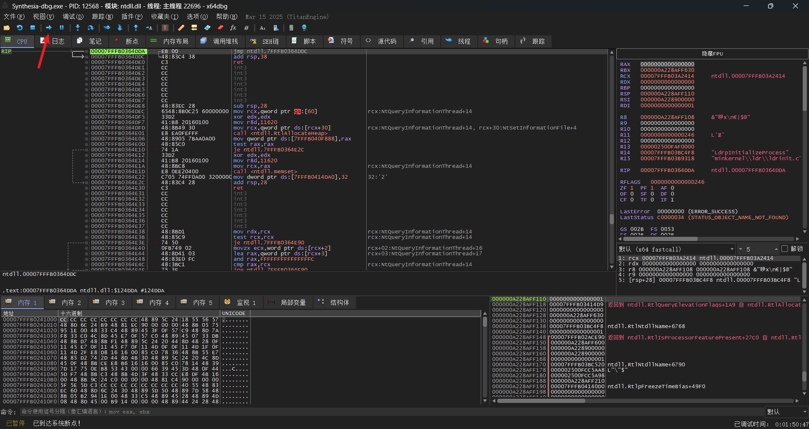
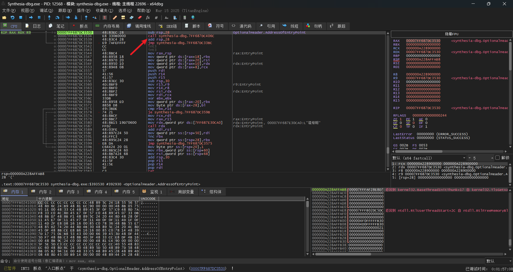
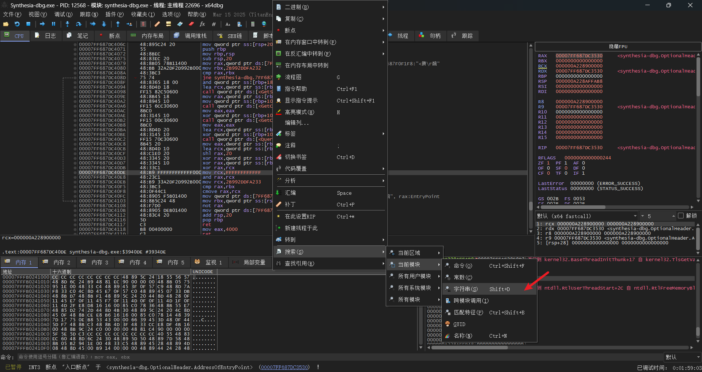
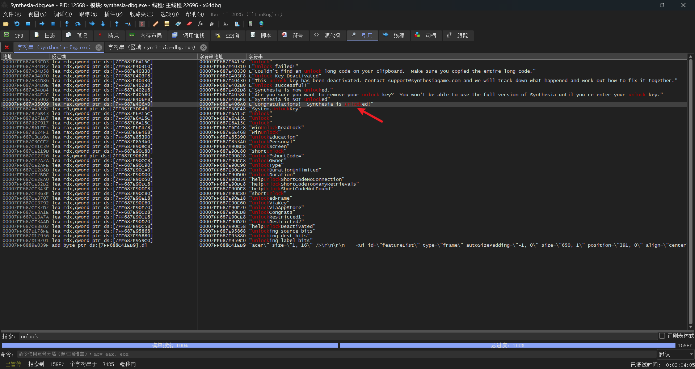
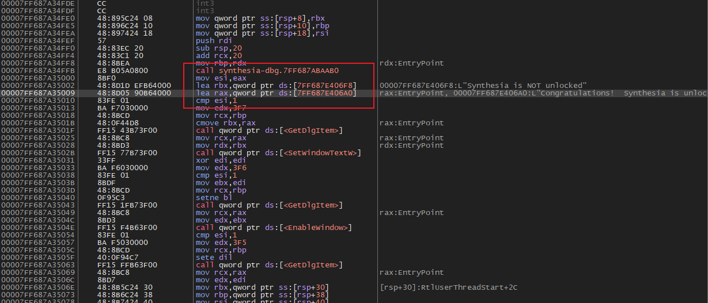
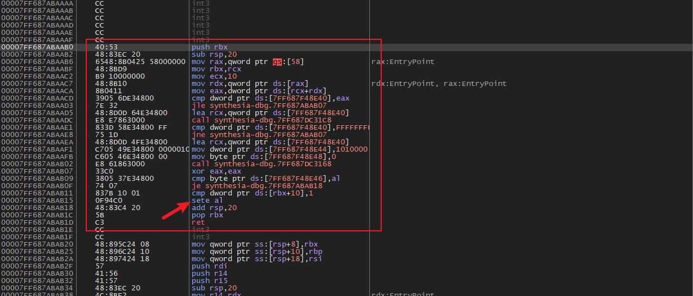
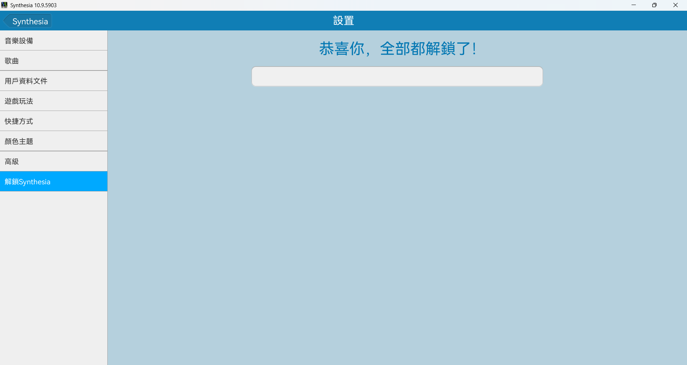

[Synthesia](https://www.synthesiagame.com/)[^1] 是一款钢琴瀑布流可视化程序。通过逆向技术绕开程序的注册判断即可破解[^2]。

<!--more-->

使用 [x64dbg](https://x64dbg.com/) 对源程序文件进行反汇编，一直点击运行直到程序的入口地址。这是因为任何的可执行文件需要装载 Windows 系统的动态链接库，这部分代码不属于程序的内部代码。

找到入口之后可以看到一个子程序调用指令 `call`​，我们点击进入程序的内部代码。

通常程序是否注册都会有提示信息，据此想到通过反汇编代码找到内存中有关 unlock、registered 之类的字符串。x64dbg 提供了检索内存中字符串的功能。

输入“unlock”之后发现内存的确有包含该字符串的内容，我们双击进入到该地址。

注意到这里有一个比较指令 `cmp esi,1`​。在它的前面有两条读内存指令 `lea`​，`rax`​ 和 `rbx`​ 寄存器分别存储指向已注册和未注册的地址。

再往前看的一条指令是 `mov esi,eax`​，然后就是子程序调用了。于是推测子程序将返回值保存在了 `eax`​ 寄存器中。判断程序是否注册的逻辑就是看这个返回值是否为 1，于是破解的思路就是强行将 `esi`​ 或者 `eax`​ 的值置为 1。

不过，如果直接修改 `mov esi,eax`​ 指令为 `mov esi,1`​ 的话，寻址方式从寄存器直接寻址变为立即数寻址了，指令的长度不一样。前者机器码为 `8B F0`​ 为 2 个字节，后者机器码为 `BE 01 00 00 00`​ 为 5 个字节。所以直接修改源文件会影响到后面的指令（主要是跳转指令这种涉及到代码段偏移量的指令）。那么，就需要考虑第二种方案，即进入到子程序中修改返回值。



**寄存器寻址**：指令直接操作寄存器中的数据，源操作数和目标操作数都是寄存器。

**立即数寻址**：指令操作一个立即数，源操作数是寄存器，目标操作数是立即数。寄存器的字长决定了操作数的字长。



子程序的代码不算太长，可以通过 `push`​ 和 `pop`​ 指令轻松判断其地址范围。注意到在退栈返回之前，有一条 `sete al`​ 指令，它的作用是根据零标志 `ZF`​（Zero Flag）的状态来设置 `al`​ 寄存器的值。`al`​ 恰好是 `eax`​ 寄存器的低 8 位，由此可以推测出这条指令是子程序内判断软件是否注册的核心指令。那么，我们只需将这条指令修改为 `mov al,1`​ 即可。

一个好消息是，`al`​ 寄存器只有 8 位，因此其立即数也只有 8 位。其对应的机器码是 `B0 01`​，只有 2 个字节，小于 `sete al`​ 指令的 3 个字节（`0F 94 C0`​）。所以可以直接修改，然后再补上 1 个 `nop`​ 指令（机器码 `90`​），表示不作任何操作。

于是，顺利破解了！

[^1]:版本 10.9。
[^2]:参考[吾爱破解](https://www.52pojie.cn/thread-1092695-1-1.html)。
