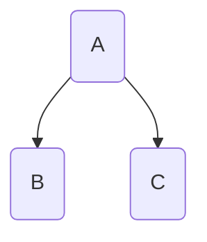
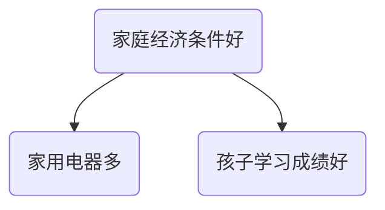
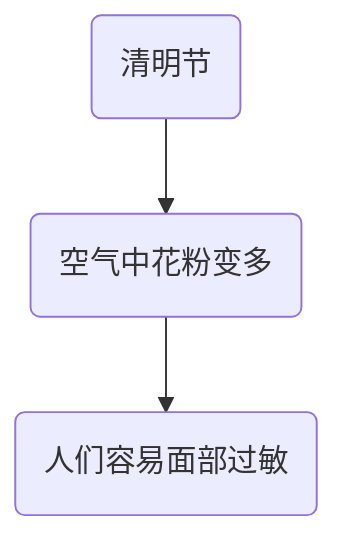
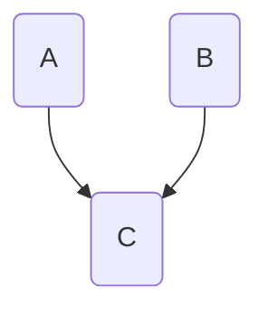
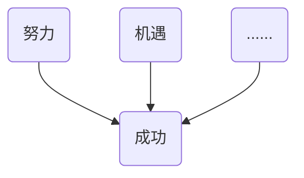

女性学历高会导致不生孩子？复旦大学社会学系副教授[沈奕斐](https://ssdpp.fudan.edu.cn/84/c0/c21318a230592/page.htm)认为这是一个非常荒谬的结论。

本文结合[视频](https://www.bilibili.com/video/BV1iS4y127qU)中的这个具体例子，系统梳理社会科学中相关性、因果性的概念。

<!--more-->

## 引例

> 职业期望越高，生育与就业的冲突越大，生育孩子的成本也越高。因此，具有较高文化程度的女性倾向于少生孩子。数据显示，受过高等教育的女性中，生育一孩居多，接近70%；高中文化程度者生育一孩和两孩的占比相当，都在47%左右；小学及以下、初中文化程度者以生育两个及以上孩子居多，占比分别为63.42%和59.21%。在未生育的女性中，高学历者所占比重也超过了一半。可见，随着女性受教育程度的提高，会导致少生和不生。

沈老师指出，在社会科学里，这些描述被称为是事实性描述。沈老师认为这些经过调查得到的客观数据本身没有问题，但是观点存在问题。这个观点是：

> 女性受教育程度的提高会导致少生或不生。

这个结论错就错在“导致”一词，它使得女学历提高和少生或不生孩子之间存在因果关系。在社会科学中，要证明存在因果关系，必须首先要证明它们之间是否存在相关性。

## 相关性

设有两个变量A和B，若A变了B也变，那么能不能证明A和B之间具有相关性？答案是否定的。

下面这个简单的例子就足以作为反例。数据显示，清明节人们面部过敏的比例占70%，而其他节日例如中秋节、端午节等则只占47%。于是得出结论，清明节会导致面部过敏，所以面部容易过敏的人尽量不要过清明节。很显然，这是一个十分荒谬的结论。

可为什么客观事实是，清明节的时候人们的的确确容易面部过敏？这是因为我们所关注的变量（节日，或进一步讲是时间）仅仅只是影响的一部分因素。我们之所以会错误地认定某种相关性，是因为我们只关注了一部分数据，这样很可能我们会看到实际上并不存在的相关性。

根据我们所掌握的科学知识，一般认为人们面部过敏和春天植物花粉在空气中的传播有关。也就是说，目前的主流观点认为植物花粉容易导致人们面部过敏，只不过由于植物授粉多发于春季（也就是清明节前后），所以上面的数据好像让我们误以为清明节容易导致人们面部过敏。而至于植物花粉容易导致人们面部过敏的结论是否成立，这个就隶属于自然科学的范畴了。

接下来我们看相关性在数学上的定义。若一个变量发生的变化与另一个变量发生的变化是随时间同步关联的，则称这两个变量**相关**。这些相关性满足时间协变的普遍性原则。也就是说，两个变量的取值在时序上一一对应，可以在平面直角坐标系中绘制出散点图。

不过，仅仅只是相关性还不够，要证明两个变量具有因果性在社会科学里也是十分复杂的。

## 因果性

在社会科学中，要证明两个变量之间具有因果性，需要测量数据、建模、控制变量等等一系列过程才能够证明。而在因果关系中，人们其实还特别容易犯如下三种错误。

### 共变虚假因果

如图所示，B和C都是同一个原因A所产生的不同结果。下面我们来看一个具体的例子：

假设现在有调查数据显示，家用电器越多的家庭孩子学习成绩往往更好，是不是可以得出结论：为了孩子学习成绩更好应该多买家用电器。很显然这是一个十分荒谬的结论。我们再回到上图就会发现，其实它们都是家庭经济条件好的两个结果，但却被我们误以为家用电器多是因而孩子学习成绩好是果。此时，我们称B和C是**共变虚假因果**。

### 中介虚假因果

如图所示，A不是导致C的直接原因，而是A先导致B，然后再通过B导致C。比如刚才的清明节人们容易面部过敏的例子：

上图已经十分显而易见了。如果在南半球，同样是清明节这个日子，实际上就会发现清明节和人们容易面部过敏就没有因果关系了。

### 多因虚假因果

如图所示，A是导致C的原因之一，但是仅仅只有A是不够的，必须A和B同时满足才能导致C。下面来看一个具体的例子：

如图所示，有多个因素同时满足时才能成功。有的时候我们只能看到其中的一个或个别因素，而看不到全部的因素。

## 总结

回到开始的话题，为什么说女性学历越高越不愿意生孩子这个结论是荒谬的？因为这个结论本身很可能是上述三种虚假因果关系的杂糅。