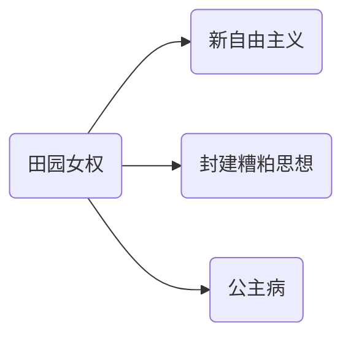

目前的中国社会，男女两性的性别矛盾在网络上日益突出。但是，作为无产阶级的我们必须要明白，当今社会种种矛盾背后的根源到底是什么？难道真的只是性别矛盾本身吗？如果我们把握不住基本矛盾，抓不住主要矛盾，就很容易陷入到纯粹的男女两性性别对立的陷阱之中，这完全就是上了资产阶级的当——不仅解决不了问题，还会导致无产阶级的内斗。

资产阶级控制大众舆论，制造和煽动男女两性对立的言论。所谓的“女权”、“女性独立”、“小仙女”、“直男”等词语被资本异化，消费主义的错误思潮正在广大青年当中蔓延。网络短视频“毒鸡汤”横行，严重侵蚀当代年轻人的思想和价值观，危害社会和谐稳定。因此，笔者认为有必要撰写此文，在马克思主义的指导下，系统论述关于男女两性解放的问题。

男女两性的性别矛盾的问题由来已久，因此我们必须要从人类社会历史当中进行探究。本文首先从阶级产生以前的各类原始社会开始，探究男女两性的矛盾从何而来。接下来，本文继续探究阶级产生以后的各个社会形态，挖掘男女两性矛盾的根源与私有制和父权制的关系。紧接着，本文介绍了国际社会主义运动中的妇女解放运动，分析无产阶级的阶级斗争和妇女解放斗争之间密不可分的关系。

在总结完人类社会历史后，本文还将深入分析当下的中国社会存在的男女两性矛盾对立的表现和根源，勾勒共产主义社会中男女两性关系的宏伟蓝图。最后，本文指出，男女两性要想实现真正的、彻底的解放，必须消灭私有制、父权制。男女两性的解放是全人类解放的一部分，也是实现共产主义的必然要求。

<!--more-->

------

## 在开始之前的小调查

下面的观点，你是否认同呢？

- 男人都是理性的，女人都是感性的。不要想着让男人变得感性，让女人变得理性。
- 女孩子学不好理工科，理工科是男孩子的天下。
- 不要跟女朋友讲道理，不要跟老婆讲道理，只要哄哄就好了。

如果你都认同，那么这篇文章将对你进行深刻的批判。但批判不是彻底决裂、划清界限，而是为了**治病救人**。如果只是为了批判而批判，显示自己对于马克思主义认识的优越感，是不符合马克思主义精神的，也就是毛主席讲的“团结-批评-团结”的方针。

那么，我们是这样来解读上述观点的：

女性没有理性思维，是社会对于女性的偏见。理性认识是感性认识的高级阶段，也就是说理性认识必然要经历感性认识这个过程。粗略地认为男人理性，女人感性，其实是将男尊女卑的思想演绎得淋漓尽致。同理，很多家长认为女孩子学不好理工科也是有这种歧视性的观念。难道女孩子真的学不好理工科吗？

同理，当女朋友或者老婆生气的时候，只要一句“我错了”，然后各种甜言蜜语哄一哄——这充分展示了大男子主义对女性的偏见和鄙夷（认为她们是不可理喻的），以高高在上的施舍姿态、用自己的大度气量反衬出女性的狭隘无礼。殊不知，很多女性竟然认为这才是男朋友或者老公爱自己的表现，其实是自己把自己放在了一个低姿态的位置上。而且，这种毫无价值的、低成本的哄并不能解决任何实际问题。

实际上，根据马克思主义基本原理，**社会存在决定社会意识**。也就是说，我们的意识、我们的思维方式是由我们所处的人类社会决定的。更进一步讲，社会存在的根本是生产力和生产关系，它们共同构成了一个社会的经济基础，决定着整个社会的上层建筑，我们的意识、思维方式就受其影响。只不过，我们的意识、我们的思维方式既具有超前性，也具有滞后性，并不会时时刻刻和当前的社会存在完全匹配。上述的这些观念其实都体现出了社会意识的**滞后性**，即今天的很多人都是为旧社会对女性的歧视、偏见、剥削所影响。

因此，下面我们首先回到过去，总结我国历史上男女两性在不同社会形态下的社会地位，分析其产生的原因。并且，我们最终还将得出结论：只有社会存在发生质变，才能从真正意义上消除社会对女性的歧视、偏见、剥削，实现男女两性的解放。

## 阶级产生以前男女两性的关系

马克思主义认为，在私有制产生以前的原始社会，不存在剥削和被剥削的两大对立阶级。这个时期的男女两性存在一定程度的分工上的差异，但并未产生出人对人的剥削。

马克思主义认为两性分工是自然发生的，并且是人类的第一个分工。但是分工本身包含着**矛盾**，它使**物质活动和精神活动**、**享受和劳动**、**生产和消费**相分离。

实际上，分工和所有制是一回事，一是就活动而言，一是就活动的产品而言。分工是以家庭中自然产生的分工和社会分裂为单独的互相对立的家庭为基础。与分工同时发生的是分配的不平等，因而产生了所有制。

最初的分工是男女之间为了生育子女而发生的分工，应当肯定原始共产主义社会的分工就是基于这种两性之间的天然分工。男子外出工作，妇女在家中工作，他们各自是自己活动领域中的主人：男子是森林中的主人，女人是家内的主人。在原始共产主义家庭经济中，实行母权统治。人类还处在知母不知父的阶段。

### 早期原始族群 旧石器时代

人类在原始社会早期过着以采集渔猎为主的生产生活方式，女性以采集业为主，男性以渔猎业为主。在原始社会生产力水平低下的条件下，生产和生活资料是平均分配的。换而言之，不存在人剥削人的情况。

当时的原始人类过着流动性很强的生活，没有稳定的居所，也没有形成一定规模的人类社会，仅仅只能称之为原始族群。因此，男女两性关系不是早期原始社会的核心，原始人类也没有像我们今天这样的性别意识（例如他们没有遮掩自己性器官和意识）。

男女两性关系在旧石器时代的几百万年里，比在阶级产生后的社会要平等得多。那时候男女两性的性关系更接近于完全自然状态下的性关系，因为需要繁衍后代才能生存。

最初的分工是男女之间为了生育子女而发生的分工，早期原始社会的分工就是基于这种两性之间的天然分工。男子外出工作，妇女在家中工作，他们各自是自己活动领域中的主人：男子是森林中的主人，女人是家内的主人。

### 母系氏族社会

母系氏族社会约产生于考古学意义上的旧石器时代晚期，其产生的根源一方面在于原始人类部落的稳定性不断提高（群居、定居），另一方面在于男性对女性生育价值的崇拜。母系氏族社会始终以母系为血缘关系为纽带，人们只知其母，不知其父。今天中国的很多姓氏带有“女”字旁，恰恰说明了上述观点。

从历史唯物主义的角度来看，母系氏族社会产生的根本原因，毫无疑问是当时的社会生产力发展的必然结果。具体地说，在没有刀耕火种的原始部落，狩猎和采集是人们唯一获取食物的方式。况且，食物（如生肉等）难以保鲜，所以原始共产主义的平均分配方式是当时低下的生产力条件下不得以而为之的。即使部分男性偶尔运气好满载而归（有劳动剩余），他们也更愿意将食物分享给与他们血缘关系最近的人。而对于原始人来说，人们只知其母，不知其父。为了能够使得原始部落的每个人都能分到食物生存下去，人类社会就自发形成了以母系为血缘关系纽带的部落，这就使得原始共产主义的平均分配方式可以惠及每一个人。

母系氏族社会的两性关系主要经历了**群婚制**[^1]和**对偶制**[^2]两大阶段。群婚制是指原始社会中一定范围的一群男子与一群女子互为夫妻的婚姻形式，换而言之就是一个原始部落内部不受任何约束的两性杂交。而对偶制则是不同氏族的成年男女双方，在或长或短的时间内实行由一男一女组成配偶，以女性为中心，婚姻关系不稳固的一种婚姻形式。不论是群婚制还是对偶制，都以氏族为单位（前者在氏族内部，后者在氏族之间）。

从群婚制到对偶制的演变反映了母系氏族社会的变革。最初母系氏族社会是由早期原始社会转变而来，因此两性关系更接近完全自然状态下不受约束的两性关系。这种群婚制保证了原始部落的凝聚力。然而，随着原始人类的生活相对稳定，杂乱无章的性关系也导致了许多问题，特别是近亲的后代为自然选择所淘汰。于是，不同族群之间的对偶婚姻开始出现，并且在母系氏族社会鼎盛时期达到顶峰。不过，不论是群婚制还是对偶制，在母系氏族社会都存在了相当长的一个历史时期。

经历这两大阶段以后，人类社会从完全原始状态下的野蛮发展到相对稳定、群居的生活方式。女性的社会地位在母系氏族原始社会中显然有所提高，我们所熟知的“女娲造人”、“嫦娥登月”等神话故事都反映出这一点。虽然母系氏族社会主要从母系，但分配方式仍然是原始共产主义的平均分配。

### 新石器时代 农耕文明雏形

新时代大约产生于距今一万年前，此时中国正值母系氏族原始社会晚期。考古学意义上划分的新时期时代产生了大量磨制工具，这极大地促进了生产力的发展。磨制石器相较于打制石器而言的最大优点就是，它可以根据人类的生产需要磨制成不同的形状，例如斧、凿、镰、犁等，这极大地推动了农业和手工业的发展。

新石器时代生产力的发展，直接推动了农耕文明在我国的诞生。定居的原始人类不再需要从自然环境中获取食物，他们一方面掌握了农作物生长的一些规律，另一方面磨制石器方便了农业生产。这样，人类就从直接从自然界获取食物逐步过渡到自主生产食物。另外，我国中原当时的地理条件为农业的发展提供了得天独厚的条件。多重因素共同奠定了我国农耕文明的雏形。

马克思主义认为，**生产力决定生产关系**。因此，生产关系开始发生微妙的变化，最直接的变化就是男女两性关系。体力充沛且强壮的男性在生产过程中所起的作用和所处的地位越来越大，社会中心自然发生偏移。因此，母系氏族社会过渡到父系氏族社会，是生产力发展的必然结果。

### 父系氏族社会 私有制雏形

随着生产力的发展，特别是农耕文明解决原始人类的食物危机问题之后，原始部落的规模不断壮大。各个部落都占有一定空间的土地以供种植粮食，在这种情况下，部落之间很有可能会因为耕地与生存而发生冲突甚至战争。而结果一定是残酷的丛林法则，战败的部落会彻底绝种——因为各个母系氏族部落之间不存在血缘关系，也没有足够的食物供战败部落的人类生存，只能将它们彻底灭绝。而部落之间的战争需要广泛地依靠（男性）人力，显然母系氏族社会的不适应这种人口规模扩大的客观发展需要。

因此，父系氏族社会的诞生绝非偶然。同样的情况，父系氏族部落可以接纳战败部落的女性俘虏，让她们成为本部落劳动力再生产的工具。于是，父系氏族部落的人口通过不断的部落战争和兼并，以滚雪球的方式蓬勃发展。母系氏族社会的生产关系相较于父系氏族社会已经不再适应生产力发展的客观需要，所以在历史的长河中逐渐为父系氏族社会取代。

父系氏族社会大约产生于距今 5500 年到 4000 年前，这一时期正值华夏文明的传说时代。不论是三皇五帝，还是唐尧虞舜，都是当时中原地区的部落首领，他们都是男性。“盘古开天辟地”、“大禹治水”、“夸父逐日”等故事也都是在歌颂男性。并且，“大禹治水”和“夸父逐日”这两个神话故事还反映出了古代劳动人民同自然灾害斗争的精神，这从客观上反映了农耕文明对农业发展的必然要求（防治旱涝灾害）。



时至今日，这种众志成城的斗争精神仍为我们广为传颂，根植于每一位华夏儿女的血脉中。例如，1998 年特大洪水抗洪救灾、2008 年汶川大地震抗震救灾等。



这一时期，男女两性的社会地位开始发生根本性转变。男性凭借着强壮的身体和充沛的体力，在农业生产劳动中逐渐取得并掌握着生产和生活资料的支配权（财产权），社会地位超越女性。与此同时，子女开始成为父亲财产的继承者，人们开始知其父而不知其母。我国黄河下游的大汶口文化[^3]、山东的龙山文化[^4]、黄河上游的齐家文化[^5]、长江下游的良渚文化[^6]等均属于父系氏族社会文化的代表。

随着社会生产力的发展，劳动成果开始有所剩余，占有生产资料的男性开始占有他人的劳动成果，并利用这些劳动成果再去奴役他人。这就是最初的私有制萌芽，贫富悬殊开始显现，氏族社会开始走向瓦解，阶级社会开始出现。父权制也是私有制的必然产物，其本质就是男性对生产生活资料的支配权，女性必须依附和服从男性接受男性对生产生活资料的支配。

父系氏族社会的两性关系则完全不同于母系氏族社会，出现了专偶制[^7]。父系专偶婚亦即一夫一妻制婚姻，在父系氏族间非血缘关系的族外婚基础上，一对不同族属的男女，通过社会、政治的媒介，建立了带独占同居性质的牢固持久的婚姻关系。这种婚姻的本质是，在父权制的基础下，将女性的生育价值物化，使女性沦为受到男性支配的生产生活资料，保证财产继承权绝对由男性掌握，延续父系氏族的生存和繁衍。男性在婚姻中始终处于支配地位，而女性则处在从属地位。

父系氏族社会出现的私有制、父权制、专偶制，使得原始社会的生产生活单位开始逐渐从部落向**家庭**过渡，社会组织形式也由氏族向**国家**过渡。由于专偶制的存在，男女两性关系因婚姻而被牢牢束缚，父权制将女性变成了家庭中的奴隶。随着这种生产关系的不断巩固与发展，从原始氏族社会过渡到阶级社会成为必然。

### 本章小结

原始社会当中男女两性的社会地位是不断变化的，从最初分工明确、相对平等的关系，到以女性为中心的关系，再到以男性为中心的关系。不过，即使存在一些关系的不平等，但是并不存在剥削阶级。并且，不论是母系氏族社会还是父系氏族社会，都是适应当时生产力的发展的，都能够在一定程度上满足人类生存繁衍的需要。但归根结底，都与生产力的发展密切相关，非常好地证明了**生产力决定生产关系**这一马克思主义基本原理。

真正的阶级社会必然伴随着私有制的产生。父系氏族社会时期已经有了私有制萌芽，并且还出现了父权制、专偶制，女性的社会地位开始下降。在此基础上，产生了以血缘关系为纽带的生产生活单位——**家庭**。

作为以男女两性关系为基础的、直接的生产生活单位，家庭的概念在父系氏族社会才基本形成，并延续至今。早期原始部落、母系氏族社会虽然都有血缘关系，但却没有形成严格意义上的家庭，是因为母系氏族社会和父系氏族社会在**血缘关系**和**社会财富**方面的关系不一样：

- 在母系氏族社会中，是**血缘关系决定社会财富**。因此，最终形成的生产生活单位是**部落**。
- 在父系氏族社会中，是**社会财富决定血缘关系**。因此，最终形成的生产生活单位是**家庭**。

无产阶级伟大导师恩格斯考察了各个历史时代及其不同发展阶段家庭形式的历史变迁，在《家庭、私有制和国家的起源》一文中认为家庭作为经济细胞和社会生活的组织形式之一，不是从来就有的，它的产生存在和发展受一定的社会经济关系的制约。他指出：

> 根据唯物主义观点，历史中的决定性因素，归根到底是直接生活的生产与再生产。但是，生产本身又有两种。一方面是**生活资料**即食物、衣服、住房以及为此所必需的工具的生产；另一方面是**人自身**的生产，即种的繁衍。一定历史时代和一定地区的人们生活于其下的社会制度，受着两种生产的制约；一方面受**劳动**的发展阶段的制约，另一方面受**家庭**的发展阶段的制约。劳动越不发展，劳动产品的数量，从而社会的财富越受限制，社会制度就越在较大程度上受血族关系的支配。

他还指出：

> 然而，在以血族关系为基础的这种社会结构中，劳动生产率日益发展起来；与此同时，私有制和交换、财产差别、使用他人劳动力的可能性，从而阶级对立的基础等等新的社会成分，也日益发展起来；这些新的社会成分在几个世代中竭力使旧的社会制度适应新的条件，直到两者的不相容性最后导致一个彻底的变革为止。以血族团体为基础的旧社会，由于新形成的各社会阶级的冲突而被炸毁；代之而起的是组成为国家的新社会，而国家的基层单位已经不是血族团体，而是地区团体了。在这种社会中，家庭制度完全受所有制的支配，阶级对立和阶级斗争从此自由开展起来，这种阶级对立和阶级斗争构成了直到今日的全部成文史的内容。

## 阶级产生以后男女两性的关系

马克思主义认为，**在私有制产生以后，人类便进入了阶级社会**，存在两大根本对立的阶级，即剥削阶级和被剥削阶级。男女两性的关系也随着私有制的产生而变得不平等，出现了**父权制**。

### 奴隶社会

随着生产力水平的提高，人类进入第一次社会大分工，生产的产品有所剩余，产品交换随之产生。社会开始出现贫富的分化，产生零散的奴隶主和奴隶。第二次社会大分工后，社会贫富分化加剧，私有制诞生，自此人类正式进入阶级社会。

奴隶社会的男女两性关系延续了过去父系氏族原始社会的男女两性关系。实际上在我国的西周时期，“姬”姓和“姜”姓位列全国第一、第二大姓，这是周王朝实行分封制[^8]的客观结果，当然也可以认为统治阶级仍保留了母系氏族社会的痕迹。从《诗经》当中许多描写男女爱情的诗文中，我们可以看到作为被统治阶级的底层劳动人民受到剥削的真实写照。即使在受到剥削的情况下，诗文处处流露出男女两性的真挚情感，也反映出男女两性对爱情的忠贞不渝。



**《诗经》反映出的先秦时代的男女两性关系**

在西周初至春秋中叶这一历史时期，奴隶制度逐渐解体，而封建制度还仅处于萌芽阶段，尚未建立，因此，这一时期对两性的限制还不严厉，两性关系比较自由。《诗经》中也包含大量描写爱情婚姻的诗作，它们的内容主要包括恋爱、相思、结婚甚至于离婚，主要集中在《国风》之中。从这些爱情婚姻诗作中，我们可以看出，这一时代男女之间的爱情是比较开放、自由的，其情感大都直率真挚、热烈健康，当然也不乏委婉含蓄、缠绵感人。例如：

{}

关关雎鸠，在河之洲。窈窕淑女，君子好逑。

参差荇菜，左右流之。窈窕淑女，寤寐求之。

求之不得，寤寐思服。悠哉悠哉，辗转反侧。

参差荇菜，左右采之。窈窕淑女，琴瑟友之。

参差荇菜，左右芼之。窈窕淑女，钟鼓乐之。

{}

{}

投我以木瓜，报之以琼琚。匪报也，永以为好也！

投我以木桃，报之以琼瑶。匪报也，永以为好也！

投我以木李，报之以琼玖。匪报也，永以为好也！

{}

{}

溱与洧，方涣涣兮。士与女，方秉蕑兮。女曰观乎？士曰既且，且往观乎！洧之外，洵訏且乐。维士与女，伊其相谑，赠之以勺药。

溱与洧，浏其清矣。士与女，殷其盈矣。女曰观乎？士曰既且，且往观乎！洧之外，洵訏且乐。维士与女，伊其将谑，赠之以勺药。

{}

{}

彼采葛兮，一日不见，如三月兮！

彼采萧兮，一日不见，如三秋兮！

彼采艾兮，一日不见，如三岁兮！

{}

{}

伯兮朅兮，邦之桀兮。伯也执殳，为王前驱。

自伯之东，首如飞蓬。岂无膏沐，谁适为容？

其雨其雨，杲杲出日。愿言思伯，甘心首疾。

焉得谖草，言树之背。愿言思伯，使我心痗。

{}

{}

氓之蚩蚩，抱布贸丝。匪来贸丝，来即我谋。送子涉淇，至于顿丘。匪我愆期，子无良媒。将子无怒，秋以为期。

乘彼垝垣，以望复关。不见复关，泣涕涟涟。既见复关，载笑载言。尔卜尔筮，体无咎言。以尔车来，以我贿迁。

桑之未落，其叶沃若。于嗟鸠兮，无食桑葚！于嗟女兮，无与士耽！士之耽兮，犹可说也。女之耽兮，不可说也。

桑之落矣，其黄而陨。自我徂尔，三岁食贫。淇水汤汤，渐车帷裳。女也不爽，士贰其行。士也罔极，二三其德。

三岁为妇，靡室劳矣。夙兴夜寐，靡有朝矣。言既遂矣，至于暴矣。兄弟不知，咥其笑矣。静言思之，躬自悼矣。

及尔偕老，老使我怨。淇则有岸，隰则有泮。总角之宴，言笑晏晏。信誓旦旦，不思其反。反是不思，亦已焉哉！

{}

{}

蒹葭苍苍，白露为霜。所谓伊人，在水一方。溯洄从之，道阻且长。溯游从之，宛在水中央。

蒹葭萋萋，白露未晞。所谓伊人，在水之湄。溯洄从之，道阻且跻。溯游从之，宛在水中坻。

蒹葭采采，白露未已。所谓伊人，在水之涘。溯洄从之，道阻且右。溯游从之，宛在水中沚。

{}

{}

汎彼柏舟，亦汎其流。耿耿不寐，如有隐忧。微我无酒，以敖以游。

我心匪鉴，不可以茹。亦有兄弟，不可以据。薄言往愬，逢彼之怒。

我心匪石，不可转也。我心匪席，不可卷也。威仪棣棣，不可选也。

忧心悄悄，愠于群小。觏闵既多，受侮不少。静言思之，寤辟有摽。

日居月诸，胡迭而微？心之忧矣，如匪澣衣。静言思之，不能奋飞。

{}



据相关研究显示[^21]，商代的男女两性关系中，统治阶级主要依靠婚姻。《说文解字》中说：

> 婚，妇家也；姻，婿家也。

这里的意思是，婚指的是女方家族，姻指的是男方家族。也就是说，商朝统治阶级的婚姻是两个宗族的权力整合。

现代我们常用的“娶”字其实在商朝的甲骨文中是写作“取”字的。只不过，由于“取”这个字需要表示的意思有很多，所以通过形声造字法，给“取”加一个偏旁“女”，专门用来表示娶女子为妻的意思。但不论如何，女性被放在婚姻关系中的客体的位置，这一点足以证明婚姻一经诞生就是一个&#8203;**经济制度**&#8203;，而不是爱情的反映。

那么对于被统治阶级而言呢？考古研究表明，殷墟出土的住房基址中，很多房间非常小，只能容纳一个人。而且，鲜有两人下葬的地方。这说明了，商朝的被统治阶级中几乎不存在家庭和婚姻，都过着独居的生活。那么，他们如何繁衍后代呢？答案就是原始社会中的群婚制[^1]。这一点可以从《周礼》中得到证明：

> 中春之月，令会男女，于是时也。令者不禁。

这其实和自然界的动物很类似，到了合适的时节，允许男女自由交配。于是有理由推测，商代的被统治阶级中是普遍存在非婚生育的现象的。爱情恰恰就是起源于男女两性关系中最简单朴素的地方，这也正是《诗经》当中描绘的很多男女情愫的场景，它反映出同为被统治阶级的男女两性追求爱情的愿望。



**关于夏商周是否为奴隶社会的争论**

无产阶级伟大导师马克思对人类社会形态的分类是基于西欧的，对于中国的情况，他没有做过细致的调查研究。而中国社会历史的发展显然是异于西欧的。实际上，马克思自己也提出了亚细亚的生产方式，将他不熟悉的社会情况剥离出他当时得到的结论的范畴。由此，足以见得马克思做研究之严谨。

我们目前所熟知的五阶段论，即原始社会、奴隶社会、封建社会、资本主义社会、共产主义社会，是斯大林明确指出的。这一说法被我国政治教科书采用，一直沿用至今。在社会主义建设时期，特别是“文化大革命”时期，涉及到社会意识形态的研究，往往需要为政治服务。郭沫若等著名学者通过一系列史料来论证夏商周是奴隶社会，就是其中一个典型的例子。

不过，目前有很多学者反对这个结论，他们基于历史唯物主义的观点和本着实事求是的原则，认为中国历史的实际情况不完全符合马克思的理论。他们批判郭沫若观点的主要理由是，不能通过证明夏商周存在奴隶，就证明夏商周是奴隶社会。因为按照马克思主义的基本观点，阶级社会的本质是**统治阶级无偿占有被统治阶级的剩余劳动**，也就是说划分社会形态的根本因素在于**经济**。他们认为，目前尚且无法证明夏商周的奴隶是社会生产的主体——反而是广大劳动的农民是社会生产的主体。

不过，这不是本文需要讨论的问题，也不是本文关心的问题。本文也是以马克思主义为指导，基于历史唯物主义的视角进行论证的。本文暂且按照马克思主义的五阶段论，对我国的社会形态进行划分。特此说明。



### 封建社会

随着铁犁牛耕的出现，农业生产力进一步提高，开始出现剩余。地主阶级登上历史舞台，我国进入了封建社会，以秦灭六国建立秦王朝为标志。

由于土地是封建社会最重要，也是最根本的生产资料，中国进入以农业为根本的封建社会之后，男性的社会地位是显著提高的。一方面，男性作为农业社会的最大劳动力参与农业生产；另一方面，男性握有以土地为主的家庭财产的所有权。于是，家庭的资源更多地向男性倾斜，重男轻女等思想就源于此。同时，男性家庭地位的提高也伴随着女性家庭地位的下降，但这种变化也仅仅主要体现在家庭当中。

实际上，在我国的历史上，不论何种阶级社会，男性在家庭中都处于**支配地位**。我们耳熟能详的“男主外，女主内”的说法就是中华民族几千年来在家庭生活中实践出来的模式，这也是中华民族自给自足的小农经济的必然产物。

不过，我们必须要肯定的是，男性在家庭处于支配地位对于家庭的稳定是有重要意义的。一方面，男性在农业社会中是最基础的劳动力，创造了大量的社会财富；另一方面，以男性为中心的家庭模式更有利于以小农经济为主的家庭的稳定。不论是父权还是夫权，都是以自给自足的自然经济为主的家庭中的必然产物。

究其原因，是因为男性本身在体力方面更占优势，主要承担了农业生产的责任。体力劳动使得男性掌握了生产资料（土地）的所有权和支配权，这构成了一个家庭的经济基础。而我们知道经济基础决定上层建筑，所以我们看到无论是重男轻女还是相夫教子，本质上都是为了保证农业社会的家庭稳定性的思想手段。这从一定程度上促进了家庭的稳定和发展，但也从一定程度上造成了男女两性的不平等，特别是导致了女性长期受剥削、压迫的地位。换而言之，家庭的稳定和发展必然伴随着男性从女性身上**获取、占有剩余**。

不过，女性的社会地位并未因此根本性地下降，甚至在某些历史时期反而也有一定的社会地位。从生产关系和生产力的角度看，秦汉王朝覆灭后，中国进入了魏晋南北朝时期，五胡乱华，战乱不断。处于被统治阶级的平民男性需要服徭役，客观上使得呆在家庭中的女性不得不直接参与农业生产，从事繁重的体力劳动。换而言之，是劳动使得当时的女性地位有了提高，这与马克思主义的论断是基本一致的。那个时代，也有很多像花木兰代父从军这样家喻户晓的故事。

中国封建社会历史上女性社会地位显著下降的时期大约始于宋朝，并且从此以后对女性的剥削是不断加强的。其中的直接原因有一种说法是唐代的武周则天皇帝，本身是女性的她触动了男权社会统治阶级的利益。统治阶级为了削弱女性的社会地位，防止再有类似武则天的人掌权，一些士大夫企图对儒家思想进行全面修正——于是出现了**宋明理学**，（从西方哲学的角度看）这是一种客观唯心主义的世界观。朱熹是宋明理学的代表人物之一，他的理学思想影响很大，成为元、明、清三朝的官方哲学。

“女子无才便是德”、“三纲五常”、“三从四德”、“饿死事小，失节事大”等等封建道德礼教就是源于宋明理学，其本质就是统治阶级利用儒家思想压迫、剥削、奴役女性的工具。今天我们很多人（特别是长辈）仍然深受这种思想的影响。从汉字的造字我们也能够看到，我国进入阶级社会以后女性地位的下降。《说文解字》中的古汉语造字部首从“女”的相当多的汉字都具有贬义，例如“奸”、“婪”、“倭”等。而与之形成鲜明对比的是，在西周时期，“姬”姓和“姜”姓因统治阶级的氏族而成为全国的大姓。“姬”、“姜”二字在当时，且直到今天都依然作为姓氏使用，没有发生贬义化，充分地说明了我国上古时期的女性地位远没有封建社会这般低下。

实际上，上述也仅仅只是直接原因而已，并且也不符合历史唯物主义。究其根本，是因为统治阶级剥削女性可以从中获取剩余。在封建社会中，这种剩余就是男性劳动力。而要想产生源源不断的男性劳动力，特别是血统纯正的男性劳动力，就必须给女性以道德约束，加强对女性的剥削。统治阶级为了保证剥削女性的合法性，要求女性“从一而终”，但男性却可以妻妾满堂。类似地，过去的彩礼制度实际上是男方家庭向女方家庭支付聘礼，以换取女性的生育能力和劳动力。实际上，一旦女性嫁入男方家庭后，其家庭地位往往取决于陪嫁的嫁妆，但归根结底是低下的，受剥削的。男方家庭可以从女性身上提取近乎无穷的剩余，因为女性本身没有婚姻、家庭的自由。我们今天许多物化女性的思想就受此影响。

封建社会对女性的剥削在明清时期达到顶峰。明清时期中国社会大体稳定，没有像魏晋南北朝时期那样长期的战乱，于是地主阶级加强了对女性的剥削。众所周知的“裹小脚”缠足陋习就是最典型的例子，本质上是统治阶级对美的定义，强化了男尊女卑的思想。

著名宫斗剧《甄嬛传》中的华妃凭借自己深受雍正皇帝宠爱，在后宫骄横跋扈，但最终的结局却十分凄惨——被皇上赐死。（虽然电视剧和小说是杜撰的，但是它们是有历史原型的，从一定程度上能够反映历史。）表面上看华妃在后宫有很大的权力，但不过只是统治阶级的附庸——雍正皇帝害怕皇子有年氏血统。华妃自以为自己深爱皇上，但也只不过是政治关系而已，最后也是命不由己。

历史上像华妃这样的女性有很多，今天很多女性的思维方式也从一定程度上受此影响。由于长期处于统治阶级地位的几乎是男性，女性不得不依附男性、迎合男性，以实现自己的价值。在长期的剥削和压迫之下，女性逐渐将这些内化，陷入女性内部、被统治阶级内部的内耗之中。历史上的宫女之间存在互相争宠、权力斗争是必然的，这其实与今天一些女性之间的攀比心理十分类似。

那么，为什么封建社会的女性的社会地位不断下降呢？归根结底是生产力发展的必然结果。早在父系氏族社会和奴隶社会中，我国就已经进入了农耕文明。但当时的生产规模远没有封建社会大，而封建社会的统治阶级是地主阶级，他们必然要通过税收以巩固自己的江山。而税收最直接、最大的来源就是农业。因此，封建社会的农业具有扩大再生产、满足国家和人民需要的必要性。除了提高劳动生产率外，对于统治阶级来说最简单粗暴的方法就是加强剥削，创造大量劳动力。而劳动力的主力军则主要是男性，他们必然需要通过稳定的婚姻家庭完成再生产。因此，对女性的加强剥削符合男权统治阶级的需要。

纵观整个封建社会，男性的社会地位是不断提高的，这也是生产力发展的必然结果。虽然女性的社会地位在中国封建社会的某些历史时期略有提升，但是中国的封建社会性质没有根本改变，地主阶级剥削农民阶级的事实没有改变，因而必然存在对女性的剥削，女性的社会地位总体上是不断下降的，是需要依附男性才能生存的。

### 资本主义社会

随着商品经济的发展，人们不再为买而卖，而是为卖而买。这就是最初的资本主义萌芽。经过资本原始积累，资本不断积聚集中到极少数资本家手中。与此同时，资本主义社会两大对立阶级——资产阶级和无产阶级的矛盾日益尖锐。无产阶级不得不出卖自己的劳动力以换取生活资料才能得以生存。

资产阶级带来的工业革命极大地促进了生产力的发展，解放了人类的劳动。不过，传统家庭生产单位的地位被资产阶级破坏了，家庭在工业社会中只不过还留有过去生活单位的职能，本质上就是劳动力再生产的基本单位。换而言之，资本家需要向工人支付工资，以满足他们的基本生活需要，以及他们再生产劳动力的需要（繁衍后代以及后代的教育）。

被破坏了的以小农经济为主的传统家庭已经不再是人与人之间建立连接的唯一桥梁，城市的人口越来越密集也使得人与人之间建立连接的方式越来越脱离纯粹的血缘关系，而是朝着在同一阶级之间建立连接的方向发展。于是，工业化的资本主义社会中产生了两个基本的生产生活单位——家庭和工厂。这一变革使得女性不再为家庭所束缚，她们可以走出家庭，进入到大工业的生产线上。

不过，本就在旧的生产方式上建立起来的大工业依旧会存在过去对女性的歧视和剥削，例如男女同工不同酬的问题。当不得不出卖自己的劳动力时，女性也只能默默接受自己因体力方面的劣势而和男性同工不同酬的现实。另一方面，过去男性在家庭中的地位延续下来，他们仍然是通过劳动取得对生产生活资料的支配权（在农业社会中是土地，在工业社会中是工资）来巩固的。这种对女性的压迫是必然的，是旧社会留下的傲慢与偏见，只不过随着生产力的发展，剥削和压迫的形式发生了根本性的变革。

作为无产阶级的女性除了在工厂里被剥削剩余价值，在家庭中依然没有足够的经济实力，无法摆脱男权的压迫，即使自己的父亲或丈夫也是无产者。她们一方面在阶级矛盾中处于被支配的地位，另一方面在阶级内部矛盾中摆脱不了男权的压迫。不过，投身社会化的劳动从一定程度上将女性从家庭中解放出来。

除了出卖自己的劳动力之外，女性还可以卖淫。无产阶级伟大导师马克思和恩格斯在《共产党宣言》中指出：“我们的资产者不以他们的无产者的妻子和女儿受他们支配为满足，正式的卖淫更不必说了，他们还以互相诱奸妻子为最大的享乐。”这句话不仅深刻地揭露了无产者的妻儿不得不任凭资本家剥削来换取生活资料的客观现实，还充分暴露了资产阶级自私、利己的阴暗心理。

实际上，卖淫的本质实际上是**女性自我的商品化**。究其根本原因，则是处于被统治阶级的女性从未真正掌握生产生活资料。在过去的封建社会中，生产的基本单位是家庭，女性没有必要卖淫，只需要依附男性就可以生存下去。而现在，女性已经走出了家庭，卖淫是她们除出卖劳动力之外的第二选择。实际上，任何商品经济发达的地方都存在这样的问题。

不过，考虑到中国社会没有经历过纯正的资本主义社会。中国历史上也有很多青楼，但多集中于繁荣的大都市，广大农村地区绝不可能存在这些。青楼大约在唐宋时期达到顶峰，我们可以在很多文学作品里，甚至在一些现代的言情小说中看到对青楼的描写。这些描写非常“精妙”，辞藻“华丽”，不禁使人产生“遐想”。这其中虽然有名门望族的大小姐卖艺不卖淫（如歌伎、舞伎等有才艺的女子），但其本质始终逃不过一个“卖”字，即不论是卖淫还是卖艺，都是自我物化，是为了迎合男性，为男性服务的。所以，今天我们看到很多对青楼的描写，其实是从以士大夫阶层为主的文人墨客的笔下流传至今的。把青楼想象得很“美好”，而没有看到了物化女性、剥削女性的客观事实，是绝对要不得的。

在最接近资本主义社会生产方式的民国时期，卖淫达到高峰。在电影《姊姊妹妹站起来》中，我们可以深切体会到妓女是如何被旧社会所压迫的。一方面，她们的肉体被物化，当“客人”特别多时她们累得不想动弹，而当“客人”太少时她们又要被老鸨（妓院的老板娘）毒打；另一方面，她们的精神受到严重摧残，她们多认为这就是自己的命，没有反抗和斗争的意识，即使周围的姐妹因染上性病无法忍受痛苦而去世，也麻木不仁。民国军阀官僚表面上查处窑子，实际上却被窑子老板买通，底层百姓完全投衙无门。

不论是马克思所处的时代和社会，还是我国旧社会的青楼和妓院，都足以证明卖淫现象的产生是随着商品经济的发展而产生的，是对女性性价值的直接物化。

无产阶级伟大导师马克思和恩格斯还在《共产党宣言》中提到了公妻制的概念。公妻制在一些原始共产主义社会中曾经实行过。简单来说，公妻制就是将女性作为生产生活资料公有化的一种制度。资产阶级歪曲、抹黑马克思和恩格斯，竟称共产主义主张公妻制。恩格斯正面回应了他们：“公妻制完全是资产阶级所特有的现象，卖淫就是这种公妻制的充分表现，因此，共产主义组织并不实行公妻制，正好相反，它要消灭公妻制。”马克思认为，要消灭公妻制，“问题正在于使妇女不再处于单纯生产工具的地位。”换句话说，公妻制仅仅强调男性的性自由，而不是所有人的性自由。因而这种制度必然是反动的，是压迫和剥削女性的。

今天我们看到很多演艺明星、政商界知名人士，大多都有出轨的行为，或者经常有新的恋情。其实他们的思维和《共产党宣言》所抨击的那些资产阶级一样，他们依仗着自己的社会资源和社会地位，实则大搞权色、钱色交易，是对女性赤裸裸的剥削和压迫。女性自己在这样的社会中也堕落不堪，为了迎合男性不惜一切出卖自己，将自己的性魅力商业化、市场化。更有甚者反对一夫一妻制，只谈恋爱不结婚，标榜所谓的性自由，实际上只不过是男性的性自由，掩盖的是资产阶级的丑恶嘴脸，其主张与马克思和恩格斯所处时代的公妻制无异。

从客观上讲，资本主义的生产方式使得女性从纯粹的家庭劳动当中解放出来。自由恋爱开始逐渐代替传统的包办婚姻，因为生产单位不再仅仅局限于家庭，人与人可以在城市里建立连接。不过，对于无产阶级来说，不论男女，仍然遭受剥削和压迫。因而，男女两性要想获得真正的解放，必然伴随着无产阶级的解放。

### 阶级社会中的家庭

本文对家庭的定义是：**家庭是以私有制为基础，以血缘关系为纽带，以父权制为基本特征，人类生产生活的基本单位**。该定义的核心一共有三点：

- **以私有制为基础**：家庭的根源在于私有制，如果没有私有制，则不会产生阶级社会意义上的家庭。这一点是家庭产生的**因**。
- **以血缘关系为纽带**：人类的繁衍、劳动力的再创造离不开家庭，因而家庭必然以血缘关系为纽带。这一点是家庭产生的**具体过程**，同时也是私有制和父权制这一对因果关系之间的**联系**。
- **以父权制为基本特征**：以血缘关系为纽带不断发展的家庭，最终形成了以父权制为基本特征的家庭模式。这一点是家庭产生的**果**。

<!-- $$
\text{私有制} \overset{\text{血缘关系}}{\Longrightarrow} \text{父权制}
$$
 -->

很多人容易陷入的误区是，血缘关系是家庭产生的因。这是一种错误的认识。我们可以追溯到我国的夏王朝，为什么在禅让制之后的夏王朝进入了“家天下”的模式，这就是因为私有制的产生。也就是说，因为我认为我的财富属于我自己（而不是属于全社会），所以在我死后我的财富要给“自己最亲的人”（而不是归公）。这个时候，血缘关系建立起了这种私有的联系，并且在当时的生产力条件下，没有什么比血缘关系更紧密的社会关系了。换而言之，一旦涉及到财富的继承和分配，人们很自然地就会想到自己的子孙后代。

不论何种阶级社会，只要以家庭为生产生活的基本单位，就无法逃脱父系氏族社会的私有制所产生的影响。这使得**男性在家庭当中具有对生产生活资料的支配权，男性成为家庭的核心，对家庭的发展起决定作用**。因而在阶级社会的家庭中，男女两性关系必然存在着男性剥削女性的关系。这在以家庭为单位的生产生活中有很多直接的反映，例如物化女性、重男轻女、大男子主义等等。

资本主义社会中的家庭却有所变化，家庭不再成为生产的第一单位。特别是许多女性走出家庭参与到大工业的生产线上，资产阶级对无产阶级的剥削上升为主要矛盾，这使得无产阶级家庭内部的矛盾成为次要矛盾。不过，阶级社会中的父权制的影响并没有消除，女性仍然没有因此取得和男性在家庭中相平等的地位。

今天的很多女性有很强烈的付出感（特别是我们的长辈），强调自我牺牲，成就家庭，本质上也是为了维护家庭稳定和发展的伟大牺牲和奉献。然而，这其中存在两个非常重要的问题：

1. 她们本身并不是真正情愿想要牺牲和奉献自我的，事后她们经常会抱怨自己有多么多么的辛苦和劳累，沦为怨妇。这是女性长期在家庭中遭受剥削和压迫的客观事实在女性身上的主观反映，这充分说明了女性思想解放是亟需解决的问题——使广大女性同胞认识到自己的付出对个人、对伴侣、对家庭、对社会都是有价值、有意义的。
2. 父权制阶级社会无偿占有了女性的生育价值和家庭劳动。也需要使社会能够真正认同女性在家庭中的奉献。

### 本章小结

不同于原始社会，在阶级社会中我们不能仅仅只看到男女两性关系的矛盾本身，还要看到阶级矛盾。

首先，**男女两性关系之间的矛盾**源于男女两性本身的差异，在原始社会中这种差异体现在社会分工的不同，母系氏族原始社会和父系氏族原始社会都是很好的例证。

其次，进入阶级社会以后，两性关系本身的矛盾一直客观存在，这是由于以血缘关系为纽带的家庭是当时的生产生活方式。两性关系本身的矛盾因父权制而发生质变，不再是过去生理和分工方面的差异，而是社会关系方面的剥削与被剥削。因此，**阶级矛盾**异化了男女两性关系之间的矛盾。

此外，还有一些矛盾本身就是阶级矛盾，却带有男女两性关系矛盾的色彩。这些矛盾有着如下的表现形式：

1. 女性直接被统治阶级剥削。
2. 女性沦为统治阶级的附庸。

统治阶级可以**直接剥削**作为被统治阶级的女性以获得自身的满足和社会的剩余，归根结底是统治阶级对被统治阶级的剥削。其中最典型的例子就是无产者的妻子卖淫。女性还可以依附作为统治阶级的男性，表面上看她们和作为统治阶级的男性建立了连接，实现了阶级的跨越，实际上她们只不过是**统治阶级的附庸**，是被统治阶级**间接剥削**的。封建社会中皇帝的三宫六院七十二妃，资本主义社会中的公妻制等等都是很好的例证。

最后，我们对阶级产生以后男女两性的关系做一个总结。男女两性关系之间的矛盾本身客观存在，但随着私有制的产生，进入阶级社会以后，阶级矛盾将男女两性关系之间的矛盾异化。在阶级社会中，**阶级矛盾的根源在于私有制，而男女两性关系之间矛盾的根源就在于父权制**。那么，按照马克思主义的基本原理，要实现无产阶级的解放必须消灭私有制，那么要实现男女两性的解放就必须消灭父权制。

不过，我们在看待今天男女两性关系的问题的时候，不能简单地把男女两性直接对立起来，也不能完全归结为阶级矛盾。而要**实事求是，具体问题具体分析**。

## 社会主义运动与女性的解放

前文已经充分说明，男女两性关系之间矛盾的根源在于父权制。因而，要实现男女两性的解放就必须消灭父权制。

具体而言，争取妇女解放意味着首先要保障女性在种族、性别、财产上的完全平等及人身、恋爱、婚姻的自由，消灭阶级社会遗留下来的重男轻女思想，以及溺婴、束胸、缠足等陋习，还有歧视、玩弄、残害妇女的传统偏见和习惯势力，实现男女两性在政治、经济、文化、社会以及家庭各个方面的平等。

下面，本文首先介绍女权运动的兴起，这源于资产阶级带来的工业革命。接下来，本文介绍国内外各个历史时期的女权运动。最后，本文将总结马克思主义的妇女解放道路。

### 工业革命推动女性走出家庭

资产阶级带来的工业革命极大地促进了生产力的发展，并且推动了阶级社会一次大的生产关系变革。过去从事家庭劳动的女性从家庭中走出来，参与到工业化的社会大生产中。这从一定程度上推动了女性的解放，越来越多的女性冲破封建束缚开始接触社会，在劳动的同时开始逐渐从思想上意识到自己与男性的不平等。

资产阶级妇女运动首先起于启蒙思想深入人心的法国，接着在英国引起反响，又波及北欧等国。继而在美国得到迅猛发展，不久遍及西方社会。法国妇女运动是世界妇女运动的第一声，它是在法国大革命中发展起来的。随后，资产阶级妇女运动发展成政治运动，资产阶级妇女要求获得参政权利。

然而，随着资本主义的发展，资本家与工人阶级的矛盾却不断加深。资本家大量雇用童工、女工，用廉价劳动力来压低工资，延长工时，排挤成年男工。女工劳动强度大，工作时间长，激起了女工的反抗。

我们应当清楚的是，女权运动的兴起不是无产阶级带来的，而是资产阶级带来的。关于这一点，资产阶级曾在历史上起着非常革命、进步的作用。其根源是工业革命带来的生产力大发展、大变革，城市的发展破坏了农业社会传统的家庭模式，女性走出家庭参与工业化的社会大生产中。从这个意义上说，我们应当感谢那个时候的资产阶级。

### 国际社会主义女权运动

国际社会主义女权运动具有鲜明的阶级性，同无产阶级的斗争密不可分。

1837 年的英国宪章运动[^10]中，女工积极参加，要求改善女工待遇。各国女工还多次举行罢工，要求提高工资，改善劳动环境。

1871 年，巴黎工人举行起义，巴黎公社诞生。在整个斗争中，巴黎无产阶级妇女表现得很英勇，著名的女英雌路易丝·米歇尔，就是一名出色的妇女组织者，无产阶级妇女在斗争中成立了自己的组织，每当斗争处于关键时刻，无产阶级妇女直接参加战斗，英勇顽强。马克思对巴黎妇女为建立无产阶级红色政权所作的英勇斗争给予很高的评价。巴黎公社时期妇女们创造的光辉业绩，是 19 世纪下半叶劳动妇女解放运动的一个缩影。为世界无产阶级劳动妇女斗争树立了光辉的榜样。

1901 年在日本社会民主党的领导下，开展了禁止使用童工和妇女夜间上班的制度，日本女工多次罢工，为争取自己的权利斗争。

1909 年 3 月 8 日，美国芝加哥女工举行声势浩大的示威游行，要求增加工资，实行 8 小时工作制，以后宣布这一天为“国际劳动妇女节”。

遍及世界各国的女权运动都有设立妇女节的诉求。1921 年 9 月 9~15 日，第二届国际共产主义妇女代表会议在莫斯科举行，28 个国家的 82 名代表出席会议。会上，保加利亚的女共产党人建议，为了纪念俄国女工在 1917 年二月革命中的英勇斗争，把每年的 3 月 8 日定为国际劳动妇女节。第二国际共产主义妇女代表会议采纳了这个建议，通过决议将 3 月 8 日这天定为国际劳动妇女节。

纵观整个国际社会，女性权利的争取是完全靠广大女性同胞依靠斗争争取来的，绝非男性的妥协，或者是某些无产阶级政党所赐予的。

### 民主主义革命时期的女权运动

中国的女权运动萌芽于近代，特别是从清末以来，越来越多的女性开始提倡女子教育，兴办女子学堂。其中较为著名的就是北洋女子师范学堂。

这批首先觉悟的中国知识妇女，创办了很多期刊杂志，宣传妇女解放、性别平权等新思想，以启迪同胞姊妹们共同斗争。最为著名的要属秋瑾，她于 1907 年创办《中国女报》，提倡女权女学，为妇女解放运动的发展起到了巨大的推动作用。其他著名的女性人物包括何香凝、唐群英、张汉英等，她们不仅仅是女权运动的倡导者和推动者，还是辛亥革命推动者。

五四运动的爆发极大地促进了女权运动的发展，也成为了新民主主义革命的开端。中国共产党的革命先驱在妇女运动方面做了许多工作，例如向警予、蔡畅、邓颖超等人。在 1923 年 6 月中共三大《关于妇女运动的决议案》中就提出“一般的妇女运动如女权运动、参政运动、废娼运动等，亦甚重要”。口号应是“全国妇女运动的大联合”、“打破奴隶女子的旧礼教”、“男女教育平等”、“男女职业平等”、“女子应有遗产承继权”、“男女社交自由”、“结婚离婚自由”、“男女工资平等”、“母性保护”、“赞助劳动女同胞”。

此后的妇女运动热情高涨，特别是在第一次国共合作时期。虽然 1927 年蒋介石叛变革命，但是新民主主义革命时期的女权运动极大地推动了女性的思想解放。北京女子师范大学学生刘和珍带领同学们向封建势力、北洋军阀宣战，然而运动被暴力镇压，惨遭遇害，成为鲁迅先生笔下的“真的猛士”。

在革命年代的先进知识分子中间，许多仁人志士虽然是男性，但他们都非常支持中国女权运动。比如，戊戌维新时期，康有为、梁启超、谭嗣同等将斗争锋芒直指封建伦理纲常、夫权和宗法关系，提出“兴女学”、“废缠足”等，主张从精神上、身体上解放妇女；辛亥革命时期，孙中山先生倡导男女平等，极力反对中国封建社会对妇女的轻视与压迫，对于促进妇女解放进行了可贵探索和实践；五四时期，李大钊、陈独秀、蔡元培、陈望道、鲁迅等，从人的解放和伦理解放视角发表多篇促进妇女解放的檄文，对于启蒙中国社会的男女平等思想发挥了重要引领作用。



**海棠依旧**

我们“觉悟社”相约，在整个运动时期，不谈恋爱，更谈不到结婚了。那个时候，我听说你主张独身主义，我还有个天真的想法，觉得我们这批朋友能帮助你实现你的愿望。我是站在这样一种立场上对待你的。而我那时对婚姻抱着一种悲观厌恶的想法：在那个年代，一个妇女结了婚，一生就完了。所以在我上学的时候，路上遇到结婚的花轿，觉得这个妇女完了，当时就没有考虑结婚的问题。这样，我们彼此之间，都是非常自然的，没有任何别的目的，只是为着我们共同的斗争，发扬爱国主义，追求新思潮，追求进步。就是这样的，没有任何个人的意思，没有任何个人目的的交往，发展起来。

——邓颖超《从西花厅海棠花忆起》





**向蔡同盟**

蔡和森同志和向警予同志作为中国共产党早期的卓越领导人，因共同的共产主义信仰而成为革命的伴侣，曾一度被认为是那个革命年代的模范夫妻。然而，就“向蔡联盟”的感情而言，二人由于接受新学识和西方文化熏陶，崇尚自由恋爱，浪漫成分居多。但是向警予却做出了在当时甚至在今天看来都算不上道德的事情——婚内“精神出轨”，这似乎有些令人费解。

据[维基百科](https://zh.wikipedia.org/wiki/%E5%90%91%E8%AD%A6%E4%BA%88#%E4%B8%8E%E8%94%A1%E5%92%8C%E6%A3%AE%E7%9A%84%E7%88%B1%E6%83%85)的相关资料显示：1925 年 6 月，蔡和森因领导上海五卅运动等工作，过度劳累，哮喘病和胃病复发，不得不离沪到北京疗养。当时的中共中央政治局委员彭述之，除了担任中央宣传部长之外，还兼管中央妇女委员会的工作；而负责妇委工作的正好是向警予。在蔡和森离开上海后，彭述之与向警予很快陷入感情。三个月后，病情缓解的蔡和森与陈独秀一道返回上海。很快向警予对蔡和森坦白，此事后来闹到了中共中央。

要知道，随着新文化运动的开展特别五四运动的爆发，中国民间各派西化的思潮层出不穷。近代西方女权思想作为其中一个很大范畴，对当时我国的知识青年产生了很大影响。有些特别激进的思想（甚至在今天看来也相当激进），例如认为“三角恋中不被爱的才是‘小三’”——这种思想仍被今天很多“小三”作为自己靠着所谓“爱情”上位的人生“信条”。还有就是一种极端的追求自由的思潮——自由仿佛高于一切——在爱情中也是如此。所以，向警予出现婚内“精神出轨”的事情就不奇怪了。

不过，向警予还是因为这件事对蔡和森深感惭愧。破镜终归难重圆，因为各种复杂的原因两人还是选择了分手。



{}

从邓颖超同志晚年的文章可以感受到，她本人在青年时期是极其厌恶封建社会的包办婚姻的。而之所以她选择了周总理相伴一生，是因为共同的共产主义信仰而成为革命的伴侣。这一点其实她和向警予同志一样。而向警予则犯了两个大忌：

1. 从马克思主义爱情观的角度来看，向警予婚内“精神出轨”，违反了爱情的专一性和排他性原则。
2. 从中华文明几千年以来的家庭观角度来看，向警予在其丈夫蔡和森忍受病痛折磨、正需要被细心照料的时候却选择“背叛”，是典型的自私行为。

{}

### 新中国的妇女解放运动

新中国建立伊始，就面临着让广大劳动妇女社会地位提高的实践问题。即使在民主主义革命时期，女权运动促进了中国社会的妇女思想解放，但是也基本限于资本主义工商业集中的城市中，广大农民阶级仍受封建思想压迫。因此，除了要在思想上进行宣传和指导，更要在实践上付诸行动，消灭一切压迫、剥削、残害妇女的反动分子。

在思想方面，伟大领袖毛主席曾撰写多篇揭露封建礼教对妇女残害的文章，提出了“妇女是一支伟大的人力资源”、“妇女能顶半边天”等著名论断。

在实践方面，中国共产党领导全国人民做了许多对提高妇女权益有益的工作。《婚姻法》消除妇女在家庭中对父亲、丈夫和儿子的从属地位，确立妇女作为一个人格独立的主体，享有和男性一样的公民权利。《婚姻法》废除包办强迫、男尊女卑、漠视子女利益的封建主义婚姻制度，实行男女婚姻自由、一夫一妻、男女权利平等、保护妇女和子女合法利益的新民主主义婚姻制度。《婚姻法》还明确禁止童养媳。不过，《婚姻法》的实施在当时封建残余顽固的中国并不那么轻松容易。可几十年后的今天，当我们再阅读其中的条文时，会发现很多也都已经实现，甚至我们会认为很多都是理所应当的。这就是社会的进步。

此外，妇女还获得了工作权和参政权。中国共产党在马克思主义的指导下，把妇女解放的事业和国家及人民的事业相结合，宣传凡是男性能做的工作，女性一样能做，甚至能做得更好，鼓励妇女走出家门。参加社会劳动取得经济上的独立，是妇女解放的第一步，同时也极大地打击了传统父权制对女性的束缚，承认了女性在家庭外的价值。1954 年《宪法》在公民的基本权利和义务中，特别指出了妇女有同男子平等的选举权和被选举权，妇女在政治的、经济的、文化的、社会的和家庭的生活各方面享有同男子平等的权利。妇女参政客观上调动了女性参与公共事务的积极性，而且由于参政的需要，又提高了女性渴望受教育的积极性。时至今日，我们依然能从政治生活的方方面面看出新中国对妇女参政议政工作的重视。例如党的各级代表大会、各级人民代表大会都明确规定了女性代表比例。

另一项十分困难的工作在于对旧社会的妓女进行改造。在电影《姊姊妹妹站起来》中，北京市政府将所有妓女集中起来，不仅给她们治病，归还她们的财物，还教她们学习，找到她们的亲人。一开始，这些妇女还或多或少感到惶恐和不安，她们由于被吃人的旧社会压迫惯了而害怕一切。最重要的是她们的思想和价值观很难重塑，方同志通过无微不至的关怀和党的好政策才逐渐将她们拉出火坑。

总的来说，在中国共产党的领导下，新中国的女性的社会地位空前提高，男女两性关系比过去任何历史时期都更加平等。然而，文化革命的影响力毕竟有限，人民的思想观念很难在十几年内就发生根本的转变，更何况尚未完全形成与之相适应的经济基础。这也是为什么当“文化大革命”结束后，全国各地特别是偏远的农村地区反而出现封建主义抬头的现象，例如重男轻女、拐卖妇女等。而随着城乡、区域发展不平衡、不充分的问题不断产生，这种现象也越来越明显，特别是资产阶级自由化的思潮、小布尔乔亚[^9]的生活情调等。

即使如此，我们也应该充分肯定老一辈无产阶级革命家和妇女运动的先驱者为中国妇女解放事业作出的杰出贡献。否则，中国人民，特别是妇女，将不知道还要在黑暗中挣扎多久。

### 马克思主义的妇女解放道路

马克思主义认为，妇女受压迫的根源在于私有制和父权制。妇女解放的道路在于取得经济地位，参加社会化大生产，并实行家庭劳动社会化。

马克思主义的妇女解放的道路归结起来就是**妇女劳动的社会化**，它包含如下两层含义：

第一，**妇女本身参与社会化劳动**。这里的社会化劳动并不是指妇女完全走出家庭，也不是和传统的家庭劳动相对，而是在社会主义（共产主义）社会将一切劳动社会化的基础上，让妇女本身参与社会化劳动。因此，要打破资本主义社会产生的家庭劳动和社会劳动的隔绝关系，使得过去以满足个人需要为主的家庭劳动和以满足社会需要为主的社会劳动统一起来，消除它们的差别——这样也就不存在家庭劳动和社会劳动之分，只有劳动满足个人需要和社会需要两方面。资产阶级为妇女创造了走出家庭，参与社会化大生产的劳动的机会。无产阶级应当在此基础上进一步消灭私有制和父权制，能够实现这一点的前提就是付诸实践，让广大妇女参与社会劳动。

第二，**社会认同妇女劳动的价值**。首先，这要求妇女自身认识到自己劳动的价值，同否认妇女劳动价值的行为坚决斗争。要承认凡是人类的劳动均产生价值，消灭父权制思想的影响，认为男性的劳动价值大于女性的劳动价值。要充分认识女性的生育价值（劳动力再创造的价值），不能将女性的生育价值物化，更不能无偿占有女性的生育价值。除了社会公共管理部门为妇女的劳动、生育提供便利外，整个社会特别是男性要充分认识到妇女劳动的价值。

只有实现了妇女劳动的社会化，女性才能从客观上取得经济地位，才有同父权制、家长制进行斗争的力量。今天的中国社会已经具有实现妇女劳动社会化的雏形，中国也是全世界女性就业人数最多、就业率最高的国家。今天成长起来的新时代的女性接受过良好的教育，传统的婚姻和家庭已经不再是她们的唯一选择，她们完全可以通过工作实现经济独立。

不过，马克思主义中并没有系统化的关于妇女解放的理论，其主要观点和历史实践往往同无产阶级的阶级斗争相关。因此，本文还将在最后一章阐述关于男女两性解放的理论。

### 本章小结

纵观国内外各个历史时期的女权运动，我们认识到：女权的兴起是存在一定的历史条件的——工业革命推动女性走出家庭参与工业化的社会大生产中。在中国的封建社会中，不存在这样的客观历史条件，直至近代以来西方列强的入侵和殖民才使得中国少数知识分子有了女权的思想。

马克思主义的理论以及其在新中国的实践都充分说明，妇女的解放同无产阶级的解放一样具有同等的地位，是相辅相成、密不可分的。

## 当今中国男女两性的思维意识溯源

马克思主义认为，社会意识具有**超前性**和**滞后性**，二者对立统一，对社会存在发展具有进步的或阻碍的反作用。

因此，今天的我们所认为的很多“道理”、“经验”等等很大程度上受过去阶级社会（特别是封建社会）的影响，也会因当今社会的现实而发生一些变化，甚至还会超前。这一点在男女两性关系的问题上比较突出，并且在今天的社会中出现了“主流”价值观和多元价值观并存的局面。本文今天就来抽丝剥茧，首先来细数其中源于过去（特别是我国农业社会）的一些观念，分析这些观念是如何影响我们今天的价值观的。

### 责任感

责任感是主体对于责任所产生的主观意识，也就是责任在人的头脑中的主观反映形式。

在中国封建社会中，责任感往往被认为是男性的优秀品质之一。“上报效国家，下孝敬父母”被认为是封建社会中男性的基本责任。中国社会的责任意识源于封建社会对国家、家庭的稳定性的根本要求，它通过“三纲五常”这样的儒家思想反映出来。不过，为了确保这一稳定性，封建社会往往只允许男性有责任感，而女性则只能依附男性，并且这也作为男性的基本责任之一。



**三纲五常**

三纲：君为臣纲，父为子纲，夫为妻纲。

五常：仁、义、礼、智、信。



那么在今天的社会看来，责任感的意义其实已经发生了转变，转变成对个人、对社会的责任感。而与今天不同的是，过去的封建社会认为责任的主体就是男性。这其实产生了一个很大的问题，就是当男女两性对于责任主体的认识不一致时，双方会出现很大的矛盾。例如，女性在经济层面得不到男性的物质保障，或者说在感情方面有一些结没有解开，她会本能地觉得是男性有问题（或者说是男性的责任），还往往只会通过发脾气、生闷气等方式表达不满，并且需要男性、依赖男性去解决这些问题，因为她认为这是男性有责任感、有担当的表现。那么其实两性关系出现问题，必然是两个人的责任，绝非单方面的责任。而之所以我们会本能地认为男性要承担这些责任，是因为我们受封建社会的社会意识所影响，认为男性是处于绝对责任地位的。

不过，责任感本身是一个非常优秀的品质。富有责任感的人遇到问题不害怕、不退缩、不逃避，勇于承担责任，能够很好地把握利己和利他的辩证关系。今天我们仍然需要责任感，并且不应该认为这只是男性的固有品质，男女两性都应该做一个富有责任感的人。

特别地，责任感对于今天的女性来说具有十分重要的意义。在上面的例子中，我们看到有很多女性在遇到问题时非常容易将问题甩给男性，特别依赖或者期待对方去解决问题。实际上，这对于女性本身取得真正的解放无益，因为这样做等于是承认了男性的责任主体地位，让渡责任的最大后果就是加强了男性的话语权。男性处在绝对的权威地位，他们不可能主动让出这一地位，这个道理和剥削阶级不会主动放弃剥削别人一样。因此，广大女性同胞要充分发挥主观能动性，深刻认识到自己在两性关系中也是责任的主体，做一个富有责任感的人。

此外，在有责任感的同时，也要注意边界。由于在封建社会中让女性依附男性也作为男性的责任之一，今天的很多男性受此影响往往在有责任感的同时忽视了边界，侵犯了女性的自主权。例如，很多男性认为自己建议、要求对方做（或不做）一些事情是为她好、保护她、爱她，如果对方没有照做就会有意见甚至暴跳如雷。这种无限的、没有边界的责任感要特别警惕，它极容易发展为服从与控制，进而导致家庭暴力和 PUA。

近年来，关于责任感网络上出现了一种男性“去责任化”的极端思潮。起因是近年来突然在网络上兴起的所谓“田园女权”，在高度强调女性权益的同时不承担任何的责任和义务，对男性嗤之以鼻。于是，为了针对该极端思潮，从对待男女两性不要双重标准的角度出发，出现了男性“去责任化”的极端思潮。具体而言就是男性（在两性关系中）不要对女性负责（包括金钱、性、爱等等），也不要对社会负责（不买房、不结婚、不生娃）。这种“去责任化”的极端思潮包括本段提到的“田园女权”都应得到批判，字里行间充斥着西方自由主义和极端个人主义，只讲权利不讲义务和责任，只讲个人不讲集体和社会。如此下去的最终结果就是人与人之间没有连接、失去信任，社会四分五裂，统治阶级坐收渔翁之利。后文会针对上述现象详细分析。

### 大男子主义

大男子主义是指在行动、态度、语言和政策等方面表现出来的推崇男性、蔑视女性，认为男人生来就比女人强的思想意识。大男子主义这个概念源于西方女权运动。近年来随着中国女性受教育程度的提高并且取得一定的经济地位，大男子主义为许多女性甚至很多男性所唾弃，可谓是某种意义上的解放。但是，当今的社会在很大程度上在各个领域仍然存在大男子主义，并且依然还深刻影响或者左右我们的观念。

大男子主义认为丈夫或父亲的权力是至高无上的，丈夫是一家之主，妻子必须顺从丈夫。男性需要承担比女性较大的家庭的责任，是家庭的领导者。男主外，女主内，男性是家庭的经济支柱，而女性作为家庭主妇则主要负责家庭的内部事务（家务劳动，照顾子女）。特别是在中国，受到过去封建社会的影响，我们往往会认为女性作为家庭主妇，进行家务劳动、照顾子女是理所应当的。这种对经济基础具有绝对支配权力的模式必然存在剥削和压迫，这一点在封建社会屡见不鲜。时至今日，这种思想仍然还或多或少地影响着家庭关系。例如很多男性痴迷于“严父”，对自己的配偶、子女一言不合就使用暴力，要求他们绝对顺从自己。那么，今天的家庭模式显然不能完全由男性决定，应当由男女两性作为一个整体集中决策。而在每个个体之间，既相互依赖又相互独立。

不过，男性在家庭当中的权力和责任均占主导地位并不完全是一件坏事，这同时也使得他们在日常生活中总是需要去做各种各样的决策。这使得男性的思维变得越来越理性、客观，因为他们需要经常做出重要的决策，并且要确保各方面问题考虑得周到。这就是我们所熟知的“男性更加理性，而女性更加感性”这一论断的渊源，殊不知从根本上来说它和男女两性在家庭中的分工和实践密切相关，而绝非与生俱来的，更与性别无关。不过，很多女性为了顺从、迎合男性，将这种大男子主义作为自己判断男性是否可靠的标准。她们在依恋、享受这样被男性带领的同时，也与男性产生了一些矛盾。她们虽然言语或者行为上反抗着大男子主义对她们的不尊重、剥削与压迫，但是却习惯于被这种大男子主义所控制的感觉。例如，许多恋爱初期的女生希望男生能够决策好约会事项。如果对方首先询问她的意见，她会觉得男生没主见（不够大男子主义）；如果对方把一切都安排好并且向她邀约，她又会觉得对方不同她商量，不尊重她（过于大男子主义）。但是这样的女生忽略了一个问题，就是自己是不是也可以做一些决策呢？难道一定要等着男生首先做出决策吗？因此，在今天的社会，不是要将大男子主义的内涵取其精华，去其糟粕（只享受其有益的一面，不要有害的一面），而是要彻底摘掉“男子”这顶帽子。

如何才能真正摘掉“男子”这顶帽子呢？我们接下来还要再破除一个我们所熟知的观念：女性喜欢依恋男性，男性喜欢带领女性。明白了前文之后，这一观念不难破除——男女两性的这种喜欢的感觉与过去封建社会男女两性在家庭的分工有着密切的联系，而且也正因为这种长期的实践使得我们的头脑内很容易对符合我们所认为的或者所想象的产生喜欢的感觉。那么，女性可不可以带领男性呢？男性又可不可以依恋女性呢？答案显然是肯定的。而且，本文还要进一步指出，依恋和带领是具有辩证关系的，并且这种关系可以在两性关系中互相转化。男女两性都喜欢的爱与被爱的感觉，都希望享受带领伴侣和依恋伴侣的感觉，不能仅仅让男性只能带领伴侣而女性只能依恋伴侣。

大男子主义还有一个典型观点就是成功人士必定为男性。在对很多成功人士的宣传中，男性的占比其实仍然较高，并且往往会同时赞扬帮他主内的太太。而如果要对一些女性进行宣传，特别是对事业有成的女性进行宣传时，往往会强调她舍弃了家庭（例如终身未婚，无儿无女等等）。这里面一个根本的逻辑仍然是大男子主义，它引申出这样一个观点——女性的价值仅仅限于家庭。因此，当女性成为职场精英时，我们会非常习惯性地认为她舍弃了家庭（很多时候事实也是如此），背后的逻辑就是不认同她（在事业上）的价值（和男性相当）。本文开头提到的女性不擅长理工科也有类似的道理，即使我们在小学、中学看到女孩子的数学成绩十分优异，家长们往往都会觉得“她以后肯定竞争不过男孩子”、“女孩子学这么多没用，不如嫁得好”等等。

最后，大男子主义还有一个十分重要的观点——男性拥有性自由。而女性是没有性自由的（或者说其性自由是被男性剥削的），她们需要守身如玉。而很多男性也有处女情结，这与大男子主义也有一定的联系。不过，这里面有一个“双重标准”：男性拥有多个女性伴侣是风流，而女性则是淫荡。这与父权制主导的封建社会有着密切的联系。要讨论这个问题，首先我们回到原始社会。在原始社会中，女性是可以确定她的孩子一定就是她的后代——因为孩子是她亲生的。然而，男性却无法确定这一点。而进入到阶级社会中，父权制的根源是私有制。统治阶级采用了各种方法限制女性的性自由，以确保财产继承和父系宗族血统纯正，彩礼、订婚、处女情结、守贞如玉等皆为其表现形式。与此同时，处于剥削地位的男性拥有性自由，他们总是能够找到各种理由美化他们自己，并且丑化女性，使得整个阶级社会的价值观认同男性拥有绝对的性自由，并且也构成了大男子主义的重要组成部分。那么很显然，这一点很显然要破除。真正的性自由是建立在两个独立个体之上的，每个人都有选择性的权利。关于处女情结，后文还将会有更进一步的探讨。

纵观上述大男子主义的种种表现和特点，我们发现它们都有一个共同的特点——男性拥有绝对的权利和责任。真正应当消灭的不是权利和责任，而是**男性的主体地位**。虽然大男子主义的很多观念已经不被我们今天的很多女性甚至社会所接受，但是受其影响的一些我们所熟知的观念仍然有着大男子主义的影子，我们要特别注意并加以破除。

### 贤惠

贤惠的本义是指妇女善良温柔而通情达理。显然，这个词是夸赞女性勤劳、体贴、持家的褒义词。在中国古代的封建社会，贤惠是女性最基本的道德修养。这是因为封建社会对家庭稳定性的根本要求，只有女性贤惠，家庭内部才能更加和睦。

不过，在以父权制为核心的阶级社会中，贤惠是一种统治阶级对女性道德约束。特别是在封建社会中，夸赞一名女子贤惠，并不是真正地欣赏这名女子的善良温柔、通情达理，而是这样的女子符合当时社会的需要，符合家庭稳定的需要。不过，由于思想、道德等的阶级性，统治阶级会使用“贤惠”这一褒义词来赞美这样的女性，其目的是为了规训女性，以符合封建社会的需要。这就好比资本家告诉工人阶级要努力奋斗，大谈理想抱负，用勤劳、工作能力强等夸赞个别工人，以“激励”工人阶级一样，本质上也是为了满足资本主义社会的需要，并不是真的发自肺腑地赞美工人阶级。

虽然新中国已经成立 70 多年，但是封建社会的思想仍然存在。贤惠作为对女性在家庭生活中的道德规训，在实践当中出现了很多问题。其中，首当其冲的要数女性过于贤惠。女性在为家庭付出的过程中很多时候都牺牲了自我，由于封建思想的影响，她们会认为自己越贤惠，对方越爱自己。甚至她们会在双方矛盾突出的时候反而加大了付出和奉献，以此来试图挽回对方的心。但实际上，前文已经指出，在阶级社会中，贤惠是一种对于在家庭生活的道德约束。所谓的“越贤惠，对方越爱自己”的想法，其实是一种错觉，男性其实爱的不是具体的人，而是贤惠带来的价值。所以，我们在实践中经常看到越贤惠的女人越得不到男性的爱，因为父权制思想根深蒂固的男性只不过是享受这种被伺候的感觉，他们仍然是高高在上、不懂感恩的。

那么这样说来，是不是今天的女性就不应该贤惠？其实，我们已经很遗憾地看到，“贤惠”一词正在被许多新时代的独立女性所唾弃，甚至还有部分人认为夸赞一个女性“贤惠”是一种贬义。当然，这种认识并不是空穴来风。经历了过去几代人家庭模式的实践，男女两性都很容易简单地把贤惠等同于“会做家务”。许多女性正是不能接受她们的价值仅仅限于家庭劳动，所以才对“贤惠”一词有负面的认识。不过，这种从一个极端跳进另一个极端的做法是要不得的。虽然贤惠是阶级社会在道德层面的产物，但是贤惠本身具有对家庭、对社会有益的方面，完全可以为社会主义社会所用。只不过，它需要经过如下的改造：

1. 贤惠的价值应当被全社会真正地认可，而不是以适应阶级社会的需要为目的。简单来说，当我们夸赞一个女子贤惠的时候，是发自内心地夸赞其崇高的道德品质，而且不带有任何想要占有她的价值的想法。
2. 贤惠应当以自我价值得到实现为目的。这种自我价值的实现包含两个层面，一是满足自己的需要，二是满足家庭和社会的需要。这实际上是赋予了贤惠自我价值的意义，强调贤惠不应过度强调付出和自我牺牲。
3. 贤惠应当建立在爱情的基础之上。换而言之，贤惠因爱和感恩而心甘情愿，而不是为了和对方在一起或者留住对方所以才贤惠。如果对方将贤惠当做理所应当，没有爱和感恩，贤惠也没有继续存在的意义。所以，把贤惠留给真正认可你贤惠的人。
4. 贤惠不应当只和女性捆绑在一起，男女两性都可以而且也都应该做到贤惠。这要以男女两性在家庭生活中权利、责任、义务对等为前提，在这个前提的基础上对男女两性更崇高的道德要求就是贤惠。

### 矜持

矜持的本义是端庄大方、张弛有度，有礼貌的同时也不失和善，通常用来形容美丽善良的女子。究其本意，矜持很明显是一个褒义词。但是，这样的解释显然和我们日常所理解的矜持不同，即形容女性（在两性关系中）不主动、不直接表达自己的情感。我们今天仿佛会认为女性的矜持是理所应当的，因为如果女性不矜持，则会显得“掉价”、“随便”，容易被别人说三道四，同时男性也容易不珍惜。可这只是中国社会的特点，那么很明显矜持也一定与过去中国社会形态有着不可分割的联系。

在原始社会中，人类完全没有任何必要矜持，因为人类生存的目的之一就是繁衍后代。那么，矜持只能和以父权制为特征的阶级社会密切相关。不过在春秋战国百家争鸣的时代，矜持一词就已经出现在古籍文献之中，并且其释义就是前文所提到的本意。矜持一词的含义变化出现在我国的封建社会时期，由于封建社会对于家庭稳定性和宗族血统纯正性的要求，作为统治阶级的男性通过各种各样的方式限制女性的恋爱与婚姻自由。这就产生了一个问题，由于女性没有恋爱和婚姻的自由，那么她们的思维和意识就会发生转变，（以适应这种相对而言没有自由的生活，）这就使得她们在选择自己的伴侣时格外谨慎小心，生怕嫁错郎。再加上封建礼教的规训，她们也必须表现出符合统治阶级审美的矜持。这种思维意识直到今天仍然对很多女性产生着深远的影响。

我们同样可以反观男性，在对比之中能够更加明显感受到这一点。首先我们一定十分熟悉“男生一定要主动”这样的观点。那么为什么会有这样的说法？主动是男性与生俱来的吗？显然不是，是阶级社会规训的结果。阶级社会赋予男性相较于女性极大的性自由和婚姻自由，这也是父权制的一种体现。由于这种极大的自由，男性就会表现得主动，甚至花花肠子。时至今日，这依然对许多男性的思维方式产生影响。

那么，今天的社会到底还要不要矜持？首先，矜持本身是非常良好的品质，只不过在我们的文化中它通常被用来形容女性。而如果我们深究矜持的内涵，会发现它同样也可以用来形容男性，并且我们的文化中也有与之相对应的词语——谦逊。也就是说，今天的社会，女性要矜持，男性同样也要谦逊。这样说来，问题不是出在矜持上面，而是出在对矜持一词的解读上面，即今天的社会女性应不应该主动、直接表达自己的情感？

回答显然是肯定的。正因为阶级社会以来女性地位的不断下降，女性的发声往往会被社会忽视，久而久之很多女性就会忽视自我，以外物的好坏来评价自我的优劣。一个典型的例子就是付出感特别强的妈妈们，她们完全无视了自我，把自己的付出当作是自己的情感。除此之外，特别是在两性交往初期，女性如果不主动表达自己的情感，十分容易让男性觉得自己不够来电，进而降低了男性主动表达自己情感的欲望；女性如果不直接表达自己的情感，十分容易让男性误会自己内心深处的真实想法，特别是当自己经常说“反话”时，实际上削弱了自己说“不”的分量。

还有一个广为许多女性所认同的一个观点是，女孩子太容易被得到男生会不珍惜，所以女孩子一定要矜持。我们仔细拆解这句话的逻辑，不难发现这句话仍然承认了男性在两性关系中的主导地位（从“被得到”一语中可看出），仍然是将女性放在客体的位置。与其纠结是否容易被得到，不如树立正确的爱情观和婚姻观，学习和掌握判断对方是否适合做自己的终身伴侣的方法。而至于男生会不珍惜的问题，很显然是男性本身的思想觉悟和道德品质问题（受父权制阶级社会以及封建思想的影响），与女性是否矜持毫无联系。因此，上述观点是一种深受父权制阶级社会影响的女性为了自我保护而不得不采取的一种下策。

### 处女情结

处女情结是指男性十分在意女性是否为处女身的一种心理现象。它是传统文化下的道德贞操观在人们心里的刻板，代表着传统封建文化对于女性身体自主权的束缚。即便时至今日，传统的贞操观仍然深刻的影响着中国人的婚姻家庭观念。

在我国，受几千年的封建文化影响，处女情结这一道德贞操显得更为根深蒂固。在宋代，以朱熹和程灏为首的学者重新解读了儒家学说，推出了“程朱理学”，长期影响着人们的性道德观。“程朱理学”呼吁“饿死事小，失节事大”，认为女性应该遵从丈夫的所有指示，且无论婚前、婚后或丈夫死后都应保持贞洁，即“守节”。历史上，表现文明一些的习俗是以花冠作为童贞的象征，对新婚之夜被验明证身的新娘，人们给她带上“荣耀的贞操花冠”，以表达人们对她身为处女的赞美。表现粗俗一些的习俗是要求新娘做公开的证明，即把沾有血迹的物件向众人进行展示，以此证明新娘的贞洁。而在我国古代封建社会，为守节妇女树立贞节牌坊也表现出了浓重的贞洁风俗。

处女情结究其本质，是**男性对女性性价值的物化和性自由的剥夺**。首先，拥有处女情结的男性会认为如果自己的伴侣的“第一次”属于自己，那么才能证明这个伴侣是属于自己。实际上，认为伴侣属于自己的思想的背后隐含了将对方物化的逻辑，不论是无偿占有其生育价值还是性价值皆是如此。其次，处女情结也束缚着女性，实际上是对女性性自由的剥夺，因为这会使得很多女性认为自己不是“处女”而产生道德的罪恶感。特别是一些有过性生活的伴侣因为三观、性格不合想要分手，却十分容易分分合合，很难真正分开，背后就与（女性的）处女情结相关（认为自己不干净）。

不过，在今天的中国社会，受西方文化的影响，我国已出现一定程度上的性开放。但是，本文需要特别指出，**性开放不等同于性解放**。西方文化中的性开放思想源于女权运动，其中固然有一些进步的思想，但也存在大量糟粕。譬如说，性的绝对自由、婚外性行为等。不过西方这些与性开放相关的大量糟粕文化都与西方自由主义有着千丝万缕的联系。追求抽象的、绝对的自由是西方社会的主流价值观之一，但这种抽象的、绝对的自由与马克思主义所主张的人的自由和全面发展完全不是一个概念。所谓物极必反，绝对的（性）自由就是（性）不自由。

马克思主义所认为的人的自由是与某种必然约束具有对立统一关系的，具体而言就是人想要取得自由需要摆脱自然关系和社会关系的束缚，不被盲目的、异己的力量所支配，成为自然和社会的主人。同理，性关系作为人与人自然关系和社会关系高度统一的一种关系，必然随着客观物质条件的发展而发展，必然随着人的解放而呈现出不同的形态。

从辩证否定观的角度来看，原始社会的性关系相对自由，但那种自由是建立在动物繁衍后代的本能之上的。而进入父权制阶级社会中，两性关系很显然是不平等的，因为这是为了满足统治阶级的需要，是为了符合社会稳定和发展的需要（这是一次否定）。近代以来的女权运动追求男女平等、性开放等等固然有其进步的一面，但绝非是无节制、完全绝对自由的开放，也不是简单地回到纯粹的、自然的原始社会的两性关系，而应该是一种真正自由、更加和谐的两性关系（这是否定的否定）。然而，目前的中国社会虽然存在一定程度上的性开放，但是传统的思想和新潮的思想相互碰撞，使得过去本就处于强势地位的男性对其进行断章取义，蛊惑女性以满足自己的私欲。因此，中国社会的性教育任重而道远。

无产阶级伟大导师马克思、恩格斯关于男女两性关系和爱情也有一些重要论述，是抨击所谓的性开放的有力武器，为无产阶级、男女两性实现真正的性解放指明了方向。马克思在写给自己女婿保尔·拉法格的信中指出：

> 在我看来，真正的爱情是表现在恋人对他的偶像采取含蓄、谦恭甚至羞涩的态度，而绝不是表现在随意流露热情和过早的亲昵。

恩格斯也指出：

> 只有以爱情为基础的婚姻才是合乎道德的。
> 
> 性爱按其本性来说就是排他的。

从中可以看出，无产阶级的性关系应当建立在爱情的基础之上，并且应当是绝对专一的、排他的。

## 当今中国男女两性的对立现象及其分析（上）

近年来，我们经常能够在生活的方方面面感受到男女对立，不论是在现实生活中的恋爱、婚姻、家庭，还是在网络上，总是能够看到一些男女两性不和谐的社会现象，甚至在网络上经常看到极端化的挑起男女对立的言论。

具体来说，在恋爱中，我们常看到许多女性抱怨渣男、海王玩弄她们的感情，也看到许多男性抱怨物质女、拜金女、大龄剩女；在婚姻家庭中，我们常看到许多女性抱怨对方出轨、丧偶式育儿、家庭暴力，也看到许多男性抱怨小仙女、天价彩礼、伏地魔；在网络上，“田园女权”思想正在蔓延，故意挑起男女对立的言论越来越多。五花八门的标签层出不穷，让人应接不暇。不过总结起来，这些现象主要存在于两个地方，一是在恋爱、婚姻、家庭中（我们称之为现实空间），二是在网络上（我们称之为虚拟空间）。现实空间和虚拟空间的男女两性关系对立呈现出相似却又不同的特点，很多矛盾常常杂糅在其中，让人很难能够剥茧抽丝。特别是在虚拟空间中，很多问题的来源于现实空间，却又和现实空间反映的情况有所出入。下面本文举几个具体的例子进行分析，最后给出一般性的结论。

### 渣男

所谓的“渣男”，是近几年特别流行的网络热词，主要用来批评那些在恋爱中对待感情不专一、玩弄感情的男性。首先，本文对待渣男的态度是嗤之以鼻的。从共产主义社会对于男女两性解放的角度看，渣男的行为无疑是开历史的倒车。而从本质上说，这种行为就是在践踏他人追求健康两性关系的权利来满足自己的私欲。

但是，在现实生活中，相当多的女性还是会很喜欢和渣男在一起相处。因为渣男懂得调情，擅长甜言蜜语，基本迎合了女性对于恋爱的幻想。关于这个问题，本文认为，首先这些女性自己负有不可推卸的责任，其次是社会意识形态的误导——这实际上是一种非常畸形的恋爱观。这种恋爱观的形成和社会的不良引导，特别是偶像剧、肥皂剧密切相关——它们向广大女性传递出这样一个逻辑：会有一个命中注定的人在合适的时间、地点与你邂逅。虽然从某种意义上说影视剧的某些镜头符合女性对于性关系的幻想，但这是一种客观唯心主义的爱情观。

本文倡导以马克思主义为核心的唯物主义爱情观，也就是说想要收获甜蜜的爱情，需要靠实践而非幻想。而渣男只不过是按照这种类似的套路迎合这些女性罢了，他们得手后的“无缝衔接”被广大女性唾骂，然而这些女性却意识不到自己的恋爱观出现了问题。社会这种错误恋爱观的不良引导极大地扭曲了现代很多女性的恋爱观，使得她们对于男性价值的欣赏局限于几个特定的标签。而资产阶级靠诱导女性然后迎合女性赚得盆满钵满，渣男也靠着同样的套路大肆纵欲，最终的受害者还是女性自己。

实际上除了渣男以外，渣女也是存在的，而且也并不少见了。从本质上来说，渣女和渣男是一样的。不过，本文无意再花费更多的笔墨来批判渣男、渣女，而是想要思考这样一个问题：当今社会为什么会有那么多的渣男、渣女？

首先，前文曾述，父权制阶级社会导致男性在性关系方面拥有近乎绝对的权力。因此时至今日，仍然有很多男性认为交往（特别是同时交往）多个女朋友是一种“风流”。这是许多渣男的思想基础。其次，受到西方绝对抽象个人主义思想的影响，加之以被渣男害得遍体鳞伤，相当一部分女性对于男性的专一已经心灰意冷，索性她们就加入其中，以报复式心理玩弄感情。也就是说，从这个意义上讲，渣女因渣男而生。从这个层面上看，倒不如说根源还是在于封建糟粕思想和西方糟粕思想的杂糅。

那么，难道过去的社会就没有渣男、渣女？答案是否定的。只要父权制阶级社会及其余毒尚且存在，渣男的存在就有客观的思想基础。即使是过去有婚姻关系对男性一定程度上的约束，但由于“家丑不可外扬”的观念，以及为了家庭的完整和孩子的身心健康，过去的女性基本上都会选择沉默、妥协。甚至过去有相当一部分女性会认为，只要是男人都会出轨，所以索性图财不求真爱。可以说，因为“家丑不可外扬”的观念，我们过去也很难通过社会层面（例如新闻、舆论）来获取这些信息。由此可见她们已经逆来顺受习惯了，不得不选择这样的下策。

而今天的女性受过良好的教育，走入职场，实现经济独立。从客观上看，她们比过去更有底气站出来反对男性的剥削和压迫。对伴侣的忠诚和专一不仅是广大独立女性的要求，也是社会进步的一种体现。今天，我们能够通过互联网看到越来越多这样的信息，从一定程度上反映了现代女性对于伴侣不忠诚的零容忍。不仅是今天女性正在一步步走向解放的社会，即使是在过去的诸侯争霸、百家争鸣的阶级社会，人们也希望伴侣能够忠诚且专一，对于爱情也有着美好的向往和憧憬。《诗经》中的相关名篇就是最好的例证。即使是在封建社会，女性也有争宠的意识，本质上其实是类似的。

然而，今天的男性却没有深刻认识到这一点，有些传统的思想仍然根深蒂固。当然，原因是多方面的。但归结起来，就是内外两个因素。内因当然是许多男性本身的思想觉悟有待提高，道德品质和责任感仍需努力培养。外因则主来源于社会发展和变革，特别是自改革开放以来，我们完成了工业化并初步实现现代化。而传统小农经济遭到了一定程度上的破坏，这导致了以家庭为核心的生产生活单位逐渐解体，取而代之的是城市化。女性走入职场、实现经济独立对于男女两性社会分工就提出了变革的必然要求。

除此之外，今天渣男、渣女越来越多从一定程度上也反映了当今社会两性关系的不稳定性。这种不稳定产生的原因是多方面的。譬如，巨额的房价、结婚所必须支付的高昂成本（彩礼、育儿等）、城乡男女比例失调等等社会方面的因素（后文详述）。当通过过去传统的婚姻关系来维系的两性关系变得越来越艰难时，自私的人们便会打着所谓的“取悦自己”、“爱自己”的旗号，实则骑驴找马，只享受不负责。不过，本文并不否认男女两性关系中专注于自我、实现自我价值，而是要辩证地看待自我价值和男女两性共同价值，不能走入其中任何一个极端。例如，不能只强调自我价值，不能将个人自我价值的实现凌驾在对方之上从而破坏共同价值，不能为了对方自我价值的实现或者共同价值的实现而牺牲自我价值，等等。

本小节从渣男这一现象切入，从男性和女性两个角度分析，发现都存在着一些问题。总的来说，我们今天对渣男、渣女越来越多的批判是一件好事，它推动了女性思想解放以及社会进步。不过，在后文中我们还要看到，在虚拟空间中的这种批判开始离经叛道，故意挑动男女对立的现象值得我们警惕。

### 直男

所谓的“直男”，同样也是近几年特别流行的网络热词，是现代很多女性对于男性的一种贬义评价，包含情商低、大男子主义、不解风情、不能提供情绪价值等。本文先不讨论这些评价是否客观，我们就单单来看这前半句话，不难发现“直男”这种评价的主体是女性，而客体则是男性。换而言之，女性是审视者，而男性是被审视的对象，“直男”是很多女性给一些男性扣上的一顶“帽子”。上一小节所述的渣男其实也是这样，我们可以将这两个概念对比着分析，因此这些评价和判断标准是否客观就格外重要了。

从直男的判断标准中我们可以清晰地认识到，直男完完全全是一个现代概念。为什么这么说？前文所述的渣男的本质是对感情不专一，思想基础源于父权制阶级社会。但从直男的判断标准来看，我们似乎很难一下子难找到其本质，或者说如果一定要找一个和过去相对比较接近的概念，本文认为只有“老实”和“木讷”这两个概念比较接近。

先来说说老实。老实在过去，特别是在建国初期，这是为社会所倡导的男性优秀品质。伟大领袖毛主席也号召广大党员干部“做老实人、说老实话、办老实事”，他指出

> 老实人，敢讲真话的人，归根到底，于人民事业有利，于自己也不吃亏。

周总理也曾指出

> 世界上最聪明的人是最老实的人，因为只有老实人才能经得起事实和历史的考验。

从这里可以看出，老实的含义更偏向于“诚实”，即有一说一，不拐弯抹角，也不撒谎欺骗。但在我们广大群众的语境中，”老实“一词更偏向于言语上沉默寡言，行动上循规蹈矩。有时甚至可以说，当我们找不到一个词语来夸赞一名男性时，我们就说他老实。

再来说说木讷。木讷的含义的更偏向于不善言辞、沉默寡言，对于周围环境的变化以及经历的人和事没有明显的情绪起伏。也就是说，广大群众所理解的老实和木讷其实意思几乎一致，都用来形容男性在言语上的不擅长。

本文认为，木讷和老实一样，背后显然有社会规训的原因——过去男性在家庭中需要承担经济责任，他觉得不需要甚至也没必要和自己的妻子有深入灵魂的沟通和交流。

今天很多女性对直男的贬义，具体来说，包括直男说话过于直接，缺乏幽默感；只懂得讲道理，不会哄女性；不懂浪漫和暧昧；等等。总而言之，可以归结为情绪价值这样一个新兴概念。本文认为，女性贬低直男的现象至少反映出如下两个深层次的问题：

1. 今天的女性对于两性关系的需要正在转变成精神层面的连接，归根结底还是因为今天的女性已经初步实现经济独立。
2. 今天的男性受过去社会意识形态和成长环境影响，尚未适应今天女性已经初步实现经济独立的客观事实。

首先，今天的女性对于两性关系的需要转变为精神层面的连接，这一点不可否认，我们应该看到这样的进步意义。甚至可以说，今天的年轻人普遍都有这样的想法，因为物质生活基本满足，自然追求精神世界的富足。党的二十大报告也指出，中国式现代化是物质文明和精神文明相协调的现代化。精神世界的富裕也是共同富裕的重要内涵之一。然而，由于中国社会教育体制（包括家庭教育、社会教育）存在的问题（这些问题和封建社会的父权制、功利化的关系密不可分），广大年轻人的精神世界是较为压抑的。

不过，我们看到的实际情况是，很多女性将这种需要通过对直男贬低的方式来表达，这是非常缺乏智慧的。甚至可以说，这不利于男女两性的团结。为什么呢？因为直男与过去的社会意识形态的关系密不可分，社会没有对男性在情感方面有道德的要求。换而言之，一个在目前中国社会环境下成长起来的男性，他想要能够很懂女性，能够走进女性的内心，其实是很困难的一件事。如果他能够做到，要么有刻意的技巧练习，要么经历过很多女性，但不论是哪一种情况都失掉了真诚和专一。因此，今天的女性一下子对男性提出了这样的情感需求，只要不被满足就要贬低。这种想法太激进了，无异于揠苗助长，而且只会使得渣男有机可乘。

真正具有智慧的做法是，女性要有意识地合理地表达自己的情感需要（例如打直球等更容易让男性理解的方式），保持耐心和包容，即使对方是直男也不要贬低，核心在于沟通和团结。不能够一开始就要求对方完全按照自己期待的样子来和自己相处，这是非常高高在上的强盗逻辑。

但是话说回来，我们在现实中所看到的直男，甚至包括过去传统意义上我们所认为的老实、木讷的人，的的确确存在一些缺点。例如，很多男性在面对女性发脾气时，往往选择沉默，这可能存在如下几点原因：

- 不知道如何用言语表达自己的情感和态度。
- 害怕说出来会加剧矛盾冲突，索性隐忍退让。
- 觉得女性无理取闹，不屑于与之争辩。

但不论是以上何种原因，归根结底是男性对于两性关系中情感的认识存在问题，特别是对于表达情感的方式存在一些固执的偏见。或许很多传统的男性是认可上述的几点原因，且不认为这样是不好的。但是上述的处理方式和态度很显然都是不适应今天的社会的。希望广大男性能够重视两性之间情感的交流。

### 彩礼

彩礼是一种起源于我国古代的习俗，是指男方家庭赠予女方家庭的一定数额的礼金。一般认为，彩礼越高，女儿在婆家越受重视，地位越高。实际上，在古代，彩礼的本质是女性生育价值和劳动力价值的价格的总和。因为女性嫁到男方家庭中就离开了自己原来的家，需要养育子女、操持家务，而彩礼则相当于男方家庭预付的成本而已。

按理来说，彩礼本身作为封建糟粕文化应该废除，但在今天却屡见不鲜。特别是在一些农村地区出现天价彩礼的现象，女方父母将彩礼钱作为给儿子买房的资金来源，并且在彩礼和嫁妆的问题上持双重标准。同时，不同地区的婚姻也有着不同的习俗，有时会存在打着婚俗的旗号想着在彩礼问题上占对方便宜的现象。总之，今天的彩礼问题错综复杂，需要逐一对其中的现象进行解构。

很多人认为彩礼问题是男女双方的道德问题。譬如，目前社会舆论普遍谴责女性眼高手低，不根据自身客观物质条件寻找门当户对的伴侣，妄想通过婚姻实现物质生活的飞跃；而很多女性则认为彩礼是自己生育的保障，是男方家庭对自己的重视，以及未来可能会面临的家暴、PUA、丧偶式育儿等问题而有离婚的底气。总的来看，关于彩礼问题，目前群众中出现的对立不仅仅包括男女两性，还包括老一辈人和新时代的独立女性。

无论何时我们要记住马克思主义的一个基本观点：**经济基础决定上层建筑**。很多人所看到的男女双方的道德问题仅仅只不过是表象，但实际上从经济基础的范畴看，归根结底是房地产绑架、剥削、收割了广大劳动人民，它以天价彩礼的形式不断转嫁给一家又一家人。这样看来，彩礼的性质从古代封建社会中女性生育价值和劳动力价值的价格转变为无产阶级必须支付的生活资料（车房等）和劳动力再生产（子女教育）的价格，归根结底是资产阶级剥削无产阶级的体现。

更加讽刺的是，很多女性用行动“生动”地诠释了，和富人谈感情，和普通人谈车房、彩礼，是她们此生“稳赚不赔”的买卖。这种现象在上海屡见不鲜，不少普通老实的男性惨遭“洗房”拦腰一刀，却只能默默承受着人财两空的痛苦。

而至于今天很多女性担心的这些因男性而起的家庭矛盾，根本不可能够通过在支付结婚成本上对男性加码的方式来解决——这样只会适得其反，加剧男性的去责任化（躺平、摆烂）。伟大领袖毛主席曾经指出：

> 凡属于思想性质的问题，凡属于人民内部的争论问题，只能用民主的方法去解决，只能用讨论的方法、批评的方法、说服教育的方法去解决，而不能用强制的、压服的方法去解决。

也就是说，广大男性因为思想观念没有跟上社会的发展而及时转变，需要大规模的、成体系的家庭教育和社会教育才能够逐步解决，同时也需要广大女性合理表达自己的诉求。（后文详述）

### 家庭暴力

家庭暴力这个现象在过去的社会可以说是及其普遍，其根源就是父权制阶级社会男性的绝对权威，也可以认为是大男子主义的一种体现。家庭暴力的核心逻辑是要求对方顺从自己的意愿，以达到控制对方的目的，如果对方没有顺从则惩罚对方。毫无疑问，这是男性对于女性赤裸裸的压迫。常见的家庭暴力形式包括肢体冲突、语言暴力、精神控制等，不论是何种形式，都对被害一方造成身心上的巨大伤害。面对家庭暴力，但凡只要是选择妥协退让，只会让对方得寸进尺——家暴只有零次和无数次！

值得欣慰的是，越来越多的女性敢于站出来反对家庭暴力。她们以各种各样的形式表达她们的诉求，例如在网络上声讨这些行为的不公，用分手、离婚结束糟糕的关系，用法律手段维护自己的权利等等。总而言之，这与过去女性选择忍气吞声、得过且过形成鲜明的对比，根本原因还是女性实现经济独立，思想解放。

家庭暴力也是前文所述的广大女性十分担心的一个问题。从逻辑上讲，她们其实是害怕自己遇人不淑，从内心深处来看广大女性希望自己能够找到符合自己心意的、忠诚专一的伴侣。但是目前存在的问题是相当一部分女性很难判断一个男性是否具有家庭暴力倾向，有些人索性就出了一些下下策——增加男性结婚需要支付的成本，在婚姻中统揽经济大权，等等，企图以经济上的付出迫使男性更珍惜自己。这种想法是错误的，其原因在于家庭暴力的核心是控制，金钱的多少只能筛选贫富而不能筛选控制欲强的人。

### 性骚扰/性侵

性骚扰/性侵是非常典型的父权制社会下的毒瘤顽疾，其带给女性的伤害不仅仅是生理上的，她们很可能还会由于受害者有罪论在精神上再次受到二次伤害。

在尚未解放的旧中国，调戏妇女、性侵的行为普遍存在，且越是在经济文化不发达的地区愈发明显。据调查显示，中国遭受性侵害的女性中，乡村地区的女孩占比较高。她们没有接受较为系统的性教育，对于可能即将受到来自其他男性侵害的猥亵行为没有任何概念和反抗力，受到侵害后又不受周围人重视。如果没有媒体的报道和警方的介入，维权非常艰难。这样，受到侵害的女性投衙无门，只能忍气吞声。其背后的逻辑正如前文所述，即只有男性才拥有性的权力。

时至今日，性骚扰/性侵仍然存在。职场上的性骚扰和性侵仍屡见不鲜，各行各业的所谓“潜规则”也十分普遍。就连学校中的师生关系也难逃此劫——最具代表性的事件就是中国人民大学教授王贵元性骚扰女学生事件[^22]。这名女博士生非常勇敢，非常清楚要想在权力资源不对等的情况下，要靠确凿的证据和网络舆论的压力来引起有关部门的关注。但从某种程度上说，这也是当今社会的悲哀——如果普通群众维权只能通过网络舆论甚至是网络暴力手段，公权力何在？这次是因为证据确凿，所以事情处理非常顺利。但是，这是冒着极大的被性侵害的风险才搜集的确凿证据。

很多性骚扰/性侵事件最后之所以不了了之了，有一个很大的原因就是证据不足。在证据不足的情况下，社会出于维护女性作为弱势群体的考虑，一定首先会在舆论上给予涉事男性以强烈谴责。但是公安机关则很难却很难给到有效的惩戒（最多拘留），从法律上讲要判处其强奸罪也需要切实的证据，且流程对于普通群众来说较为繁琐。本文认为，必须在法律和道德两方面切实保护女性免受性侵害，对侵犯女性性自主权力的男性必须从重处罚，强制剥夺其性权力。

无数的事件令我们义愤填膺，但为什么无法彻底清除掉性骚扰/性侵的土壤？因为有限的资源掌握在极少数的男性身上，这些男性本身并不拥有绝对的性的权力，但是他们用自己占有的资源去换取性的权力。广大女性但这些男性眼里有且只有性价值这样一种可交换的价值，她们在这个不平等的权力关系中是被动弱势的一方，且很多时候是身不由己的被迫交易。

此外，这种现象的高发和普遍性还会导致女性自己因阴谋论而受到二次伤害。例如，当一名女性在职场上升职加薪，其周围的其他女性或许会因为嫉妒，对她不怀好意和恶语相向，认为她是以非正当手段谋权篡位。虽然在实际生活中，的的确确存在这种现象，但是在没有证据的情况下阴阳怪气则是父权制社会对女性异化的一种反映。这种异化是女性身体的自主权和不得不和男性交换的异化。

所以，消灭私有制是马克思主义的根本政治任务，与此同时，消灭因私有制而生的父权制也才能从根本上彻底消除对女性的性侵害。

### 本章小结

首先，我们要清楚的一点是，在上一小节我们提到的所有男女两性的对立现象都在网络空间中被大家广泛地讨论过，并且也有大量的短视频、博主等发表他们的观点。其次，这些所有男女两性的对立现象本身客观存在，或源于自古以来就存在的封建糟粕，或因女性经济独立而产生的客观诉求。再次，这些现象总的看来是社会进步的体现，有不少问题隶属于人民内部矛盾的范畴，但也有部分问题是源于阶级矛盾。最后，针对这些男女两性的对立现象，有些解决方法其实也存在着一定的问题。

然而，下面我们要讲的绝非单纯的男女两性对立现象本身，而是人民公敌企图通过挑动男女对立，加剧人民群众的焦虑，助长社会的浮躁风气，牟取不可告人的私利的险恶阴谋。

## 当今中国男女两性的对立现象及其分析（下）

### 流量密码

今天是互联网的时代，也是资本为王、流量至上的时代。互联网缩短了人与人之间的距离，但也带来了一些新的问题——相关法律法规尚不完善、灰色地带纷繁冗杂、推荐算法形成信息茧房……其实，这些问题产生的根源是，互联网经济是一种以**流量**为核心的经济模式。类比马克思在《资本论（第一卷）》中所讲的**商品的拜物教**那样，本文也提出**流量的拜物教**这一概念。互联网上的任何实体，就算是穷举，也要找到流量的密码，可谓是宗教般的狂热！

这种盲目追求流量的后果是，可以以损害人民群众利益的毫无下限的行为来博取流量。其中，一种常见的拙劣手段就是放大矛盾、甚至无端制造矛盾。一些所谓大 V 不遗余力地寻找人民群众的内部矛盾，特别是男女两性矛盾，添油加醋后在社交媒体疯狂传播。例如，某地仅仅是因为婆媳矛盾而发生了较为离谱的刑事案件时，这些大 V 还原事实真相的同时，还故意雇佣水军在下面发表一些挑拨离间的言论，例如极度仇视婆婆、不婚不育一生无忧等等。我们很多普通群众在看到这样的新闻事件时，一定会唏嘘不已，再翻到下面的评论时，很容易被极端言论煽动。最初可能只是情绪波动，但如果加上推荐算法的火上浇油，人民群众长期在这种负面极端言论的轰炸下，非常容易仇视他人甚至社会。

其实从这些大 V 的立场来看，他们的目的早已达到。剩下的工作就是做数据分析和推荐算法，看看还有什么样的社会热点可以挖出流量。这种方法常常十分凑效，因为一个社会的正面的、积极的宣传一定是必要的且占主导地位的，突然冒出来很多负面的内容，而且还是和人民群众生活相关、源于人民群众内部矛盾的事件，很难不吸引人的眼球。这样，大 V 们就几乎不费吹灰之力，赚取了人民群众的流量，消费了人民群众的同情心。

但这对人民群众，特别是对于男女两性的伤害却是极大的。悲剧的发生本身就已经令人痛心，但是从社会层面来说，应该做的是努力不让类似悲剧重现。而这些大 V 却做了什么呢？不言而喻，这样做不仅不会解决人民群众的内部矛盾，反而会加剧人民群众内部的矛盾和分裂。

实际上，这种套路在西方是屡见不鲜的——它被称为**民粹主义**[^14]。民粹主义和西方经常标榜的所谓“民主”完全不同，它的特点是狂热地迎合某一身份特征的群众的利益诉求，完全不顾甚至侵犯其他群众的利益。其客观结果必然会导致分裂，本质上是统治阶级分化被统治阶级、转移阶级矛盾的一种形式。不过，由于中国共产党的坚强领导，西方式的民粹主义很难通过街头政治、游行示威等方式在中国有效传播。所以，境外敌对势力将目光瞄准了互联网空间。他们刚好和所谓大 V 等哗众取宠的自媒体一拍即合。

同时，人民群众在没有独立思考能力、尚未形成坚定立场的情况下，很容易人云亦云，被极端的言论所影响。一般来说，极端言论相较于普通的言论而言，会使用短而尖锐的措辞，非常容易理解。而很多的真理，光是解释清楚其本质就需要一些篇幅和实例论证，更何况说明其成立的条件是有限的，这也客观造成了其不容易理解的现象。

上述通过极端言论炒作人民群众内部矛盾是一类典型现象。下面要说的这个典型现象看似无害，实则不然。

新浪微博作为我国最大的社交媒体之一，拥有海量的用户。微博热搜成为大家最为关心的话题。然而，微博热搜的背后确时常能够见到资本的踪影。什么样的话题和关键词有热度，特别是娱乐圈，往往都是资本控制的结果。很多话题虽然无关痛痒，但是却潜移默化地影响着我们的三观。

最为典型的话题要属“秋天的第一杯奶茶”。奶茶作为深受广大群众，特别是广大女性喜爱的饮品，近年来成为资本市场热衷的赛道之一。在消费主义的影响下，资本通过微博热搜打造现象级 IP 和品牌，在较短的资本周转周期中通过加速商品销售从而加速货币资本的周转，在市场中赚取更多利益。在这个过程中，资本使出“浑身解数”，各种铺天盖地的夸大宣传，乃至已经严重危害健康的男女两性关系。资本有意引导男性在立秋给女朋友购买秋天的第一杯奶茶，甚至很多商家打出“第二杯半价”的旗号。“直男”这个概念被炒热，仿佛不给女朋友买奶茶就是不爱的表现，就是“直男”不懂女孩子的心思。其实不光是秋天的第一杯奶茶，还有各种情人节、传统节日、西方节日，乃至于六一儿童节，都能看到资本之手在疯狂地灌输消费主义。这是网络流量的效应，成功影响实际生活的一个典型例子。

其后果我们已经经历过了——2023 年，“舔狗经济”轰然倒塌，很多男性不再为爱而为女朋友买单，他们开始更加地爱自己，不主动、不负责、不恋爱、不结婚。资本被反噬，消费降级已成为必然。但资本却能够靠新赛道“东山再起”，可男女两性的矛盾似乎很难再弥合了。其中最具代表性和标志性意义的，要属“胖猫”事件 [^16]。



**“胖猫”事件**

“胖猫”事件可谓是舔狗经济崩盘的标志性事件。网友们通过对事件中的捞女行为不断地抨击、诋毁，甚至是网络暴力，虽然从道德上讲是基本占理的，但是行为已经非常地极端化、暴力化。虽然此事件在 2024 年 5 月 19 日的警情通报中迎来反转，这当然也是如今许多互联网热点事件的一大特点，本质上也是利用人民群众的同理心来获得流量密码。不过，即使消除了对谭某的恶劣影响，今天的捞女也基本上成为过街老鼠、人人喊打了，过去几年突然流行的 520 也变得冷清起来。

即使没有“胖猫”，此类事件的发生也绝非偶然，而是必然。正所谓“物极必反”，极端女权压迫下的广大普通男性在积怨已久的情况下终于找到了一个合适的导火索，以网络暴力来“惩罚”捞女。甚至，仅仅将节目主持人涂磊的话断章取义，剥离说话的语境和立场，故意引导群众对捞女的厌恶和谩骂，不是解决问题的根本之道——其实，他们也从来没有想过要解决问题，只不过是输出情绪罢了。

从极端到极端的，不仅仅是对立的人民群众，还有深谙流量密码的资本。



综上所述，如果说第一个例子是从现实到网络，那么第二个例子是从网络到现实。其共同点在于，都有资本的身影，伤害的，却是广大人民群众，让男女两性的矛盾雪上加霜。而下面要说的这个例子，则是在网络和在现实中都非常尖锐的矛盾——**生育**。

之所以将生育列在流量密码一小节中，是因为这本身是一个非常热点的社会问题，牵扯到男女两性自然属性和社会属性两方面的双重矛盾的同时，又因互联网的广泛传播而加剧女性（特别是未育女性）的焦虑。首先，每一位妈妈毫无疑问，都是伟大的。不论是十月怀胎的各种不适，还是分娩时开十指的剧烈疼痛，亦或是产后坐月子、哺乳等令人身心俱疲，都是不可否认的。也应当承认，自从阶级社会产生以来，任何社会都会有意营造一种意识形态——对母性的赞美。譬如，封建社会认为生育是女人的天性和道德，而新中国成立后，这种观念仍然深刻地影响着我们。老一辈人普遍认为女性孕育、养育孩子是天性、是责任、是义务，即使再痛、再苦、再累，孩子从出世到茁壮成长，身为母亲的她们都感到由衷地喜悦。

可是，今天的网络环境却发生了大反转：大量短视频和各路大 V 疯狂制造生育焦虑。这种焦虑涉及到以下诸多方面：

- 十月怀胎期间的各种生理性不适，如呕吐、食欲不振等，强调怀孕本身的负面影响。
- 心理健康问题，产前/产后焦虑症、“一孕傻三年”，甚至还配有科学研究报告的说明和论证。
- 制造容貌焦虑，例如女性身材“走样”、妊娠纹等，并且将容貌与丈夫出轨强行建立必然的因果关系。
- 已婚已育的“过来人”的“警告”：不要结婚生子，会失去自由。
- 制造育儿焦虑，“不要输在起跑线上”。
- ……

所以，在这样的网络环境下，倒不是生育本身出现了新的问题，而是网络上铺天盖地的制造焦虑，加剧了男女两性关于生育的矛盾。这种现象为何能够快速蔓延？本文认为，生育本身固然存在很多问题，特别是家庭、用人单位、社会给女性的支持政策有明显短板（这和经济基础有着密不可分的关系），但这也只能算是产生焦虑的基础。真正起到推波助澜作用的，就是生育这个话题背后的流量密码，甚至是放大原问题本身乃至无中生有。此外，生育焦虑也是“**丧文化**”[^15]盛行的一个缩影，许多年轻人自己都没活明白，更何况生儿育女。

由于生育是**人的自然属性和社会属性高度统一的实践活动**，要谈清楚这个问题需要多方面、多角度的深入分析。本小节谨以生育为例，分析流量的密码是如何破解的——那就是**制造焦虑**。这，就是流量的密码。



**微博热搜里无穷无尽的流量密码**

感兴趣的读者可以尝试做一个小实验，现在就打开手机的微博热搜，你一定能够在 50 条热搜榜中看到和女性以及挑起男女性别对立的话题。

不过有的时候，涉及女性主义、田园女权以及男女两性对立的话题并不那么明显。例如，我们知道 HPV（人乳头瘤病毒）是导致女性患宫颈癌的一大诱因。近年来，针对 HPV 的疫苗问世，网络上有关于 HPV 的讨论一直保持着很高的热度。

如图所示[^17]，搜索结果的前两条就是典型的故意挑起男女两性性别对立以赚取流量。表面上看它好像在陈述一个客观事实，那就是男性患 HPV 容易且难以发现，实际上是以爱自己为由变相地给女性制造焦虑，接种能尽可能阻隔一切类型 HPV 病毒的九价疫苗，同时还不忘贬低男性和制造厌男情绪。

后面的四条热搜验证了这一判断，资本有意宣传（九价）HPV 疫苗供求关系不再紧张，一改前些年疯抢九价 HPV 疫苗的客观现状。再加上“HPV 治疗隐形成本更高”的宣传，很难不让目前经济条件一般或者没有预约上的普通女性感到焦虑。再后面两条的套路如出一辙，看上去是打着健康的旗号，实则是制造焦虑。最后一条纯粹是领悟到流量密码的精髓，虽然是辟谣，但是谣言本身（也只不过是一条热搜）就将 HPV 和生育两大女性高敏感话题揉在了一起。

有些读者可能不认可，难道接种 HPV 疫苗，保护自己的健康有错吗？其实这当然不是错，而是我们被境外的医药资本裹挟却不自知。如果真的是向群众科普健康知识，为什么其他重症、绝症的预防的宣传相比于宫颈癌和 HPV 少之甚少？如果真的是号召群众广泛接种 HPV 疫苗，为什么要贬低男性呢？种种迹象表明，HPV 疫苗（特别是九价）在互联网上的宣传是境外医疗资本的一场**阳谋**，我们欣然接受，却不知他们赚得盆满钵满。

所以通过上面的分析不难看出，很多流量密码不是简单的无中生有，而是寄生在广大群众的切身利益上，又夹带私货，故意制造焦虑，煽动情绪。

[^17]: 数据来源[热搜时光机](https://www.weibotop.cn/2.0/)，2024年6月5日。



而下面要谈的这个问题，则尤为甚。

### 田园女权

田园女权同样也是一个网络流行词。田园女权披着男女平等的外衣，大行自私自利之实；单方面要求男性承担责任，而女性只负责享受权利。田园女权的最大特点有三个：一是**精致利己**，二是**双重标准**，三是**极端厌男**。这三个特点层层递进，每达到一层就离“纯粹的”田园女权更进一步，思想也就愈发极端。

典型的田园女权观点主要有：

- 男生就是要宠着女生，女生要口红就要给她买，要衣服要给她买，饿了就要给她送饭，不然就是不爱我。如果连我的基本需求都满足不了，我为什么还要跟他在一起？【精致利己】
- 独立女性不该做家务，但男人就该赚钱养女人。【双重标准】
- 抽烟喝酒纹身蹦迪还是好女孩，但男人只要出轨就是渣男。【双重标准】
- 男人都是下半身动物。【极端厌男】

相信三观但凡正常的读者，看到这里一定会十分气愤。但是，这就是田园女权主义者们在互联网上留下的言论。

田园女权并不是空穴来风，而是经历了一个又一个阶段的发展历程。跳出田园女权本身，纵观国内环境和国际局势，中美关系因 2018 年中美贸易战而急转直下。翌年，美西方阴谋在香港策动“颜色革命”，当时的互联网环境涌入了大量的西方自由民主和各类极端言论，这也与田园女权在网络上流行的时间基本一致。经调查，可以坐实这些都是境外反动势力蓄谋已久。而田园女权仅仅只是作为一种思潮，却反而成为美帝国主义对华舆论战最为有效的手段。

田园女权最初起源于娱乐圈，但各路自媒体大 V 不论只是想哗众取宠，还是确有境外势力指使，都刻意借此挑起男女两性的矛盾。所谓无风不起浪，在当时的中国互联网中打出女权非常凑效，很快就博得很多年轻女性的支持。不论是物质基础，还是生产关系，广大女性的的确确在经济上实现了自给自足，不再像过去那样依附男性，所以就有了女权主义萌芽的土壤。只不过，国内外反动势力利用了人民内部矛盾，特别是男女两性矛盾，大肆宣扬西方精致利己的价值观，散布极端仇视男性的言论，和真正的女权主义背道而驰。

一时间，互联网上关于田园女权的各类言论满天飞，下面的评论区更是乌烟瘴气。实际上，这些都是境外势力通过水军和不为人知的后门刻意制造出来的假象。可在广大人民群众看来，特别是在很多年轻女性看来，她们未经深入的独立的思考，很容易被极端言论所影响。再加上自己的日常生活中又的的确确存在各类男女两性矛盾，特别是家暴、出轨的男性，这些女性就很容易犯以偏概全的逻辑错误，愈发强化了她们对极端思想的认同感。

而田园女权最初也只不过在互联网上闹得沸沸扬扬，但却对人民群众的现实生活产生着深远的影响。其中最具标志性意义的事件就是 6·7 川大女生污蔑大叔偷拍事件[^11]。这个事件细思极恐的地方在于，在没有任何证据的情况下，川大女生在互联网上仍然对涉事男子进行恶意揣测和诽谤。传统媒体使用“值得商榷”来评价这一行为，因为大家也能够理解女性维护自己的正当合法权益的出发点，而且女性在社会舆论中一定是作为弱势群体加以保护的。

然而，传统媒体根本不了解田园女权。结合前文所述的田园女权三大特点，不难发现，涉事女子的逻辑是很典型的**极端厌男**逻辑——因为你是男性，所以你就是坏人，所以我认定你肯定是在偷拍我，而且手法娴熟，不像是第一次作案。（这是情绪化的、极端化的表述，具有非常强的主观性。）那么按照这个逻辑，如果夜间走路时看到一名男子鬼鬼祟祟，我们是不是有理由怀疑他要打劫我们，从而可以“先下手为强”？那么，把这个逻辑抽象出来就是

而正常逻辑应该是

上述例子是一个非常典型的“造黄谣”案例。近年来，频频能够见到造黄谣的事件登上热搜。过去，我们或许会听说一些针对女性的黄谣，通过私生活不检点等无中生有的造谣来抹黑女性。可是，自从田园女权“诞生”以后，造黄谣的目标对象开始向男性蔓延，而且几乎都是老实人躺枪。性骚扰的界定标准在这些田园女权主义者们看来，就是她们的“推测”和“第六感”。

从**线上**到**线下**，从**公众人物**到**普通群众**，田园女权不断突破人民群众的底线，已经对广大群众，特别是很多不明真相的、感性的女性产生了很大的负面影响，许多无辜的群众，特别是老实的男性无缘无故被攻击、谩骂。为何田园女权如此泛滥？毫无疑问，首当其冲要属境外反动势力。不过，因国内生产关系的变革却没有处理好男女两性的矛盾也是其萌芽和滋生的土壤。最后一点，个人主义，特别是极端的个人主义备受推崇。这“得益于”两个方面，一是美西方内部的新自由主义而产生的个人主义思潮，二是 90 后、00 后一代的独生子女多娇生惯养。

谈到这里，我们不得不提到**新自由主义**[^12]这个万恶之源。不论是身份政治[^13]，还是民粹主义[^14]，都是新自由主义的衍生物。这在美国非常常见，但对于我们中国人来说却难以想象。结合上述概念的相关资料，我们不妨来重新审视一下田园女权。不难发现，田园女权其实就是新自由主义的一种表现形式，颇具身份政治和民粹主义的典型特点，本质上就是**极端的个人主义**。

不过，从历史上看，似乎任何西方思潮进入我国总是会被“同化”或者“中国化”。结合前文对田园女权在我国泛滥的分析，可以得出下面的结论：

西方的新自由主义，加上我国仍然存在的一些封建糟粕思想（只保留对女性有利的部分，如彩礼、男性的责任感等），再加上独生子女娇生惯养形成的精致利己的公主病，最终就形成了田园女权这么一个缝合怪。看似这三个条件毫无关联，实则互相成就。

最后，我们补充一点：如何区别真正的女权主义和田园女权？请看下面两句话：

> 这件事为什么不让我们女性做？
>
> 这件事凭什么让我们女性做？

精辟！

### “独立”女性

这里，本文特意给“独立”二字加上了双引号，这意味着这里的“独立”并不是真正的独立，而是所谓田园女权框架下的独立。

我们必须要承认，女性在过去相当长的一段历史时期内，为家庭做出了很多的贡献，甚至可以说是牺牲了自己的自由。当工业化和信息化随着资本主义的发展逐渐改变了人们的生活方式，当广大女性接受了良好的教育，开始走进职场时，客观上她们就会产生希望自己的价值不局限于家庭的需求。这个是经济发展的客观规律，也是女性追求自我价值实现的体现。

不过，真正拥有事业的女性还是少数。绝大多数普通的女性从本质上说都是现代工人阶级，她们拿着勉强糊口而又有些许结余的工资，却又沦为“月光族”。这是因为传统社会并不要求女性承担经济责任，在没有责任的约束下，自然很多女性就控制不住自己了。目前我们看到的情况是，女性好像独立了，但并不完全独立；经济好像是独立的，但精神不独立。

于是，“女性独立”的口号于是就这样通过网络和自媒体传播开来了。我们好像从来没有听说过“男性独立”这样的口号，这个原因也很好理解，而且前文也提到了——男性在父权制阶级社会中被要求富有责任感，“上报效国家，下孝敬父母”，如果男性不能独立，他根本不可能在社会上立足，更不可能成家立业。与之相反，由于父权制社会没有这样的要求（只要求女性依附男性），所以“女性独立”这样的口号极具煽动性，因为它是传统社会不曾有的。

但是问题在于，今天关于女性独立的宣传，完全在田园女权的极端化思潮下变得非常畸形——仿佛“独立”女性一定是不进入婚姻的，一定是独自绽放，不依附男性的。“独立”女性似乎是越来越标签化的代名词，凡是与“独立”女性这个标签不相容的（例如温柔、贤惠等）都会被极端地批判。这种思想的极端之处在于，不论是妻子还是母亲这样的角色，都是一种照顾者的角色。换而言之，这种观点认为，妻子和母亲的角色是固定的（即照顾丈夫和孩子），不能选择和改变的。

恰恰相反，今天的女性并不需要完全做一个照顾者的妻子和母亲的角色，是可以选择平衡好这两者的利益的。如果说平衡不好这两者的利益，总是家庭鸡飞狗跳，职场也是不顺心，这是&#8203;**能力**&#8203;出了问题，而不是&#8203;**角色**&#8203;出了问题。这里的能力，既包括女性自己个人的能力，又包括丈夫与整个家庭的能力。换而言之，如果男性对家庭不负责任（丧偶式育儿），女性也就不得不像传统的妻子和母亲那样去照顾丈夫和孩子。



**航天员刘洋谈如何兼顾事业与家庭**

在中央广播电视总台的《鲁健访谈》节目中，“神州”九号、“神州”十四号航天员刘洋接受了鲁健的专访。刘洋谈到自己是如何兼顾事业、学业和家庭时表示：

“在我还没有成为一名母亲之前，就是一个专注。但当我成为两个孩子的母亲之后，我发现这是一个伪命题。一肩挑事业，一肩挑家庭，我想我一定不是那个女强人，我没办法很好地平衡。”

“所谓的平衡，是整个家庭与你一起平衡，是你的爱人、你的亲人、你的父母，他们呵护了你的两双翅膀——一个翅膀是事业，一个翅膀是家庭。两者平衡你才能飞得更稳、飞得更远。这个平衡的问题，不应该只问母亲，只问妻子。这是夫妻双方，甚至全家应该共同完成的一件事。”



所以，回过头来再看所谓的“独立”女性，本质上是一种&#8203;**逃避责任**&#8203;的行为，只享受权利而不履行义务。

此外，所谓的“独立”女性还引申出一种思潮：我的生活我做主，我可以独立自由地做选择。进一步看，这种思潮其实是将独立的概念和自我的概念混为一谈了，甚至这种话语可以嗅到“我行我素”的味道。在这层看似很有道理和进步意义的口号下，好像选择不婚就有了更加正当的理由。但实则不然。首先，马克思主义有一个基本观点，即自由和必然的辩证关系[^18]：

> 物质及其运动规律尚未为人所认识和支配的时候，表现为必然。对于人，既可能带来好处，也可能带来灾难，无论哪一种场合，都是一种异己的盲目起作用的力量。反之，当它为人所认识，并且有计划地使之为人的目的服务的时候，就表现为自由，是一种为人自觉所支配的力量。所以，自由是对于必然的认识和运用。

所以说，根本不存在所谓的自由选择——因为现实生活中总是存在各种各样的问题，能不能自由地选择，其实并不取决于我们的意志，而是取决于我们的&#8203;**能力**&#8203;和&#8203;**支持体系**&#8203;。[^19]

那么，到底什么才是真正的独立女性？本文认为，这个问题本身就存在问题——因为要独立的不是女性，而是每一个人，而且独立是每一个人在社会上立足的必修课。即不论是男性还是女性，首先作为人本身，本来就应该学会独立。可为什么会有所谓的“独立”女性这样的概念呢？本文认为，这与西方的身份政治[^13]有着千丝万缕的联系。

前文曾述，传统的父权制阶级社会本身根本不可能给女性独立的机会。在过去信息尚不发达的社会，女性一般不会形成这种看似具有进步意义的追求权利的想法，或即使有也很难成气候。但是，随着互联网的发展，特别是前文曾述的“流量密码”现象，很多看似传统社会约定俗称的规矩在互联网上被刻意放大并且形成一定的讨论空间了，譬如说冠姓权、彩礼、生育、（职场）性别歧视等。这些内容又的的确确是现实生活中客观存在的问题。但正如前文所说的那样，它们加剧了女性的焦虑情绪。在这样一种情绪之下，很多女性迫切地需要一种身份认同，这个身份认同恰恰就是所谓的“独立”女性。有了这样一个概念，很快她们就可以树立起这样的一个人设，就可以“大杀四方”，正大光明地提出自己的诉求。

> 流量，流量，流量，真是当今最好用的催化剂！

很显然，这就是一种很典型的身份认同。也就是说，“独立”女性给自己贴上诸如自由、爱自己、职场精英、大女主等标签，而给另一群非“独立”女性的人又贴上贤妻良母、照顾者等标签，并且疯狂地 diss 和自己不同身份的人，希望所有人认同并加入到自己所处的身份中。这难道不就是一种身份政治吗？

另一方面，近年来的电视剧题材开始逐渐由“霸道总裁爱上我”转变为“大女主自我成长”，背后反映出了本小节所述的所谓“独立”女性的思潮的急剧蔓延。不少人通过镜头感受大女主在一段段爱情中不断成长，不断去追求照顾者之外的价值时，不禁感慨自己的人生倘若也是这样那该多好。然而，有些电视剧的剧情完全不符合实际情况，甚至完全不合乎逻辑的情节，使得相当一部分女性的价值观被彻底颠覆了——她们只图情绪上的一时之快，只图人设上的完美无瑕，全然不顾自己是否有能力做到，是否有足够的支持体系。换而言之，这种所谓的“独立”女性大多具有非常好的经济基础和很高的社会阶层，普通人根本不可能存在这样的试错成本。



**玫瑰的故事，就是所谓“独立”女性的故事**

《玫瑰的故事》是当代作家亦舒创作的长篇小说，首次出版于 1981 年。该小说主要讲述了黄玫瑰的情感故事。黄玫瑰出身于富贵之家，在经历了庄国栋、溥家明、罗德庆三个男人刻骨铭心的爱情之后，玫瑰心中认定与她白头偕老的伴侣是罗德庆爵士。作者通过塑造玫瑰这一形象否定传统的从一而终的观念，强调女性在爱情中应有精神空间，并且独立自主和满足自我。[^20]

虽然本文并不否认追求爱情，寻找并实现自我价值的励志故事，但是问题在于，这样大女主视角下的故事的宣传，极易导致极端化的思潮——独立极端化为完全顺从自己的内心想法，听不进任何他人的心声，也不考虑客观实际情况；自我极端化为自私，不考虑他人的意见和想法，也不顾及这么做可能会产生的后果。

[^20]: 摘自[《百度百科》](https://baike.baidu.com/item/%E3%80%8A%E7%8E%AB%E7%91%B0%E7%9A%84%E6%95%85%E4%BA%8B%E3%80%8B/4379)



> 有关独立与自我这两大概念的深入剖析，本文作者将额外撰写一篇文章进行论述，敬请期待……

“独立”女性这个概念也被资本主义加以利用，宣扬消费主义。不管是传统意义上的口红、包包、项链，还是现代意义上的美甲、美瞳，甚至包括“穿衣自由”，无一不能看到“独立”女性的广告化宣传。今天的社会，人们的消费沉浸在短暂快乐的“奶头乐”中。而当这些符号化的、具有美的象征意义的商品被冠以“独立”女性的标签时，没有一个所谓的“独立”女性真正明白自己追求的自我价值究竟是什么，沉浸在自己幻想的短暂快乐之中。

> 资本宣传做美甲的逻辑，是典型的以外物的好坏来衡量一个人的身份和价值的逻辑。这种逻辑不仔细分析很难发现，甚至很多女性认为是自己“独立”的选择，是自己所认为的美，实则完全没有意识到自己已经被定义了。
> 
> 其他的反映出女性美的价值符号同理。

最可怕就是所谓的医美整容了。近年来 3·15 曝光的医美整容机构乱象丛生，但依然还是有非常多的女性&#8203;**苦苦地**&#8203;追求着这种看似科学实则玄学的所谓“变美”之路。这背后反映了一种缺失的自信，以及对臆想中某种捷径的向往——通过外物的美来证明自己的价值。这种畸形的审美观产生的直接原因，首当其冲要属韩国的整容文化（后文详述）。

> 这里的“苦苦地”一词生动形象地描绘了这些被洗脑的女性明知整容需要手术，会冒极大的生命健康的风险，但还是为了美愿意不惜一切代价的焦虑心理。

综上所述，所谓的“独立”女性本身就是一个伪命题、伪概念。独立应该回到每一个人本身上来，对所有人（不论男性女性）都应该是同等的要求。如果一定要具体地回答什么样的女性才是独立的女性，我想答案一定是回归到马克思主义上来——妇女能顶半边天。

### 穿衣“自由”

和上一小节一样，这里本文也是给“自由”二字加上了双引号，这就意味着它显然又是一个伪概念。我们首先先不讨论穿衣自由这个问题，而是先来看看和它有异曲同工之妙的“言论自由”这样一个问题。

> “言论自由”一词最早为国人所熟知的时间大约在 2019 年香港修例风波时，特别是当时任 NBA 总裁 Adam Silver 公然支持发表“港独”言论的 Houston 火箭队总经理 Daryl Morey 时为自己的言行做辩解时用的就是这个概念作为理由。这种行为激起了中国人民的强烈愤慨，它挑战了中国的国家主权和社会稳定。
> 
> 众所周知，任何范畴的自由都一定被约束在一定的框架下，更何况涉及到政治这种敏感的问题，这一点在高度“政治正确”的美国也不例外。而以“言论自由”试图来搪塞、掩盖自己的可能侵犯他人乃至别国边界的言论，就是一种狡辩和不负责任的行为。如果说侵犯他人边界的言论是一种自由，那么被侵犯边界的人还口也应当是一种自由。从来不可能存在只有我有自由，而你没有自由的自由。所以，Silver 的言论恰恰反映出了美帝国主义居高临下的高傲姿态。
>
> 任何人都有表达自己观点的权利，这并没有错。可问题是，表达自己观点的同时也要为自己说过的话负责，并承担可能产生的后果。&#8203;**权利**&#8203;和&#8203;**责任**&#8203;（或者说&#8203;**义务**&#8203;）永远是同时成对出现的。
>
> 可见，“自由”这个词在西方已经高度极端化，成为他们为任何行为正当化的诡辩式说辞，是一种话语霸权。

有了上述的例子，我们对这种类似的“自由”大概有了一个相对感性的认识了。回到穿衣“自由”的话题上，实际上这个问题还需要细分为如下几个典型的场景：

1. 女朋友穿着性感出门，男朋友会觉得不妥，于是女朋友觉得自己不被尊重，认为男朋友干涉自己的穿衣自由。
2. 父母和老师要求女孩在学生时代不要过度打扮，以保护自己的安全，这被部分女孩和少数别有用心的自媒体认为是不尊重孩子，干涉孩子的穿衣自由，并且这是一种“受害者有罪论”。
3. 很多女性喜欢穿 Cosplay、Lolita 等不被目前中国社会绝大多数群体认可（可能在美西方、日韩是认可的）的奇装异服（虽然她们自己高度认可），在公共场合（特别是公共交通）中被人（以中老年人为主）指指点点，被认为是伤风败俗，她们同样觉得自己所在的群体不被尊重，认为社会必须要尊重她们的穿衣自由。

首先，对于第一个场景，男女双方其实都有他们的理由。对于男朋友来说，第一，他出于爱情的独占性和排他性角度的考虑，不希望自己的女朋友的性感身材被全社会所共享，只希望在私密的空间穿给自己看；第二，同样的原因，当自己的女朋友穿衣性感时，他觉得容易吸引其他异性的目光，进而就会产生对自己的“主权”构成挑战的不安全感；第三，他也有害怕自己的女朋友被色狼盯上，遭到不法侵害的担忧。但对于女朋友来说，第一，她希望性感的身材、漂亮的衣服只有被看到才能凸显她的价值（前文曾述）；第二，她不希望别人（甚至是自己的男朋友）评价她（不想听到的评价），她只想获得近乎社会上所有人的认同。

其次，对于第二个场景也是类似，只不过对穿衣自由评价的人从男朋友变成了父母和老师。而父母和老师的角度是基于保护孩子的立场，而不是独占性价值的男朋友立场。但是，由于长辈的说教式口吻，确实很难让叛逆的孩子接受。此外，目前的中国社会尚未形成对男性的体系化性道德教育，渣男还是很容易被社会认为是一种“风流”（前文曾述）。这的的确确是一个根本的问题，不过它需要时间逐步解决，绝不是喊口号这么简单。

最后，对于第三个场景也是如出一辙，只不过对穿衣自由评价的人转变为社会上的人，他们代表了社会上的一部分群体。这部分群体的立场由于比较传统，自然对这种多元文化的自由主义是高度的不认可。

于是我们不难发现，无论是哪一个场景，支持穿衣“自由”的女性都在寻找一种社会的认可，本质上和所谓“独立”女性一样，还是在寻找身份认同。首先，她们的的确确突破了不成文的现有的社会公序良俗（但并没有触犯到法律，也很难界定是否违背道德）。她们的这种自由的行为自然引起了整个社会立场传统人们的担忧，不论这些传统立场的人们主观上是何目的，都被她们认为是不尊重自己，对自己自由的侵犯。这很显然掉进了和 Silver 一样的言论自由的陷阱中，本质上还是一种话语霸权，强迫意见不合者接受自己的立场。但问题是整个社会不只是她们这些人生存着，还有很多形形色色的人，这些人难道就没有自由吗？自由的行为应当建立在不侵犯他人自由的基础上，否则根本不能称之为是自由。

> 新自由主义的最终结果就是，社会越来越割裂，最终必然走向分裂。现在发生在美国的一切不断地证明着这一点。

下面谈谈“受害者有罪论”的问题，这恰恰也是穿衣“自由”特别抨击的。穿衣“自由”本身要争取的自由即不被传统社会所认可的性感的打扮，所以在这样一个前提条件下，我们就详细解读穿衣性感和受害者有罪论的联系。客观地说，相当多的男性看到性感的女性时，很难不会“精虫上脑”，这有生理因素方面的原因。时至今日，仍然有很多男性会认为，穿衣性感就等于性同意，即勾引自己，是自愿和自己发生性关系的一种信号。这也是为什么不论是父母、老师还是男朋友，不希望女性在外穿着过于漂亮、性感的原因，他们担心可能存在的危险。如果真的发生了危险（遭到不法侵害），往往女性得到的不是支持和安慰，而常常是责备和谩骂（为什么叛逆不听老人言），这就无异于雪上加霜了。

本文认为，“受害者有罪论”本身是不正确的观点。既然已经是受害者，她们已经承受了这种行为的后果，并无必要再在精神上受到二次折磨。正所谓享受了自由的权利，就要承担这种行为可能带来的后果。

但是这并不意味着穿衣就能实现绝对的自由，因为社会仍然存在很多不确定的因素和潜在的危险，而且是不为个人意志所决定的。当选择了所谓的穿衣“自由”时，实际上就必须要做好应对这个行为可能产生的后果。但是话说回来，很多女性是很难承受这个后果给她们造成的伤害的。所以退而求其次，保守或许总没有坏处，穿衣的边界和尺度需要综合客观情况考虑和把握。

另外，穿衣“自由”还和文化认同有着千丝万缕的联系。有一个例子很形象：知名艺人金星表示，某些女性公众人物和明星艺人走红毯的时候，既要穿深 V 衣服又要捂胸，“既怕穷人看到，又怕富人看不到”，这到底是怎样的一种心理呢？本文认为，这是一种文化不自信的表现，（该女性公众人物）既想效仿西方获得西方时尚界和主流价值观的认可，又不想被中国的主流价值观所否定。而当金星抨击这种现象时，反对金星的人就用穿衣“自由”来回绝。金星的观点很明显是落在了嫌贫爱富上，其实这种观点没有毛病。更具体地说，其实是嫌中国人贫，爱美国人富，极力地寻求国际化的身份认同，又怕被自己的同胞所不认同。

另一方面，穿衣“自由”还有为擦边行为谋正当化之嫌。不论是 Cosplay 还是 Lolita，都是通过日本的动漫这样一个载体传入中国，成为广受中国年轻人追捧的文化。但问题在于，日本社会关于性的边界和中国相比是高度开放的，从很多日漫作品中经常能够看到对于少男少女恋爱的描写。而且，Cosplay 和 Lolita 服装的很多元素抽象出的符号都带有性暗示的意义。种种因素叠加在一起，穿衣“自由”极有可能为地下黄色产业链条打掩护，也容易使青少年的性观念造成扭曲。

> 有关 Cosplay 和 Lolita 等源于日本的文化，后文将进一步详细介绍。

综上所述，穿衣“自由”显然是一个伪命题。因为任何的自由一定是相对的，只在一定条件下成立的。所以，所谓的穿衣“自由”只是一种部分群体寻求身份认同的表现形式。

### 本章小结

本节的后半部分介绍了流量密码、田园女权、“独立”女性和穿衣“自由”这四个源于网络虚拟空间的男女两性矛盾的对立现象。

其中，流量密码和田园女权互为表里——田园女权本身可以认为就是流量密码，它是流量的一种载体；而要想获得流量密码，“打拳”也是制造焦虑的好手。综合以上来看，流量密码和田园女权这两个矛盾与前面所提到的现实生活中的矛盾的不同点在于

1. 流量密码和田园女权的阵地最初在网络虚拟空间中，但随着其在人民群众不断地产生（负面的）影响，已经不是简单的网络引战、网络暴力和舆论引导问题，俨然已经形成新的甚至更复杂的男女两性矛盾（人民内部矛盾）。
2. 都有境外敌对势力的影子，尤其是田园女权，本身处处都体现出美西方新自由主义的糟粕思想的同时，又作为中美舆论战的重要战场之一。
3. 本身不属于中国父权制阶级社会的固有男女两性矛盾，却又因之而起，从一个极端跳进另一个极端。
4. 本质上不是人民内部矛盾，而是**敌我矛盾**。流量密码更多是资产阶级和无产阶级的矛盾，因为无良自媒体和各路大 V 消费了人民群众的情感，将流量转化为资本毫无底线地扩张；而田园女权则是美帝国主义和中国人民的矛盾，因为它客观上（或者说事实上）已经造成了部分群众思想的极端化，初步达到了美帝国主义分裂人民的目的。

而对于“独立”女性和穿衣“自由”，虽然没有像田园女权那样很直接的男女两性矛盾，但它们都是从属于田园女权框架下的一种思潮，本质上就是一类群体寻求身份认同的表现。但它们又不像田园女权那么极端——应当说它们的极端具有隐蔽性，如果不对其深入剖析和解构，很容易对此深信不疑，甚至是奉为指导思想。它们共同的特点是，只考虑自己的权利，全然不顾整个社会其他群体的权利。

---

本章花费了大量篇幅，分为两个大的方向，从现实的角度和从网络空间的角度，分析了当今中国男女两性对立现象。从现实的角度看，渣男、直男、彩礼、家庭暴力是现实中经常可能会遇到的问题。从网络空间的角度看，田园女权、“独立”女性、穿衣“自由”都作为载体，成为自媒体的流量密码。更有甚者，生育问题则是横跨了现实和网络空间两个维度的矛盾，现实中的生育问题非但没能得到妥善解决，恐婚恐育的焦虑情绪更是蔓延全网。

很难绝对地说，所有问题的根源都是阶级矛盾、敌我矛盾或者人民内部矛盾。很多时候，这些矛盾杂糅在一起，有时相互转化。但总体上看，本章前几小节所讨论的现实中本来就客观存在的男女两性矛盾，应当归结为&#8203;**人民内部矛盾**&#8203;；而本章后几小节所讨论的源于网络空间的男女两性矛盾，应当归结为&#8203;**阶级矛盾**&#8203;或者&#8203;**敌我矛盾**&#8203;。

网络源于现实，却又影响着现实。这也是为什么很多矛盾杂糅在一起，很难绝对地下判断。但经过上述分析与解构，大体上我们可以总结出一个判断的标准，这个标准取决于网络所源于的现实是怎样的现实。如果是中国社会过去就普遍存在的问题，那么经网络宣传放大焦虑后，本质上还是&#8203;**人民内部矛盾**&#8203;，但制造焦虑的行为是&#8203;**阶级矛盾**&#8203;；如果不是中国社会过去就普遍存在的问题，而是能够在美西方直接找到可对标的、本质上一致的问题，那么就是&#8203;**敌我矛盾**&#8203;了，这就极有可能是美帝国主义对华舆论战的重要战场之一。

## 人被商品化的婚恋市场

自古以来，婚姻乃终生大事。能够找到合适、互相欣赏的伴侣共度余生，是再幸福不过的一件事了。然而，一旦加上了“市场”这个中心语，几乎不可能有人能够独善其身——大家基本上都在互相审视对方的条件和价值，却不过是“五十步笑百步”——自己不过也是别人眼中的商品而已，也改变不了自己被资本异化的命运。

近年来的社会观察显示，中国社会的婚恋市场乱象丛生，呈现出&#8203;**男女对立**&#8203;、&#8203;**城乡割裂**&#8203;的鲜明特点。在特大城市、一线以及新一线城市，出现女性有价无市、男性被动退出的现象；而在小县城和农村，则出现男性遍地光棍、非头婚女性仍有市的现象。

具体地说，在城市的婚恋市场中，“大龄剩女”的现象非常普遍，成为互联网时代的热点话题。“大龄剩男”却鲜有讨论，因为按照当前女性的择偶要求，很多普通男性几乎没有资格进入相亲市场。房、车、彩礼成为婚姻的标配，并且极易激发男女两性在婚姻关系上的矛盾。除此之外，女性对男性的收入、职业、外貌、情商等等样样没有要求，却又样样都有要求。而男性则相对传统，首先在乎女性的年龄（生育价值），其次是在乎女性的性格和外貌。男女双方互相看不上彼此，在相亲市场中各找各的。同时，结婚率、生育率持续走低，离婚率不断走高，以至于二婚也形成了市场。

而在乡村的婚恋市场中，农村“大龄剩男”面临光棍危机，二婚女却仍然是抢手的对象，足见供求关系的不平衡。这一现象在人口密度较高，经济尚不特别发达的中原地区和内陆省份中最为常见。江西的天价彩礼为全国之最，频频登上热搜，成为网友们口诛笔伐的对象，甚至引发国家有关部门的专项整治。传统重男轻女思想越重的地区，越是因为目前婚恋市场的极度供求不平衡，而出现养儿反而成为负担，形成卖女却能够大赚一笔的不良风气。

### 婚恋市场的成因

众所周知，当大量的商品需要进行交换时，就会形成市场。

婚姻，自古以来是一项经济制度，是宗族势力的资源整合。新中国成立后，人民得到解放，《婚姻法》的颁布和“一夫一妻制”的施行充分保障了无产阶级的生育权。婚姻进而成为了人民世俗化生活的重要组成部分，是每个人的人生必须完成的一项终生大事。

在过去物质基础尚不丰富、信息尚不发达的社会，人们的婚姻大多通过亲朋好友牵线搭桥，大家彼此知根知底，社交圈相对今天来说可以说是非常之小。同时，人们对于婚姻的需求普遍也是安安稳稳地过日子。大家虽然都并不富裕，但贫富差距并不算大，阶级矛盾尚不突出。所以，过去的婚姻很难形成一定程度上的市场，即使是在一个小范围的地域内有征婚的需求，匹配的速度也很快，不足以形成市场。

可是问题来了。随着经济的发展，特别是城市化的进程加速，以及房地产的无序扩张，形成了城乡、区域资源分配极度不平衡的社会问题。客观地说，这在城市中产生了新兴的既得利益资产阶级，农民工则成为城市里的新兴无产阶级，而在空心化的乡村则留下了广大农民无产阶级。

房地产的无序扩张，使得城市中的房地产过剩，有价无市。受到传统观念的影响，成家立业首先应该拥有一套属于自己的房子，使得婚姻中房成为了刚需。但是绝大多数城市新兴无产阶级难以承担起高额的房价，这也是城市男性被迫退出相亲市场的一大原因。虽然同为城市新兴无产阶级，女性（特别是通过奋斗跻身大城市的小镇做题家）在传统观念中并无买房这样的经济压力，加之她们在工作中（特别是服务业）常常有机会接触远比自己的阶层高的男性，于是她们的婚恋需求也越来越高。于是乎，形成了城市中几乎所有阶层的女性，都希望和城市中的比自己更高一层（甚至顶层）的男性进入婚姻的现象。

> 有研究把上述的这种现象称为“A 女 D 男说”，详见本站沈奕斐的社会学爱情思维课[梯度理论：A 女如何进入爱情？](../../learn/sociology-love/chapter2/lesson8)一节。

这直接导致了，城市婚恋市场中女性是相对过剩的。虽然说城市中也有大量未婚男性，但是他们压根没有资格进入婚恋市场。当大量的需求涌入社会（几乎所有的女性都要求同等条件的优质男性），且不能快速的内部自然消化时，就会形成&#8203;**婚姻市场**&#8203;。而市场正式形成的标志，恰恰就是&#8203;**人被商品化**&#8203;。

### 人是如何被迫被商品化的？

正如本小节的标题，人是如何被迫被商品化的？为什么人被商品化是今天婚恋市场的形成的标志？本小节将逐一解答。

当市场中出现供求关系的不平衡时，商品必然会被从多个维度量化。这就好比高考，本身优质的高校招生人数是有限的，学生相对于优质的高校来说是相对过剩的。所以，每名考生需要通过高考完成同样一份考卷，根据分数排名决定能否被录取。

对于婚恋市场来说，每个人既是买家，又是卖家。每个人都在看对方的条件是否符合自己的择偶标准，同时也把自己的条件摆在明面上谈。这里的条件，具体到男女两性上，由于社会文化和经济基础等多方面的因素影响，呈现出不同的标准，且各个维度的价值也存在一定的排序。

本文给出了一种近似的衡量男女两性在婚恋市场上价值的标准及其排序，仅供参考：

- 对于男性：收入、车房、职业、身高、家庭、情商……
- 对于女性：年龄、外貌、性格、家庭……

不管这里的标准及其排序是什么，它们都是相对客观且可&#8203;**量化**&#8203;的标准。在婚恋市场中，相对优势的一方具有更多的选择权，他们当然更愿意选择婚恋价值更高的人；而相对劣势的一方则较为被动，且越是婚恋市场价值低的人越容易被剩下来。而被剩下来的人，内心十分容易极度的不平衡甚至焦虑，因为自己的价值不被婚恋市场所认可。但是这样怨天尤人解决不了问题，因为我们已经&#8203;**被迫被商品化**&#8203;了，我们就是在供求极度不平衡，甚至有些畸形的婚恋市场中成为商品的。这里的供求不平衡，既包括数量上的，又包括需求上的。

### 人和社会被资本异化

无产阶级伟大导师马克思指出，商品经济之所以发展成为资本主义，就是因为&#8203;**劳动力成为商品**&#8203;。人的劳动可以买卖，资本家可以以支付工人工资的方式雇佣工人劳动，并且无偿占有其剩余价值。劳动者的劳动产品不为劳动者所有，反而为资本家所有，这就是&#8203;**劳动产品和劳动者的异化**&#8203;。同时，劳动者仿佛像是机器一样重复着简单的劳动，劳动不再是自由的、创造性的，而是强制的、自我折磨的，这就是&#8203;**生产过程与劳动者的异化**&#8203;。由于出卖了自己的劳动力，劳动对工人来说变成了仅仅是外在于自身的东西，已经不再是人的本质了，这就是&#8203;**人的本质与人的异化**&#8203;。最后，各个工人之间只是为了工作为目的而在一起，失去了原有的社会连接，这就是&#8203;**人与人之间关系的异化**&#8203;。

> “异化”一词的内涵是，本来应该属于某一物质的内在属性，现在被外在的某种力量强行将它们分开，使得该物质不再像过去那样呈现出本来的面貌。

同样，在婚恋市场中，&#8203;**人作为人本身和人的物质条件被异化**&#8203;。每个人生而为人，就享有人权，都有追求幸福的权利。但是，人的物质条件却因为资本的无序扩张，而形成少数人占有多数社会财富，多数人争抢剩下的少部分社会资源的现象。每个人的物质条件，开始逐渐取代人本身，成为人能否获取社会资源，与他人建立连接的核心因素。

换而言之，每个人的物质条件被资本强行剥离出来，成为包括婚姻在内的所有社会关系的&#8203;**价值符号**&#8203;。找对象这样一个社会行为，已经从找具体的人，变成是找到符合自己标准的价值符号。讽刺的是，这个价值符号甚至可以脱离人本身而单独存在。这也是很多“小仙女”的信条：“宁愿单身，也绝不将就。”

## 世界历史上的男女两性对立现象

### 日本

### 南朝鲜



**特别说明**

本文基于马克思主义的根本立场，不承认南朝鲜伪政权的独立主权国家地位，不承认所谓“大韩民国”，只承认朝鲜民主主义人民共和国政府为代表朝鲜的唯一合法政府。因此，本文统一改称“韩国”为南朝鲜。



### 美国

### 与当今中国之异同

## 当今男女两性对立现象的本质

## 共产主义与男女两性的解放

## 结语



男女两性关系矛盾本身是人民内部矛盾，然而，资产阶级利用舆论等阶级统治工具将无产阶级和资产阶级的敌我矛盾刻意掩盖了，将无产阶级的视线转移到男女两性关系矛盾之中，挑起了无产阶级的内斗。换而言之，本身客观存在的男女两性关系矛盾，被资产阶级刻意放大了，并且使得客观上是无产阶级的一些人开始持资产阶级立场了。因此，男女要获得真正的解放，必须正确处理男女两性关系矛盾这个人民内部矛盾以及无产阶级和资产阶级的敌我矛盾，并且这两个矛盾是相互依存、密不可分的，男女两性的解放必然伴随着无产阶级的解放，无产阶级的解放也需要男女两性团结起来、解放彼此。



同志们，朋友们，不论性别，大家团结起来！

[^1]: 群婚制，又叫集团婚姻制，是指原始社会中一定范围的一群男子与一群女子互为夫妻的婚姻形式。它是人类社会最早的婚姻家庭形态，其本质特征在于两性关系受到一定范围的血缘关系的限制或排斥。按照摩尔根在《古代社会》中提出的婚姻家庭进化模式，群婚制可以划分为血缘群婚制和亚血缘群婚制度两个阶段。

[^2]: 对偶婚，亦称对偶家庭。指原始社会时期，不同氏族的成年男女双方，在或长或短的时间内实行由一男一女组成配偶，以女子或男子为中心，婚姻关系不稳固的一种婚姻形式。对偶婚为一种两厢情愿、不受约束而稍有固定的成对同居形式。从多偶婚（伙婚）向单偶婚过渡的一种形式。其形式有走婚，望门居，不落夫家等。

[^3]: 大汶口文化是分布于黄河下游一带的新石器时代文化，因山东省泰安市岱岳区大汶口镇大汶口遗址而得名。分布地区东至黄海之滨、西至鲁西平原东部、北达渤海北岸、南到江苏淮北一带，基本处于汉族先民首领少昊氏的地区，为山东龙山文化的源头。

[^4]: 龙山文化，泛指中国黄河中、下游地区约新石器时代晚期的一类文化遗存，属铜石并用时代文化。龙山文化首次发现于山东省济南市历城县龙山镇（今属济南市章丘区）而得名，分布于黄河中下游的河南、山东、山西、陕西等省。龙山文化时期相当于文献记载的夏代之前或与夏初略有交错。

[^5]: 齐家文化，是以甘肃为中心的新石器时代晚期文化，并且已经进入铜石并用阶段，名称来自其主要遗址甘肃广河县齐家坪遗址。是分布在河西走廊地区的一支重要的早期青铜时代的考古学文化。

[^6]: 良渚文化是距今 5300 ~ 4000 年前后环钱塘江分布的以黑陶和磨光玉器为代表的新石器时代晚期文化。良渚遗址实际上是浙江余杭区的良渚、瓶窑、安溪三镇之间许多遗址的总称，是长江下游良渚文化的代表性遗址，遗址总面积约 34 平方公里。遗址中心位于浙江省杭州市余杭区西北部瓶窑镇，核心部位于良渚古城，“反山、莫角山、汇观山，11 条水坝”均在瓶窑境内。中心地区为钱塘江流域和太湖流域，而遗址分布最密集的地区则在钱塘江流域的东北部、东部。

[^7]: 父系专偶婚亦即一夫一妻制婚姻。这种婚姻是在父系氏族间非血缘关系的族外婚基础上，一对不同族属的男女，通过社会、政治的媒介，建立了带独占同居性质的牢固持久的婚姻关系。婚姻的具体实行是女子出嫁到男子的氏族中与丈夫同居并生儿育女。父系专偶婚是受父权制支配下的固定对偶婚姻，故在婚姻实施过程中，男子或丈夫始终掌握着主导权，女子或妻子则处在从属地位，丈夫可以随便支使妻子，甚至死后妻子也要与丈夫同葬。父系专偶婚通常是针对一对男女独自专有地建立婚姻关系，故又习称为一夫一妻制婚姻。

[^8]: 分封制是是中国古代分封诸侯的制度。在西周时期，古代帝王的后裔和商的遗民以及立功的将士，让他们在地方作“诸侯”，分区管理，辅佐周王，被封的“诸侯”在“封国”内继续分封，通过这种逐级分封，下级对上级承担缴纳贡物，军事保卫，服从命令等义务。目的是为保证王室的强大，拱卫王室。对各诸侯国有效控制，加强统治。

[^9]: 小布尔乔亚有时也称小资，特指向往西方思想生活，追求内心体验、物质和精神享受的年轻人。表现为刻意追求精致高雅的生活品位，讲求生活细节，善于营造浪漫气息，追求休闲享受，精神上标榜自我，张扬个性自由。小布尔乔亚本身压根算不上资产阶级，却又向往资产阶级的生活方式，想要博得资产阶级的认同感，以满足自己空虚的精神追求，并且看不起无产阶级。

[^10]: 宪章运动是 1836 ~ 1848 年英国工人们为得到自己应有的权利而掀起的工人运动，这次运动有一个政治纲领——《人民宪章》 ，因此得名为宪章运动。

[^11]: 2023 年 6 月 7 日，广东广州地铁 8 号线上，一女子看见一大叔蹲着玩手机，怀疑对方是偷拍自己，要求检查相册。在大叔同意让她检查相册并自证清白后，该女子仍在网络曝光大叔是“猥琐男”，称手法娴熟不是第一次作案，并表示既然没有偷拍，那他为什么不为自己发声。经调查取证，涉事男子并未存在任何偷拍行为。2023 年 6 月 21 日，四川大学发布通报，认定该生违反了校规党纪，但考虑到该生公开道歉，且经调解后取得对方谅解，双方达成和解，所以给予该生留校察看和留党察看处分。

[^12]: 新自由主义是一种经济和政治学思潮，它反对国家和政府对经济的不必要干预，强调自由市场的重要性。但不同于经典自由主义，它提倡社会市场经济，即政府只对经济起调节以及规定市场活动框架条件的作用。在国际政策上，强调开放国际市场，支持全球性的自由贸易和国际分工。新自由主义者倡导个人主义，拥护个人自由，认为每个人在经济活动中首先是利己的，其次才是利他的动机和行为。集体的利益是个人利益的总和，任何集体的利益的实现不应该以压制合理的个人利益为代价。

[^13]: 身份证治是指具有特定宗教、种族、社会背景等的人结成排他性政治联盟的倾向，摆脱传统的基础广泛的党派政治。

[^14]: 民粹主义主张直接民主，拥护平民掌控政治，反对精英或贵族主导政治。

[^15]: 丧文化指一些 90 后、00 后的年轻人在现实生活中因为生活、学习、事业、情感等的不顺，在网络上、生活中表达或表现出自己的沮丧而形成的一种文化趋势。它是青年亚文化的一种新形式，反映出当前青年的精神特质和集体焦虑，在一种程度上是新时期青年社会心态和社会心理的一个表征。

[^16]: “胖猫”事件，是指 2024 年 4 月 11 日凌晨，一网名为“胖猫”的男生在重庆长江大桥上跳江身亡的事件。“胖猫”生前的主要收入来源是游戏代打。他于 2021 年在游戏《王者荣耀》中与名为谭竹的女子相识并确立恋爱关系。2023 年 10 月，“胖猫”赴谭竹所在的重庆生活，独自租房居住。2024 年 4 月，两人争吵，谭竹要求双方“互相冷静一段时间，过自己的生活”。4 月 10 日晚，“胖猫”将 6.6 万余元转账自愿赠予谭竹，并于 11 日凌晨跳江自杀。“胖猫”父亲与谭竹达成和解；但其姐姐认为，“胖猫”付出太多，欲谭竹付出代价，遂在网络上广泛传播此事。事件于是引发网民持续关注，同时谭竹也受到了网络暴力，乃至出现个别网民利用此事“蹭热度”。谭竹与“胖猫”姐姐先后报警，谭竹指控隐私被侵犯，而“胖猫”姐姐指控谭竹诈骗。5 月 19 日重庆警方发布通报，对“胖猫”姐姐指控诈骗不予立案，对谭竹隐私被侵犯仍在调查处理，同时也说明了对一些网络“蹭热度”事件的处理情况。

[^18]: 有关于自由和必然的辩证关系的详细论述，可以参考[自由与必然的辩证关系](../../learn/marxism/科学社会主义理论/共产主义与人的解放/#自由与必然的辩证关系)。

[^19]: 该观点源于复旦大学社会学系副教授沈奕斐的视频[【《不够善良的我们》：家庭主妇，单身独立女性，谁更做自己？】](https://www.bilibili.com/video/BV1Ez421h7xb)。

[^21]: 相关知识参考甲骨文知识传播者李右溪的视频[【婚姻历经三千多年有什么变化？】](https://www.bilibili.com/video/BV15V4y1B7CL)。

[^22]: 2024年7月21日晚，中国人民大学文学院的一名在读女博士生，实名举报她的导师王贵元教授于2022年5月对其进行性骚扰和强制猥亵，并在要求发生性关系被拒后以其不能毕业相威胁。受害学生发布了一个长达近1小时的视频，呈现相关录音、聊天记录及其他相关证据。中国人民大学官方处理也十分迅速，给予王贵元开除党籍处分，撤销教授职称，取消研究生指导教师资格，撤销其中国人民大学教师岗位任职资格，解除聘用关系。同时，报请上级教育行政部门撤销其教师资格，并将问题线索依法反映给有关机关。