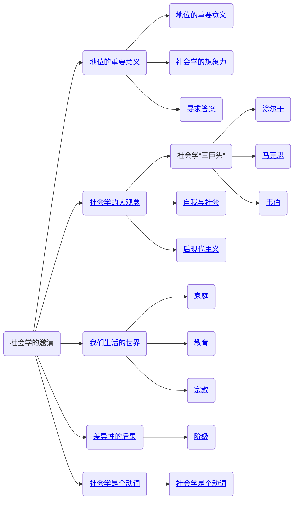
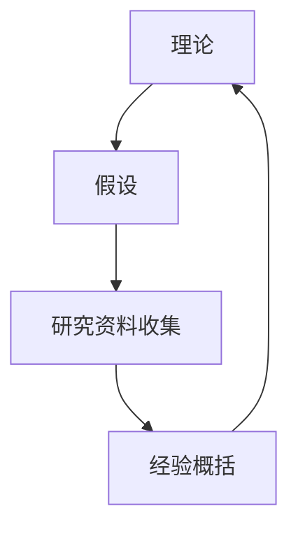

我们为什么会按照我们想的那样去做呢？我们为什么会按照我们做的那样去做呢？社会学旨在对这两个问题提供答案。尽管其他学科也试图做出回答，但社会学提供的分析视角，既有更大的包容性，又有更大的密切性，它比我们在许多其他领域可能找到的观点要更为基本、更为明确。社会学可使我们洞悉“全景”。

我推荐的这本《社会学的邀请》，是一部很好的社会学入门读物。

<!--more-->

------

## 导读

《社会学的邀请》共分为四个部分。第一部分从社会学的视角带领读者重新审视我们往往习以为常的日常生活；第二部分介绍社会学的大观念，介绍古典社会学“三巨头”——涂尔干、马克思和韦伯——的思想，以及后现代主义社会学的内容；第三部分介绍我们生活的世界，从社会学的视角看待与我们生活息息相关的重要组成部分——家庭、教育和宗教。第四部分则谈到种种差异造成的最终后果——阶级——是如何形成并左右我们生活的方方面面的。

## 第一部分 社会学视角

### 第一章 地位的重要意义

第一章首先分析了我们在社会关系中所处的地位影响我们所做决策的一些方式。社会学有助于我们分析个人和社会之间的关系，以一种独特的方式回答两个根本性的问题：“为什么我们会照自己做的那样去做？”“为什么我们会照自己想的那样去想？”尽管我们往往会理所当然地把我们的选择看做自己的个人喜好所为，但当我们后退一步纵揽全局时，我们就会看到：处于类似地位的人往往具有更相近的喜好，并会做出类似的选择。所以，当我们分析过地位的意义之后，我们就可以更清晰地去认识我们自己和他人。一言以蔽之，**我们所处的地位决定了我们是谁**。

我们的所做所想会影响周围的世界，反过来我们也会受到周围世界的影响。社会学就是研究这些影响的科学。**社会学是对个体与社会之间的关系以及差异性后果的系统研究**。了解那些影响我们所做所想的事物，可以帮助我们做出更加明智的选择。

为了了解“社会”对我们个体选择的影响，社会学家更喜欢分析那些更具体的群体范畴，诸如性别、社会阶级、收入类群、教育类群、部族、宗教团体等。社会学家证明群体成员影响的一个重要途径，就是把社会成员分为不同的“**世代**”来进行分析。社会学家称这些世代群体为“**年龄同期群**”，它是指仅仅因为出生在差不多同一时代而具有相近年龄并因之而具有类似经历的一群人。



**“xx后”**

“xx后”是近年来非常流行的网络用语，指相应的年代出生的一群人，和社会学中的年龄同期群的本质是一样的。

网络上有一个很有意思的梗：“70后”请假是因为父母不舒服，“80后”请假是因为孩子不舒服，“90后”请假是因为自己不舒服，“00后”请假是因为他看你不舒服。这生动形象地说明了社会成员按群体划分，处于类似地位的人往往会做出类似的选择。



如果仅仅根据年龄、社会性别等这些基本的**人口统计学因素**去研究群体偏好，很可能会忽略社会地位影响个人选择的一些重要信息。因此，社会学家还根据人们的消费偏好、群体成员身份、品味、价值观和态度而将其划分为不同的**类群**，这被称为“**生活方式簇**”。

除了分析我们的喜好模式以外，社会学家还分析我们所做和所想事情的象征意义。物（物体、词语、故事）不仅仅是物，还是**象征符号**。它们因我们而充满意义，这种意义性只有在与其他事物（符号）形成的关系网络中才能体现出来。它们的意义也可以是多层次的：一方面是显而易见、理所当然的；另一方面，我们只有后退一步，换一个角度来看，才会认识到这些意义。

**思考题**

{}

首先，世代因素指的是我们所处的特定世代、年龄群体。每个世代在成长和社会化过程中都会受到不同的社会、文化和历史环境的影响，这些因素会塑造他们的喜好和价值观。例如，年轻一代可能更喜欢新潮的音乐、时尚或科技产品，而老一代可能更倾向于传统的价值观和文化形式。因此，世代因素对我们的喜好会有一定程度的影响。

其次，社会性别是指社会对性别角色和期望的构建。男性和女性在社会化和文化环境中通常有不同的社会角色，这也可能导致他们在喜好方面存在差异。例如，男性可能倾向于对体育、科技或特定类型的娱乐感兴趣，而女性可能更倾向于对美容、艺术或其他领域的兴趣。但是需要注意的是，这种差异并不适用于每个人，因为个体喜好的差异会影响他们的选择。

至于我们的喜好在多大程度上来自自己，以及我们有多大程度上可以自由选择，这是一个复杂的问题。社会学研究表明，个体的喜好和选择受到多种因素的制约和影响。社会环境、文化价值观、社会压力、媒体影响等都会在一定程度上塑造我们的喜好。另外，个人的社会经济地位、教育背景和个体特质也会对喜好和选择产生影响。

虽然我们受到这些外部因素的影响，但也有一定的自主性和自由选择的空间。我们可以根据个人偏好、兴趣和价值观去做出自己的选择，但这些选择仍然受到一定的限制和影响。

总之，世代和社会性别等人口学因素会在一定程度上影响我们的喜好，但个人的自主性和选择空间也存在。喜好的形成是一个综合考虑多种因素的过程。

{}

### 第二章 社会学的想象力

这一章首先介绍了“社会学的想象力”，它是指分析作为个体的我们与塑造我们生活的更大的社会和历史力量之间关系的意愿和能力，它是以社会学眼光了解社会的首要工具。从社会的角度来看，这就是历史；从个人的角度来看，这就是人生。社会学的想象力以最简单的形式说明了我们如何认识生活中的历史与人生相互交叉的重要性。

社会学家韦伯用“**生活机会**”这一概念描述了这一现实：个体可能获得的成就是以其所处的社会地位与其所能得到的资源为基础的。具体来说，这些资源包括：

- 物质或经济资源：你拥有什么（金钱、资产与土地）
- 社会资源：你认识谁（社会网络与声望）
- 文化资源：你知道什么（观点、信念与价值）

米尔斯指出，我们应该区分个体作为个人所面对的障碍（**私人难题**）与处于相似地位的个体所共同面临的障碍（**公共问题**，社会学家则常称**社会问题**）。换而言之，如果处于相似地位的人们面对着同样的难题，那么我们或许就可以处理那些需要在全社会范围内解决的“公共问题”或社会问题。

接下来，作者给社会学下了定义：**社会学是对个体与社会之间的关系以及差异性后果的系统研究**。这个定义涉及到许多概念，下面详细说明：

- **系统研究**：社会学建立在经验和观察的基础上，讲究方法和立场。**方法**意味着应把哪些东西算作资料以及如何收集资料，**立场**则涉及社会学家与其研究对象的关系。
- **个体**：尽管社会学常与群体联系在一起，但个体的重要性不言而喻。个体拥有选择和行动的自由，这被称为**主观能动性**。社会学家既强调我们选择行动的能力，又强调我们不可能任意地选择行动。
- **社会**：包含如下三个密切相关的要素：
  - **结构**：包括关系和社会网络模式。社会学家一直将总体结构的主要要素称为“制度”，一般包括经济、家庭、教育、政府和宗教。
  - **文化**：包括物质文化（铅笔、计算机、飞机等人类创造的物质财富）、认知文化（语言、思想、信仰、知识、观念等人类创造的精神财富）和规范文化（行为的准则）。
  - **互动**：包括我们的结构地位内部文化资源的交换。
- **差异性的后果**：为什么有途径获得并能控制重要资源的人，比起那些无法获得这些资源的人，会有更多不同的选择？社会学的任务之一就是揭示和分析此类不平等的制度。

随后，作者根据视角和立场进一步对社会学进行细分。

- 按**视角**划分
  - **微观分析法**：由内而外、自下而上的视角，能够立足整个社会甚至跳出社会去解释社会如何决定个体的行动。
  - **宏观分析法**：由外而内、自上而下的视角，关注人们的行动和想法，从而提炼出一般的意义。
- 按**立场**划分
  - **科学社会学**：科学、客观、超然地看待社会。
  - **改革社会学**：描述、分析与纠正社会的不平等。



**孔德对科学社会学的贡献**

孔德主张“实证主义”，认为可以通过对某些主张进行经验检验（发现有关它们的“客观”事实），并证明其作用的因果关系，从而有可能确切地知道这些主张是否正确。





**马蒂诺对改革社会学的贡献**

马蒂诺认为，对“道德”（即我们认为什么是适当的）和“行为方式”（即我们实际所做的）的观察与分析，应该成为社会学研究的中心问题。



最后，作者指出，**社会学作为一种工具**，为我们更好地理解个体与社会之间的相互作用提供了基础。他形象地称之为“社会学的想象力”。

### 第三章 寻求答案

这一章一开始，作者开门见山地指出：**社会学研究涉及理论和资料之间的对话**。因此，作者在这一章主要讲述社会学是如何做研究的。

作者首先指出“**科学研究循环**”的概念，如下图所示：

- **理论**：旨在解释人们为何会那样想、那样做。
- **假设**：是一个可验证的陈述，它涉及两个或两个以上的观察、可测量变量之间的关系。
- **收集资料**：既可以验证理论（演绎法），又可以描述、解释和提出新理论（归纳法）。社会学收集资料的方法有一般有如下五种：
  - 调查法
  - 参与观察
  - 访谈法
  - 实验法
  - 二手资料分析法
- **概化**：是指从资料到理论的过程。与此同时，社会学家会用研究结果去修正已有的理论和模型，也会提出一些新的问题。

作者列举了社会学研究的两个经典案例：涂尔干和杜波依斯，试图说明社会学家是如何做研究的。

## 第二部分 社会学的大观念

### 第四章 汉堡是一个奇迹

本章主要介绍社会学“三巨头”之一的涂尔干的研究和观点。涂尔干的观点用一句话概括，就是“**社会塑造个人**”。

为了理解涂尔干分析的核心观点，需要关注如下三个概念：

- **集体意识**：一个社会成员所共有的全部信仰和情感，它形成了一个具有自己生命的固定体系。
- **劳动分工**：生产的专门化程度。
- **社会团结**：社会各部分相互联系和稳定的程度。

涂尔干认为：

- 传统社会以**机械团结**为特征，社会凝聚力基于稳定性或共同性。
- 现代社会以**有机团结**为特征，社会凝聚力基于差异性和相互依赖性。

究其原因，涂尔干认为是劳动分工的发展导致集体意识的弱化。许多人做着不同的事情，这种共同经验的缺乏，导致社会成员在看待世界以及自己所处地位方面存在或多或少、或深或浅的差异。

集体主义的缺失，也形成了日益强烈的个人主义。虽然这大大推动了个人的发展和创新，但也形成了另一种极端——既不会有集体意识，也不会有相互责任感。涂尔干认为，极端个人主义的结果是无政府状态。为了解决这一问题，他认为只有通过相互依靠，才能使现代世界的生活变为可能。目前看来，经济上的相互依赖性，是现代社会团结的一个重要因素。



一个人的生活必需品，是由无数其他人的共同劳动所提供的。离开了其他人，这个人不能自己提供自己任何东西。

——吉尔曼



所以，“汉堡是一个奇迹”——因为我们不可能在不依赖来自他人的任何知识、技术或者工具的情况下去制作一个汉堡。

也正因此，相反，生活在传统社会的人却具备更全面的知识。作者举了门诺人的例子。

矛盾的是，我们由于极端的劳动分工而不能自给自足，但是我们却有一种强烈的独立的愿望。我们比以前更需要对方，但却认为我们可以不需要对方。那么我们究竟应该如何看待当代社会的个人主义和相互依赖性呢？这个问题尚未得到明确的答案。

### 第五章 劳动力+书=书桌

作者在本章开头就指出：涂尔干重点关注的是工业革命对社会的影响，而忽视了工业革命对生产的影响。他把劳动分工看成是给定的，从而在很大程度上忽视了劳动分工对工作和工人的影响。这一承上启下很好地说明了本章接下来要重点讲述的马克思的观点和涂尔干的不同之处。

我们知道，**资本主义**是指一种基于私人资产的经济制度。在这一制度中，追逐利润的个人、公司和组织相互进行市场竞争。随着生产的工业化，工人不得不为了工资而工作，听命于资本家——因为他们对自己的劳动产品失去了控制。



**马克思的一生**

马克思于1818年5月出生在德国莱茵省特利尔城。他的父亲是名律师，母亲来自荷兰一个有名望的家族。17岁那年，马克思离开家乡去上大学，在波恩大学度过了美好的一年以后，他转到了柏林大学，他在那里接受的哲学思想对他以后的生涯有许多帮助。即将完成博士学业时，马克思因跟那些拥护激进观点的人有密切关系而被列入黑名单，学业就此终止。1843年，他娶了青梅竹马的女友燕妮为妻，一起移居巴黎。在那里，他遇到了一生的知己恩格斯。

1848年，欧洲似乎到处都在发生翻天覆地的变化。工业革命在德国、意大利、比利时和法国到处爆发。马克思去了事件发生的很多地方。在这一大背景下，马克思和恩格斯写成了著名的《共产党宣言》。从这本书中我们得知，马克思坚信资本主义很快就要灭亡。尽管这些革命全部都被镇压了，很多都是通过暴力手段实现的，但马克思依然坚持信念并继续写作。1849年，马克思移居伦敦，并在那里以在大英博物馆里写作的方式度过了他余生中所有最重要的时光。

马克思不断视察革命迫近的信号。1863年，第一个国际性工人组织（第一国际）成立，呼吁工人们联合起来与资本主义制度作斗争，希望能由一种集体所有制取代它，马克思给予了他们很大帮助。1871年，一个工人阶级的革命政府（巴黎公社）控制了巴黎。但是，结果也是革命很快就被镇压，数以千计的工人被杀，第一国际最终于1876年瓦解。马克思期盼的革命在其有生之年再也没有爆发，但是基于他的历史发展理论，马克思始终坚信历史是站在他这边的。

马克思晚年忘我工作，写成了旷世巨著《资本论》。但因积劳成疾，马克思未能完成《资本论（第三卷）》手稿的整理，不幸于1883年3月14日逝世。在马克思的墓前，恩格斯称赞他是“当代最伟大的思想家”。



要想理解马克思的观点，首先要明确如下两个概念：

- **劳动力**：是指人们生产的能力或把原材料转换成产品的能力。
- **技术革新**：是指永无止境地在生产中开发新技术和工具。

马克思的思想相比涂尔干更进一步的是，马克思认为工业革命和资本主义的发展威胁到了我们人类最核心的东西——**劳动**。马克思认为，劳动是人类的根本属性，劳动使我们区别于其他高等哺乳动物，成为独特的人。马克思认为他所设想的共产主义社会终将实现，那时人的劳动和价值将会得到充分的体现和尊重。

马克思的观点有如下五点预设：

- 人类必须生产
- 生产使我们成为独一无二的人类
- 我们把自己投入产品之中
- 经济决定社会
- 短缺和分配是实现美好社会的障碍

尽管资本主义解决了生产问题，但它带来的却是大多数人的**异化**。按照马克思的观点，资本主义必然会导致人类价值降低，而且会使人成为商品。在资本主义制度下，我们制造的商品中的人的价值降低为市场价值。原来有意义的工作现在已经变得没有意义——我们是为了工资而工作。

通过总结马克思的观点，作者指出，个体的所做所想会受到结构因素的影响，主要是经济力量：劳动力、生产组织和技术革新。资本主义通过提高生产力解决了短缺问题，但随着资本家降低劳动力成本以获取更多利润，资本家和工人阶级的斗争导致了异化的出现。同时，资本家之间也彼此竞争，如果跟不上技术革新，他们就会被市场淘汰。总而言之，是**制度决定了他们的行动**。

**思考题**

{}

所有人都将占有生产资料和自己的劳动产品。同时他们又具有社会责任感，自发地将自己生产产品的剩余提供给社会。

{}

{}

生产能力是人和其他动物的根本区别。人类生产能力必须得到保护、珍视、赞扬和肯定，因为这是我们是谁的根本。但是资本主义追求利润最大化，无偿占有了工人阶级的劳动（异化），使人的劳动力成为可以买卖的商品。而劳动产品和财富却被极少数人占有和支配。

{}

{}

资本主义的基本矛盾（生产资料资本主义私人占有和生产社会化的矛盾）决定了资本主义制度必定灭亡。

{}

{}

资本主义需要市场，但每个资本家都希望垄断。结果就在资本家内部形成恶性竞争，每个资本家想提高生产率而降低劳动力成本来提高利润率。这需要不断地技术革新，技术革新也会带来劳动力成本的降低（需要的工人数量减少）。

对于无产阶级而言，技术越是革新，他所获得的报酬反而越少，乃至失业。与此同时，生产出来的商品越来越多，工人的工资又不足以消费。商品滞销导致资本周转不畅，形成生产过剩，爆发经济危机，阶级矛盾越来越尖锐。

{}

{}

如果一个工人想对其老板抱怨工资或工作环境，那老板很快就会雇佣另一个工人来顶替这个位置，而不需要什么培训。因而其他工人就被看成了竞争者，怨恨由此产生。所以，如果工人如果为了工资而竞争，反而会导致工资越来越少，并且工作会变得越来越没有意义。

{}

### 第六章 我思故我做

笛卡儿有一句经典的名言：“我思故我在。”这句话生动形象地描绘了人类思想的力量。社会学家韦伯和马克思的不同之处就在于，马克思认为我们的所作所为影响力我们怎样思考，而韦伯则认为我们的思维方式决定了我们做什么。

此外，韦伯和马克思关于权力的分配上也有不同的观点。马克思认为权力从根本上讲来自于对物质资源的占有和控制，而韦伯则提出了权力多维观，认为权力来源于阶级、地位和党派，比马克思的观点更具普适性。

考虑到韦伯对马克思主义的全面修正，并且刻意地把问题复杂化，看不到事物的内在联系和问题的根源，甚至还为宗教权力的正当性辩护。我个人对韦伯的思想持批判态度，因此本文不花费过多篇幅介绍韦伯的思想。

### 第七章 自我与社会

虽然我对韦伯的思想持批判态度，但是不可否认的是，韦伯的思想启示我们认知的重要性，我们所认为的事物是真实的之重要性，以及它如何影响到我们的思考和行动。

社会学“三巨头”都是自上而下进行分析的，即他们都认为自己可以超越或存在于社会之外认识这个社会。那么，当关注点转向个体及其行动时，我们首先要回答的问题是：“个体与我们的社会之间的关系是怎样的？”作者根据社会学家彼得·伯格和托马斯·勒克曼的观点，介绍了“世界建构”的三阶段模型。在这个模型中，个体与社会相互依赖相互关联。这三个阶段包括：

- 建构文化
- 建构自我
- 建构社会

首先是建构文化。**文化**是我们人类在确立跟自然界以及社会中的其他成员之间关系建构的所有东西的总和，它是我们借以同存在于我们自身之外的世界发生联系的方式，它包括我们生存其中的社会的所有有形与无形的、过去与现在的产物。文化由如下三个部分组成：

- 物质文化：包括我们对自然界的改造物
- 认知文化：包括语言、观念、信仰、知识等
- 规范文化：为我们的行为提供准则

其次是建构自我。尽管是我们创造了文化，但我们同时也受我们（以及先人）所创造的文化影响。也就是说，我们自己也是我们所创造的文化的产物。**社会化**就是我们共同创造的世界形塑个体的思维和行动的过程。作为个体的我们，内化了我们共同建构的物质文化、认知文化与规范文化。



**社会性别的社会化**

社会地位对我们界定自我有着非常巨大的影响力，社会性别就是其中一个例子。

孩子出生以后，我们经常会问：“是男孩还是女孩？”我们之所以会问这样的问题，是因为我们想知道该如何与孩子及其父母互动。对于中国人而言，如果是男孩，我们受传统观念的影响，可能会祝贺家族香火得以延续；如果是女孩，可能只会礼貌性地祝福。

社会性别的社会化贯穿我们生命的始终。孩子们相当早就开始学习性别与其性别相适应的行为准则。例如，女孩子开始专注于漂亮的服饰和配饰，而男孩子开始专注于运动。



为了分析社会和我们在其中的地位对我们影响的程度，我们需要“自我”这一概念。**自我**就是构成个体的特征和经验的综合体，它超出了人的身体和思维的范畴，还包括社会纽带关系。例如回答“我是谁”这个问题，我们可能下意识的反应是说出自己的名字，殊不知自己的名字来源于原生家庭，从而体现出我们置身于和他人的社会关系中。



**注意和个人主义的区分**

这个关于自我的社会性或者关系性概念，与在美国占据主导地位的独立自我意识（“粗俗的个人主义”、“我是我自己”、“我行我素”等）是相互对立的。把我们自己从他人的关系中分离出来是非常困难的。即使是被隔离意义上的自我，也只有在同未被隔离的自我建立关系才有意义。

今天的中国，尤其是互联网上也存在类似的问题。很多人，特别是年轻人开始越来越专注于自我。这本身是一个好的现象，也是社会进步的体现。但在很多情况下，他们不考虑自己同社会的关系，片面地强调所谓自我，要求他人乃至全社会都要围着他们来转，这种自私的、极端个人主义的思想是不可取的。



当我们分析与他人相遇时会发生什么时，就能够认识到自我。别人好像一面镜子，我们通过这面镜子看到了自我，这就是**反身自我**。这意味着，我们是谁并不是简单地依据他人如何想而定，还依据我们认为他人会如何思考我们自己的想法。这启示我们，认知在我们的自我发展中具有重要作用。据此，可以将自我分为**主我**和**客我**两个概念。

**主我**（**I**）是行动着的我们的一部分——是对他人态度的机体反应。**客我**（**Me**）则规划行动并判断我们接着该怎么做，这是自我社会化了的一部分。主我和客我之间相互作用。打个比方，假设你面前是一片平坦的沙滩。客我计划以直线方式穿过，主我则刚开始迈步（总受客我指挥，客我努力使主我走笔直的直线）。当穿过之后，你再回头看时，又是客我在决定你该怎么做。总而言之，客我做计划，主我行动，然后客我评判。

最后是建构社会。首先我们要认识到社会具有一定的结构层次。我们一般用**地位**来表示我们相对于他人在社会中所占有的位置。地位总是意味着权利和义务，即具有一定地位的人被期望以一种适当的方式行事——这并不因为他们作为个体是谁，而是因为他们所占有的位置。社会学家用**角色**这一术语来指示地位占有者所被期望的行动。

在社会地位的基础上，地位的结合体被称为社会**群体**。一个社会群体包括一组相互联系的地位和一个标明群体内外的分界线。具体来说，社会群体可以分为首属群体和次属群体。首属群体不太正式，但关系最亲密、持久，并能够使我们将整个自我完全融入其中。次数群体则刚好相反，它更加正式、关系不亲密，是更加工具性的关系，我们的自我仅有一小部分能够融入其中。

处在社会群体层次之上的就是**制度**。制度包括相互联系的社会群体，以及他们的地位和角色，目的是实现某些领域的社会需要。现代社会的制度包括如下五类：

- 家庭
- 教育
- 政府
- 经济
- 宗教



**托马斯定理**

我们以我们认为是真实的东西（即使它与现实本身相反）为基础去行事。

托马斯定理告诉我们：如果我们与他人具有共同的思维和行动，我们将会轻松地实现我们追求的目标。如果我们相信他人能够按期望去做，我们就可以只关注我们所应做的事情而不同担心其他人做什么。



根据社会学的观点，社会既存在于我们之外（在他人的观念中，在我们帮助建构的结构中），又存在于我们之内（我们的建构，我们的认识，我们的判断）。所以，个体的重要性不言而喻。进一步讲，我们需要一种可以把社会结构和个体行动结合起来的方法，把自我和社会的关系更好地具体化。这大致有如下两种思路：

- 从社会到自我
- 从自我到社会

### 第八章 “是”的含义



“这要看单词‘是’的意思是什么？”

这是美国前总统克林顿在莱温斯基性丑闻事件中对大陪审团的证词所做的陈述。这句话看似是在诡辩，但深入了解了社会学之后，答案似乎就不言而喻了。



本章作者主要围绕“**后现代**”一词展开讨论。但是要想理解这个词有一定的难度。首先，作为一个社会组织或社会结构的体现，**后现代性**强调的是我们的社会世界的多元性、相互联结性和全球性特征。它萌芽于“现代”时期，这个时代形成了启蒙思想，并兴起了工业革命——在西方的历史叙事中，“现代”一词意味着黑暗的中世纪结束，文艺复兴的开始，现代文明的起源。“**后现代主义**”与“现代主义”不同，前者是关于现实的哲学和理论思维，它质疑后者的单一性质（即运用科学方法和经验研究去认识，例如牛顿经典力学），并怀疑我们能用绝对术语去认识有关的现实。

一个现代主义者一定会简单地认为克林顿在说谎、诡辩。在现代世界里，我们往往认为语言是理所当然的、无疑义的，并假定词语对我们周围的世界提供了准确的表达。但后现代主义者不这么认为，他们对那些指代符号（例如“是”的含义）和现实之间的关系存疑，他们觉得这些符号是被社会建构的。后现代主义的本质就是没有本质，没有我们可以直接获得的基本现实。

这似乎还是有些难以理解，作者接下来举了一些例子来说明后现代性的体现。

第一个例子是**元叙事**。它是指处在关于我们自身经验的叙述层次之上的叙事。元叙事是讲述现实本质的大故事，可以使我们理解周围的世界。例如，为什么人固有一死？我们的答案往往会诉诸于某种元叙事，一个抽象的故事，例如“因为上帝要带他去见天堂”（宗教性的元叙事）、“因为万事万物皆有定数”（道家的元叙事）、“因为身体器官老化”（现代科学的元叙事）。而后现代主义者会对元叙事产生怀疑，他们认为没有一个故事能把我们统一起来。

第二个例子是**超现实**。从字面意思上讲，它就是指在现实之上，超越真实和在真实之外。尤其是随着今天人工智能的发展，特别是像 ChatGPT 这样的大语言模型的出现，我们甚至无法分辨文本、图像、声音、视频等模态的信息是真实的还是人工智能生成的。我们今天被各种各样纷繁复杂的信息所淹没，以致于无法辨别什么是真实，什么是现实的建构。

第三个例子是**强制选择**。选择不仅仅是一种取舍，更是一件必须要做的事情。强制选择让我们自由地去追求新的、有创造性的自我和未来，但它也可能使得我们失去自我身份存在的坚实基础。

第四个例子是**网络**。网络带来了两个大的趋势。一是**全球化**，我们比过去似乎更容易地了解到这个社会更多人的所做所想，人与人之间的边界日益模糊。然而，具有讽刺意味的是，跨国公司的发展和大众媒体的扩张，使美西方价值观、道德标准在全世界蔓延开来，从而导致了一种文化霸权主义的出现。这些变化带来的影响是，彼此不一样的人跟那些较少与当地社区联系的人之间出现了更大的分离，传统的地理因素的影响逐步减弱。同时，加之推荐算法带来的影响，人们越来越陷入到“信息茧房”之中，和相同簇群的人联系更加紧密。二是**赛博化**，把人、技术和网络结合在一起，使得人类、机器和环境之间的分界线也变得模糊起来。Meta（原 Facebook）公司率先提出元宇宙（Metaverse）的概念，使得科幻小说中的赛博人有望成为现实。作为赛博人，不仅仅是一个人机结合体：它还使自我和非自我之间的界限变得模糊不清。孤立的自我让路于网络化的自我。

综上所述，后现代性体现了跨界的特点。在每个例子中，我们都可以发现的共性是，边界是模糊的，而且这些边界在现代主义中被认为是不容置疑的。后现代主义带来的一个现象是**相对主义**，即没有绝对正确的元叙事，我们似乎永远无法向别人证明我们的元叙事是正确的。这告诉我们，生活中没有单一的历史和单一的经验。

## 第三部分 我们生活的世界

### 第九章 联结纽带

本章首先介绍了家庭的社会和历史背景，以及这种背景是如何影响我们对家庭的定义的。作者指出传统意义上的家庭是**制度家庭**，即经济、社会和文化资源转换的中心制度。而且婚姻是建立社会关系的主要途径。

后来随着工业革命的发展，人们需要离开生活的土地为他人工作。而与此同时，家庭则成为私人领域的一部分（工作则对应着公共领域）。这就导致了家庭的形式演变为**伙伴家庭**，它重视爱和情感的支持而不是纯粹的经济和社会资源的交换。



**家庭中的女性**

人们一般认为，理想的婚姻包括一个丈夫和一个妻子，丈夫投入公共领域，领回工资供养家庭；妻子则成为家庭主妇，全力照顾家庭成员和操持家务。

为此，人们还为妻子们设计了新的价值和规范——女人被假定为天生就有特别适合私人领域生活的心理特质：善良、温柔、平和、顺从、无私、优雅、单纯——所有这些特质都代表需要保护并且不利于在公共领域取得成就。

如果女性成为（公共领域）劳动力的一部分，她们就不能（私人领域）贤妻良母的角色。这导致了许多妇女都失去了生产者的角色，变得越来越依赖于他们的丈夫。

而现在，男性和女性都参与到公共领域，也同时参与私人领域。所以上述的传统观念在现在并不被广泛接受。



而**后现代家庭**发展了伙伴婚姻模式，将家庭建立在爱情和情感的基础上。基本的价值观也发生了变化，不是团结友爱，而是自主。这给了家庭成员特别是女性在公共领域更大的选择和自由。

接下来作者分析了家庭对社会有何作用。家庭所具有的两个重要功能就是**社会网络**功能和**个人需要**功能，前者涉及家庭和社会的关系，后者包括家庭成员的生理需要和情感需要。这里的社会网络功能主要包括：通过家庭传承社会地位，新家庭的形成，以及家庭的再生产（既包括其生物意义，也包括其社会意义）。

最后，作者分析了我们在家庭和社会中的地位以怎样的方式塑成了我们个体的选择，特别是伴侣的选择，也包括工作和生活的兼顾。作者指出，爱情不是盲目的，而是社会和文化力量的产物，这些力量促使了我们的选择。懂得如何选择真爱，我们就不会因为可以选择的对象太多而无从下手。

此外，工作和家庭之间的不平衡，深深地影响了配偶之间以及父母与孩子之间的关系。有研究者指出：真正不平衡的是市场活动和非市场活动（包括社区和家庭纽带关系）之间的关系，我们的工作没有为我们留出时间来尽家庭责任。这或许是我们今天所面临的最大的家庭困难之一。

### 第十章 教育

作者开门见山地指出：从积极的一面来说，教育有助于建构和维护社会秩序，促进个人成长；从消极的一面来说，教育也帮助构建并维护了社会权力和不平等。



**美国教育制度的变迁**

教育在美国历史上的发展，是一个不断扩展和制度化的过程。

在建国前及更早时期，家庭承担着必要的教育责任，学校都不是免费义务的。建国后，杰斐逊总统提出巩固教育的目标是实现个人需要和满足社会需求。但直到19世纪中期，教育改革者们才把公共教育普及扩大。然而，最初学校只向男孩（几乎全是白人男孩）开放，后来才逐渐扩大到招收女孩。南北战争后，为非裔美国人争取更多教育机会的斗争日渐扩大。然而，整个20世纪，教育的包容性原则和不平等现实之间的对抗一直都在持续。

今天，教育被列为一项社会权利，全民都应该获得免费义务教育直至获得高中学历。但时至今日，其包容性的发展并没有消除不平等。



关于教育积极的一面，主要包括：

- 社会化
- 文化传递
  - 正式文化：为了考试而必须学习的
  - 非正式文化：对我们的生成具有同等重要意义的知识
- 职业培训
- 文化创新
- 儿童保育

关于教育消极的一面，主要包括：

- 社会控制：课程往往以强势的、权威的、社会地位高的群体为视角，要求学生接受现状、不要批判思考、承认社会变革很难。
- 分轨制：把学生按照各种名义（天赋、兴趣等）分到不同的班级，这会在某种程度上限制孩子前进道路上的机会。
- 不平等的资源分配：生活在富裕地区的学生得到的社会教育资源，远多于贫困地区的孩子。

当涉及我们如何想和如何做时，教育扮演了一个重要的角色。通过教育制度，我们传递文化并因此再生产社会本身。教育的确给每个人都提供了社会流动的机会，但它也掩盖了我们丧失机会的程度，并由此帮助维持了现状。

### 第十一章 保持信仰

在西方，宗教在过去的社会生活中是占据统治地位的支配力量。伴随着现代化的开始，宗教竭力维护其在公共领域中的地位。但与此同时，科学给我们提供了更好地解决问题的方法。本章作者从社会学的视角重新评定宗教。

首先，作者回顾了社会学“三巨头”关于宗教的论述。

- 马克思：宗教是被压迫生灵的叹息，是无情世界的感情，正像它是没有精神的制度的精神一样，宗教是人民的鸦片。
- 涂尔干：宗教社会仅仅是对人类社会的理想化。
- 韦伯：宗教是世俗化的社会。宗教促进了现代资本主义的产生。

其次，作者分析宗教的三种构成要素：

- 信念与实践的统一体系：包括教义、教条、信条、圣经等。
- 神圣物：例如十字架等。
- 宗教共同体：即信仰者团体——教会。

要想理解宗教，一个等价的方法是询问我们自己“我们的时间和精力主要花在什么上面”，或者追问自己“我们狂热追求的是什么”。

在后现代社会中，宗教以功能等价物的新形式呈现出来，这就是“**宗教多元化**”。与之相对，**原教旨主义**代表了一种回归所谓信仰的核心原则和“根本原则”的现代尝试。

## 第四部分 差异性的后果

### 第十二章 等级之差

最后一章作者重点探讨差异化的后果——社会阶级。阶级是马克思分析社会关系的中心问题，但在美国一直是一个敏感话题。首先作者列举了如下几种社会分层制度：

- **社会分层**：一个社会中成员或群体的等级次序。
- **奴隶制**：把人当作财产的制度。
- **种姓制**：起源于古印度，按人们的出身划分阶级。
- **阶级制**：以经济地位为基础，具有如下特点：
  - 阶级制度具有流动性
  - 阶级地位在某种程度上是自致的
  - 阶级地位基于经济基础
  - 阶级制度是大规模且非个人式的

接下来作者介绍了一些概念，这些概念有助于我们分析社会阶级。首先是**社会流动**的概念，即人们在社会各阶层之间变动的能力。允许不同社会地位之间相互流动的制度是开放系统，不允许这种流动的制度是封闭系统。然后是资源，即物质资源、社会资源和文化资源。

其中，作者特别强调了文化资源的概念。他指出，并不是所有文化资源都是等价的，不同阶级具有不同的**文化资本**——我们所知道的和我们所喜好的东西。例如，交响音乐会和歌剧被认为是“高雅文化”，而摇滚乐、嘻哈被视为“通俗文化”。这些判断都是基于一定的文化优越论，其中那些处在高层的人可以把他们的偏好定义得明显优于普通大众的偏好。而工人阶级的文化资本通常被认为是最低的——因为资产阶级垄断了优秀文化的解释权。这恰恰说明了社会经济地位对文化的影响。

不过，阶级毕竟是建立在经济不平等的基础之上的，并且阶级的存在也使经济不平等得以长期维持。具体来说，这通过收入和财富来体现。

最后，阶级关联到不同层次的权力。在讨论阶级特权是否应该时，我们往往会认为自己理应享有，而别人不能享有。在美国，少数人有资格享受任何特权——有些特权是他们的社会阶级的产物。但与此同时，我们又坚信在某些基本条件下每个人都是平等的。——这是自相矛盾的。

## 结语 社会学是个动词

为什么说社会学是个动词？因为我们需要社会学更好地理解自己，更有效地在日常生活中去行动，这种行动不仅会塑造我们每个人的未来，也会影响与我们相关的，以及我们要对他们负责的其他人。作者希望传达这样一种理念：社会学无论是在我们作为个体试图更好地理解自己这一方面，还是在我们作为集体努力建设更美好的世界这一方面，都具有举足轻重的作用。
