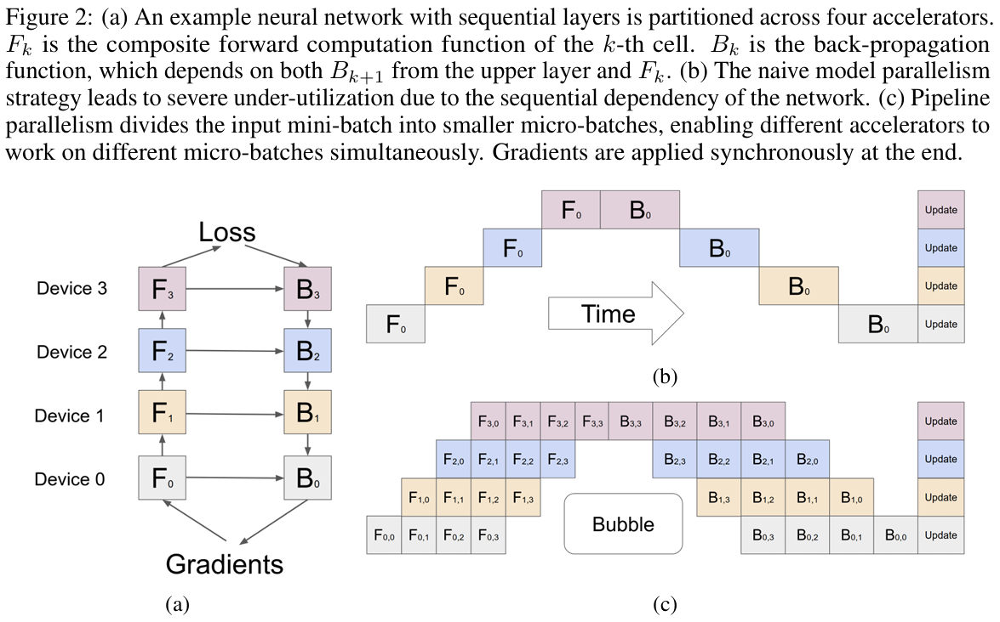
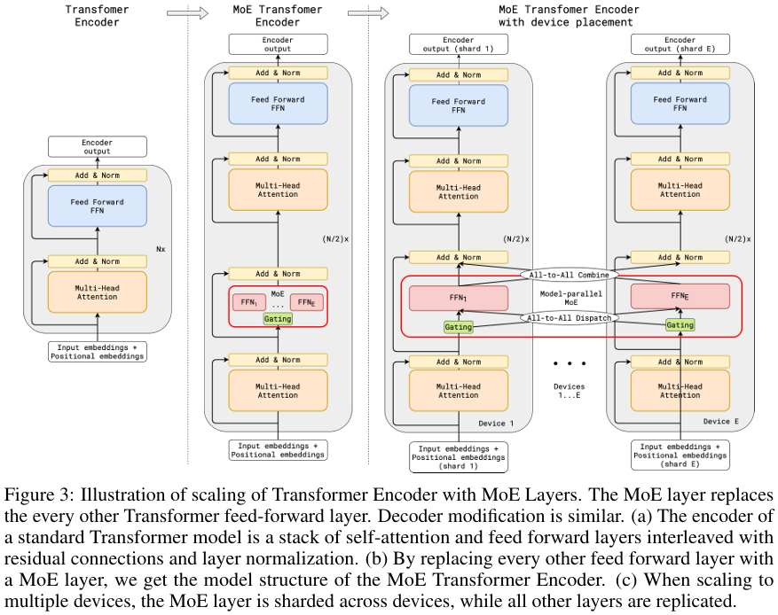
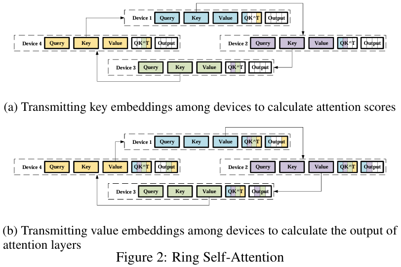
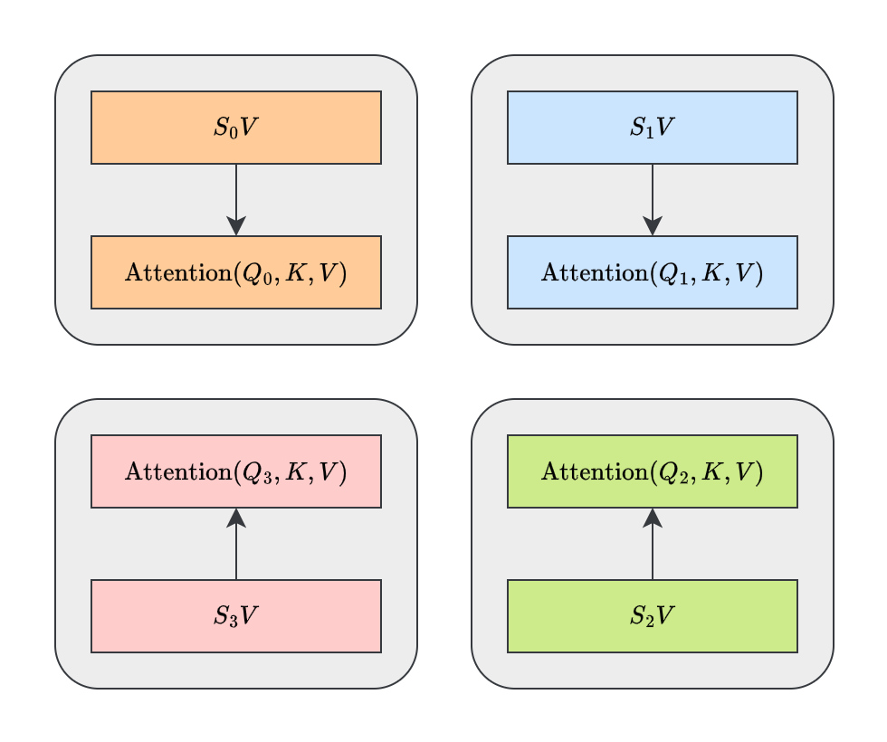
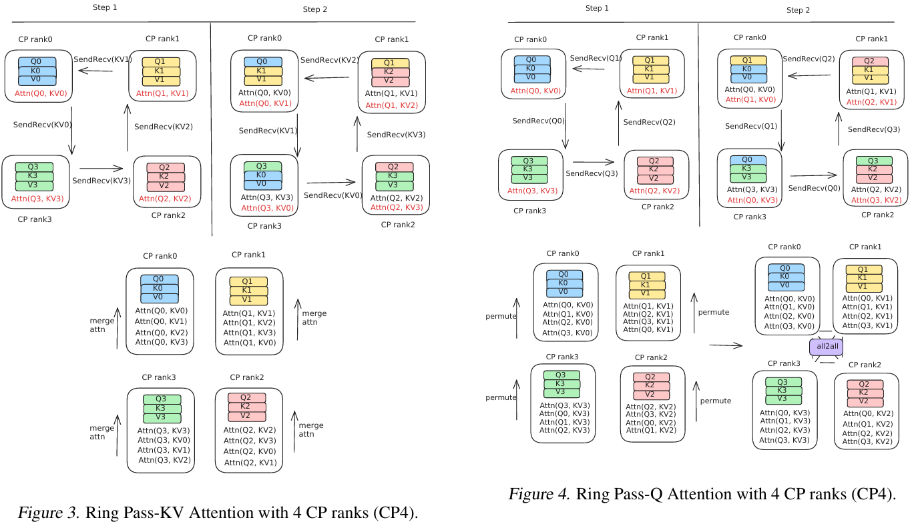

随着大模型（Large Language Model，LLM）规模的不断增大，模型参数数量和计算量也在不断增加，这使得模型的训练和推理变得越来越困难。为了应对这一挑战，研究人员提出了多种并行策略，包括数据并行（Data Parallelism，DP）、张量并行（Tensor Parallelism，TP）、流水线并行（Pipeline Parallelism，PP）、专家并行（Expert Parallelism，EP）和序列并行（Sequence Parallelism，SP）。本文将深入图解并给出这些并行策略的定量分析。

<!--more-->

## 概述

在 LLM 并行策略的相关综述[^1]中，已经对这五大并行策略及其相关工作进行了罗列与比较。

[^1]: Efficient Training of Large Language Models on Distributed Infrastructures: A Survey. [arXiv](https://arxiv.org/abs/2407.20018)



张量并行和流水线并行还可以统称为模型并行（Model Parallelism，MP）。这是因为它们都是将模型权重进行分片，只不过前者之间切分权重，而后者切分模型层。



> 关于分片的定义详见下文。

```mermaid
mindmap
    root((并行策略))
        DP
            ZeRO
        TP
            Megatron-LM
        PP
            GPipe
            PipeDream
        EP
            GShard
        SP
            RSA
            CP
            Ulysses
            USP
```

### 符号定义

下面的表格定义了模型超参数以及输入输出的维度。

| 符号  |              定义               |     注释     |
| :---: | :-----------------------------: | :----------: |
| \(b\) |     批量大小（Batch Size）      |              |
| \(s\) |   序列长度（Sequence Length）   |              |
| \(h\) |    隐藏层维度（Hidden Size）    |              |
| \(e\) |    专家数量（Expert Number）    | MoE 模型特有 |
| \(k\) | 激活专家数量（取 top-k 个专家） | MoE 模型特有 |
| \(l\) |  Decoder 层数（Layer Number）   |              |

那么，根据以 Transformer 基础的 LLM 设计范式，一层 Decoder 总参数量可以近似认为是其线性层的参数量，包括：

-   注意力模块的 \( W_Q, W_K, W_V, W_O \)
-   前馈网络的 \( W_1, W_2 \)（或者记作 \( W_{\mathrm{up}}, W_{\mathrm{down}} \)）

而前馈网络的中间层维度通常是隐藏层的 4 倍，且单个注意力头的维度正好是隐藏层维度除以注意力头数。据此，可以计算出一层 Decoder 的参数量为：

$$
\Phi = 4 \cdot h^2 + 2 \cdot 4 h^2 = 12 h^2
$$

另外，一个 LLM 的隐藏状态通常是一个维度为 \([b, s, h]\) 的向量。

本文用 \(d\) 来表示各个并行策略的**并行度**。并行度即参与并行计算的设备数量。

## 基本概念

### 集合通信

所有的这些并行策略都需要在不同的设备之间进行通信，此时就需要一系列通信原语或者通信算子。常见的包括 All Reduce（AR）、All Gather（AG）、Reduce Scatter（RS）、All-to-All（A2A）等。

> 强烈建议读者在阅读本文时，先对这些通信原语有一个基本的了解。读者可参考[并行计算集合通信初步](../introduction-to-parallel-computing-collective-communication/)一文。

### 分片与平铺



在了解了这些通信原语之后，我们希望读者首先要在头脑中建立这么一个概念：按照数据（或者可以说是张量）在 LLM 中的意义来划分，只能将参与通信的数据分为两大类，即**模型权重**（或称**模型参数**）和**中间激活**（或称**隐藏状态**）。换而言之，无论何种并行策略，有且只有权重和激活两类张量可以切分。



**分片**（Sharding）和**平铺**（Replicated）是采用了并行策略之后，权重和激活张量在各个设备的分布方式。

-   分片：将张量在某个维度上切分成多个子张量，每个子张量在不同的设备上存储。
-   平铺：将张量在所有设备上都存储一份完整的副本。



**Sharding 和 Tiling 的区别**

要注意区分 Sharding 和 Tiling 这两个概念。尽管它们都是对张量进行切分，但是 Sharding 的载体是计算设备（通常指单个 GPU），而 Tiling 的载体是计算设备内的存储（例如 HBM）。

Tiling 的核心思想是将一个大计算任务（如矩阵乘法）分解为多个小块（tiles），逐块计算，通常是为了适配硬件缓存或内存限制。例如著名的 [FlashAttention](https://arxiv.org/abs/2205.14135) 算法就采用了 Tiling 策略，减少 HBM 访问。

Tiling 不在本文的讨论范围内。



[^7]: FlashAttention: Fast and Memory-Efficient Exact Attention with IO-Awareness. [arXiv](https://arxiv.org/abs/2205.14135)

> 若读者对 FlashAttention[^7] 感兴趣，可参考[图解 Flash Attention](../illustrated-flash-attention/) 一文。

## DP 数据并行

数据并行是指将批量数据切分成多个子批量，每个子批量在不同的设备上并行计算，最后将结果合并。由此可见，数据并行是典型将隐藏状态切分而将模型参数平铺的并行策略。

数据并行在前向传播时无需任何通信，仅在反向传播时需要通信，包括参数梯度的 AR（即我们常说的梯度平均）。在每个设备上，中间激活张量的维度为 \([\dfrac{b}{d}, s, h]\)。不过，由于梯度不是中间激活张量，所以反向传播时的通信开销与之无关，即通信量为

$$
\begin{cases}
    M_f = 0 \\
    M_b = \Phi = 12 d^2
\end{cases}
$$

ZeRO[^3]（Zero Redundancy Optimizer）是在标准数据并行（Data Parallelism, DP） 的基础上，通过消除模型状态的冗余存储来显著降低显存占用，从而支持训练超大规模模型（如百亿、千亿参数）。它不是改变并行策略本身，而是在 DP 的通信和计算流程中对模型状态进行分片。具体来说，在 DP 中，每个设备都会完整存储：

[^3]: ZeRO: Memory Optimizations Toward Training Trillion Parameter Models. [arXiv](https://arxiv.org/abs/1910.02054)

-   参数 P
-   梯度 G
-   优化器状态 OS

ZeRO 则在此基础上按照 DP 的并行度对这些数据进行分片。ZeRO 逐步对上述三类模型状态进行分片：

1. 仅优化器状态 \( P_{\mathrm{os}} \)
2. 优化器和梯度 \( P_{\mathrm{os+g}} \)
3. 优化器、梯度和参数 \( P_{\mathrm{os+g+p}} \)

尽管 ZeRO 极大地减少了显存占用，以支持超大规模的模型训练，但是它是以引入了额外的通信开销为代价的，详见下表：

| 并行策略 |  分片内容  | 每轮通信算子 |   单位设备通信量   |  通信频次  |
| :------: | :--------: | :----------: | :----------------: | :--------: |
|    DP    |     --     |    1 × AR    |     \(2 \Phi\)     |     1      |
|  ZeRO-1  |     OS     |    1 × AR    |     \(2 \Phi\)     |     1      |
|  ZeRO-2  |   OS + G   |    1 × AR    |  \(\approx \Phi\)  |     1      |
|  ZeRO-3  | OS + G + P | 2 × AG + RS  | \(\approx 5 \Phi\) | = 模型层数 |

一般来说，越大的模型，才可以使用越高一级的 ZeRO 并行策略。

## TP 张量并行

张量并行是指将模型权重切分成多个子权重，每个子权重在不同的设备上存储和计算。由此可见，张量并行是典型将模型参数切分而将隐藏状态平铺的并行策略。

使用张量并行时需要满足一个重要的条件，即模型层一定是成对出现的。例如在 Transformer 中，注意力模块里前有 \( W_Q, W_K, W_V \) 三个线性层，后有 \( W_O \) 一个线性层；前馈网络里前有 \( W_{\mathrm{up}} \) 一个线性层，后有 \( W_{\mathrm{down}} \) 一个线性层。否则，会产生十分不和谐的情况。

要解释清楚这个问题，首先我们来了解一下 Megatron-LM[^2] 的张量并行设计。

[^2]: Megatron-LM: Training Multi-Billion Parameter Language Models Using Model Parallelism. [arXiv](https://arxiv.org/abs/1909.08053)

对于 MLP 层，公式推导如下：

$$
\begin{aligned}
    Z = Y B &= X A B \\
    &= X \begin{bmatrix}
        A_1 & A_2
    \end{bmatrix}
    \begin{bmatrix}
        B_1 \\
        B_2
    \end{bmatrix} \\
    &= \begin{bmatrix}
        X A_1 & X A_2
    \end{bmatrix}
    \begin{bmatrix}
        B_1 \\
        B_2
    \end{bmatrix} \\
    &= \begin{bmatrix}
        Y_1 & Y_2
    \end{bmatrix}
    \begin{bmatrix}
        B_1 \\
        B_2
    \end{bmatrix} \\
    &= Y_1 B_1 + Y_2 B_2
\end{aligned}
$$

> 有关矩阵乘法的分块计算，读者可参考[分块矩阵的乘法](../block-matrix-multiplication/)一文。

注意公式的最后一行的加法，其所需的结果来源恰好是分布在不同的设备上的，这也就是为什么 TP 需要 AR 通信的原因。

同时，TP 要求成对的两个投影层前者竖着切（Column Parallelism），后者横着切（Row Parallelism）。这样做是为了：

1. 保证中间隐藏状态的维度不变
2. 通信在计算完两个线性层后进行

对于 Attention 层也是同理。既然隐藏状态的维度为 \([b, s, h]\)，那么一层 Decoder 的通信量包括前向传播的 2 次 AR 和反向传播的 2 次 AR，每次通信的数据量为 \( bsh \)。因此，一层 Decoder 的总通信量为

$$
M_f = M_b = 2bsh (d-1)
$$

不过，在工程实践中，AR 可分解为单位通信量为 \( \dfrac{1}{d} \) 的 RS + AG。如图所示，这可以进一步降低通信开销。

据此，可以计算得出一层 Decoder 的总通信量为

$$
M_f = M_b = \dfrac{4bsh}{d} \cdot (d-1)
$$

## PP 流水线并行

流水线并行是指将模型的不同层分布在不同的设备上，形成一个计算流水线。每个设备只处理输入数据的一个子集，并将中间结果传递给下一个设备。这样可以充分利用设备的计算资源，提高训练效率。

在流水线并行中，前向传播和反向传播的计算是交替进行的。具体来说，前向传播时，输入数据首先经过第一个设备的计算，然后将中间结果传递给第二个设备，依此类推。反向传播时，梯度从最后一个设备开始，逐层向前传递。

GPipe[^4] 是一种经典的流水线并行实现。它将模型划分为多个阶段，每个阶段在不同的设备上计算。为了提高设备利用率，GPipe 引入了微批量（Micro-batch）的概念，将一个大批量数据切分为多个小批量数据，交替进行前向传播和反向传播。

[^4]: GPipe: Efficient Training of Giant Neural Networks using Pipeline Parallelism. [arXiv](https://arxiv.org/abs/1811.06965)

PP 的通信开销可以说是最低的，它仅仅只需要 \( d-1 \) 次 P2P 通信，每次通信的数据量为 \( bsh \)。这是因为每个设备只需要将中间激活传递给下一个设备，而不需要进行任何额外的计算。但是 PP 的痛点在于其致命的气泡（Bubble）率，这使得其在模型训练过程中设备利用率大打折扣。

PipeDream[^5] 是一种改进的流水线并行方法，通过引入重叠计算和通信的机制，进一步提高了设备利用率。PipeDream 本质上相当于是一种异步的流水线并行。

[^5]: PipeDream: Fast and Efficient Pipeline Parallel DNN Training. [arXiv](https://arxiv.org/abs/1806.03377)

GPipe 和 PipeDream 都是经典的流水线并行方法，但它们只是作为 PP 技术的铺垫。现代的 PP 方法通常采用 1F1B 调度策略[^6]，即每进行一次前向传播就进行一次反向传播，从而最大化设备利用率。

[^6]: Memory-Efficient Pipeline-Parallel DNN Training. [arXiv](https://arxiv.org/abs/2006.09503)



**TP-PP 混合并行**

在大多数 LLM 并行训练框架中，TP 和 PP 通常是结合使用的。这样做的原因是：

- 节点内的多 GPU 之间使用高速互联（如 NVLink），适合采用 TP，因为 TP 的每一层均需要 AR 通信。
- 节点间的多节点之间使用相对较慢的网络（如 InfiniBand），适合采用 PP，因为 PP 的通信开销较低。

在此基础上，PP 的 P2P 通信量可以被 TP 组进一步减小。假设 PP 的并行度为 \( d_{\mathrm{PP}} \)，TP 的并行度为 \( d_{\mathrm{TP}} \)。在完成 PP 的 P2P 通信时，节点内的每张卡只负责发送中间激活张量的 \( \dfrac{1}{d_{\mathrm{TP}}} \)，然后在目标节点内进行 AG 合并，如图所示。

在这种情况下，PP 的 P2P 通信量变为

$$
M_f = M_b = \dfrac{bsh}{d_{\mathrm{TP}}} \cdot (d_{\mathrm{PP}} - 1)
$$

而 AG 的通信量为

$$
M_f = M_b = \dfrac{bsh}{d_{\mathrm{TP}}} \cdot (d_{\mathrm{TP}} - 1)
$$



## EP 专家并行

专家并行是混合专家模型（Mixture of Experts, MoE）独有的并行策略。既然 MoE 引入门控网络和多个 MLP 层组成的专家，那么就可以直接将 MoE 模型中不同的专家分配到不同的设备上，这相当于是一种更简单方便的实现模型并行的方式。

看起来 EP 只是对模型权重进行分片，而不涉及到隐藏状态。不过由于 MoE 模型的路由机制，即每个 token 只激活一部分专家（即 top-k 加权），因此 EP 势必会影响到隐藏状态的分片。此时，需要引入 A2A 通信来在设备之间交换中间激活。在 MoE 模型中，将原始输入的各个 token 根据门控网络的输出路由到不同的专家进行处理的过程称为 **Dispatch**，而将各个专家的输出重新组合成原始输入顺序的过程称为 **Combine**。

GShard[^12] 是最早提出 EP 的工作之一。其实现 EP 的方式至今仍被各大训练和推理框架所采用。

[^12]: GShard: Scaling Giant Models with Conditional Computation and Automatic Sharding. [arXiv](https://arxiv.org/abs/2006.16668)

EP 通常会与 DP 结合使用，以进一步提高系统的吞吐量和资源利用率。此时，输入输出的隐藏状态的维度为 \([\dfrac{b}{d}, s, h]\)。在路由之后，维度变为 \([\dfrac{b}{d} \cdot s, k, h]\)，批次大小和序列长度相乘说明所有 token 被展平。而在 Dispatch 之后，假设第 \(i\) 个专家上被分配了 \( n_i \) 个 token，那么其隐藏状态的维度为 \([n_i, h]\)。这些参数之间应当满足以下关系：

$$
\sum_{i=1}^{e} n_i = b s k
$$

这说明每个专家所需推理的 token 数量的数学期望为

$$
E(n) = \dfrac{b s k}{e}
$$

接下来考虑 EP，那么单个设备上应当有 \(\dfrac{e}{d}\) 个专家。那么在 Dispatch 之后，单个设备上被分配到的 token 数量的数学期望为

$$
E(n) = \dfrac{b s k}{e} \cdot \dfrac{e}{d} = \dfrac{b s k}{d}
$$

由此可得，EP 的 A2A（包括 Dispatch 和 Combine）平均通信量均为 \( \dfrac{b s h k}{d} \)。那么，一层 MoE Decoder 的总通信量（的数学期望）为

$$
M_f = M_b = \dfrac{2 b s h k}{d} \cdot (d-1)
$$

## SP 序列并行

序列并行是指将输入序列切分成多个子序列，每个子序列在不同的设备上并行计算。这样可以极大地减少单个设备上的显存占用，在训练中可以支持更长的序列长度，而在推理中可以降低 K/V 缓存的显存占用。其实 SP 和 DP 一样都是对隐藏状态进行切分，不过 SP 是在序列维度上切分，而 DP 是在批量维度上切分。

使用 SP 不像 DP 那样，它以非常频繁的通信开销为代价。这其中的原因在于 Transformer 的自注意力机制。由于自注意力机制需要每个 token 都与其他 token 进行相似度的计算，在 Attention 的计算过程中，需要一边计算一边同步中间结果以保证正确性。

这个想法最初是以 Ring Self-Attention（RSA）[^8] 的形式提出的。RSA 将序列切分成多个子序列，并在多个设备上并行计算自注意力。每个设备只计算自己子序列内的注意力，然后通过环形通信将中间结果传递给下一个设备，依此类推，直到所有设备都完成计算。

[^8]: Sequence Parallelism: Long Sequence Training from System Perspective [arXiv](https://arxiv.org/abs/2105.13120)

对于 \( Q \times K \) 和 \( S \times V \) 两个矩阵乘法，RSA 都需要进行 \( d-1 \) 次 P2P 环形通信，可进一步参考下面的动画深入理解。其中，\( Q \times K \) 的结果维度为 \([b, \dfrac{s}{d}, \dfrac{s}{d}, h]\)，所以每次通信的数据量为 \( bh \cdot \left( \dfrac{s}{d} \right)^2 \)；而 \( S \times V \) 的结果维度为 \([b, \dfrac{s}{d}, h]\)，所以每次通信的数据量为 \( bh \cdot \dfrac{s}{d} \)。所以一层 Decoder 的总通信量为

$$
bh \left[ \left( \dfrac{s}{d} \right)^2 + \dfrac{s}{d} \right] (d-1) = \dfrac{bh (s^2+sd) (d-1)}{d^2}
$$

Context Parallelism（CP）[^9]也提出了类似的想法，不过它是基于 Group-Query Attention（GQA）[^10]实现的。GQA 将注意力头划分为多个组，每个组内的头只关注输入序列的一个子集，从而减少计算量和显存占用。对于不同稀疏模式的注意力机制，根据其设计的序列并行策略也有所不同。

[^9]: Context Parallelism for Scalable Million-Token Inference. [arXiv](https://arxiv.org/abs/2411.01783)

[^10]: GQA: Training Generalized Multi-Query Transformer Models from Multi-Head Checkpoints. [arXiv](https://arxiv.org/abs/2305.13245)

由于 SP 的引入会导致 Attention 计算时的多次同步通信，DeepSpeed 团队索性就一劳永逸，在 Attention 计算前后各进行一次 A2A，保证 Attention 计算时的序列是完整的。这样一来，形成了 SP-HP-SP 的混合并行模式（HP，Head Parallelism），是为 Ulysses[^11]。这里的 HP 指的是将注意力头切分到不同设备上计算，其本质和 EP 相当。

[^11]: DeepSpeed Ulysses: System Optimizations for Enabling Training of Extreme Long Sequence Transformer Models
. [arXiv](https://arxiv.org/abs/2309.14509)

在这个混合并行策略中，输入和输入的隐藏状态维度为 \([b, \dfrac{s}{d}, h]\)，而在计算 Attention 时的维度为 \([b, s, \dfrac{h}{d}]\)。由此可见，采用 Ulysses 并行策略的一层 Decoder 中，总通信量为

$$
M_f = M_b = \dfrac{2bsh}{d} \cdot (d-1)
$$

此外，后续的工作在系统分析和全面总结 Ring-Attention 和 DeepSpeed-Ulysess 的基础上，提出了统一的序列并行（Unified Sequence Parallelism, USP）[^13] 框架。该框架能够兼容不同 Transformer 架构（如标准注意力、滑动窗口注意力、稀疏注意力等）和不同的硬件网络拓扑（如 NVLink、InfiniBand 等）。

[^13]: USP: A Unified Sequence Parallelism Approach for Long Context Generative AI. [arXiv](https://arxiv.org/abs/2405.07719)

具体来说，这篇论文认为 Ulysses 和 Ring-Attention 分别存在如下痛点：

- Ulysses：并行度不能超过注意力头数量，因此对稀疏注意力（如 MQA[^14]、GQA[^10] 等）不友好。
- Ring-Attention：通信开销较大，即便可以实现通算掩盖。

[^14]: Fast Transformer Decoding: One Write-Head is All You Need. [arXiv](https://arxiv.org/abs/1911.02150)

USP-Attention 的设计理念即中庸之道，将 SP-Ulysses 和 Sp-Ring 结合起来，形成 2D 混合并行。

> TODO: USP 的通信开销定量分析。

## 总结

本文对 LLM 的五大并行策略及其通信开销进行了图解和定量分析。下表总结了各个并行策略的通信开销。

| 并行策略 |  模型权重  |          隐藏状态          |               前向传播总通信量               |               反向传播总通信量               |
| :------: | :--------: | :------------------------: | :------------------------------------------: | :------------------------------------------: |
|    DP    | Replicated | \( [\dfrac{b}{d}, s, h] \) |                   \( 0 \)                    |              \( \Phi \cdot l \)              |
|    TP    |  Sharding  |      \( [b, s, h] \)       |  \( \dfrac{4bsh}{d} \cdot (d-1) \cdot l \)   |  \( \dfrac{4bsh}{d} \cdot (d-1) \cdot l \)   |
|    PP    |  Sharding  |      \( [b, s, h] \)       |            \( bsh \cdot (d-1) \)             |            \( bsh \cdot (d-1) \)             |
|    EP    |  Sharding  |      \( [b, s, h] \)       |  \( \dfrac{2bshk}{d} \cdot (d-1) \cdot l \)  |  \( \dfrac{2bshk}{d} \cdot (d-1) \cdot l \)  |
|    SP    | Replicated | \( [b, \dfrac{s}{d}, h] \) | \( \dfrac{bh (s^2+sd) (d-1)}{d^2} \cdot l \) | \( \dfrac{bh (s^2+sd) (d-1)}{d^2} \cdot l \) |

在 USP[^13] 这篇论文中，研究人员还提到了其提出的 SP 可以与 DP、TP 等并行策略结合使用，形成 4D 混合并行。它们也同样对这些并行策略进行了定量分析，如图所示：

