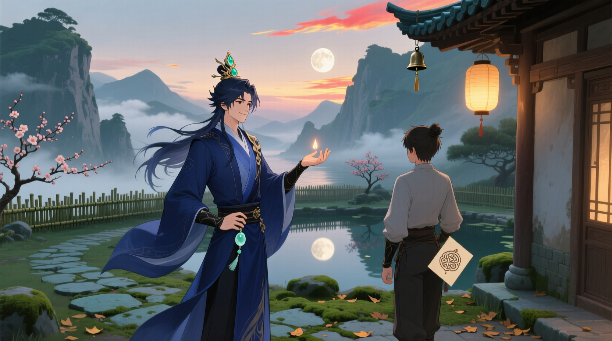

东浩纪的《动物化的后现代：从御宅族透析消费社会》是一部以日本御宅族文化为切入点，对当代人类精神结构与文化逻辑进行哲学透视的著作。作者指出，御宅族并非单纯逃避现实的亚文化群体，而是战后日本社会在意义崩溃与大叙事终结后，最早进入“后现代状态”的人类样本。他们不再通过故事与理想追求意义，而是像“数据库动物”一样，以角色、属性、萌要素为单位消费世界；他们的文化是“超平面”的，没有深度、没有中心，而他们自身也成为可切换的“多重人格”。东浩纪藉由御宅族文化揭示出：在信息化与虚拟化的时代，人类的存在方式正从“思考的主体”转变为“被数据连接的节点”，动物化的御宅族，正是未来社会的镜像。

<!--more-->

> 《动物化的后现代》成书于 2001 年。2014 年以《动物化的后现代：御宅族如何影响日本文化》为名的中文译著是中国台湾的学者褚炫初翻译出版的。而 2024 年由上海人民出版社再版的版本将书名改为《动物化的后现代：从御宅族透析消费社会》，本文所依据的即为该版本。
>
> 两个中文译本在内容上基本一致，但在个别术语的翻译上有所差异。不过，这些差异并不影响对书中核心观点的理解。

---

下面我们从头开始，**按照作者的创作顺序**（也就是书的论证逻辑）逐章、逐节讲解。我们将每节分成三个层面来理解：

1. **内容梗概**（作者写了什么）
2. **思想解读**（核心论点与哲学背景）
3. **当代意义**（它在今天的文化/社会中意味着什么）

## 第一章 御宅族的拟日本



**主题**：御宅族文化如何反映日本战后社会的精神结构。



### 1.1 何谓御宅族系文化？

#### 📖 内容梗概

东浩纪首先界定了“御宅族（Otaku）”这一概念。他指出：

- 御宅族不仅仅是沉迷动画、漫画、游戏的年轻人；
- 到 1990 年代，他们已成长为拥有社会地位的成年人（30 ～ 40 岁），是一种**世代文化现象**；
- 御宅族文化已在日本社会深深扎根，甚至影响了亚洲的次文化。

同时，作者提及宫崎勤事件（1989 年的连环杀人案），媒体将“御宅族”与犯罪画上等号，使整个群体长期背负污名。

而在这种社会歧视之下，御宅族们反而强化了自我认同，形成了一种“以被压迫为荣”的文化共同体。

> “御宅族们开始以身为御宅族为荣，形成了一种自负的姿态。”

#### 💡 思想解读

东浩纪的第一章从社会心理学角度入手——他认为御宅族并非病态群体，而是**战后日本社会结构变化的产物**。尤其是：

- 在“家庭—学校—公司”三层社会结构崩解后，日本社会的“共同体”失效；
- 御宅族们创造了新的归属感：**虚构的共同体**（通过动画、角色、作品形成的想象团体）。

这正是**后现代社会的典型特征**：现实世界的联系被削弱，人们转向虚构世界寻找身份与情感。

#### 🌏 当代意义

这一节为全书奠基：“御宅族文化”不只是亚文化，而是日本社会在失去“宏大叙事”后产生的新文化模式。

今天的网络社群、虚拟偶像、粉丝文化，其根源都可以追溯到这里。

### 1.2 御宅族的拟日本

#### 📖 内容梗概

这一节进入“御宅族文化的美学核心”——为什么御宅族作品中充满“日本味”？东浩纪指出：

- 御宅族文化并不是传统日本文化的延续；
- 它是“**用美国原料制造的日本式幻想**”；
- 也就是说，它是“拟日本（pseudo-Japan）”：一种对日本的再造、扭曲和再消费。

例子包括：

- 动画《福星小子》中将日本妖怪与科幻结合；
- 动画《机动战舰抚子》中对日本军国主义和英雄主义的讽刺；
- 动画《机械女神 J》中“拟江户”式的世界：高科技与前现代共存的幻想都市。

#### 💡 思想解读

东浩纪的关键论点是：

> 御宅族文化的“日本性”不是继承，而是重构。
>
> 它是一种“以战后创伤为背景”的文化再生。

具体逻辑：

1. 战败 → 传统断裂 → 对美国的自卑；
2. 动漫作为美国文化的变形产物（有限动画、超级英雄模式）；
3. 日本人将这种美国技术“日本化”，发展出新的美学（静止画面、角色中心）；
4. 最终出现“拟日本”幻想：既非真实的日本，也非美国——是一种文化混种。

东浩纪称之为“**战败的美学**”——御宅族文化用幻想的方式掩盖日本战后的心理创伤。

#### 🌏 当代意义

1. 动漫中“巫女”“樱花”“制服”等元素并非传统，而是对“传统的再造”；
2. 日本在全球文化中的成功（ACG 输出）其实建立在这种“拟日本”的自我表演上；
3. 对今天的日本文化研究者来说，这是一个警示。

> “我们所认知的日本文化，可能本身就是御宅族式的构造物。”



**案例分析**

如图所示，这是一名同时具备“巫女”“樱花”“制服”等多种典型日本文化符号的女性角色形象。尽管该形象是 AI 强行生成的，严格意义上说并不存在于任何具体的动漫作品中，但是其所体现的文化符号却是深植于日本社会的，理论上的确可以将各种元素自由组合。

具体来说，其上身所着的具有大和民族特色的传统白衣绯袴巫女服，象征着日本的传统文化与宗教信仰；四周点缀的樱花则是日本的国花，象征着日本文化中的美学——生命、死亡、重生、无常、短暂的美丽；而下身所穿的水手服制服，则是现代日本学生的典型服装，象征着少女纯真与青春的理想化，也代表着现代日本社会与教育体系。这种将多种典型日本文化符号融合在一起的形象，正体现了御宅族文化中“拟日本”的特征，即通过对传统与现代元素的再造与混合，创造出一种独特的文化表达方式。



### 1.3 御宅族文化与后现代主义

#### 📖 内容梗概

东浩纪进一步指出：御宅族文化的兴起与“后现代主义的流行”是同步的。

- 1980 年代，日本经济腾飞，社会陷入“**自恋与漂浮**”的氛围；
- 后现代主义（postmodernism）在学术界成为潮流（浅田彰《结构与力》、柄谷行人等）；
- 这股思潮与御宅族文化互相支撑：

  - “后现代主义提供了思想框架，御宅族文化提供了文化实践。”

作者还引用法国哲学家科耶夫（Alexandre Kojève）的观点：

> 世界最终会分为两种社会：
>
> “动物化的美国”与“自命清高的日本”。
>
> 日本是后历史社会的象征。

东浩纪指出，这种理论曾被日本知识界当作“精神胜利”使用，暗示日本站在文明的最前线。

御宅族文化正是在这种“日本走在世界前面”的幻想中成长的。

#### 💡 思想解读

“后现代主义”在此并非学术术语，而是一种**时代精神（Zeitgeist）** 。在东浩纪看来：

- 御宅族文化不是“落后”的，而是**后现代化最彻底的产物**；
- 日本社会之所以接受这种文化，是因为它已经提前进入“后现代状态”；
- “御宅族”成为后现代主体的象征：

  - 没有历史、没有理想、只在虚构与数据中生活。

#### 🌏 当代意义

- 东浩纪揭示了日本社会从“现代主义”向“后现代主义”过渡的精神症候；
- 他预见了今天的网络时代：

  - 一个以“虚拟认同”和“自我消费”为主的文化结构。

- 这节的意义相当于为第二章《数据库动物》奠基：

  - ——为什么人类开始以“数据”和“角色要素”代替故事与意义。

### 本章总结



御宅族文化 = 战败后日本社会的心理投影



> “它既是美国文化的变形体，也是对日本身份的幻想性再造。”

东浩纪在第一章构建了他整本书的哲学基础：

| 层次       | 内容                         |
| ---------- | ---------------------------- |
| 社会学层面 | 御宅族群体的社会化、世代变迁 |
| 文化层面   | 拟日本、战败创伤、美国影响   |
| 思想层面   | 后现代主义、自恋与拟像       |
| 精神层面   | 对日本身份的幻想性重建       |

## 第二章 数据库动物



**主题**：御宅族文化中的“故事”崩塌后，人类如何以“数据库”的方式消费世界。



这是东浩纪的理论核心，影响极大——它不仅奠定了他在日本思想界的地位，也成为后来“萌文化”“元叙事崩溃”研究的关键词。

### 2.1 御宅族与后现代

#### 📖 内容梗概

东浩纪一开篇就指出：御宅族文化是后现代社会的典型产物，因为它展现出两种特征：

1. **拟像的增殖（Simulacra Proliferation）**

   - 御宅族热衷于“**二次创作**”：同人志、同人游戏、同人模型等；
   - 这些创作模糊了原创与复制的界线；
   - 原作、衍生、恶搞、改编彼此叠加、循环；
   - 世界变成了“复制品的复制品”——布希亚（Baudrillard）所谓的“拟像社会”。

2. **大叙事的凋零（Decline of Grand Narratives）**

   - 御宅族不再追求宏大意义或社会理想；
   - 他们的人际关系和价值体系都建立在**虚构世界**之中；
   - 从政治、宗教、家庭的“现实认同”，转向“虚构认同”；
   - 动画、游戏、小说成为新的“共同体”。

> “御宅族不是逃避现实，而是因为现实不再提供有用的价值体系。”

#### 💡 思想解读

东浩纪在这里用两位法国思想家的概念作理论支撑：

| 哲学家                   | 概念              | 在御宅族文化中的体现         |
| ------------------------ | ----------------- | ---------------------------- |
| 让·布希亚（Baudrillard） | 拟像（Simulacra） | 二次创作与模仿的无限循环     |
| 李欧塔（Lyotard）        | 大叙事的崩溃      | “意义”失效，只剩碎片化小故事 |

这意味着：

- 御宅族文化是后现代社会“去意义化”的极致体现。
- 现实不再由“真理”支配，而是由“趣味”和“数据”驱动。

#### 🌏 当代意义

- 网络迷因、同人创作、AI 生成内容……都在重演这种“拟像增殖”；
- 今天的粉丝文化（例如二创、同人文、AI 绘图）就是御宅族式的后现代创作机制。



**案例分析**

“**同人创作**”（日语：同人誌／どうじんし，Dōjinshi；中文常简称“同人”）是指爱好者基于已有作品（如动漫、游戏、小说、影视剧等）或原创设定，出于非商业或半商业目的进行的二次创作活动及其产物。磕 CP（Character Pairing，角色配对）是同人创作中的一种常见形式，指将两个角色配对在一起，通常以浪漫或亲密关系为主题进行创作。

如图所示，《名侦探柯南》中的工藤新一 x 毛利兰（新兰 CP）和江户川柯南 x 灰原哀（柯哀 CP）是同人创作中非常受欢迎的配对组合。甚至网络上还曾一度掀起“新兰大战柯哀”的热潮，粉丝们通过同人小说、漫画、插画等形式表达对这两对 CP 的喜爱与支持。



### 2.2 故事消费

#### 📖 内容梗概

这一节是对御宅族消费心理的社会学分析。东浩纪借鉴了大塚英志的《故事消费论》：

- 战后日本的娱乐结构从“作者讲故事”转向“消费者自己拼故事”；
- 动漫、小说、游戏等媒介提供“素材”，读者负责“组合”；
- 因此消费的对象，不再是一个完整叙事，而是“故事的数据库”。

他提出著名的转折概念：

> “树状图的世界（故事结构）” → “数据库的世界（要素结构）”

在数据库的世界中，消费者不再在意故事的逻辑或主题，而是：

- “角色是否可爱？”
- “设定是否萌？”
- “世界观是否有共鸣？”

#### 💡 思想解读

“故事消费”到“数据库消费”的转型，是后现代文化的根本转向。

| 类型       | 特征                             | 例子                           |
| ---------- | -------------------------------- | ------------------------------ |
| 故事消费   | 追求情节连贯、角色成长、主题意义 | 《高达》《星球大战》           |
| 数据库消费 | 追求角色属性、视觉符号、要素拼装 | 《Fate》《Love Live!》《原神》 |

消费者不再需要“意义”，只要“要素组合”能刺激欲望即可。

这就是“后现代的消费结构”。

#### 🌏 当代意义

东浩纪的这一节预言了今天的娱乐生态：

- “人物卡池”“抽卡系统”“皮肤收集”“元宇宙资产”等概念本质上都是**数据库消费**；
- TikTok、短视频文化同样体现了这种“去叙事化”的欲望结构。

### 2.3 大型非叙事

#### 📖 内容梗概

东浩纪在此进一步解释：

后现代社会的大叙事（宗教、理想、历史）消失后，人类转而创造“虚构的替代品”。

御宅族的“世界观（world setting）”就是这种替代品。比如：

- 《新世纪福音战士》表面上是机战动画，实则是对“意义缺失”的隐喻；
- 御宅族沉浸其中，不是为了理解世界，而是为了在虚构中找到安全感。

> “御宅族用虚构替代了意识形态，用设定替代了信仰。”

#### 💡 思想解读

东浩纪指出：“大叙事的凋零”不代表人类放弃虚构，而是**虚构变成了填补意义的工具**。

他称之为“非叙事的大型系统”：一个没有中心、没有真理、却可以无限生成的虚构体系。

#### 🌏 当代意义

- 今天的“多宇宙叙事（Multiverse）”和“开放世界游戏”正是这种“非叙事结构”的延续；
- 人类在虚构中寻找“情感结构”而非“意义结构”；
- 比如：你在《原神》中并不关心主线，而是在角色互动中获得满足。



**案例分析**

《原神》中一个非常典型的例子是玩家与角色“钟离”的互动，尤其是在他的角色故事任务（传说任务）和日常对话中所体现的情感联结。

在钟离的传说任务《辞行久远之躯》中，主线剧情其实并不复杂：钟离作为契约之神，正准备卸下尘世的职责，而玩家协助他完成最后的仪式。但真正打动玩家的，并不是这个“卸任神明”的宏大叙事，而是任务中穿插的细节：钟离对璃月千年历史的深情回望、他对契约精神近乎固执的坚持、以及他在与玩家对话时流露出的温柔与孤独。比如，他会认真地为玩家讲解一道菜的历史渊源，或是在雨天默默撑伞，说“契约虽已终结，但陪伴无需理由”。

此外，在日常互动中，玩家回到尘歌壶（家园系统）时，若邀请钟离作为访客，他会站在庭院中凝望远方，轻声说：“此地虽小，却有烟火气，甚好。” 这类台词没有推动任何剧情，却营造出一种宁静、陪伴的情感氛围。

玩家从中获得的满足，并非来自“拯救提瓦特”这样的宏大意义，而是源于与钟离建立的一种拟社会关系（parasocial relationship）——仿佛他是一位博学、沉稳又略带古风的朋友。这种情感结构（如陪伴感、被理解感、文化共鸣）正是《动物化的后现代》所指出的：当代玩家更在意虚构角色能否唤起细腻的情感体验，而非故事是否具有哲学深度或终极意义。

因此，钟离的例子很好地诠释了“在角色互动中获得满足”这一观点。



### 2.4 萌的要素

#### 📖 内容梗概

这一节提出了本书最具影响力的关键词之一：

> **“萌（Moe）”是后现代欲望的单位。**

东浩纪解释：

- 萌是一种“情感反应”，不是故事性的，而是要素性的；
- 消费者对“角色的特征（属性）”产生反应：眼镜、长发、傲娇、巫女、姐姐属性……；
- 这些“要素”是可以自由组合的；
- 因此，萌是一种**可数据库化的欲望结构**。

#### 💡 思想解读

这节揭示了“数据库消费”的心理机制：

- 萌是人与虚构世界之间的接口；
- 当消费者面对虚构角色时，不再追求“认同”，而是追求“触发（trigger）”；
- 这就是“动物化”的开端：

  - **刺激 --> 反应**，没有中介意义。

#### 🌏 当代意义

- “萌”是数字时代的基本情感逻辑：表情包、头像、贴纸、虚拟主播，都以“要素化的可爱”刺激用户；
- 东浩纪的“萌理论”被视为日本文化进入“后意义社会”的标志。



**萌属性表**

下面的表格总结了一些典型的萌属性及其含义和在《名侦探柯南》中的代表角色：

> 由于我相对更熟悉《名侦探柯南》，所以表格中的角色示例均来自该作品，供读者参考理解各类萌属性的具体体现。
>
> ⚠️ 可能存在错误或遗漏，欢迎指正补充！

| 萌属性分类                              | 定义与特点                                                                                                 | 《名侦探柯南》角色示例                                                                                                                             |
| :-------------------------------------- | :--------------------------------------------------------------------------------------------------------- | :------------------------------------------------------------------------------------------------------------------------------------------------- |
| **傲娇（ツンデレ）**                    | 外表强硬、口是心非，对喜欢的人表面冷淡但内心温柔。                                                         | 灰原哀 —— 经常对柯南口气冷淡、毒舌，但在关键时刻处处关心他。                                                                                       |
| **病娇（ヤンデレ）**                    | 对爱执着甚至病态，爱到疯狂、占有欲极强。                                                                   | 铃木园子曾一度在恋爱脑状态下表现出轻微病娇倾向（如过度保护京极真）。                                                                               |
| **天然呆（天然ボケ）**                  | 思维脱线、天真单纯、反应慢但惹人怜爱。                                                                     | 毛利兰 —— 天然善良，对柯南的身份长期未察觉。                                                                                                       |
| **冷艳系 / 冷美人**                     | 外表冷漠理智，不轻易流露情感，但气质高雅。                                                                 | 世良真纯 —— 外表干练冷静，实际上感情细腻。                                                                                                         |
| **元气少女**                            | 活力十足、阳光外向、总能带动气氛。                                                                         | 铃木园子 —— 爱热闹、话多、性格直爽。                                                                                                               |
| **萝莉（ロリ）**                        | 年龄或外表幼小、可爱感强，激发保护欲。                                                                     | 吉田步美 —— 元气天然萝莉。                                                                                                                         |
| **御姐（お姉さん系）**                  | 成熟、有魅力、可靠且温柔或性感。                                                                           | 妃英理 —— 冷静干练又关心家人，典型知性御姐。 贝尔摩德（苦艾酒）—— 性感、女人味十足的千面魔女。                                                  |
| **大小姐（お嬢様）**                    | 富家千金气质，礼貌端庄，有时略带优越感。                                                                   | 铃木园子 —— 来自财阀家庭，典型的大小姐属性。                                                                                                       |
| **学姐/学长系**                         | 年长、有引导感、令人仰慕。                                                                                 | 世良真纯 —— 对柯南表现出关照与指导感。                                                                                                             |
| **青梅竹马**                            | 从小一起长大，情感深厚。                                                                                   | 毛利兰 —— 与新一从小相识、互相喜欢。                                                                                                               |
| **黑长直**                              | 黑发直发、温柔典雅、纯洁形象的象征。                                                                       | 毛利兰 —— 黑长直发，兼具温柔与坚强。                                                                                                               |
| **眼镜系（メガネっ娘）**                | 佩戴眼镜的角色，通常表现为知性、文静。                                                                     | 灰原哀（有时戴眼镜）、阿笠博士（知性代表）、妃英理（冷静干练的女性形象）。                                                                         |
| **呆毛（アホ毛）**                      | 头发上翘一根，象征天然与可爱。                                                                             | 少见于柯南角色，但少年侦探团中的元太或光彦偶有造型带呆毛。                                                                                         |
| **猫系性格**                            | 高冷、独立、偶尔撒娇。                                                                                     | 灰原哀 —— 冷淡但在信任的人面前会柔软。                                                                                                             |
| **犬系性格**                            | 忠诚、热情、喜欢陪伴。                                                                                     | 毛利兰 —— 一心一意守护新一，忠诚温柔。                                                                                                             |
| **兄控 / 妹控**                         | 对兄妹有强烈依恋或保护欲。                                                                                 | 世良真纯对赤井秀一（哥哥）的依恋。                                                                                                                 |
| **正太控 / 姐控**                       | 喜欢年下或年上的关系。                                                                                     | 柯南与灰原之间略带“正太 x 萝莉”的微妙关系。                                                                                                        |
| **抖 S（サド）**                        | 喜欢调戏、支配别人，从中获得乐趣。                                                                         | 灰原哀偶尔以冷嘲热讽“整”柯南。                                                                                                                     |
| **抖 M（マゾ）**                        | 享受被支配或被调侃的过程。                                                                                 | 柯南被灰原“调侃”时甘之如饴。                                                                                                                       |
| **腹黑（腹黒い）**                      | 外表温和、内心腹黑、有心机。                                                                               | 黑羽快斗（怪盗基德）—— 外表玩世不恭，内心精明周到。 若狭留美 —— 为报仇不顾同伴（小林老师）的安危利用其作为诱饵让黑衣组织狙击手暴露。            |
| **笨蛋（バカっ娘）**                    | 性格单纯、容易犯傻但不失可爱。                                                                             | 铃木园子、步美 —— 常因轻信而闹出笑话。                                                                                                             |
| **冷淡理科系**                          | 逻辑导向、感情表达少。                                                                                     | 灰原哀、阿笠博士。                                                                                                                                 |
| **正义热血系**                          | 崇尚正义、勇敢冲动。                                                                                       | 工藤新一 —— 永远的“正义侦探”。                                                                                                                     |
| **冷酷系（クール系）**                  | 外表冷静、言语克制、不流露情感，带有强烈的压迫感。                                                         | 琴酒 —— 无论是杀人、指挥组织任务还是对待同伴，他始终面无表情、声音低沉冷峻。                                                                       |
| **异色瞳（オッドアイ／Heterochromia）** | 指左右眼颜色不同的角色，常用于视觉上表现“非凡存在”。象征双重人格、身份秘密、宿命冲突、超凡能力、悲剧美感。 | 库拉索 —— 黑衣组织的冷酷杀手 vs 少年侦探团治愈下的失忆善人，最后为保护众人不惜牺牲自己。                                                           |
| **反差萌（ギャップ萌え）**              | 外表或职业与真实性格形成强烈反差。                                                                         | 安室透 —— 表面是亲切的咖啡店店员，实际上是黑衣组织卧底、公安警察。温柔笑容下隐藏冷酷智谋。 若狭留美 —— 表面是温柔的老师，实际上是冷酷的复仇者。 |
| **无口（むくち）**                      | 不善言辞、沉默寡言，给人神秘感。                                                                           | 赤井秀一 —— 少言寡语、以行动代替情绪。                                                                                                             |
| **黑化（こくか）**                      | 在强烈情感或压抑的心理刺激下，性格或行为突然变得极端、暴力或疯狂，出现“黑暗面”。                           | 若狭留美 —— 羽田浩司送给自己的将棋护身符丢失不见后，毫不留情地袭击了安室透。                                                                       |
| **乙女（おとめ）**                      | 温柔、柔弱、恋爱向、容易被保护、带有少女情怀或幻想感的萌系特质。                                           | 毛利兰 —— 典型的乙女形象，温柔体贴，对爱情充满幻想。                                                                                               |



### 2.5 数据库消费

#### 📖 内容梗概

这一节系统化总结了前面的逻辑：

| 阶段          | 特征                       |
| ------------- | -------------------------- |
| 1️⃣ 故事消费   | 消费者阅读完整叙事         |
| 2️⃣ 萌的要素   | 从叙事中提取可欲望化元素   |
| 3️⃣ 数据库消费 | 对这些要素自由组合、再生产 |

东浩纪指出：

- 在这种模式中，“作品”只是数据库的一个输出；
- 消费者与创作者的界线消失；
- “角色魅力 --> 作品整体”，因此御宅族能跨作品地喜欢角色（如不同作品中的“女仆属性”）。

#### 💡 思想解读

数据库消费的关键不是内容，而是结构。

消费者在面对“无限组合可能性”时，成为数据库的一部分。

人类的消费行为从“理解故事”退化为“响应刺激”——于是，东浩纪称这种状态为：

> “动物的时代（the age of animals）。”

#### 🌏 当代意义

- 它预示了社交媒体、算法推荐、AI 内容生成的逻辑；
- 我们不再消费意义，而是消费标签（hashtags）、属性（tags）、视觉符号；
- 东浩纪几乎预见了“信息茧房”和“数据人格”的未来。

### 2.6 ~ 2.9 从拟像到动物的时代

这几节把“数据库消费”推向社会学结论：

1. **拟像与数据库**：

   - 从布希亚的“拟像社会”发展到“数据库社会”；
   - 前者是“复制现实”，后者是“直接生成现实”。

2. **清高主义与犬儒主义**：

   - 御宅族虽然被嘲笑为宅，但实际上他们代表了“新的真诚”：

     - 他们不相信意义，却仍愿意投入虚构。

3. **解离的人类**：

   - 人们对虚构的投入变成“反射行为”；
   - 游戏、动画、恋爱模拟等让人感动落泪，但这种情感是程序化的。

4. **动物的时代**：

   - 在一个没有“他者”的社会里，人类退化为“动物”

     - ——他们直接对刺激反应，不再思考“为什么”。

> “御宅族不是堕落的人类，而是新时代的人类模型。”

### 本章总结

| 概念       | 含义             | 对应现象             |
| ---------- | ---------------- | -------------------- |
| 拟像       | 复制的复制       | 二次创作、衍生作品   |
| 大叙事崩溃 | 意义失效         | 无中心的虚构系统     |
| 萌         | 情感触发的要素   | 角色属性、视觉标签   |
| 数据库     | 欲望的结构化系统 | ACG、社交媒体、算法  |
| 动物化     | 刺激-反应型消费  | 信息流、抽卡、短视频 |

## 第三章 超平面性与多重人格



**主题**：后现代社会的空间与主体结构：

世界变得“平面化”，人类变成“多重人格的存在”。



这一章在哲学层面上延伸了第二章“数据库动物”的理论。

东浩纪从**艺术美学（superflat）**&#8203;和**心理结构（multiple personality）**&#8203;两条线索，说明后现代社会中人类的“自我”如何被彻底扁平化。

### 3.1 超平面性是什么？

#### 📖 内容梗概

“超平面性（Superflat）”是艺术家村上隆提出的美学概念。他认为：

> 日本的视觉文化（从浮世绘到动画）具有“无透视”的特征，
>
> 即——没有深度、没有背景、所有元素都在一个平面上共存。

东浩纪引用这一概念，用来描述后现代文化的精神特征：

- 动画、游戏、漫画中的角色与世界都在“同一层面”上；
- 没有“内外”“高低”“中心与边缘”的区分；
- 一切符号、角色、信息都并列存在；
- 这是一种**扁平的存在论**（flat ontology）。

例如：

- 动画人物与观众之间的界限模糊；
- 角色设定、背景世界、粉丝创作都在同一层面流通；
- 作品不再“表达意义”，而是**展示结构与表面**。

> “后现代文化的世界，不再有‘深度’，只有不断流动的表层。”

#### 💡 思想解读

东浩纪的“超平面性”是美学与哲学的结合。

| 层面 | 意义                               |
| ---- | ---------------------------------- |
| 美学 | 平面化的图像、去透视的视觉世界     |
| 社会 | 媒介的平等化：电视、网络、广告并列 |
| 思想 | 意义层次坍塌：没有“更深的真理”     |
| 主体 | 人的自我结构变成“并列碎片”         |

也就是说：

> “超平面性”不仅描述视觉艺术，更是一种**时代的感知结构**。
>
> 在数据库社会中，世界本身被“平面化为信息界面”。

#### 🌏 当代意义

- 在社交媒体上，真实事件、虚拟角色、AI 生成图像都在同一个 feed 中并列；
- 这是典型的“超平面”世界：没有中心，没有权威，只有信息的平等流动；
- 东浩纪预言了“信息空间（info-space）取代现实空间”的趋势。

### 3.2 HTML 的世界：从层次到链接

#### 📖 内容梗概

东浩纪进一步用互联网来解释“超平面性”。

- 在传统文学中，意义是“层次化”的（主题 --> 情节 --> 人物 --> 细节）；
- 而在网络（尤其是 HTML 超文本）中，意义是**超链接式**的；
- 没有“中心”，只有节点之间的连接；
- 用户的体验是跳跃式的，而非线性的。

> “在网络上，所有信息都是等价的链接节点。”

他指出，这与御宅族文化极其相似：

- 动漫、游戏、同人文化都是“超链接结构”；
- 用户可以任意组合角色、情节、设定；
- 世界由“节点（要素）”而非“整体（叙事）”构成；
- 这正是第二章“数据库消费”的空间表现。

#### 💡 思想解读

东浩纪用“HTML 世界”来比喻后现代社会：

- 人类的思维方式从“纵深结构”变成“横向网络”；
- 哲学上，从“深度的追求（意义）”转向“关系的编织（结构）”；
- 人的主体不再像小说人物那样有发展线，而像网页一样由无数超链接构成。

> “后现代主体就像一个被超链接化的网络节点。”

#### 🌏 当代意义

- 今天的社交媒体、推荐算法、AI 语义网络，几乎完全实现了东浩纪的“HTML 人类”；
- 我们通过标签（tags）和推荐（links）生活，而不再在意内容的“深度”；
- “信息的平等”取代了“意义的深度”。

### 3.3 多重人格的诞生

#### 📖 内容梗概

在“超平面”社会中，主体（人）也被扁平化。东浩纪指出：

- 在现代社会，人类拥有“统一的自我”；
- 在后现代社会，人类拥有“多重人格（multiple selves）”；
- 每一个人格对应一个语境（工作身份、社交账号、兴趣社区等）；
- 人类在不同语境间自由切换，而不再追求整体一致。

御宅族正是这种“多重人格”的典型代表：

- 在现实中，他们可能沉默寡言；
- 在虚拟世界中，他们是创作者、恋人、英雄；
- 他们的“身份”是可切换的，不再是固定的。

> “御宅族的存在方式不是逃避，而是新的主体形式。”

#### 💡 思想解读

东浩纪认为，这种“多重人格”不是病理现象，而是**结构性的时代特征**。

这背后受到了法国哲学家德勒兹（Gilles Deleuze）与瓜塔里（Guattari）“**分裂主体**”的影响：

| 理论                 | 核心                 | 与御宅族的对应             |
| -------------------- | -------------------- | -------------------------- |
| 德勒兹《反俄狄浦斯》 | 欲望是流动的、分裂的 | 御宅族在虚构世界中流动身份 |
| 德里达“解构”         | 中心的崩溃           | 主体不再有核心人格         |
| 后结构主义           | 语言即身份           | 网络 ID 即人格             |

换句话说，御宅族的“多重人格”正是后现代社会的“正常人格”。

#### 🌏 当代意义

- 我们每个人现在都在网络上拥有多个身份：推特、B 站、Reddit、工作邮箱……
- 这些人格彼此独立、互不矛盾；
- 东浩纪预言了这种“分裂人格常态化”的时代；
- 他的洞见几乎完美预测了**元宇宙人格**与**虚拟主播文化**的出现。

### 3.4 从主体到网络：后现代人类的存在方式

#### 📖 内容梗概

东浩纪在此提出哲学总结：

> “后现代主体不是个体，而是节点（node）。”
>
> “我们每个人都被嵌入网络，通过数据库被定义。”

在这种社会中：

- 自我是被数据描述的；
- 他人不是通过经验，而是通过资料认识的；
- 关系是接口式的，而非情感式的；
- 存在是一种“被连接”的状态。

他称之为：

> “**数据库的存在论**（ontology of database）。”

#### 💡 思想解读

这其实是对现代性人类学的反转：

| 时代   | 主体结构             | 特征             |
| ------ | -------------------- | ---------------- |
| 现代   | 自我中心（笛卡尔式） | “我思故我在”     |
| 后现代 | 网络节点             | “我被连接故我在” |

后现代的“我”不是独立思考的意识，而是一个被算法、媒介、数据库定义的集合体。

#### 🌏 当代意义

- 社交媒体的“身份即数据”；
- 人工智能时代的“数据即人格”；
- 大模型（LLM）生成内容的逻辑几乎正是东浩纪的预言实现：

  - 它没有“自我”，只有“数据库的再组合”。

### 本章总结

> “御宅族文化并非堕落，而是对后现代社会的先行实践。”

东浩纪在结尾强调：

- 御宅族并没有堕落为动物，而是适应了新时代；
- 他们展示了“后意义社会”的生存样式；
- 他们通过数据库、虚构、网络，创造出新的存在论。

于是，全书的思想线索闭合为一条清晰的演化链：

| 阶段   | 社会结构 | 文化形式       | 主体形态 |
| ------ | -------- | -------------- | -------- |
| 第一章 | 拟日本   | 战后文化、幻想 | 自我寻找 |
| 第二章 | 数据库   | 萌、要素消费   | 动物化   |
| 第三章 | 超平面   | 网络、超链接   | 多重人格 |

东浩纪并非在批判“御宅族”，而是在说：

> “他们是新的人类类型（posthuman type）。”
>
> “他们的存在方式——数据库化、去中心化、多重人格化——将成为所有人的未来。”

## 📘 总结：从“御宅族”到“我们每一个人”

| 概念       | 东浩纪的定义         | 当代延伸               |
| ---------- | -------------------- | ---------------------- |
| 拟日本     | 战后文化的幻想再造   | 文化身份的自我表演     |
| 萌         | 欲望的最小单位       | 情感算法化（推荐系统） |
| 数据库动物 | 消费刺激而非意义     | 短视频、算法推荐用户   |
| 超平面性   | 世界无层次的并列结构 | 社交媒体、信息流       |
| 多重人格   | 网络节点式自我       | 虚拟身份、数字人格     |

📖 **东浩纪的结论**

> “人类已经进入动物的时代——
>
> 一个不再追求真理、而是追求刺激的时代。
>
> 但这并非终结，而是一种新的开始。”

---

## 读后感——对东浩纪的批判

诚然，东浩纪对日本社会在上世纪 90 年代泡沫破裂后的文化现象进行了深刻的剖析，且其提出的理论颇有见解。他吸收了后现代主义的思想，将其应用于御宅族文化的分析中，提出了“数据库动物”和“超平面性”等概念。这些概念在当时的文化语境下具有一定的前瞻性，且时至今日仍然具有启发性。

然而，当东浩纪谈及对御宅族文化现象的看法时，则认为它是后现代主义的必然结果。他并没有进一步深挖其背后的深层原因，只是简单地认为是二战战胜日本的美国文化影响所致，受限于战败国拧巴的历史叙事。

另外，展望未来，他认为这种御宅族文化现象普遍存在且不可避免，甚至将其视为人类社会发展的必然趋势。这种观点在我看来是有失偏颇的。下面，我将基于马克思主义的立场和方法，对东浩纪的观点进行批判。

### 对“数据库消费”缺乏历史与阶级分析的批判

东浩纪认为，后现代社会中，人们不再消费“宏大叙事”（如国家、民族、革命等），而是转向对“数据库”中孤立符号（如萌元素、角色设定）的消费，即“数据库消费”。这种观点虽然捕捉到了当代文化消费的碎片化特征，但**忽略了消费行为背后的社会关系与生产方式**。

作为马克思主义者，我们应当进一步思考：

- “数据库消费”并非凭空出现，而是**晚期资本主义商品逻辑发展的产物**。符号、角色、设定之所以能被拆解、重组、消费，是因为它们已经被商品化，成为文化工业的一部分。
- 这种消费模式根植于**资本积累的需要**：资本通过制造差异、更新符号、刺激欲望，不断再生产消费市场。东浩纪将这种现象描述为“动物化”（即人类退化为仅凭欲望驱动的动物），却未追问：**是谁在操控数据库？谁在生产这些符号？谁从中获利？**

从目前的商业模式来看，御宅族文化是文化作品先行，极大地满足了经济下行期人们对精神慰藉的需求，从而催生了大量的衍生品市场和二次创作市场。最后资本通过对御宅族文化的挖掘和利用，形成了一个庞大的文化产业链条，进一步强化了御宅族文化的存在和发展，同时也使得日本在冷战结束后保持了三十多年的文化软实力。

### 对“宏大叙事消亡”论的质疑

东浩纪沿袭利奥塔的观点，认为宏大叙事在后现代已失效。然而，**宏大叙事的“失效”是意识形态现象**，而非历史事实。资本主义危机（如 2008 年金融危机、气候危机、全球不平等加剧）恰恰证明，我们需要新的、更有力的总体性分析框架，而非放弃对社会整体结构的理解。

马克思主义本身并非僵化的“元叙事”，而是**以历史唯物主义为基础的批判方法**，能够解释包括“数据库消费”在内的文化现象如何根植于特定的生产关系。

御宅族的动物化从其本质上看，是人的动物性和人的主观能动性的扭曲与异化。御宅族实际上是自己否定了自己作为人的主体性，沦为了肉体和欲望自由组合的“数据库动物”。然而，东浩纪却将其视为后现代社会的常态化现象，实际上是对人类主体性的放弃。或者说，这是又一种新形式的“愚民化”。

### “动物化”概念的唯心主义倾向

东浩纪用“动物化”描述人类从“语言性存在”（依赖叙事与意义）退化为“欲望性存在”（仅回应数据库中的刺激）。这一概念隐含一种**文化决定论或技术决定论**，将人的行为简化为对符号系统的被动反应。那这跟狗经过训练后对某些刺激（如铃声）产生反应又有什么区别呢？

作为马克思主义者，我们应当进一步思考：

- 人的意识与欲望并非孤立于社会生产之外。 **“欲望”本身是被社会建构的**，尤其在资本主义社会中，欲望被广告、媒体、算法系统性地塑造，以服务于资本增殖。
- 将消费者描绘为“动物化”的被动主体，**忽视了阶级斗争、集体行动与意识觉醒的可能性**。而且，这种观点强化了对个体的异化，完全忽视了人类的主体性与能动性。

用相对通俗的语言来说，马克思主义认为，当不同的人在看到相同的数据库符号时，他们的反应并非完全相同，而是受到其社会地位、阶级背景、文化认同等多重因素的影响。人类并非简单的“动物”，而是具有复杂社会关系和历史背景的主体。譬如正直善良守法的人看到《名侦探柯南》中的琴酒时，只会觉得他是个坏人，但这与二次元萌属性所渲染的冷酷邪恶到极致而感到帅气的形象是完全格格不入的。

### 逃避现实的精神鸦片

马克思在《〈黑格尔法哲学批判〉导言》中指出，宗教是人民的鸦片。御宅族文化同样也应当被视为一种精神鸦片，它使人们沉浸在虚拟世界中，逃避现实生活的压力与困境。

逃避现实，即“二次元”的本意——与现实世界中的“三次元”相对立。其理论依据就是东浩纪所指出的“宏大叙事消亡”，即人们不再相信现实世界中的理想、信仰与历史，而是转向虚构世界寻求慰藉。

在马克思主义者看来，逃避现实的本质就是在否认实践作为改造客观物质世界的力量这一根本原理，它的危害显而易见：

- 逃避现实使人们失去了对社会变革的信心，进而放弃了对抗压迫与不公的斗争。
- 这种文化消费的碎片化趋势，导致人们对现实问题的关注度降低，无法形成有效的集体行动。
- 最终，逃避现实的结果是个体的孤立与无力感加剧，反而助长了现存体制的稳定。

于是，越来越多的人动不动就说自己很焦虑，emo 了，抑郁了，甚至产生自杀倾向。这些现象的背后，正是御宅族文化所带来的精神鸦片效应。它使人们染上一种“虚拟”毒瘾，每当情绪低落时，总要磕磕 CP 这样的鸦片，来企图使自己相信爱情，但却不相信现实中的爱情。

## 结语

> “哲学家们只是用不同方式解释世界，而问题在于改变世界。”

东浩纪解释了“动物化”的症状，但马克思主义者一定会追问：谁在喂养这只动物？怎样才能解放它？
