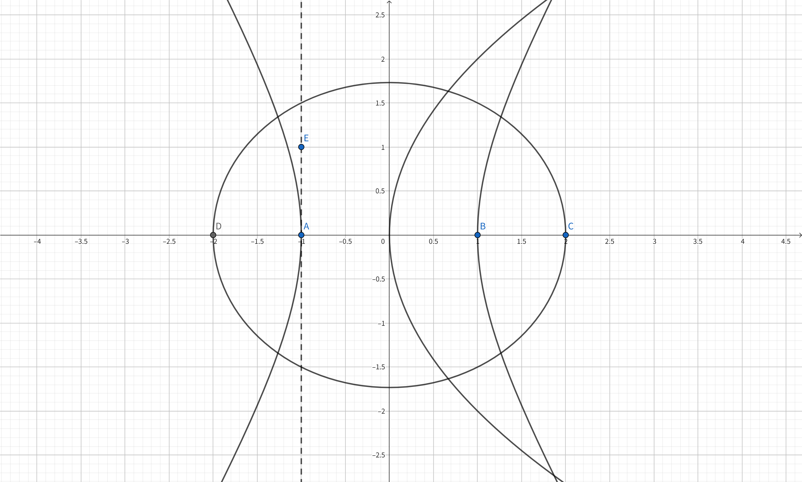
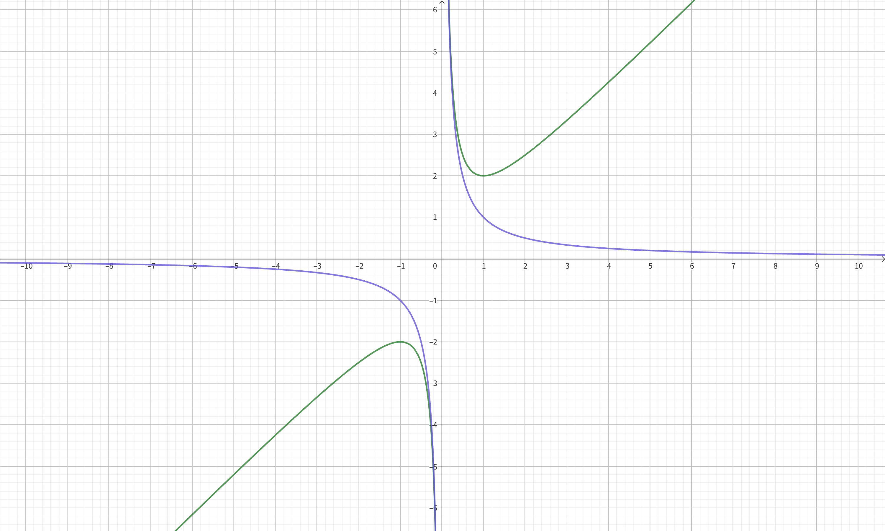
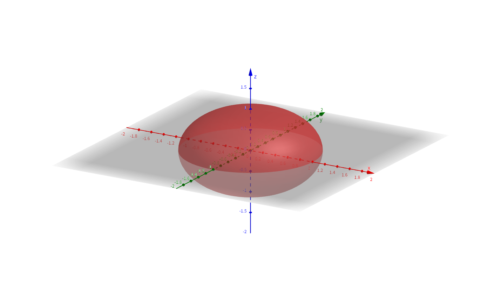
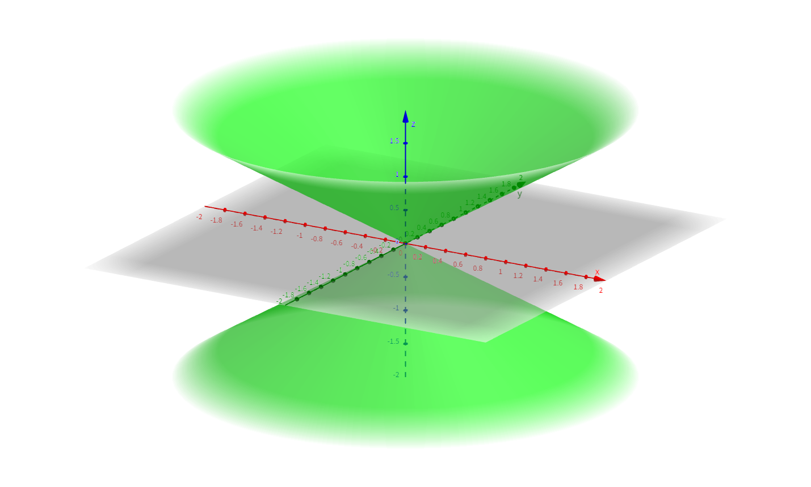
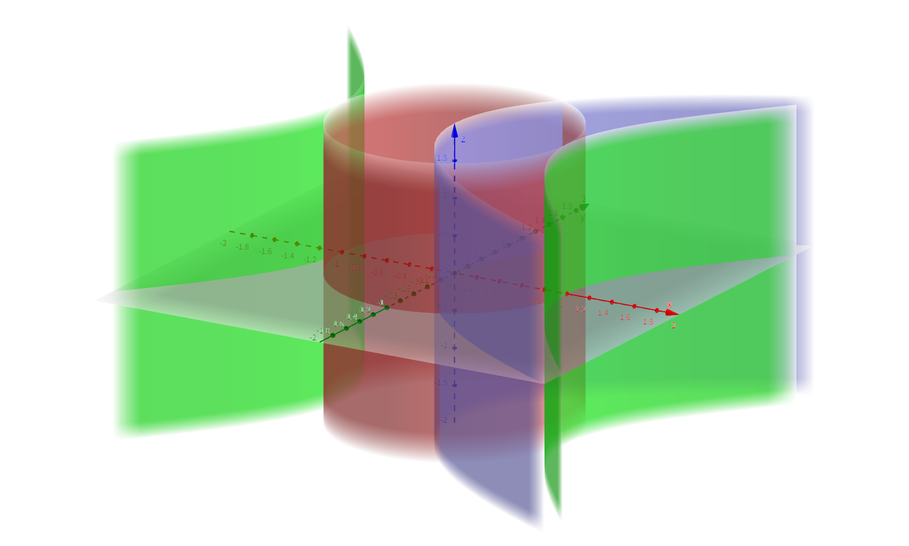
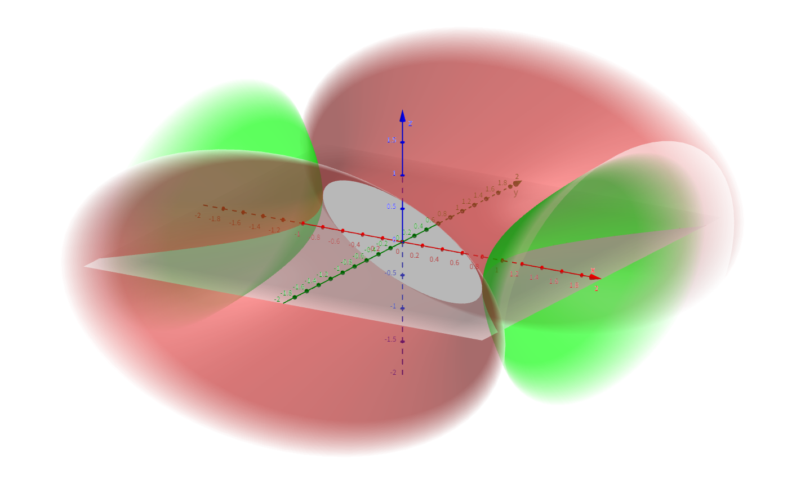
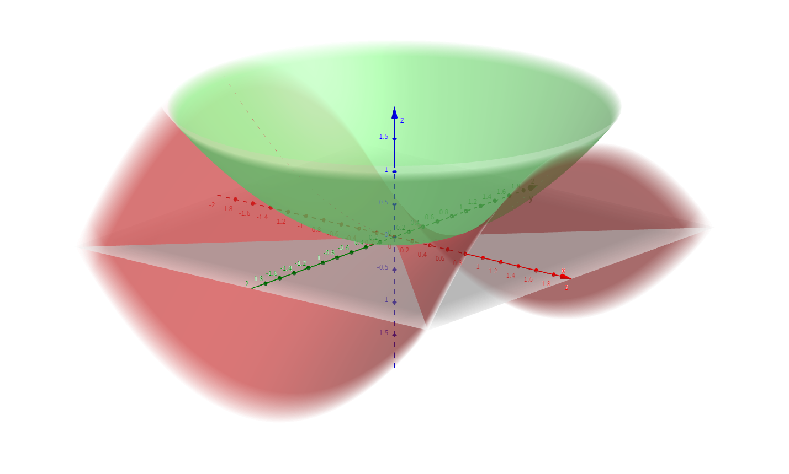

<!--more-->

------

## 圆锥曲线及其方程

### 椭圆的标准方程

$$
\begin{aligned}
  \dfrac{x^2}{a^2} + \dfrac{y^2}{b^2} = 1 \quad (a, b > 0)
\end{aligned}
$$

当 \(a = b = r\) 时，这个方程表示圆

$$
\begin{aligned}
  x^2 + y^2 = r^2 \quad (r > 0)
\end{aligned}
$$

### 双曲线的标准方程

$$
\begin{aligned}
  \dfrac{x^2}{a^2} - \dfrac{y^2}{b^2} = 1 \quad (a, b > 0) \\
  \dfrac{y^2}{a^2} - \dfrac{x^2}{b^2} = 1 \quad (a, b > 0)
\end{aligned}
$$

### 抛物线的标准方程

$$
\begin{aligned}
  y^2 = 2px \\
  x^2 = 2py
\end{aligned}
$$

### 圆锥曲线的一般方程

圆锥曲线的一般方程是一个关于 \(x, y\) 的二次方程

$$
\begin{aligned}
  Ax^2 + By^2 + 2Cxy + 2Dx + 2Ex + F = 0 \tag{1}
\end{aligned}
$$

之所以有部分项的前面有系数 2，是为了方便用高等代数的形式来表示，即

$$
\begin{aligned}
  \begin{bmatrix}
    x & y & 1
  \end{bmatrix}
  \begin{bmatrix}
    A & C & D \\
    C & B & E \\
    D & E & F
  \end{bmatrix}
  \begin{bmatrix}
    x \\
    y \\
    1
  \end{bmatrix} = 0 \tag{2}
\end{aligned}
$$

## 圆锥曲线的形状判定

### 旋转变换矩阵

$$
R = \begin{bmatrix}
  \cos \theta & -\sin \theta \\
  \sin \theta & \cos \theta
\end{bmatrix}
$$

它是一个正交矩阵，这意味着

$$
R R^{\top} = R^{\top} R = I
$$

又因为逆矩阵的定义

$$
\begin{aligned}
  R R^{-1} = R^{-1} R = I
\end{aligned}
$$

所以

$$
\begin{aligned}
  R^{-1} = R^{\top}
\end{aligned}
$$



**正交变换**

正交矩阵对应的变换称为正交变换。两个向量经过正交变换后

- 夹角不变
- 模长不变

由此可知，对于曲线（乃至曲面甚至更高维度的超曲面），作正交变换，形状一定不变！



我们所熟知的反比例函数图像为什么是双曲线，是因为

$$
\begin{aligned}
  xy &= k
\end{aligned}
$$

的两条渐近线分别为 \(x\) 轴和 \(y\) 轴。作变量变换

$$
\begin{aligned}
  \begin{bmatrix}
    u \\
    v
  \end{bmatrix} &= \begin{bmatrix}
    \dfrac{\sqrt{2}}{2} & -\dfrac{\sqrt{2}}{2} \\
    \dfrac{\sqrt{2}}{2} & \dfrac{\sqrt{2}}{2}
  \end{bmatrix} \begin{bmatrix}
    x \\
    y
  \end{bmatrix}
\end{aligned}
$$

反解出

$$
\begin{aligned}
  \begin{bmatrix}
    x \\
    y
  \end{bmatrix} &= \begin{bmatrix}
    \dfrac{\sqrt{2}}{2} & \dfrac{\sqrt{2}}{2} \\
    -\dfrac{\sqrt{2}}{2} & \dfrac{\sqrt{2}}{2}
  \end{bmatrix} \begin{bmatrix}
    u \\
    v
  \end{bmatrix}
\end{aligned}
$$

代入原方程得

$$
\begin{aligned}
  \left(\dfrac{\sqrt{2}}{2}u + \dfrac{\sqrt{2}}{2}v \right)
  \left(-\dfrac{\sqrt{2}}{2}u + \dfrac{\sqrt{2}}{2}v\right) &= k \\
  v^2 - u^2 &= 2k \\
  \dfrac{v^2}{2k} - \dfrac{u^2}{2k} &= 1
\end{aligned}
$$

同样，对勾函数（也称为双勾函数）的图像也是双曲线，是因为

$$
\begin{aligned}
  y = x + \dfrac{k}{x}
\end{aligned}
$$

的两条渐近线分别为

$$
\begin{aligned}
  x = 0 \\
  y = x
\end{aligned}
$$

作变量变换

$$
\begin{aligned}
  \begin{bmatrix}
    u \\
    v
  \end{bmatrix} &= \begin{bmatrix}
    \cos \dfrac{\pi}{8} & -\sin \dfrac{\pi}{8} \\
    \sin \dfrac{\pi}{8} & \cos \dfrac{\pi}{8}
  \end{bmatrix} \begin{bmatrix}
    x \\
    y
  \end{bmatrix}
\end{aligned}
$$

由角平分线第二定理，可以快速计算出 \(\dfrac{\pi}{8}\) 的正弦值为

$$
\begin{aligned}
  \sin \dfrac{\pi}{8} &= \sin \dfrac{\pi}{4} \cdot \dfrac{1}{\sqrt{2} + 1} \\
  &= 1 - \dfrac{\sqrt{2}}{2} \\
  \Longrightarrow \cos \dfrac{\pi}{8} &= \sqrt{1 - \sin^{2} \dfrac{\pi}{8}} \\
  &= \sqrt{\sqrt{2} - \dfrac{1}{2}}
\end{aligned}
$$

接着，求出旋转变换的逆矩阵即可反解出 \(x, y\)，代入原式即可证明。

### 矩阵相似对角化

系数矩阵

$$
P = \begin{bmatrix}
  A & C & D \\
  C & B & E \\
  D & E & F
\end{bmatrix}
$$

是一个实对称矩阵，所以它必定可相似对角化，即存在可逆矩阵 \(Q\)，使得

$$
\begin{aligned}
  Q^{-1} P Q &= \begin{bmatrix}
    \lambda_1 & & \\
    & \lambda_2 & \\
    & & \lambda_3
  \end{bmatrix} \\
  P &\sim \begin{bmatrix}
    \lambda_1 & & \\
    & \lambda_2 & \\
    & & \lambda_3
  \end{bmatrix}
\end{aligned}
$$

其中，\(\lambda_1\), \(\lambda_2\), \(\lambda_3\) 为特征值。相似的矩阵具有相同的特征值，它刻画了特征向量的伸缩倍数。

注意这里的 \(\lambda_1\), \(\lambda_2\) 是直接对 \(x, y\) 作用的，它们共同影响了圆锥曲线的形状。下面我们就来进行深入分析。

### 圆锥曲线的不变量

圆锥曲线一共有如下 3 个不变量

$$
\begin{aligned}
  I_1 &= \operatorname{tr} \begin{pmatrix}
    A & C \\
    C & B
  \end{pmatrix} = A + B \\
  I_2 &= \operatorname{det} \begin{pmatrix}
    A & C \\
    C & B
  \end{pmatrix} = AB - C^2 \\
  I_3 &= \operatorname{det} \begin{pmatrix}
    A & C & D \\
    C & B & E \\
    D & E & F
  \end{pmatrix}
\end{aligned}
$$

其中，\(I_2\) 是重要的判断圆锥曲线形状的依据。若

$$
\begin{bmatrix}
  A & C \\
  C & B
\end{bmatrix} \sim \begin{bmatrix}
  \lambda_1 & \\
  & \lambda_2
\end{bmatrix}
$$

作为对角矩阵的特征值，不妨设 \(\lambda_1 < \lambda_2\)，那么

1. 若 \(0 < \lambda_1 < \lambda_2\), 则该圆锥曲线是椭圆。
2. 若 \(\lambda_1 < 0 < \lambda_2\), 则该圆锥曲线是双曲线。
3. 若 \(0 = \lambda_1 < \lambda_2\)，则该圆锥曲线是抛物线。

并且，可以确定椭圆或双曲线的离心率为

$$
e = \sqrt{1 - \dfrac{\lambda_1}{\lambda_2}} \begin{cases}
  = 0 \quad \text{圆} \\
  \in (0, 1) \quad \text{椭圆} \\
  = 1 \quad \text{抛物线} \\
  \in (1, +\infty) \quad \text{双曲线}
\end{cases}
$$

又因为任意方阵 \(A\) 的所有特征值之积等于 \(A\) 的行列式，即

$$
\prod_{i} \lambda_i = \operatorname{det} A
$$

所以

$$
I_2 = AB - C^2 \begin{cases}
  < 0 \quad \text{双曲线} \\
  = 0 \quad \text{抛物线} \\
  > 0 \quad \text{椭圆}
\end{cases}
$$



为什么不用 \(I_3\) 来判断圆锥曲线的形状呢？

注意在系数矩阵中，是包含比二次项次数更低的一次项和常数项的。在比二次项次数更低的分量上进行线性运算，只能是维度更低的运算，例如平移、投影等。低维运算对高维特征没有影响。

研究圆锥曲线的形状，二次齐次式是关键。在三维空间乃至更高维度也是如此，归根结底是二次齐次式。这也是为什么要定义二次型的原因。



## 二次曲面及其方程

从二维升至三维后，情况虽然变得更为复杂，但是总有一些根本的不变量和规律。首先，我们先直观地感受一下二次曲面的种类和分类。

### 椭球面

$$
\dfrac{x^2}{a^2} + \dfrac{y^2}{b^2} + \dfrac{z^2}{c^2} = 1 \quad (a, b, c > 0)
$$

特别地，当 \(a = b = c = r\) 时，方程表示球面

$$
x^2 + y^2 + z^2 = r^2 \quad (r > 0)
$$

由于双曲线和抛物线不是封闭曲线，所以它们不可能形成类似于球面的封闭曲面。

### 椭圆锥面

$$
\dfrac{x^2}{a^2} + \dfrac{y^2}{b^2} = z^2 \quad (a, b > 0)
$$

特别地，当 \(a = b = r\) 时，方程表示圆锥面

$$
\dfrac{x^2}{r^2} + \dfrac{y^2}{r^2} = z^2 \quad (r > 0)
$$

### 二次柱面

圆锥曲线沿某个坐标轴运动的轨迹就形成了二次柱面，即

$$
\begin{aligned}
  \dfrac{x^2}{a^2} + \dfrac{y^2}{b^2} &= 1 \quad (a, b > 0) \\
  \dfrac{x^2}{a^2} - \dfrac{y^2}{b^2} &= 1 \quad (a, b > 0) \\
  y^2 &= 2px
\end{aligned}
$$

### 双曲面

双曲线沿其不同的对称轴旋转的轨迹形成了不同的双曲面，包括单叶双曲面和双叶双曲面，即

$$
\begin{aligned}
  \dfrac{x^2}{a^2} + \dfrac{y^2}{b^2} - \dfrac{z^2}{c^2} &= 1 \quad (a, b, c > 0) \\
  \dfrac{x^2}{a^2} - \dfrac{y^2}{b^2} - \dfrac{z^2}{c^2} &= 1 \quad (a, b, c > 0) \\
\end{aligned}
$$

### 抛物面

椭圆和双曲线的标准方程都是二次齐次式，它们可以在更高的三维空间中和抛物线相结合，形成椭圆抛物面和双曲抛物面（马鞍面）。

$$
\begin{aligned}
  \dfrac{x^2}{a^2} + \dfrac{y^2}{b^2} &= z \quad (a, b > 0) \\
  \dfrac{x^2}{a^2} - \dfrac{y^2}{b^2} &= z \quad (a, b > 0)
\end{aligned}
$$

### 二次曲面的一般方程

通过类比推理，二次曲面的一般方程是一个关于 \(x, y, z\) 的二次方程。用高等代数的形式表示就是

$$
\begin{bmatrix}
  x & y & z & 1
\end{bmatrix} \begin{bmatrix}
  A & D & E & G \\
  D & B & F & H \\
  E & F & C & J \\
  G & H & J & K \\
\end{bmatrix} \begin{bmatrix}
  x \\
  y \\
  z \\
  1
\end{bmatrix} = 0
$$

同理，二次齐次式的系数矩阵

$$
\begin{bmatrix}
  A & D & E \\
  D & B & F \\
  E & F & C
\end{bmatrix}
$$

是判断二次曲面类型的关键。当维度升高后，有必要引入一套更加规范化的理论，这就是**二次型**。

## 二次型

$$
\begin{aligned}
  f(x_1, x_2, \cdots, x_n) &= \begin{bmatrix}
    x_1 & x_2 & \cdots & x_n
  \end{bmatrix} \begin{bmatrix}
    a_{11} & a_{12} & \cdots & a_{1n} \\
    a_{21} & a_{22} & \cdots & a_{2n} \\
    \vdots & \vdots & \ddots & \vdots \\
    a_{n1} & a_{n2} & \cdots & a_{nn}
  \end{bmatrix} \begin{bmatrix}
    x_1 \\
    x_2 \\
    \vdots \\
    x_n
  \end{bmatrix} \\
  &= x^{\top} A x
\end{aligned}
$$

通过二次型的定义，可以将 \(n\) 维空间的任意一个超二次曲面的方程和一个 \(n\) 阶对称矩阵对应起来。

### 矩阵合同

两个矩阵 \(A, B\) 合同，即

$$
\begin{aligned}
  A \simeq B
\end{aligned}
$$

等价于，存在一个可逆矩阵 \(Q\)，使得

$$
\begin{aligned}
  Q^{\top} A Q &= B
\end{aligned}
$$

二次型在可逆变换前后，矩阵合同。又因为二次型和实对称矩阵一一对应，所以任何二次型的系数矩阵一定和一个对角矩阵合同。



**矩阵等价、合同、相似**

顾名思义，“等价、合同、相似”，直观的感受是需要满足的条件越来越多，满足后者则一定满足前者。然而，实际情况会更复杂一些。

两个矩阵**等价**，说明它们的**秩**相等。这意味着，向量组线性相关，可以互相线性表示。

两个矩阵**合同**，说明它们在秩相等的基础上，正负**惯性指数**相等。

两个矩阵**相似**，说明它们不光正负惯性指数相等，而且还有相同的**特征值**。

上述关于相似和合同的结论仅仅只是在实对称矩阵上才成立。对于一般的 \(n\) 阶方阵，合同和相似没有任何关系，但它们都一定能推出等价。



### 标准形

只含平方项的二次型被称为二次型的标准形，即

$$
\begin{aligned}
  f(x_1, x_2, \cdots, x_n) &= \begin{bmatrix}
    x_1 & x_2 & \cdots & x_n
  \end{bmatrix} \begin{bmatrix}
    \lambda_1 & & & \\
    & \lambda_2 & & \\
    & & \ddots & \\
    & & & \lambda_n
  \end{bmatrix} \begin{bmatrix}
    x_1 \\
    x_2 \\
    \vdots \\
    x_n
  \end{bmatrix} \\
  &= \lambda_1 x_1^2 + \lambda_2 x_2^2 + \cdots + \lambda_n x_n^2
\end{aligned}
$$

任何二次型都可以通过正交变换化为标准形。具体步骤如下：

1. 求特征值和特征向量
2. 确定齐次线性方程的基础解系
3. 施密特正交化、单位化，得到正交变换矩阵

我们再回到二维平面中，定义二次型

$$
f(x, y) = ax^2 + by^2 = k \quad (k > 0)
$$

- 若 \(a > 0, b > 0\)，二次型表示椭圆。
- 若 \(ab < 0\)，二次型表示双曲线。

由于抛物线的方程不是二次齐次式，按上述定义无法通过二次型表示抛物线。参考前文的内容，不难发现，一般的二次多项式若表示抛物线，须满足

$$
\begin{aligned}
  I_2 &= \operatorname{det} \begin{pmatrix}
    A & C \\
    C & B
  \end{pmatrix} = AB - C^2 = 0 \\
  I_3 &= \operatorname{det} \begin{pmatrix}
    A & C & D \\
    C & B & E \\
    D & E & F
  \end{pmatrix} \ne 0
\end{aligned}
$$

类似地，在三维空间中，定义二次型

$$
f(x, y, z) = ax^2 + by^2 + cz^2 = k \quad (k \geqslant 0)
$$

- 若 \(a, b, c\) 都大于 0，二次型表示椭球面。
- 若 \(a, b, c\) 有且仅有一个小于 0，二次型表示单叶双曲面。
- 若 \(a, b, c\) 有且仅有两个小于 0，二次型表示双叶双曲面。
- 若 \(abc = 0\)，二次型是一个柱面。
- 若 \(a, b, c\) 不都同号，且 \(k = 0\)，二次型表示椭圆锥面。

同样地，上述二次齐次式无法表示抛物面。可以用类似二维平面的方法，通过二次曲面的不变量来判断。

### 规范形和惯性指数

通过上述分析，我们发现二次型的标准形的正负是一个重要指标。通过可逆变换（不能是正交变换），可以把二次型化为规范形。

二次型的规范形经过伸缩变换，特征值发生了变化，且取值范围只能是 \(\{1, -1, 0\}\)。大于 0 的特征值个数称为**正惯性指数**，小于 0 的特征值个数称为**负惯性指数**。

### 正定二次型

如果一个二次型的特征值都大于 0，即正惯性指数 \(p = n\)，那么该二次型就是一个**正定二次型**。显然，椭圆、椭球面都是正定二次型，双曲线、双曲面都是不定二次型。

不难发现，不论是二维平面的椭圆，还是三维空间的椭球面，它们具有一个共同的特点：封闭。这意味着，如果一个多元函数是正定的，那么它必然存在最优解。这在凸优化等领域得到广泛应用。