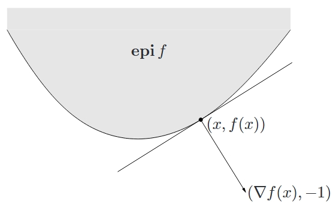

<!--more-->

## 定义

如果 \(\operatorname{dom} f\) 是凸集，且对于任意的 \(x, y \in \operatorname{dom} f\) 和任意的 \(0 \leqslant \theta \leqslant 1\)，若有

$$
f(\theta x+(1-\theta) y) \leqslant \theta f(x)+(1-\theta) f(y)
$$

则称函数 \(f: \mathbf{R}^n \rightarrow \mathbf{R}\) 是凸的。

从几何意义上看，上述不等式意味着点 \((x, f(x))\) 和点 \((y, f(y))\) 之间的线段，即从 \(x\) 到 \(y\) 的弦，在函数 \(f\) 图像的上方。如果不等式中当 \(x \ne y\) 时 \(0 \leqslant \theta \leqslant 1\) 严格成立，则称函数 \(f\) 是严格凸的。

## 扩展值延伸

通常可以定义凸函数的定义域外的值为 \(\infty\)，从而将这个凸函数延伸至全空间 \(\mathbf{R}^n\)。我们定义凸函数 \(f\) 的扩展值延伸：\(\tilde{f}: \mathbf{R}^n \rightarrow \mathbf{R} \cup \{\infty\}\) 如下：

$$
\tilde{f}(x)=\left\{\begin{array}{ll}
f(x) & x \in \operatorname{dom} f \\
\infty & x \notin \operatorname{dom} f
\end{array}\right.
$$

## 一阶条件

假设 \(f\) 可微（即其梯度 \(\nabla f\) 在开集 \(\operatorname{dom} f\) 内处处存在），则函数 \(f\) 是凸函数的充要条件是 \(\operatorname{dom} f\) 是凸集，且对于任意的 \(x, y \in \operatorname{dom} f\)，有

$$
f(y) \geqslant f(x)+\nabla f(x)^{\top}(y-x)
$$

由此得出的仿射函数 \(y\) 即为函数 \(f\) 在点 \(x\) 附近的 Taylor 近似。上面的不等式表明，对于一个凸函数，其一阶 Taylor 近似实质上是原函数的一个全局下估计。反之，如果某个函数的一阶 Taylor 近似总是其全局下估计，那么这个函数是凸的。

同理，可以定义凹函数及其一阶条件。

## 二阶条件

现在假设函数 \(f\) 二阶可微（即对于开集 \(\operatorname{dom} f\) 内的任意一点，它的 Hessian 矩阵或者二阶导数 \(\nabla ^2 f\) 存在），则函数 \(f\) 是凸函数的充要条件是，其 Hessian 矩阵是半正定矩阵，即对所有的 \(x \in \operatorname{dom} f\)，有

$$
\nabla ^2 f(x) \succeq 0
$$

## 下水平集

函数 \(f: \mathbf{R}^n \rightarrow \mathbf{R}\) 的 α-下水平集定义为

$$
C_\alpha = \{ x \in \operatorname{dom} f \mid f(x) \leqslant \alpha \}
$$

## 上境图

函数 \(f: \mathbf{R}^n \rightarrow \mathbf{R}\) 的图像定义为

$$
\{ (x, f(x)) \mid x \in \operatorname{dom} f \}
$$

它是 \(\mathbf{R}^{n+1}\) 空间的一个子集。

函数 \(f: \mathbf{R}^n \rightarrow \mathbf{R}\) 的上镜图定义为

$$
\operatorname{epi} f = \{ (x, f(x)) \mid x \in \operatorname{dom} f, f(x) \leqslant t \}
$$

上镜图的概念很像是下水平集和函数图像二者的结合。从几何上看，上镜图即为在函数图像之上。

定义在 \(\mathbf{R}^n\) 上的凸函数 \(f\) 的上镜图是 \(\mathbf{R}^{n+1}\) 空间的一个凸集，其支撑超平面和一阶条件有着如下图所示的联系：

从图中可以直观地看到，凸函数 \(f\) 在点 \(x\) 处的一阶 Taylor 近似即为其上镜图在 \(x\) 处的支撑超平面。

## Jensen 不等式及其扩展

基本不等式

$$
f(\theta x+(1-\theta) y) \leqslant \theta f(x)+(1-\theta) f(y)
$$

有时也称作 Jensen 不等式。此不等式可以很方便地扩展至更多点的凸组合：如果函数 \(f\) 是凸函数，\(x_1, \cdots, x_k \in \operatorname{f}\)，\(\theta_1, \cdot, \theta_k \geqslant 0\) 且 \(\theta_1 + \cdots + \theta_k = 1\)，则下式成立

$$
f(\theta_1 x_1 + \cdots + \theta_k x_k) \leqslant \theta_1 f(x_1) + \cdots + \theta_k f(x_k)
$$

考虑凸集时，此不等式还可以扩展至无穷项和、积分以及期望。

例如，若在 \(S \subseteq \operatorname{dom} f\) 上 \(p(x) \geqslant 0\) 且 \(\int_{S} p(x) \mathrm{d} x = 1\)，则

$$
f\left(\int_{S} p(x) x \mathrm{~d} x\right) \leqslant \int_{S} f(x) p(x) \mathrm{d} x
$$

再比如，设 \(x\) 是随机变量，若函数 \(f\) 是凸函数，则

$$
f(\mathbf{E}x) \leqslant \mathbf{E} f(x)
$$



我们不妨来回忆以下高中时期我们接触到的凸函数定义，如下

$$
f\left(\frac{x+y}{2}\right) \leqslant \frac{f(x)+f(y)}{2}
$$

其实这就是由 Jensen 提出的最初的一个最简单的不等式。现在，我们可以称上述所有的不等式为 Jensen 不等式。

