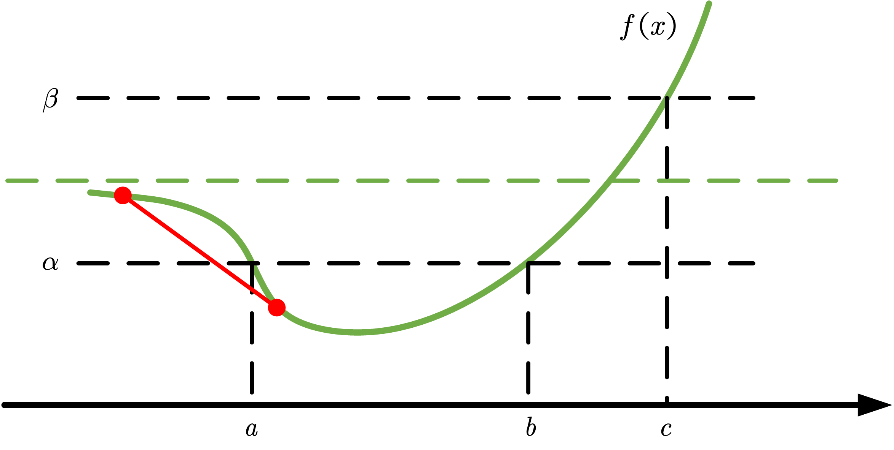

<!--more-->

## 定义

如果函数 \(f: \mathbf{R}^n \rightarrow \mathbf{R}\) 的定义域及所有下水平集 \(\{ x \mid f(x) \leqslant \alpha \}\) 都是凸集，则称函数 \(f\) 是**拟凸函数**（或者**单峰函数**）。

同理，如果函数 \(-f\) 是拟凸函数，并且所有上水平集 \(\{ x \mid f(x) \geqslant \alpha \}\) 都是凸集，那么函数 \(f\) 是拟凹函数。

如果函数 \(f\) 既是拟凸函数又是拟凹函数，则称函数 \(f\) 为拟线性函数，并且其定义域和其所有的水平集 \(\{ x \mid f(x) = \alpha \}\) 都是凸集。



**注意**

凸函数具有凸的下水平集，所以也是拟凸函数。但是拟凸函数不一定是凸函数。下图是一个反例。

如图所示，\(f(x)\) 有一条水平渐近线（图中绿色虚线）。对于任意的 \(\alpha\)，下水平集 \([a, b]\) 是凸集。对于任意的 \(\beta\)，下水平集 \((-\infty, c]\) 是凸集。因此，\(f(x)\) 是拟凸函数。

然而，如图中红色线段所示，该部分不满足凸函数的定义，因此 \(f(x)\) 不是凸函数。



### 举例

#### 一元函数

定义在 \(\mathbf{R}_{++}\) 上的对数函数 \(f(x) = \log x\) 是拟凸函数，也是拟凹函数，因此是拟线性函数。

上取整函数 \(\mathrm{ceil}(x) = \inf \{ z \in Z \mid z \geqslant x \}\) 是拟凸函数，也是拟凹函数，因此是拟线性函数。

#### 多元函数

线性分式函数

$$
f(x)=\dfrac{a^{\top} x+b}{c^{\top} x+d}
$$

是拟凸函数，也是拟凹函数，因此是拟线性函数。其 α-下水平集为

$$
\begin{aligned}
S_{\alpha} &=\left\{x \mid c^{\top} x+d>0,\left(a^{\top} x+b\right) /\left(c^{\top} x+d\right) \leqslant \alpha\right\} \\
&=\left\{x \mid c^{\top} x+d>0, a^{\top} x+b \leqslant \alpha\left(c^{\top} x+d\right)\right\}
\end{aligned}
$$

它是凸集，因为它是一个开端半平面和闭的半平面的交集。

距离比函数

$$
f(x)=\dfrac{\|x-a\|_{2}}{\|x-b\|_{2}}
$$

在半平面 \(\{ x \mid \| x - a \|_2 \leqslant \| x - b \|_2 \}\) 上是拟凸函数。

## 基本性质

### 拟凸函数的 Jensen 不等式

函数 \(f\) 是拟凸函数的充要条件是，\(\operatorname{dom} f\) 是凸集，且对于任意的 \(x, y \in \operatorname{dom} f\) 以及 \(0 \leqslant \theta \leqslant 1\)，有

$$
f(\theta x + (1 - \theta) y) \leqslant \max \{ f(x), f(y) \}
$$

上式的几何意义在于，如果 \(f\) 是拟凸函数，那么 \(x\) 和 \(y\) 之间的函数值不超过 \(f(x)\) 和 \(f(y)\) 之间的最大值。这很好的说明了为什么拟凸函数又被称为单峰函数。

### 连续函数的拟凸性

连续函数 \(f: \mathbf{R} \rightarrow \mathbf{R}\) 是拟凸的，当且仅当下述条件至少有一个成立：

- 函数 \(f\) 是非减的（单调递增）
- 函数 \(f\) 是非增的（单调递减）
- \(\exists c \in \operatorname{dom} f\)，使得对于 \(t \leqslant c\)，\(f\) 非增；对于 \(t \geqslant c\)，\(f\) 非减。

简单来说，如果一个函数是拟凸函数，那么它在定义域内要么具有单调性，要么有且仅有一个峰。

## 可微拟凸函数

### 一阶条件

设函数 \(f: \mathbf{R}^n \rightarrow \mathbf{R}\) 可微，则函数 \(f\) 是拟凸函数的充要条件是，\(\operatorname{dom} f\) 是凸集，且对于 \(\forall x, y \in \operatorname{dom} f\) 有

$$
f(y) \leqslant f(x) \Longrightarrow \nabla f(x)^{\top}(y-x) \leqslant 0
$$

一阶条件的几何意义实际上就是定义了水平集 \(\{ y \mid f(y) \leqslant f(x) \}\) 的一个支撑超平面（\(\nabla f(x)\) 为该超平面的法向量）。

我们注意到用一阶条件判断凸性和判断拟凸性很相似，但实际上二者存在着重要的差别。例如，如果函数 \(f\) 是凸函数且 \(\nabla f(x) = 0\)，那么 \(x\) 是函数 \(f\) 的全局极小点。

然而，对于拟凸函数，这样的论断并不成立。有可能 \(\nabla f(x) = 0\)，但是点 \(x\) 不是 \(f\) 全局最小点。例如 \(f(x) = x^3\) 的 \(x^{*} = 0\) 处，\(\nabla f(x^{*}) = 0\)，但不是极小点而是鞍点。因此，\(f(x) = x^3\) 是拟凸函数而不是凸函数。

### 二阶条件

假设函数 \(f\) 二次可微，如果函数 \(f\) 是拟凸函数，则对于任意 \(x \in \operatorname{dom} f\) 以及任意 \(y \in \mathbf{R}^n\) 有

$$
y^{\top} \nabla f(x)=0 \Longrightarrow y^{\top} \nabla^{2} f(x) y \geqslant 0
$$

对于定义在 \(\mathbf{R}\) 上的一元函数，上述条件可以简化为

$$
f^{\prime} (x) = 0 \Longrightarrow f^{\prime \prime} (x) \geqslant 0
$$

这实际上是我们非常熟悉的一阶导数为零且二阶导数非负的判断方法。

## 保拟凸运算

### 非负加权最大

$$
f = \max \{ w_1 f_1, \cdots, w_m f_m \}
$$

其中 \(w_i \geqslant 0\)，\(f_i\) 是拟凸函数。此性质可以扩展到一般的逐点上确界，即

$$
f(x) = \sup _{y \in C} \{ w(y) g(x, y) \}
$$

其中 \(w(y) \geqslant 0\)，\(y\) 视为参数，\(g(x, y)\) 是关于 \(x\) 的拟凸函数。

### 复合

如果函数 \(g: \mathbf{R}^n \rightarrow \mathbf{R}\) 是拟凸函数，且函数 \(h: \mathbf{R} \rightarrow \mathbf{R}\) 是非减的，则复合函数 \(f = h \circ g\) 是拟凸函数。

拟凸函数和一个仿射函数或者线性分式函数进行复合可以得到拟凸函数。

### 最小化

如果函数 \(f(x, y)\) 是 \(x\) 和 \(y\) 的联合拟凸函数，且 \(C\) 是凸集，则函数

$$
g(x) = \inf _{y \in C} f(x, y)
$$

是拟凸函数。

## 通过一族凸函数进行表示

我们可以很方便地将拟凸函数 \(f\) 的下水平集（凸集）表示成凸函数的不等式。选择一族凸函数 \(\phi_t: \mathbf{R}^n \rightarrow \mathbf{R}\)，\(t \in \mathbf{R}\) 表示凸函数的编号，这些函数满足

$$
f(x) \leqslant t \Longleftrightarrow \phi_{t}(x) \leqslant 0
$$

即拟凸函数 \(f\) 的 \(t\)- 下水平集是凸函数 \(\phi_t\) 的 0-下水平集。