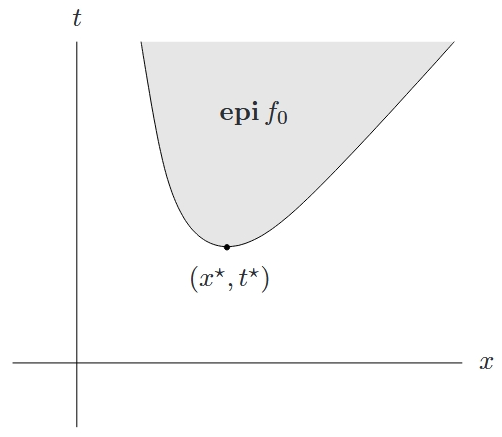

<!--more-->

## 基本术语

$$
\begin{aligned}
    \mathrm{minimize} \quad & f_0(x) \\
    \mathrm{subject\ to} \quad & f_i(x) \leqslant 0, \quad i = 1, \cdots, m \\
    & h_i(x) = 0, \quad i = 1, \cdots, p
\end{aligned}
$$

上式描述的就是一般意义上的优化问题。我们需要明确如下概念：

- 优化变量：\(x \in \mathbf{R}^n\)
- 目标函数：\(f_0: \mathbf{R}^n \rightarrow \mathbf{R}\)
- 不等式约束：\(f_i(x) \leqslant 0\)
- 等式约束：\(h_i(x) = 0\)

如果没有约束，即 \(m = p = 0\)，则称该优化问题为无约束问题。

#### 定义域

$$
\mathcal{D}=\bigcap_{i=0}^{m} \operatorname{dom} f_{i} \cap \bigcap_{i=1}^{p} \operatorname{dom} h_{i}
$$

#### 可行集（约束集）

$$
\{ x \mid x \in \mathcal{D}, f_i(x) \leqslant 0, i=1, \cdots, m, \quad h_i(x) = 0, i=1, \cdots, p \}
$$

#### 最优值

$$
p^{\star}=\inf \{f_{0}(x) \mid f_{i}(x) \leqslant 0, i=1, \cdots, m, \quad h_{i}(x)=0, i=1, \cdots, p\}
$$

\(p^{\star}\) 可以取 \(\pm \infty\)。如果问题不可行，那么 \(p^{\star} = \infty\)；如果问题无下界，那么 \(p^{\star} = -\infty\)。

### 最优点和局部最优点

如果 \(x^{\star}\) 是可行的并且 \(f_0(x^{\star}) = p^{\star}\)，则称 \(x^{\star}\) 为**最优点**，或 \(x^{\star}\) 解决了该优化问题。所有最优解的集合称为**最优集**，记为

$$
X_{\mathrm{opt}}=\{x \mid f_{i}(x) \leqslant 0, i=1, \cdots, m, h_{i}(x)=0, i=1, \cdots, p, f_{0}(x)=p^{\star}\}
$$

如果问题存在最优解，则称最优值是**可得**或**可达**的，称问题**可解**。如果 \(X_{\mathrm{opt}}\) 是空集，则称最优值是不可得或不可达的（这种情况常在问题无下界是发生）。满足 \(f_0(x) \leqslant p^{\star} + \epsilon (\epsilon > 0)\) 的可行解 \(x\) 称为 \(\epsilon\)- 次优。所有 \(\epsilon\)- 次优解的集合称为 \(\epsilon\)- 次优集。

如果 \(\exists R > 0\)，使得

$$
\begin{aligned}
    f_{0}(x)=\inf \{f_{0}(z) \mid f_{i}(z) & \leqslant 0, \quad i=1, \cdots, m, \\
    h_{i}(z)&=0, \quad i=1, \cdots, p, \quad \|z-x\|_{2} \leqslant R\}
\end{aligned}
$$

则称可行解 \(x\) 为局部最优。或换言之，\(x\) 是关于 \(z\) 的优化问题

$$
\begin{aligned}
    \mathrm{minimize} \quad & f_0(z) \\
    \mathrm{subject\ to} \quad & f_i(z) \leqslant 0, \quad i = 1, \cdots, m \\
    & h_i(z) = 0, \quad i = 1, \cdots, p \\
    & \| z - x \|_{2} \leqslant R
\end{aligned}
$$

的解。粗略地讲，这意味着 \(x\) 在可行集内一个点的周围极小化了 \(f_0\)。

如果 \(x\) 可行且 \(f_i(x) = 0\)，则称约束 \(f_i(x) \leqslant 0\) 的第 \(i\) 个不等式在 \(x\) 处**起作用**。如果 \(f_i(x) < 0\) 则约束 \(f_i(x) \leqslant 0\) **不起作用**，称该约束是**冗余的**。去掉冗余约束不改变可行集。

### 举例

下面的例子都是定义在 \(\mathbf{R}_{++}\) 上的初等函数。

$$
\begin{aligned}
    f_0(x) &= \frac{1}{x} \\
    p^{\star} &= 0
\end{aligned}
$$

但最优值不可达。

$$
\begin{aligned}
    f_0(x) &= -\log x \\
    p^{\star} &= -\infty
\end{aligned}
$$

所以该问题无下界。

$$
\begin{aligned}
    f_0(x) &= x \log x \\
    p^{\star} &= \frac{1}{e}
\end{aligned}
$$

能取得唯一最优解。

### 可行性问题

如果目标函数恒等于零，那么其最优解要么是零（如果可行集非空），要么是 \(\infty\)（如果可行集是空集）。我们称其为**可行性问题**，写作

$$
\begin{aligned}
    \mathrm{find} \quad & x \\
    \mathrm{subject\ to} \quad & f_i(z) \leqslant 0, \quad i = 1, \cdots, m \\
    & h_i(z) = 0, \quad i = 1, \cdots, p
\end{aligned}
$$

因此，可行性问题可以用来判断约束是否一致。如是，则找到一个满足它们的点。

## 优化问题的标准表述

$$
\begin{aligned}
    \mathrm{minimize} \quad & f_0(x) \\
    \mathrm{subject\ to} \quad & f_i(x) \leqslant 0, \quad i = 1, \cdots, m \\
    & h_i(x) = 0, \quad i = 1, \cdots, p
\end{aligned}
$$

我们可以通过转化的方式将优化问题的一般形式化为标准形式。例如一般的等式约束：

$$
\begin{aligned}
    & g_i(x) = \tilde{g}_i(x) \\
    \Longleftrightarrow & g_i(x) - \tilde{g}_i(x) = 0
\end{aligned}
$$

可以添加负号更变不等号的方向：

$$
\begin{aligned}
    & f_i(x) \geqslant 0 \\
    \Longleftrightarrow & -f_i(x) \leqslant 0
\end{aligned}
$$

框约束直接约束变量的范围，其可行集看起来是一个方框。

$$
\begin{aligned}
    \mathrm{minimize} \quad & f_0(x) \\
    \mathrm{subject\ to} \quad & l_i \leqslant x_i \leqslant u_i, \quad i = 1, \cdots, n
\end{aligned}
$$

可以将该问题表示成标准形式为

$$
\begin{aligned}
    \mathrm{minimize} \quad & f_0(x) \\
    \mathrm{subject\ to} \quad & l_i - x_i \leqslant 0, \quad i = 1, \cdots, n \\
    & x_i - u_i \leqslant 0, \quad i = 1, \cdots, n
\end{aligned}
$$

### 极大化问题

按习惯，我们主要考虑极小化问题。而极大化问题

$$
\begin{aligned}
    \mathrm{maximize} \quad & f_0(x) \\
    \mathrm{subject\ to} \quad & f_i(x) \leqslant 0, \quad i = 1, \cdots, m \\
    & h_i(x) = 0, \quad i = 1, \cdots, p
\end{aligned}
$$

可以通过在同样的约束下极小化 \(-f_0\) 得到求解。其最优值的定义为

$$
p^{\star}=\sup \{f_{0}(x) \mid f_{i}(x) \leqslant 0, i=1, \cdots, m, \quad h_{i}(x)=0, i=1, \cdots, p\}
$$

## 等价问题

如果对原优化问题进行一些变换后，\(x\) 是原问题的最优解当且仅当 \(x\) 是变换后问题的最优解，则称这两个优化问题是**等价**的。

### 变量变换

设 \(\phi: \mathbf{R}^n \rightarrow \mathbf{R}^n\) 是一映射，其象包含了问题的定义域，即 \(\phi(\operatorname{dom}) \supseteq \mathcal{D}\)。我们定义函数

$$
\begin{aligned}
    \tilde{f}_i(z)=f_i(\phi(z)), &\quad i=0, \cdots, m \\
    \tilde{h}_i(z)=h_i(\phi(z)), &\quad i=1, \cdots, p
\end{aligned}
$$

关于 \(z\) 的问题

$$
\begin{aligned}
    \mathrm{maximize} \quad & \tilde{f}_0(z) \\
    \mathrm{subject\ to} \quad & \tilde{f}_i(z) \leqslant 0, \quad i = 1, \cdots, m \\
    & \tilde{h}_i(z) = 0, \quad i = 1, \cdots, p
\end{aligned}
$$

通过**变量变换**（或**变量代换**）\(x = \phi(z)\) 所联系。

这两个问题显然是等价的。如果 \(x\) 求解了原问题，那么 \(z = \phi^{-1}(x)\) 也求解了变换后的问题；如果 \(z\) 是变换后问题的解，那么 \(x = \phi(z)\) 是原问题的解。

### 目标函数和约束函数的变换

设 \(\psi_0: \mathbf{R} \rightarrow \mathbf{R}\) 单增；\(\psi_1, \cdots, \psi_m: \mathbf{R} \rightarrow \mathbf{R}\) 满足：当且仅当 \(u \leqslant 0\) 时 \(\psi_i(u) \leqslant 0\)；\(\psi_{m+1}, \cdots, \psi_{m+p}: \mathbf{R} \rightarrow \mathbf{R}\) 满足：当且仅当 \(u = 0\) 时 \(\psi_i(u) = 0\)。我们定义复合函数

$$
\begin{aligned}
    \tilde{f}_i(x)&=\psi_i(f_i(x)), \quad i=0, \cdots, m \\
    \tilde{h}_i(x)&=\psi _{m+i}(h_i(x)), \quad i=1, \cdots, p
\end{aligned}
$$

那么，问题

$$
\begin{aligned}
    \mathrm{maximize} \quad & \tilde{f}_0(x) \\
    \mathrm{subject\ to} \quad & \tilde{f}_i(x) \leqslant 0, \quad i = 1, \cdots, m \\
    & \tilde{h}_i(x) = 0, \quad i = 1, \cdots, p
\end{aligned}
$$

显然与标准形式的原问题等价。

#### 举例

考虑无约束的 Euclid 范数极小化问题

$$
\operatorname{minimize} \| Ax - b \|_2, \quad x \in \mathbf{R}^n
$$

因为范数是非负的，所以为了求解方便，我们一般求解范数的平方

$$
\operatorname{minimize} \| Ax - b \|_2^2 = (Ax-b)^{\top}(Ax-b)
$$

这两个问题显然是等价的——因为最优解相同。但要注意，这两个问题是不同的问题。

### 松弛变量

通过观察我们可以得到一个简单的变换，即 \(f_i(x) \leqslant 0\) 等价于存在一个 \(s_i \geqslant 0\) 满足 \(f_i(x) + s_i = 0\)。利用这个变换，我们可以得到问题

$$
\begin{aligned}
    \mathrm{maximize} \quad & f_0(x) \\
    \mathrm{subject\ to} \quad & s_i \geqslant 0, \quad i=1,\cdots,m \\
    & f_i(x) + s_i = 0, \quad i = 1, \cdots, m \\
    & \tilde{h}_i(x) = 0, \quad i = 1, \cdots, p
\end{aligned}
$$

其中 \(x \in \mathbf{R}^n\)，\(s \in \mathbf{R}^m\)。这个问题由 \(n+m\) 个变量，\(m\) 个不等式约束（关于 \(s_i\) 的非负约束）和 \(m+p\) 个等式约束。称新的变量 \(s_i\) 为对应原不等式约束 \(f_i(x) \leqslant 0\) 的**松弛变量**。通过引入松弛变量，我们可以将每个不等式约束替换为一个等式和一个非负约束。

显然，松弛后的问题与原问题是等价的。如果 \((x,s)\) 对松弛后的问题是可行的，那么 \(x\) 对原问题也是可行的，因为 \(s_i = -f_i(x) \geqslant 0\)；反之，如果 \(x\) 是原问题的可行解，那么我们取 \(s_i = -f_i(x)\)，\((x,s)\) 就是松弛后的问题的可行解。

### 消除等式约束

设函数 \(\phi: \mathbf{R}^k \rightarrow \mathbf{R}^n\)，满足

$$
\begin{aligned}
    & h_i(x) = 0, \quad i=1,\cdots,p \\
    \Longleftrightarrow & \exists z \in \mathbf{R}^k, \quad \mathrm{s.t.\ } x=\phi(z)
\end{aligned}
$$

那么，优化问题

$$
\begin{aligned}
    \mathrm{maximize} \quad & \tilde{f}_0(z) = f_0(\phi(z)) \\
    \mathrm{subject\ to} \quad & \tilde{f}_i(z) = f_i(\phi(z)) \leqslant 0, \quad i=1,\cdots,m
\end{aligned}
$$

与原问题等价。转换后的问题含义变量 \(z \in \mathbf{R}^k\)，\(m\) 个不等式约束而没有等式约束——这是因为变量变换 \(\phi\) 暗含了等式约束 \(h_i(x) = 0\)。

### 消除线性等式约束

如果等式约束是线性的，即 \(Ax = b\)，那么我们可以令 \(F \in \mathbf{R}^{n \times k}\) 为满足 \(\mathcal{R}(F) = \mathcal{N}(A)\) 的矩阵。再令 \(x_0\) 表示等式约束的任意可行解，那么线性方程 \(Ax = b\) 的通解可以表示为 \(x=Fz+x_0\)。将之代入原问题可以得到关于 \(z\) 的问题

$$
\begin{aligned}
    \mathrm{maximize} \quad & f_0(Fz+x_0) \\
    \mathrm{subject\ to} \quad & f_i(Fz+x_0) \leqslant 0, \quad i=1,\cdots,m
\end{aligned}
$$

### 引入等式约束

考虑问题

$$
\begin{aligned}
    \mathrm{maximize} \quad & f_0(A_0x+b_0) \\
    \mathrm{subject\ to} \quad & f_i(A_ix+b_i) \leqslant 0, \quad i=1,\cdots,m \\
    & h_i(x) = 0, \quad i=1,\cdots,p
\end{aligned}
$$

这个问题的目标函数和约束函数由函数 \(f_i\) 和仿射变换 \(A_ix+b_i\) 的复合给出。我们引入新的变量 \(y_i\) 和新的等式约束 \(y_i = A_ix + b_i\)，\(i=0,\cdots,m\)，从而构造等价问题

$$
\begin{aligned}
    \mathrm{maximize} \quad & f_0(A_0x+b_0) \\
    \mathrm{subject\ to} \quad & f_i(y_i) \leqslant 0, \quad i=1,\cdots,m \\
    & y_i = A_ix+b_i, \quad i=1,\cdots,m \\
    & h_i(x) = 0, \quad i=1,\cdots,p
\end{aligned}
$$

### 优化部分变量

$$
\inf_{x,y} f(x,y) = \inf_{x} \{ \inf_{y} f(x,y) \}
$$

这是一个简单而普适的规则，说明我们可以先优化一部分变量再优化另一部分变量来优化一个函数。

设变量 \(x \in \mathbf{R}^n\) 被分为 \(x=(x_1,x_2)\)，其中 \(x_1 \in \mathbf{R}^{n_1}\)，\(x_2 \in \mathbf{R}^{n_2}\)，并且 \(n_1+n_2=n\)。考虑问题

$$
\begin{aligned}
    \mathrm{maximize} \quad & f_0(x_1, x_2) \\
    \mathrm{subject\ to} \quad & f_i(x_1) \leqslant 0, \quad i=1,\cdots,m_1 \\
    & \tilde{f}_i(x_2) \leqslant 0, \quad i=1,\cdots,m_2
\end{aligned}
$$

这种约束相互独立的问题适合采用每次只优化一部分变量的方法来进行优化。

### 上镜图问题形式

$$
\begin{aligned}
    \mathrm{maximize} \quad & t \\
    \mathrm{subject\ to} \quad & f_0(x) - t \leqslant 0 \\
    & f_i(x) \leqslant 0, \quad i=1,\cdots,m \\
    & h_i(x) = 0, \quad i=1,\cdots,p
\end{aligned}
$$

其优化变量为 \(x \in \mathbf{R}^n\) 和 \(t \in \mathbf{R}\)。显然，这个问题与原问题是等价的。下图可以很好地说明无约束优化问题的几何意义，即找上镜图中的最低点。

### 隐式与显式约束

我们可以通过改变定义域将任何约束隐式地表达在目标函数中。作为一个极端的例子，可以将标准形式问题表示为如下一个无约束问题

$$
\mathrm{minimize} F(x)
$$

我们用 \(f_0\) 来定义 \(F\)，但其定义域被限定在可行集中

$$
\begin{aligned}
    \operatorname{dom} F = \{ x \in \operatorname{dom} f_0 \mid f_i(x) & \leqslant 0, i=1,\cdots,m \\
    h_i(x) &= 0, i=1,\cdots,p \}
\end{aligned}
$$

然而，这种变换仅仅只是一种符号游戏，它根本不能给求解带来丝毫的方便。