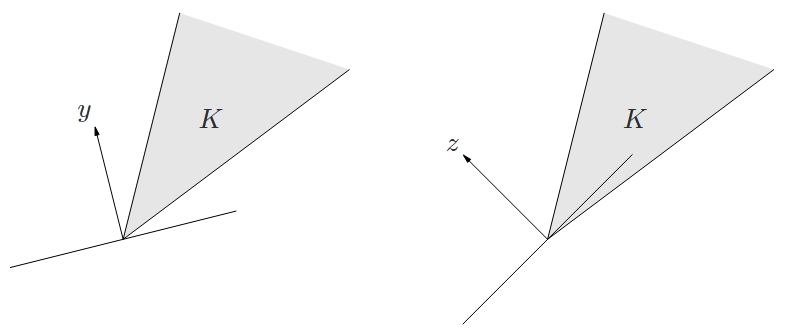
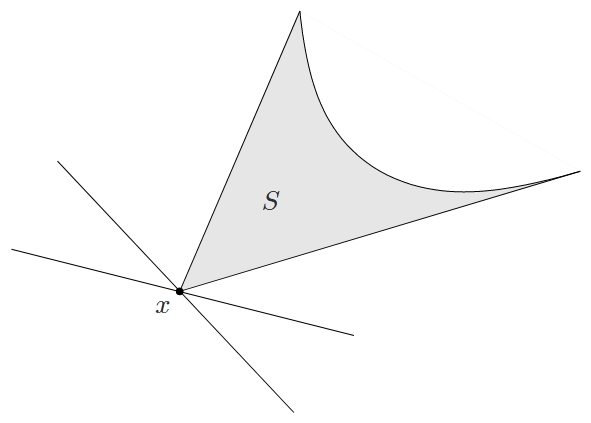
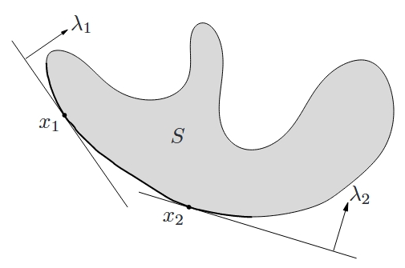

<!--more-->

## 对偶锥

若 \(K\) 为一个锥，则集合

$$
\begin{aligned}
K^{*} = \{y \mid x^{\top} y \geqslant 0, \forall x \in K\}
\end{aligned}
$$

称为 \(K\) 的对偶锥。从几何上看，对偶锥 \(K^{*}\) 是与锥 \(K\) 内的所有向量夹角不超过 90 度的所有向量组成的集合。如图所示，以 \(y\) 为法向量的半空间包含锥 \(K\)，因此 \(y \in K^{*}\)；而以 \(z\) 为法向量的半空间不包含锥 \(K\)，因此 \(z \notin K^{*}\)。

### 对偶锥的性质

- \(K^{*}\) 是闭凸锥。
- \(K_1 \subseteq K_2 \Rightarrow K_2^{*} \subseteq K_1^{*}\)。
- 如果 \(K\) 有非空内部，那么 \(K^{*}\) 是尖的。
- 如果 \(K\) 的闭包是尖的，那么 \(K^{*}\) 有非空内部。
- \(K^{**}\) 是 \(K\) 的凸包的闭包。因此如果 \(K\) 是凸和闭的，那么 \(K^{**}=K\)。

## 广义不等式的对偶

若凸锥 \(K\) 是正常锥，则其对偶锥 \(K^{*}\) 也是正常锥，它可以导出一个广义不等式 \(\preceq_{K^{*}}\)。

### 广义不等式及其对偶的性质

$$
\begin{aligned}
x \preceq_K y \Leftrightarrow \forall \lambda \succeq _{K^{*}} 0, \lambda^{\top} x \leqslant \lambda^{\top} y \\
x \prec_K y \Leftrightarrow \forall \lambda \succeq _{K^{*}} 0 \wedge \lambda \ne 0, \lambda^{\top} x < \lambda^{\top} y
\end{aligned}
$$

## 对偶不等式定义的最（极）大（小）元

### 最小元的对偶性质

\(x\) 是 \(S\) 上关于广义不等式 \(\preceq_K\) 的最小元的充要条件是，对于 \(\forall \lambda \succ_{K^{*}} 0\)，\(x\) 是在 \(z \in S\) 上极小化 \(\lambda^{\top} z\) 的唯一最优解。从几何上看，这意味着对于 \(\forall \lambda \succ_{K^{*}} 0\)，超平面 \(\{z \mid \lambda^{\top} (z-x) = 0\}\) 是在 \(x\) 处对 \(S\) 的一个严格支撑超平面。如图所示。

### 极小元的对偶性质

如果 \(\lambda \succ _{K^{*}} 0\) 并且 \(x\) 在 \(z \in S\) 上极小化 \(\lambda^{\top} z\)，那么 \(x\) 是极小的，如图所示。

其逆命题在一般情况下是不成立的。
