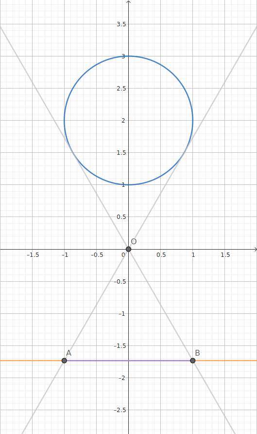

<!--more-->

## 交集

交集运算是保凸的：如果 \(S_1\) 和 \(S_2\) 是凸集，那么 \(S_1 \cap S_2\) 也是凸集。这个性质可以推广到无穷个凸集的交。

## 仿射函数

函数 \(f: \mathbf{R}^n \rightarrow \mathbf{R}^m\) 若满足 \(f(x) = Ax + b\)，其中 \(A \in \mathbf{R}^{m \times n}\)，\(b \in \mathbf{R}^m\)，则称 \(f\) 是仿射函数。设 \(S \subseteq \mathbf{R}^n\) 是凸的，那么 \(S\) 在 \(f\) 下的象

$$
\begin{aligned}
f(S) = \{f(x) \mid x \in S\}
\end{aligned}
$$

也是凸的。从几何上看，凸集经过伸缩变换和平移变换后仍然是凸集。一个凸集向它的某几个坐标的投影也是凸的。

**双曲锥**

$$
\begin{aligned}
\{x \mid x^{\top} P x \leqslant\left(c^{\top} x\right)^{2}, c^{\top} x \geqslant 0\}
\end{aligned}
$$

其中 \(P \in \mathbf{S}_+^n\)，\(c \in \mathbf{R}^n\)。这是因为它是二阶锥

$$
\begin{aligned}
\{(z, t) \mid z^{\top}z \leqslant t^2, t \geqslant 0\}
\end{aligned}
$$

在仿射函数 \(f(x) = (P^{1/2}x, c^{\top}x)\) 下的原象。

**椭球**

$$
\begin{aligned}
\mathcal{E}=\{x \mid\left(x-x_{c}\right)^{\top} P^{-1}\left(x-x_{c}\right) \leqslant 1\}
\end{aligned}
$$

是单位 Euclid 球 \(\{u \mid \|u\| _2 \leqslant 1\}\) 在仿射函数 \(f(u) = P^{1/2}u + x_c\) 下的象，其中 \(P \in \mathbf{S} _{++} ^{n}\)。

## 透视函数

定义 \(P: \mathbf{R}^{n+1} \rightarrow \mathbf{R}^{n}\)，\(P(z, t) = z/t\) 为透视函数，其定义域为 \(\operatorname{dom} P = \mathbf{R}^{n} \times \mathbf{R}_{++}\)。透视函数对向量进行伸缩，或称为规范化，使得最后一维分量为 \(1\) 并舍弃之。



**小孔成像**

我们可以用小孔成像的原理来解释透视函数。

在二维空间 \(\mathbf{R}^{2}\) 中，小孔坐标 \((0, 0)\)。圆 \(x^2 + (y-2)^2 = 1\) 在直线 \(y = -\sqrt{3}\) 上所成的像为线段 \(y = -\sqrt{3}, x \in [-1, 1]\)。如图所示：



一个凸集在透视函数下的象和原象也是凸的，因此透视运算是保凸运算。

## 线性分式函数

线性分式函数有透视函数和仿射函数复合而成。设 \(g: \mathbf{R}^{n} \rightarrow \mathbf{R}^{m+1}\) 是仿射的，即

$$
\begin{aligned}
g(x) & = \left[\begin{array}{c}
A \\
c^{\top}
\end{array}\right] x+\left[\begin{array}{l}
b \\
d
\end{array}\right]
\end{aligned}
$$

其中 \(A \in \mathbf{R}^{m \times n}\)，\(b \in \mathbf{R}^{m}\)，\(c \in \mathbf{R}^{n}\) 并且 \(d \in \mathbf{R}\)。则由 \(f = P \circ g\) 给出的函数 \(f: \mathbf{R}^{n} \rightarrow \mathbf{R}^{m}\)

$$
\begin{aligned}
f(x) & = \frac{A x+b}{c^{\top} x+d}, \quad \operatorname{dom} f = \{x \mid c^{\top} x+d>0\}
\end{aligned}
$$

称为线性分式函数（或投射函数）。如果 \(c=0\)，\(d > 0\)，则 \(f\) 是仿射函数。因此，仿射函数和线性函数被视为特殊的线性分式函数。线性分式函数也是保凸运算。