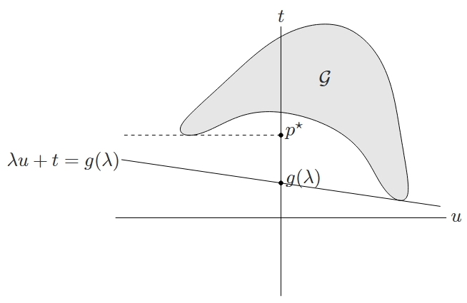
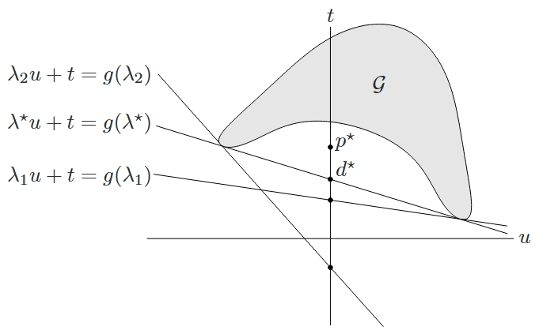
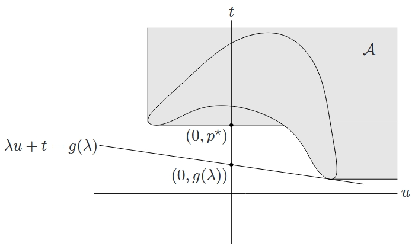

<!--more-->

## 通过函数值集合理解强弱对偶性

可以通过集合

$$
\begin{aligned}
    \mathcal{G}=\{(f_1(x), &\cdots, f_m(x), \\
    h_1(x), &\cdots, h_p(x), f_0(x)) \in \mathbf{R}^m \times \mathbf{R}^p \times \mathbf{R} \mid x \in \mathcal{D}\}
\end{aligned}
$$

给出对偶函数的简单几何解释。事实上，此集合是约束函数和目标函数所取得的函数值。利用集合 \(\mathcal{G}\)，可以很容易地表达优化问题的最优值 \(p^{\star}\)。

$$
p^{\star} = \inf \{ t \mid (u, v, t) \in \mathcal{G}, u \preceq 0, v = 0 \}
$$

求解以 \((\lambda, \nu)\) 为自变量的对偶函数，得到

$$
g(\lambda, \nu) = \inf \{ (\lambda, \nu, 1)^{\top}(u, v, t) \mid (u, v, t) \in \mathcal{G} \}
$$

如果下确界有界，则不等式

$$
(\lambda, \nu, 1)^{\top}(u, v, t) \geqslant g(\lambda, \nu)
$$

定义了集合 \(\mathcal{G}\) 的一个支撑超平面。

针对只有一个（不等式）约束的简单问题，对偶函数和下界 \(g(\lambda) \leqslant p^{\star}\) 的几何解释如图所示。给定 \(\lambda\)，在集合 \(\mathcal{G} = \{ (f_1(x), f_0(x)) \mid x \in \mathcal{D} \}\) 上极小化 \((\lambda, 1)^{\top}(u, t)\)，得到斜率为 \(-\lambda\) 的支撑超平面。支撑超平面与坐标轴 \(u = 0\) 的交点即为 \(g(\lambda)\)。

如图所示，对偶可行的三个 \(\lambda\) 值对应的支撑超平面，这三个值中包含最优值 \(\lambda^{\star}\)。强对偶性此时不成立，最优对偶间隙 \(p^{\star} - d^{\star} > 0\)。

### 上镜图变化

通过下面的理解，我们就可以解释为什么对（大部分）凸问题，强对偶性总是成立。定义集合 \(\mathcal{A} \subseteq \mathbf{R}^m \times \mathbf{R}^p \times \mathbf{R}\) 为

$$
\begin{aligned}
    \mathcal{A} &= G + \{ \mathbf{R}^M_+ \times \{ 0 \} \times \mathbf{R}_+ \} \\
    &= \{ (u, v, t) \mid \exists x \in \mathcal{D}, f_i(x) \leqslant u_i, i=1,\cdots,m, \\
    & \qquad h_i(x) = v_i, i=1,\cdots,p, f_0(x) \leqslant t \}
\end{aligned}
$$

我们可以认为 \(\mathcal{A}\) 是 \(\mathcal{G}\) 的一种上镜图形式，因为 \(\mathcal{A}\) 包含了 \(\mathcal{G}\) 中的所有点以及一些“较坏”的点，即目标函数值或者不等式约束函数值较大的点。

可以用 \(\mathcal{A}\) 来描述最优值

$$
p^{\star}=\inf \{t \mid (0,0,t) \in \mathcal{A}\}
$$

同样的，我们可以通过极小化仿射函数得到关于 \((\lambda, \nu)\) 的对偶函数

$$
g(\lambda, \nu)=\inf \{(\lambda, \nu, 1)^{\top}(u, v, t) \mid(u, v, t) \in \mathcal{A}\}
$$

如果确定下确界有界，则

$$
(\lambda, \nu, 1)^{\top}(u, v, t) \geqslant g(\lambda, \nu)
$$

定义了 \(\mathcal{A}\) 的一个非竖直的支撑超平面。

特别地，由于 \((0, 0, p^{\star}) \in \operatorname{bd} \mathcal{A}\)，我们有

$$
p^{\star} = (\lambda, \nu, 1)^{\top} (0, 0, p^{\star}) \geqslant g(\lambda, \nu)
$$

即弱对偶性成立。强对偶性成立，当且仅当存在某些对偶可行变量 \((\lambda, \nu)\)，使得上式中的不等号取等号。从几何上看，对于集合 \(\mathcal{A}\)，存在一个边界点 \((0, 0, p^{\star})\) 处的非竖直的支撑超平面。

针对具有一个（不等式）约束的问题，对偶函数和下界 \(g(\lambda) \leqslant p^{\star}\) 的几何解释。给定 \(\lambda\)，在 \(\mathcal{A}\) 上极小化 \((\lambda, 1)^{\top}(u, t)\)。这样可以得到斜率为 \(-\lambda\) 的支撑超平面。此支撑超平面与坐标轴 \(u = 0\) 的交点即为 \((0, g(\lambda))\)。

## 在约束规则下强对偶性成立的证明

> 本文从略

## 多准则解释

多准则凸优化问题的每个 Pareto 最优解都是给定某个非负权向量 \(\tilde{\lambda}\) 时函数

$$
\tilde{\lambda}^{\top} F(x)=f_{0}(x)+\sum_{i=1}^{m} \lambda_{i} f_{i}(x)
$$

的最小点，我们考虑集合

$$
\mathcal{A}=\left\{ t \in \mathbf{R}^{m+1} \mid \exists x \in \mathcal{D}, f_{i}(x) \leqslant t_{i}, i=0, \cdots, m \right\}
$$

这和研究 Lagrange 对偶问题时的定义一样，此时所需权向量也是集合在任意一个 Pareto 最优点处的支撑超平面。在多准则优化问题中，权向量的含义是目标函数的相对权重。当我们固定权向量的最后一个分量（和函数 \(f_0\) 对应）为 \(1\) 时，其他权向量分量的含义是相对 \(f_0\) 的成本，即相对于目标函数的成本。