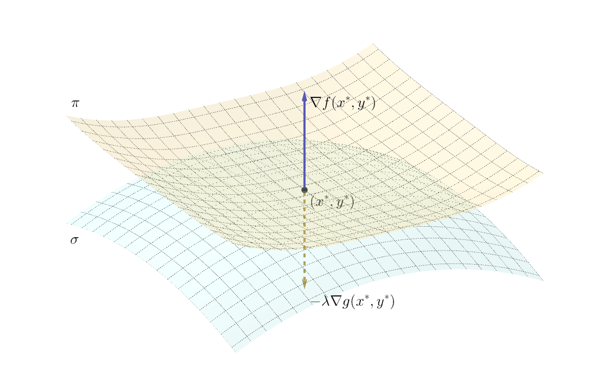
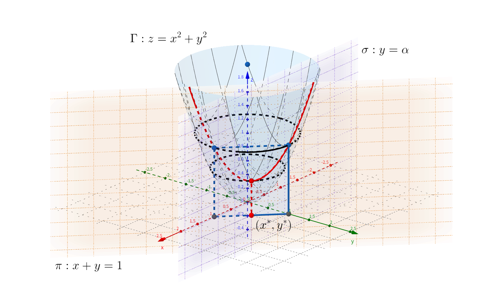

<!--more-->



本节将对上一小节[最优性条件](../optimality-conditions)中提出的 KKT 条件进行深入的理解和分析。



KKT 条件究其本质，是优化问题取得最优解的必要条件。下面我们首先从我们最熟悉的知识开始。

## 等式约束优化问题

我们在《高等数学》课程中学习过多元函数的极值问题，其中提到了 Lagrange 乘子法。其本质就是运用《凸优化》课程当中讲的 Lagrange 函数，求解等式优化问题。只不过《高等数学》课程中不涉及不等式约束，仅仅只有等式约束。为了更贴近也更容易回忆起《高等数学》所学内容，我们在这里仅考虑二元函数，并且只有一个等式约束。此时，这个约束优化问题记为

$$
\begin{aligned}
    \mathrm{min} \quad & f(x, y) \\
    \mathrm{s.t.} \quad & g(x, y) = 0
\end{aligned}
$$

这里只有一个等式约束，因此只需要引入一个 Lagrange 乘子 \(\lambda\) 即可

$$
L(x, y, \lambda) = f(x, y) + \lambda g(x, y)
$$

计算 \(L\) 对 \(x\)、\(y\) 和 \(\lambda\) 的偏导数，并令它们都等于零，就可以得到最优解的必要条件

$$
\left\{
    \begin{aligned}
        \frac{\partial L}{\partial x} &= f_x(x, y) + \lambda g_x(x, y) = 0 \\
        \frac{\partial L}{\partial y} &= f_y(x, y) + \lambda g_y(x, y) = 0 \\
        \frac{\partial L}{\partial \lambda} &= g(x, y) = 0
    \end{aligned}
\right.
$$

解上面的方程组就可以得到最优解 \((x^{\star}, y^{\star})\)。

## 不等式约束优化问题

我们注意到，在刚才在求解的过程中，我们其实一点也不关心 \(\lambda\) 的取值，因为那是我们引入的新变量，我们只关心原问题当中 \((x, y)\) 的取值。实际上，按照《高等数学》当中的方法求解出的 \(\lambda\) 是无法判断其符号的。对于只含有等式约束的问题，这个问题并不重要。但是，对于含有不等式约束的问题来说，不等号的方向和引入的 Lagrange 乘子之间则是具有一定联系的。

我们先考虑仅含有一个不等式的约束的二元函数优化问题

$$
\begin{aligned}
    \mathrm{min} \quad & f(x, y) \\
    \mathrm{s.t.} \quad & g(x, y) \leqslant 0
\end{aligned}
$$

我们先来讨论最优解 \((x^{\star}, y^{\star})\) 的情况，它应该有且仅有如下两种：

1. \(g(x^{\star}, y^{\star}) < 0\)，说明最优解位于可行域的内部，称为内部解。此时约束条件是**无效**的。
2. \(g(x^{\star}, y^{\star}) = 0\)，说明最优解位于可行域的边界，称为边界解。此时约束条件是**有效**的。

这两种情况的最优解具有不同的必要条件：

1. 内部解：原问题退化为无约束优化问题，只要驻点 \((x^{\star}, y^{\star})\) 满足 \(\nabla f=0\) 且 \(\lambda = 0\)。
2. 边界解：原问题转变为等式约束优化问题，这与之前讨论的情况相同。可以证明的一点是，最优解处的 \(f\) 和 \(g\) 的梯度方向是反向，即 \(\exists \lambda\) 使得 \(\nabla f = - \lambda \nabla g\)。这里 \(\lambda\) 的正负性是有意义的。由于我们希望最小化 \(f\)，梯度 \(\nabla f\) 的值表示函数值上升最快的方向，因而负梯度方向 \(-\nabla f\) 应该指向可行域的内部。\(\nabla g\) 指向可行域的外部，即 \(g(x, y) > 0\) 的区域，因为约束 \(g(x, y) \leqslant 0\)。因此这里的 \(\lambda \geqslant 0\)，这就是之前几节讲的对偶可行性。

边界解的情况可以通过上图加深理解。图中表示的是二元函数 \(f(x, y)\) 在不等式约束 \(g(x, y) \leqslant 0\) 下的优化问题，并且最优解在边界的情况。如图所示，最优点即为平面 \(\pi\)（方程 \(z = f(x, y)\)）和平面 \(\sigma\)（方程 \(g(x, y) = 0\)）的交点。约束 \(g(x, y) \leqslant 0\) 说明了可行域在平面 \(\sigma\) 的下侧。梯度 \(\nabla f\) 指向上方，负梯度 \(-\nabla f\) 指向下方可行域内部。在最优解 \((x^{\star}, y^{\star})\) 处，\(\nabla f\) 和 \(\nabla g\) 共线。

更一般地，如果有多个不等式约束，对应到上图中就是有若干平面 \(\sigma_1,\cdots,\sigma_p\)，并且在最优点处 \(\nabla f(x^{\star}, y^{\star})\) 可由有效约束对应的平面的支撑超平面的法向量的线性表示。即 \(\exists \mu_1,\cdots,\mu_p \geqslant 0\)，使得

$$
\nabla f(x^{\star}, y^{\star}) = -(\mu_1 \nabla g_1(x^{\star}, y^{\star}) + \cdots + \mu_p \nabla g_p(x^{\star}, y^{\star}))
$$

而不论是内部解还是边界解，\(\lambda g(x, y) = 0\) 恒成立，这就是互补松弛性。

## 小结

回顾了等式约束优化和不等式约束优化之后，我们可以从中提炼出一种转化的思想：

1. 无约束优化问题：令梯度向量为零即可。
2. 等式约束优化问题：引入 Lagrange 乘子，将原目标函数转化为 Lagrange 函数，将原问题转化为无约束优化问题。
3. 不等式约束优化问题：引入松弛变量，将原不等式约束函数转化为等式约束函数，将原问题转化为等式约束优化问题。

## KKT 条件的本质

综合上面的讨论与分析，我们再来看看 KKT 条件：

$$
\begin{aligned}
    f_{i}\left(x^{\star}\right) &\leqslant 0, & i &=1, \cdots, m \\
    h_{i}\left(x^{\star}\right) &=0, & i &=1, \cdots, p \\
    \lambda_{i}^{\star} & \geqslant 0, & i &=1, \cdots, m \\
    \lambda_{i}^{\star} f_{i}\left(x^{\star}\right) &=0, & i &=1, \cdots, m \\
    \nabla f_{0}\left(x^{\star}\right)+\sum_{i=1}^{m} \lambda_{i}^{\star} \nabla f_{i}\left(x^{\star}\right)+\sum_{i=1}^{p} \nu_{i}^{\star} \nabla h_{i}    \left(x^{\star}\right) &=0 & &
\end{aligned}
$$

其中一个包含了四个条件，它们分别是：

1. Lagrange 函数的定常方程式：上式最后一行 \(\nabla L = 0\)。
2. 原始可行性：即满足等式约束和不等式约束，上式第一行 \(f_{i}\left(x^{\star}\right) \leqslant 0\) 和第二行 \(h_{i}\left(x^{\star}\right) =0\)。
3. 对偶可行性：即上式第三行 \(\lambda_{i}^{\star} \geqslant 0\)。
4. 互补松弛性：即上式第四行 \(\lambda_{i}^{\star} f_{i}\left(x^{\star}\right) =0\)。

## 简单的例子

考虑下面的问题

$$
\begin{aligned}
    \mathrm{min} \quad & x^2 + y^2 \\
    \mathrm{s.t.} \quad & x + y = 1 \\
    \quad & y \leqslant \alpha
\end{aligned}
$$

写出 Lagrange 函数

$$
L(x, y, \lambda, \nu) = x^2 + y^2 + \lambda(1 - x - y) + \nu(y - \alpha)
$$

KKT 条件方程组如下

$$
\left\{\begin{aligned}
    2x - \lambda &= 0 & (1) \\
    2y - \lambda + \nu &= 0 & (2) \\
    \nu &\geqslant 0 & (3) \\
    \nu(y - \alpha) &= 0 & (4)
\end{aligned}\right.
$$

分别由 (1) 式和 (2) 式求出

$$
\left\{\begin{aligned}
    x &= \frac{1}{2} \lambda & (5) \\
    y &= \frac{1}{2} \lambda - \frac{1}{2} \nu & (6)
\end{aligned}\right.
$$

代入等式约束 \(x+y=1\)，得到 \(\lambda\) 和 \(\nu\) 的函数关系

$$
\lambda = \frac{1}{2} \nu + 1
$$

再代入式 (5) 和 (6) 中，消去 \(\lambda\)

$$
\left\{\begin{aligned}
    x &= \frac{1}{4} \nu + \frac{1}{2} & (7) \\
    y &= -\frac{1}{4} \nu + \frac{1}{2} & (8)
\end{aligned}\right.
$$

最后再加入不等式约束，得到

$$
\left\{\begin{aligned}
    \nu & \geqslant 2 - 4 \alpha \\
    \nu & \geqslant 0
\end{aligned}\right.
$$

下面对参数 \(\alpha\) 进行分类讨论：

1. 若 \(\alpha > \frac{1}{2}\)，不难验证 \(\nu = 0 > 2 - 4 \alpha\)。此时满足所有的 KKT 条件，约束不等式是无效的。\(x^{\star} = y^{\star} = \frac{1}{2}\) 是内部解。
2. 若 \(\alpha = \frac{1}{2}\)，\(\nu = 0 = 2 - 4 \alpha\)。此时满足所有的 KKT 条件，约束不等式是有效的。\(x^{\star} = y^{\star} = \frac{1}{2}\) 是边界解。
3. 若 \(\alpha < \frac{1}{2}\)，\(\nu = 2 - 4 \alpha > 0\)。此时约束不等式是有效的。\(x^{\star} = 1 - \alpha\)，\(y^{\star} = \alpha\)。

本题的几何意义如图所示。目标函数对应的曲面 \(\Gamma\) 是（椭）圆抛物面，等式约束对应平面 \(\pi\)，不等式约束对应以平面 \(\sigma\) 为边界的左半空间。曲面 \(\Gamma\) 和平面 \(\pi\) 的交线为图中的红色曲线（该曲线实际上是一个抛物线）。不考虑不等式约束，该优化问题的最优解为 \((x^{\star}, y^{\star}) = (\frac{1}{2}, \frac{1}{2})\)，最优值为 \(f(x^{\star}, y^{\star}) = \frac{1}{2}\)，对应图中红点的坐标 \((\frac{1}{2}, \frac{1}{2}, \frac{1}{2})\)。不等式约束实际上是让平面 \(\alpha\) 沿 \(y\) 轴方向平移，以 \(\alpha = \frac{1}{2}\) 为界，可以分三种情况讨论。

**参考**

- [Karush-Kuhn-Tucker (KKT) 条件](https://zhuanlan.zhihu.com/p/38163970)
- [浅谈最优化问题的KKT条件](https://zhuanlan.zhihu.com/p/26514613)