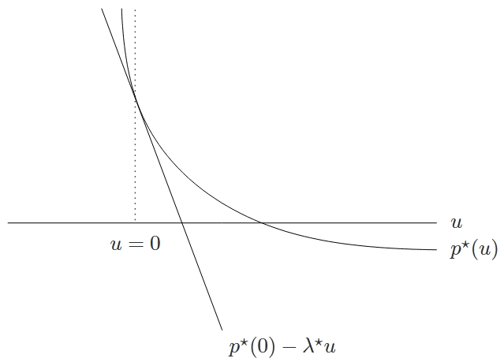

<!--more-->

## 扰动问题

考虑下面的问题

$$
\begin{aligned}
    \mathrm{minimize} \quad & f_0(x) \\
    \mathrm{subject\ to} \quad & f_i(x) \leqslant u_i, \quad i=1,\cdots,m \\
    \quad & h_i(x) = v_i, \quad i=1,\cdots,p
\end{aligned}
$$

当 \(u=0, v=0\) 时，该问题与原始的优化问题一致。而当 \(u_i > 0\) 时，意味着第 \(i\) 个不等式约束放松了；当 \(u_i < 0\) 时，意味着第 \(i\) 个不等式约束收紧了。这就是**扰动问题**，它通过 \(u_i\) 放松或收紧每个不等式约束，并且通过 \(v_i\) 改变等式约束的右端得到。

## 一个全局不等式

假设强对偶性成立且对偶问题最优值可以达到。（当原问题是凸问题且 Slater 条件满足时这种情形将会发生。）设 \((\lambda^{\star}, \nu^{\star})\) 是未被扰动的问题的对偶问题的最优解，则对所有的 \(u\) 和 \(v\)，有

$$
p^{\star}(u, v) \geqslant p^{\star}(0,0)-\lambda^{\star \top} u-\nu^{\star \top} v
$$

### 灵敏度解释

当强对偶性成立时，可以根据上述不等式直接得到很多有关最优 Lagrange 变量的灵敏度解释。有如下结论成立：

- 如果 \(\lambda_i^{\star}\) 比较大，我们加强第 \(i\) 个约束（即选择 \(u_i < 0\)），则最优值 \(p^{\star}(u, v)\) 必会大幅增加。
- 如果 \(\nu_i^{\star}\) 较大且大于零，我们选择 \(v_i < 0\)；或者如果 \(\nu_i^{\star}\) 较大且小于零，我们选择 \(v_i > 0\)，在这两种情况下最优值 \(p^{\star}(u, v)\) 必会大幅增加。
- 如果 \(\lambda_i^{\star}\) 较小，我们放松第 \(i\) 个约束（\(u_i > 0\)），那么最优值 \(p^{\star}(u, v)\) 不会减小太多。
- 如果 \(\nu_i^{\star}\) 较小且大于零，\(v_i > 0\)；或者如果 \(\nu_i^{\star}\) 较小且小于零，\(v_i < 0\)，那么最优值 \(p^{\star}(u, v)\) 不会减小太多。

实际上，上述不等式以及上述结论仅仅只是给出了扰动之后最优值的一个下界，但是没有给出上界。因此，放松或者加强一个约束，上述结论并不对称。

上述不等式的几何意义如图所示，这是一个具有一个不等式约束的凸问题。图中蓝色曲线表示具有一个约束 \(f_1(x) \leqslant u\) 的凸问题的最优值 \(p^{\star}(u)\) 的图像，它是 \(u\) 的函数。当 \(u = 0\) 时，对应原始未被扰动的问题；当 \(u < 0\) 时，约束加强了；当 \(u > 0\) 时，约束放松了。仿射函数 \(p^{\star}(0) - \lambda^{\star}u\)（图中紫色直线）给出了最优值 \(p^{\star}\) 的一个下界。从图中可以看到，紫色直线在蓝色曲线的下方，它们相切的切点对应的横坐标就是 \(u = 0\)，即原始未被扰动的问题。

## 局部灵敏度分析

假设 \(p^{\star}(u, v)\) 在 \(u = 0\) 和 \(v = 0\) 处可微，并且强对偶性成立，那么最优变量 \(\lambda^{\star}, \nu^{\star}\) 可以和 \(p^{\star}\) 在 \(u = 0\) 和 \(v = 0\) 处的梯度联系起来：

$$
\begin{aligned}
    \lambda_i^{\star} &= -\dfrac{\partial p^{\star}(0, 0)}{\partial u_i} \\
    \nu_i^{\star} &= -\dfrac{\partial p^{\star}(0, 0)}{\partial v_i}
\end{aligned}
$$

可以从之前的图中看出此性质，因为 \(-\lambda\) 是 \(p^{\star}\) 在 \(u = 0\) 处的斜率。

因此，若 \(p^{\star}(u, v)\) 在 \(u = 0\) 和 \(v = 0\) 处可微，且强对偶性成立，那么最优 Lagrange 乘子就是最优值关于约束扰动的局部灵敏度。和不可微的情况不同，这种解释的对称的：

- 稍稍加强第 \(i\) 个不等式约束（即选择一数值较小且小于零的 \(u_i\)）会使得 \(p^{\star}\) 增加大约 \(-\lambda_i^{\star}u_i\)。
- 稍稍放松第 \(i\) 个约束（即选择以数值较小且大于零的 \(u_i\)）会使得 \(p^{\star}\) 减小大约 \(\lambda_i^{\star}u_i\)。

局部灵敏度结论给出了最优解 \(x^{\star}\) 附近的约束起作用的一种定量描述。如果 \(f_i(x^{\star}) < 0\)，那么此约束不起作用，因此可以稍稍加强约束或者放松约束而不影响最优值。根据互补松弛性，相应的最优 Lagrange 乘子必然为零。考虑 \(f_i(x^{\star}) = 0\) 的情况，即第 \(i\) 个约束在最优解处起作用。那么，通过最优 Lagrange 乘子的第 \(i\) 个分量可以知道此约束起作用的程度：如果 \(\lambda_i^{\star}\) 较小，那么我们可以稍稍放松或者加强此约束而对最优值没有大的影响；如果 \(\lambda_i^{\star}\) 较大，那么即使稍稍放松或者加强此约束，最优值都会受到很大的影响。
