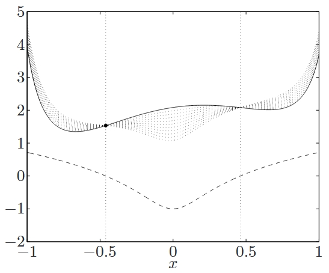

<!--more-->

## Lagrange 函数

考虑标准形式的优化问题

$$
\begin{aligned}
    \mathrm{minimize} \quad & f_0(x) \\
    \mathrm{subject\ to} \quad & f_i(x) \leqslant 0, \quad i=1,\cdots,m \\
    & h_i(x) = 0, \quad i=1,\cdots,p
\end{aligned}
$$

定义该问题的 **Lagrange 函数** \(L: \mathbf{R}^n \times \mathbf{R}^m \mathbf{R}^p \rightarrow \mathbf{R}\) 为

$$
L(x, \lambda, \nu) = f_0(x) + \sum_{i=1}^m \lambda_i f_i(x) + \sum_{i=1}^p \nu_i h_i(x)
$$

其中定义域 \(\operatorname{dom} L = \mathcal{D} \times \mathbf{R}^m \times \mathbf{R}^p\)。\(\lambda_i\) 称为第 \(i\) 个不等式约束 \(f_i(x) \leqslant 0\) 对应的 **Lagrange 乘子**；类似地，\(\nu_i\) 称为第 \(i\) 个等式约束 \(h_i(x) = 0\) 对应的 Lagrange 乘子。向量 \(\lambda\) 和 \(\nu\) 称为**对偶变量**或者问题的 **Lagrange 乘子向量**。

## Lagrange 对偶函数

定义 **Lagrange 对偶函数** \(g: \mathbf{R}^m \times \mathbf{R}^p \rightarrow \mathbf{R}\) 为 Lagrange 函数关于 \(x\) 取得的最小值：即对 \(\lambda \in \mathbf{R}^m\)，\(\nu \in \mathbf{R}^p\)，有

$$
g(\lambda, \nu)=\inf_{x \in \mathcal{D}} L(x, \lambda, \nu)=\inf_{x \in \mathcal{D}}\left(f_0(x)+\sum_{i=1}^{m} \lambda_i f_i(x)+\sum_{i=1}^{p} \nu_i h_i(x)\right)
$$

如果 Lagrange 函数关于 \(x\) 无下界，则对偶函数取值为 \(-\infty\)。因为对偶函数是一族关于 \((\lambda, \nu)\) 的仿射函数的逐点下确界，所以即使原问题不是凸的，对偶函数也是凹函数。

## 最优值的下界

对偶函数构成了原问题最优值 \(p^{\star}\) 的下界：即对 \(\forall \lambda, \nu \succeq 0\) 有

$$
g(\lambda, \nu) \leqslant p^{\star}
$$

### 几何意义

为了便于理解，我们考虑只有一个变量 \(x \in \mathbf{R}\) 并且只有一个不等式约束的简单情形。如下图所示：

图中表示的是对偶可行点给出的下界。粗的实线表示目标函数 \(f_0\)，下方的虚线表示约束函数 \(f_1\)。可行集是图中两个红点之间的部分所在区间。细的点线表示一系列 Lagrange 函数 \(L(x, \lambda)\)，其中 \(\lambda = \lambda_1, \lambda_2, \lambda_3, \cdots\)。该问题的最优点是左边的红点所在位置，可以看到每个 Lagrange 函数的极小值均小于之。

## 通过线性逼近来理解

可以通过对集合 \(\{0\}\) 和 \(-\mathbf{R}_+\) 的示性函数进行线性逼近来理解 Lagrange 函数和其给出下界的性质。首先将原问题重新描述成一个无约束问题

$$
\mathrm{minimize} \quad f_0(x) + \sum_{i=1}^m I_-(f_i(x)) + \sum_{i=1}^p I_0(h_i(x))
$$

其中，\(I_-: \mathbf{R} \rightarrow \mathbf{R}\) 是非正实数集的示性函数

$$
I_-(u) = \left\{
    \begin{matrix}
        0 & u \leqslant 0 \\
        \infty & u > 0
    \end{matrix}
\right.
$$

类似地，\(I_0\) 是集合 \(\{0\}\) 的示性函数。打一个形象的比喻，可以将函数 \(I_-(u)\) 理解为我们对约束函数值 \(u = f_i(x)\) 的一种恼怒或不满。类似地，\(I_0(u)\) 表达了我们对等式约束值 \(u = h_i(x)\) 的不满。

如果我们用线性函数 \(\lambda_i(u)\) 替代函数 \(I_-(u)\)，其中 \(\lambda_i \geqslant 0\)，用函数 \(\nu_i u\) 替代 \(I_0(u)\)。那么，目标函数就变成了 Lagrange 函数 \(L(x, \lambda, \nu)\)，且对偶函数值是该问题的最优值。实际上，使用线性函数太“软”，没有示性函数“硬”。用线性函数去逼近示性函数是远远不够的，不过至少可以将线性函数看作是示性函数的一个下估计。

用“软”约束代替“硬”约束的思想在后文考虑内点法时会再次提到。

## 举例

### 线性方程组的最小二乘解

$$
\begin{aligned}
    \mathrm{minimize} \quad & x^{\top}x \\
    \mathrm{subject\ to} \quad & Ax = b
\end{aligned}
$$

其中 \(A \in \mathbf{R}^{p \times n}\)，说明这个问题共有 \(p\) 个等式约束。其 Lagrange 函数和对偶函数分别为

$$
\begin{aligned}
    L(x, \nu) &= x^{\top}x + \nu^{\top}(Ax - b) \\
    g(\nu) &= \inf_x L(x, \nu)
\end{aligned}
$$

由于 \(L(x, \nu)\) 是关于 \(x\) 的二次凸函数，可以通过求解如下最优性条件得到函数的最小值

$$
\begin{aligned}
    \nabla_x L(x, \nu) = 2x + A^{\top} \nu &= 0 \\
    x &= -\frac{1}{2} A^{\top} \nu
\end{aligned}
$$

因此，对偶函数为

$$
g(\nu) = -\frac{1}{4} \nu^{\top} AA^{\top} \nu - b^{\top} \nu
$$

它是一个二次凹函数，定义域为 \(\mathbf{R}^p\)。

## Lagrange 对偶函数和共轭函数

共轭函数和 Lagrange 对偶函数紧密相关。下面的问题说明了一个简单的联系。

$$
\begin{aligned}
    \mathrm{minimize} \quad & f(x) \\
    \mathrm{subject\ to} \quad & x = 0
\end{aligned}
$$

虽然这个问题没有什么挑战性，但是我们还是可以很容易地得到 Lagrange 函数为 \(L(x, \nu) = f(x) + \nu^{\top} x\)，则其对偶函数为

$$
g(\nu) = \inf_x (f(x) + \nu^{\top} x) = -\sup_x ((-\nu)^{\top}x - f(x)) = -f^{*}(-\nu)
$$

即，我们得到了结论

$$
g(\nu) = -f^{*}(-\nu)
$$
