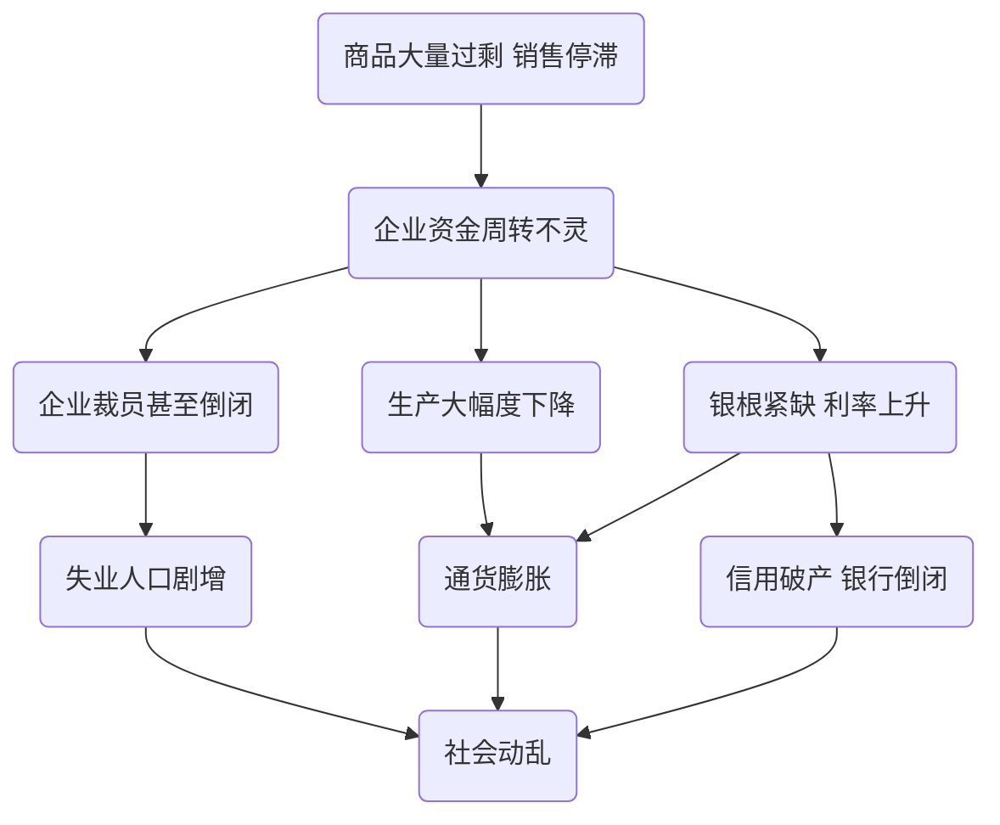

本章从马克思主义哲学的角度揭露了资本主义的基本矛盾，证明了资本主义经济危机爆发的必然性，并且预言了资本主义必定灭亡，为社会主义所代替的历史规律。

<!--more-->

## 资本主义的基本矛盾

**资本主义的基本矛盾：生产资料资本主义私人占有和生产社会化之间的矛盾。**

资本主义的基本矛盾决定了资本主义必定灭亡。

## 资本主义经济危机

**资本主义经济危机的本质特征：生产相对过剩。**

产生经济危机的可能性：货币作为支付手段和流通手段。

经济危机爆发的根本原因：**资本主义的基本矛盾**。这体现在两个方面：

1. 生产无限扩大的趋势与劳动人民有支付能力的需求相对缩小的矛盾

2. 个别企业内部生产的有组织性和整个社会生产的无政府状态之间的矛盾

### 经济危机的表现



**小故事**

曾经，有一位在大英博物馆做保洁工作的小男孩，和当时正在撰写《政治经济学批判》（《资本论》前身）的马克思有过这样一段对话。

**小男孩**：“马克思先生，家里最近没有煤了，我都冻感冒了。我想起来爸爸不是在煤厂工作吗，于是我就问爸爸为什么不去买煤。爸爸说他被煤老板解雇了，买不起煤了。我就接着问爸爸，为什么煤老板要解雇爸爸呢。爸爸说，因为煤太多了。我就觉得奇怪，煤那么多，煤厂应该可以通过卖煤赚更多的钱。爸爸本应该挣更多的钱，可为什么爸爸会丢了工作呢？”

**马克思**：“小朋友，这个问题你之所以想不通，是因为煤厂老板有个秘密没有告诉你。”

**小男孩**：“什么秘密？您快告诉我！”

**马克思**：“这就是资本的秘密，也就是剥削的秘密。你爸爸通过劳动创造的一些价值被煤厂老板，也就是资本家悄悄地拿走了。简单点说，你爸爸每天辛辛苦苦在煤厂从早干到晚，其实大部分时间都是在为老板白白干活。白干的部分都装进了老板的腰包，这就是剩余价值。老板们越来越有钱，而你爸爸则只能拿勉强糊口的工资。这就是剥削的秘密啊！”

**小男孩**：“他凭什么剥削我爸爸？”

**马克思**：“凭他有资本，因为煤厂是他的啊。工人们一无所有，想要生活，就只能选择给资本家打工，任凭资本家剥削。”

**小男孩**：“哦，我知道了。因为剥削，所以爸爸的工资很低。可我还是不明白，怎么爸爸多挖煤，煤越多，老板不奖励爸爸，反而不让爸爸干了呢？”

**马克思**：“小朋友，其实，煤不是真的多。想买煤的穷人买不起，买得起的富人又用不了那么多煤。煤只是显得好像有很多的样子，我把这种现象称为生产的相对过剩。煤过剩，也就卖不出去，煤老板赚不到钱，就不给工人发工资了，你爸爸就只能回家了。”

**小男孩**：“我明白了，煤太多了我爸爸就失去了工作。那为什么煤厂老板不能把煤便宜点卖给那些需要的穷人呢？”

**马克思**：“你还能问出这样的问题，太让我吃惊了！这是因为，追逐利润是资本的本性，赚钱是资本家活着的动力。要降价把煤卖出去，这可是要了煤厂老板的命啊！”

**小男孩**：“那我们应该怎么办呀？”

**马克思**：“我们得让更多的工人知道这个秘密。把工厂从老板手里夺过来，让工人说了算。”



### 经济危机的四个阶段

1. **危机**（本质阶段）。危机是指在社会中商品流通的某一个环节中出现，之后危机会影响到社会生产的各个领域，最终将会引起严重混乱的社会经济活动。危机的后面是萧条阶段。
2. **萧条**。在萧条阶段之后，社会经济活动将逐步恢复，生产也逐步上升，经济呈现好转的局面。萧条阶段后面是复苏阶段。
3. **复苏**。在复苏阶段，由于社会市场会再扩大，物品价格开始有所上涨，利润渐有增加，刺激着资本家再次增加对产业的投资、扩大生产规模。随着经济的逐步发展，社会生产规模的扩大，社会生产进入高涨阶段。
4. **高涨**。在经济周期的高涨阶段，经济将会是最昌盛繁荣的景象，生产规模达到最大，经济持续发展，人民生活富足，但是，繁荣仅仅维持一段时间。繁荣过后，资本主义将会进入经济周期循环的下一个阶段危机。

## 资本主义必定灭亡

资本主义的历史地位和发展趋势：**必定灭亡，被社会主义所代替。**

资本主义走向社会主义必然性取决于资本主义社会的基本矛盾，即生产的社会化与资本主人私人占有制之间不可调和的根本矛盾。

现代资本主义已经不同于马克思所处时代的自由资本主义了，它融入和吸纳了一些社会主义制度有益的成分。这大大缓解了资本主义的基本矛盾，但是没有从根本上解决资本主义的基本矛盾。社会发展的前进性和曲折性具有辩证关系，资本主义必定灭亡的真理还需要实践检验。