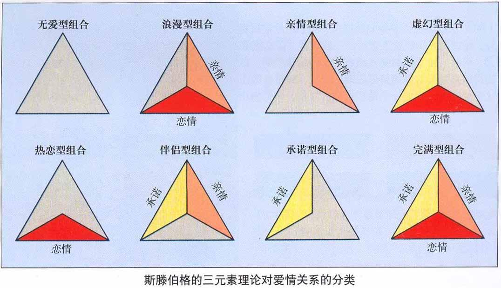

<!--more-->



肉欲不是罪过，相反，是对生命的崇拜，是上帝的馈赠，是春天和夏日的轻柔之风。我们应以明确意识和快乐欣赏它。所有健康、成熟的男人和女人都会渴望它、需要它。

——弗伦森

爱情是本能和思想，是疯狂和理性，是自发性和自觉性，是一时的激情和道德修养，是感受的充实和想象的奔放，是残忍和慈悲，是餍足和饥渴，是淡泊和欲望，是烦恼和欢乐，是痛苦和快感，是光明和黑暗，爱情把人的种种体验融为一炉。

——瓦西列夫



## 爱中的性

在我们的社会文化环境中，一度对“性”讳莫如深，人们会用“偷食禁果”这样的词汇来形容男女之间没有婚姻基础的性关系。

但是，性和爱其实是相辅相成的，谈到爱情就不能不谈到性。

### 三个层面

爱中的“性”，其实和有关生物的生殖或性欲相关，它是一种存在，是包含着生物生理、心理精神、社会文化等数个层面且具有丰富内容的存在。包括三个层面：

1. **自然层面**：表现为身体的发育和长成，如性器官、性征、性冲动等性生理内容。
2. **社会层面**：表现为对两性关系的理解与自律。
3. **精神层面**：表现为人格的成熟和责任感的增长。

爱情产生于性能力的基础上，但爱中的性不同于性能力勃发的这种本能。

性能力就本身而言并不具体选择特定的异性和对象，性能力的勃发在起初可以说是一种盲目的力量，**一种无目标的内在本能力量**。

爱中的性，则是以爱的人为特定的对象，是具体化的“性”，它已经超越纯粹的生理层面。

### 激情元素

性是人类爱情中的重要基础，是激情的动力来源，而激情恰恰是爱情的重要构成。

根据斯滕伯格的爱情三角理论，我们知道激情是爱情的三种元素之一，它对爱情的质量有着显著的影响作用。

没有亲密和激情的爱是空爱，双方之间只有责任和义务，是高度道德化两性伙伴关系。这种爱不存在真正的爱情成分，令人感到压抑和乏味。

对于性，我们需要多一份理性、多一份坦然、多一份尊敬。

## 性心理

对于人类而言，是人类种族得以繁衍存续的基础，是生命之源，担负着种族繁衍的神圣使命；性还是个体生理和心理发展过程中不可回避的主题。

精神分析学大师弗洛伊德认为，心理症之成因，在于患者的后天经验迫使其留恋其婴儿期的性活动。一个人若能通过幼儿性欲的诸阶段，将之抛诸身后，方能得以成熟而正常。

性心理，是指在性生理的基础上，与性征、性欲、性行为有关的心理状态与心理过程，也包括了与异性交往和婚恋等心理状态。

性心理结构的四种基本成分：

- 性感知
- 性思绪
- 性情绪
- 性意志

### 青春期的性心理发展阶段

青春期的性心理大体上会经历异性疏远期、异性接近期和异性恋爱期这三个阶段。

#### 异性疏远期

也称为性发育早期、“性紧张期”。青春期开始时，少男少女对性的差异非常敏感，第二性征的出现，使他们内心深处产生了朦胧感，而此时他们对两性关系似懂非懂，对性知识、性行为一知半解。

将异性的生理差异与男女之间的关系看得神秘，在与异性的交往中显得羞涩、忸怩和不自然，心中好像潜藏着无数秘密感，心有相互吸引之力却在表面上表现得相互疏远，有畏惧感和似曾相似感。

一般表现：

- 男孩表现出潜意识的紧张心理：口吃、挤眉弄眼。
- 女孩表现得情绪不稳定。

#### 异性接近期

完全进入青春期后，随着生理机能的进一步发展，生活阅历的增加，青少年对异性关系有了进一步的了解和认识，对性意识的情感体验也开始有了新的变化。

特点：

- 喜欢与异性在一起活动，力求成为异性眼中有吸引力的人。
- 两性的畏惧感、陌生感消失，强烈的相互吸引和接近，会采取接近异性的曲线方式。

一般表现：

- 男孩喜欢高谈阔论以引起注意，逞强、做危险动作，表现男子汉气概，甚至起哄、开玩笑、恶作剧，目的是引起女生的注意。
- 女孩现出单相思，钟情妄想，用打扮、声调、细微的关心和体贴吸引对方。

**提醒**：由于青少年缺乏接近异性经验，不知如何表现自己，因此对两性的认识会表现为狂热追星，以释放内心对异性的渴慕之情。

#### 异性恋爱期

进入青春后期后，性生理完全成熟，性心理在逐渐成熟，自我意识、思维和人格都在积极发展。

生活领域也日渐广阔，对恋爱的理解和认识更加深刻，对恋人的寻觅更加迫切，对异性的态度也逐渐客观。此时，男女青年开始对异性展开主动积极的进攻。

男女青年尽量在异性面前展示自己的长处与才华，以引起对方的关注。由于受社会文化的影响，男性在恋爱的表达方面更加主动、大胆、直率而且热情奔放；女性更加含蓄、深沉、妩媚略带羞涩和矜持。

青春期性发育完成后，进入“两性恋爱期”。从泛泛的异性爱慕过渡到钟情于某个人；直接而热烈，追求技巧成熟；一旦碰壁，心理挫折感强烈。

### 性心理健康

性心理健康与否会对人的性行为产生显著的影响。判断一个人的性心理健康，有以下几个标准：

- 能够正确认识自我，愉快的接纳自己的性别
- 具有正常的性欲望
- 性心理的特点和性行为符合相应的性心理发展年龄特征
- 能与异性保持和谐的人际关系
- 性行为符合社会文明规范

## 小结

性的吸引是爱的第一步，有了稳固的感情基础、并在合乎道德和法律范围内，发生性是一件水到渠成的事。

良好的性可以是爱情中的润滑剂，最终达到“灵”与“肉”的统一。但“性”不是爱情中的“灭火剂”，更不是“维生素”。

对于爱情的发展和维护，除了性以外，更需要其他多方面的努力和付出。

我们希望：能够促进大家对“爱与性”的理解，减少偏见，养成健康的性心理。