<!--more-->

```python
%matplotlib inline
import matplotlib.pyplot as plt
import numpy as np
```

## 入门

下面，我们用描点法来画正弦函数 \(y = \sin{x}\) 一个周期内的图像。

首先，我们要生成一系列均匀的散点 `x`，并计算出对应的函数值 `y`：


```python
x = np.linspace(0, 2*np.pi, num=25, endpoint=True)
y = np.sin(x)
```

然后直接调用 `plt.plot` 方法绘图即可：


```python
plt.plot(x, y)
```


    [<matplotlib.lines.Line2D at 0x18edab70a30>]


    
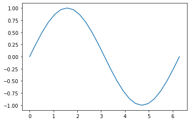
    


但是，我们的教程非常不推荐这种绘图方法，因为这种绘图方法只适用于简单图像的绘制，如果需要对图像的各个元素进行更细致化的设置是不行的。

## 用 Axes 对象绘图

首先，我们获取 `Figure` 对象。


```python
fig = plt.figure()
```


    <Figure size 432x288 with 0 Axes>


不过 `Figure` 对象只是一个空白的 `Figure` 窗口，它没有任何的坐标系可以绘制图像。因此，我们需要在 `Figure` 对象中添加 `Axes` 对象：


```python
ax = fig.add_axes([0.1, 0.1, 0.8, 0.8])
```

传入的四元组参数表示绘图区域 `Axes` 的横纵坐标、宽度和高度，都是 \([0, 1]\) 之间的浮点数。

这样，当我们显示绘图窗口时，会发现是一张有坐标系的白纸：


```python
fig
```


    
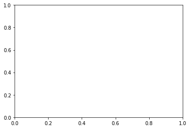
    


下面，我们调用 `Axes` 对象的 `plot` 绘图方法：


```python
sin_line = ax.plot(x, y)
```

`Figure` 对象是整个绘图窗口，它不能画图。只有控制整个绘图区域的 `Axes` 对象才能画图。

现在来看看绘图窗口，会发现已经有图像显示了：


```python
fig
```


    

    


```python
ax.clear()
```

## 美化图像

我们可以用一些简单的参数美化图像，例如设置线条颜色为绿色，线条样式为点划线，并用实心点标注。


```python
sin_line = ax.plot(x, y, 'go-.')
```


```python
fig
```


    
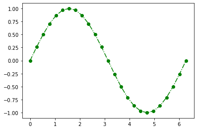
    


```python
ax.clear()
```

颜色、线条样式和标注样式可以分别设置：


```python
sin_line = ax.plot(x, y, color='r', ls='--', marker='^')
```


```python
fig
```


    
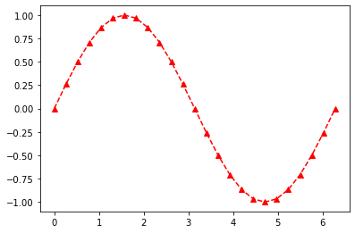
    


## 坐标轴设置

### 坐标轴范围

坐标轴范围即定义域，也就是 `x` 的取值范围；以及值域，也就是 `y` 的取值范围。

我们绘制的是正弦函数一个周期内的图像，因此可以设置其横轴的取值范围为 \([0, 2 \pi]\)。


```python
ax.set_xlim(0, 2*np.pi)
```


    (0.0, 6.283185307179586)


```python
fig
```


    

    


也可以设置其值域为 \([-1, 1]\)。


```python
ax.set_ylim(-1, 1)
```


    (-1.0, 1.0)


```python
fig
```


    
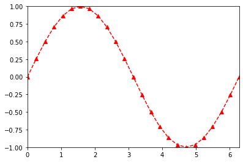
    


### 坐标轴刻度

三角函数在 \(\pi\) 的有理数倍处往往可以取到特殊值，而绘图时默认横轴的刻度是整数，我们可以进行如下调整：


```python
xticks = np.linspace(0, 2*np.pi, num=7)
ax.set_xticks(xticks)
```


    [<matplotlib.axis.XTick at 0x18edb3363d0>,
     <matplotlib.axis.XTick at 0x18edb336520>,
     <matplotlib.axis.XTick at 0x18edb351220>,
     <matplotlib.axis.XTick at 0x18edb34b2b0>,
     <matplotlib.axis.XTick at 0x18edb3212b0>,
     <matplotlib.axis.XTick at 0x18edb321130>,
     <matplotlib.axis.XTick at 0x18edb344700>]


```python
fig
```


    
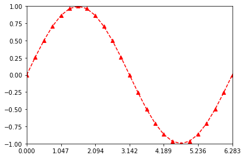
    


同理，纵轴的刻度也可以进行类似的调整：


```python
yticks = np.linspace(-1, 1, num=5)
ax.set_yticks(yticks)
```


    [<matplotlib.axis.YTick at 0x18edb310eb0>,
     <matplotlib.axis.YTick at 0x18edb310df0>,
     <matplotlib.axis.YTick at 0x18edb33bc70>,
     <matplotlib.axis.YTick at 0x18edb2e3310>,
     <matplotlib.axis.YTick at 0x18edb2e33a0>]


```python
fig
```


    

    


### 坐标轴子刻度

坐标轴子刻度不能用标签或者值进行标注。访问坐标轴子刻度需要通过 `Axis` 坐标轴对象。`MultipleLocator` 类按照指定间隔设定刻度 `tick`。


```python
miloc = plt.MultipleLocator(np.pi/6)
ax.xaxis.set_minor_locator(miloc)
```


```python
fig
```


    
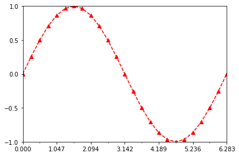
    


```python
miloc = plt.MultipleLocator(1/4)
ax.yaxis.set_minor_locator(miloc)
```


```python
fig
```


    

    


### 坐标轴刻度标签

我们发现，前面一小节设置的横轴刻度还不能够满足我们的需求。如果刻度线下面显示刻度值是含有 \(\pi\) 的无理数就更完美了。因此，需要设置坐标轴刻度标签。


```python
xticklabels = [0, r'\(\dfrac {\pi} {3}\)', r'\(\dfrac {2 \pi} {3}\)', r'\(\pi\)',
               r'\(\dfrac {4 \pi} {3}\)', r'\(\dfrac {5 \pi} {3}\)', r'\(2 \pi\)']
ax.set_xticklabels(xticklabels)
```


    [Text(0.0, 0, '0'),
     Text(1.0471975511965976, 0, '\(\\dfrac {\\pi} {3}\)'),
     Text(2.0943951023931953, 0, '\(\\dfrac {2 \\pi} {3}\)'),
     Text(3.141592653589793, 0, '\(\\pi\)'),
     Text(4.1887902047863905, 0, '\(\\dfrac {4 \\pi} {3}\)'),
     Text(5.235987755982988, 0, '\(\\dfrac {5 \\pi} {3}\)'),
     Text(6.283185307179586, 0, '\(2 \\pi\)')]


要注意的是，如果需要渲染 **LaTeX** 公式，需要在字符串首尾添加 `$` 符。而且，由于 **LaTeX** 代码涉及 `\` 转义符，而 **Python** 字符串中也有类似语法，故字符串前需要加上 `r` 或者使用双反斜杠 `\\`。


```python
fig
```


    
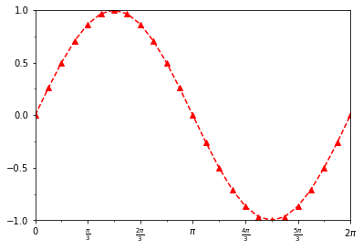
    


同理，纵轴的标签也可以这样设置：


```python
yticklabels = ['-1', r'\(- \dfrac {1} {2}\)', '0', r'\(\dfrac {1} {2}\)', '1']
ax.set_yticklabels(yticklabels)
```


    [Text(0, -1.0, '-1'),
     Text(0, -0.5, '\(- \\dfrac {1} {2}\)'),
     Text(0, 0.0, '0'),
     Text(0, 0.5, '\(\\dfrac {1} {2}\)'),
     Text(0, 1.0, '1')]


```python
fig
```


    
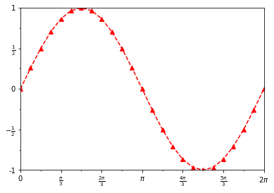
    


### 坐标轴标题

坐标轴的标题同样也可以设置，并且支持 **LaTeX**，本小节不再赘述。

有些时候，坐标轴标题需要中文显示，而如果采用默认设置就会出现乱码。因此，需要进行如下设置：


```python
from pylab import mpl
mpl.rcParams['font.sans-serif'] = ['SimHei']
```

现在，我们添加横纵坐标轴标题：


```python
ax.set_xlabel('相位')
ax.set_ylabel('幅度')
```


    Text(3.200000000000003, 0.5, '幅度')


```python
fig
```


    
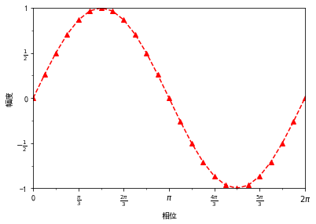
    


标题字体的大小也可以设置：


```python
ax.set_xlabel('相位', fontsize=16)
ax.set_ylabel('幅度', fontsize=16)
```


    Text(16.403125000000003, 0.5, '幅度')


```python
fig
```


    

    


## 网格线

`Axes` 对象的 `grid` 方法可以添加网格线。


```python
ax.grid()
```


```python
fig
```


    

    


```python
ax.grid(None)
```

可以设置网格线的样式：


```python
ax.grid(ls='-.')
```


```python
fig
```


    
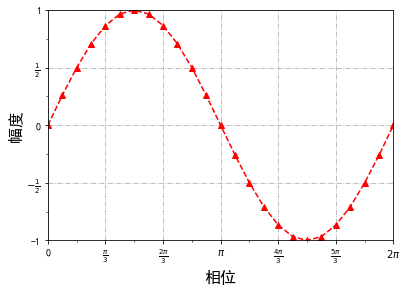
    


```python
ax.grid(None)
```

可以只设置一个轴显示网格线：


```python
ax.grid(axis='x')
```


```python
fig
```


    
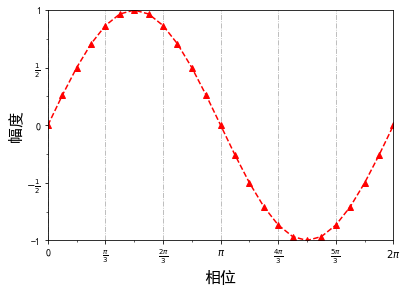
    


```python
ax.grid(None)
```

设置网格线的粗细：


```python
ax.grid(linewidth=2)
```


```python
fig
```


    

    


## 图例

添加图例首先需要设置图像的 `label` 参数。我们首先要找到表示正弦曲线的 `Line2D` 对象：


```python
sin_line?
```


    Type:        list
    String form: [<matplotlib.lines.Line2D object at 0x0000018EDB35B5B0>]
    Length:      1
    Docstring:  
    Built-in mutable sequence.
    
    If no argument is given, the constructor creates a new empty list.
    The argument must be an iterable if specified.
    


```python
sin_line[0].set_label(r'\(y = \sin{x}\)')
```

`loc` 用于确定图例的位置，`upper right` 表示图例的显示位置为右上角。其他方位以此类推。


```python
ax.legend(loc='upper right')
```


    <matplotlib.legend.Legend at 0x18edb5ad280>


```python
fig
```


    
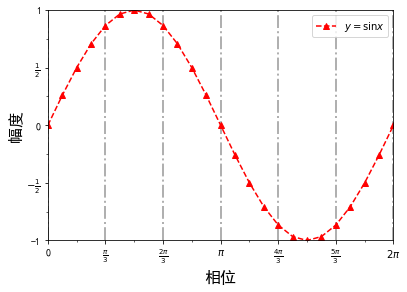
    


```python
ax.legend_.remove()
```

如果不希望图例显示在绘图区域，则需要通过 `Figure` 对象，将图例绘制在窗口内。


```python
fig.legend(loc='upper center')
```


    <matplotlib.legend.Legend at 0x18edb2e30d0>


```python
fig
```


    
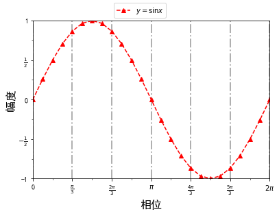
    


## 注解

在 **Matplotlib** 中，我们可以使用 `annotate` 方法来创建一个注解。


```python
ax.annotate(
    text='max',
    fontsize=20,
    xy=(np.pi/2, 1),
    xytext=(np.pi/2, 0.7),
    horizontalalignment='center'
)
fig
```


    
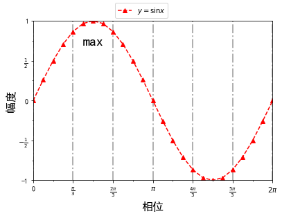
    


其中，参数 `text` 表示注解的文本内容，参数 `xy` 表示被注解的点的坐标，参数 `xytext` 表示注解的文本框的坐标。

我们还可以创建带有箭头的注解，这需要用到 `arrowprops` 参数。默认情况下，该参数取空值 `None`。如果需要绘制箭头，则需要传入指定格式的字典。


```python
ax.annotate(
    text='min',
    fontsize=20,
    xy=(np.pi*3/2, -1),
    xytext=(np.pi*3/2, -0.5),
    horizontalalignment='center',
    arrowprops=dict(shrink=0.05)
)
fig
```


    
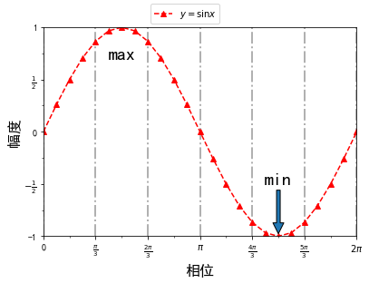
    


箭头参数主要包括：

- `width` 箭头宽度
- `headwidth` 箭头头部宽度
- `headlength` 箭头头部长度
- `shrink` 箭头两端收缩的百分比

我们也可以采用内置的模板直接绘制，即指定 `arrowstyle` 参数。这个时候，不能手动设置箭头参数。


```python
ax.annotate(
    text=r'\(\dfrac {T} {2}\)',
    fontsize=20,
    xy=(np.pi, 0),
    xytext=(4, 0.5),
    horizontalalignment='right',
    verticalalignment='top',
    arrowprops=dict(arrowstyle='->')
)
fig
```


    

    


