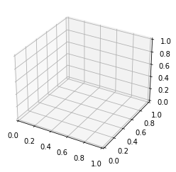
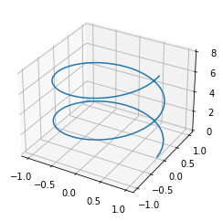
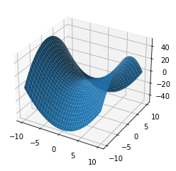
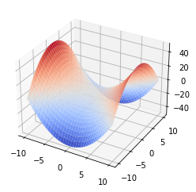
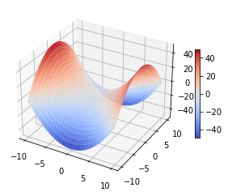
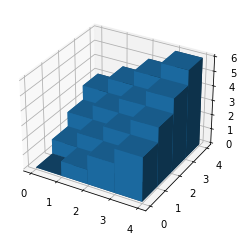

<!--more-->


```python
import matplotlib.pyplot as plt
import numpy as np
from matplotlib import cm
```

## 绘制空间曲线

下面我们绘制圆柱螺旋线两个周期的图像，其参数方程如下：

$$
\begin{cases}
x = \cos t \\
y = \sin t \\
z = \frac{1}{2 \pi} t
\end{cases}
$$

首先，我们先准备好数据。


```python
t = np.linspace(0, 4*np.pi, 101)
x = np.cos(t)
y = np.sin(t)
z = t * 2 / np.pi
```

接下来我们创建绘图窗口和 `Axes3D` 对象，方法和二维是类似的，不过需要额外指定 `subplot_kw` 参数。`subplot_kw` 参数是一个参数集，绘制三维图像需要指定 `projection` 键的值为 `3d`。


```python
fig, ax = plt.subplots(subplot_kw={"projection": "3d"})
```


​    

​    


直接调用 `Axes3D` 对象的 `plot` 方法就能绘制三维曲线。


```python
ax.plot(x, y, z)
fig
```


​    

​    


## 绘制空间曲面

下面我们绘制双曲抛物面（马鞍面）\(x^2 - y^2 = 2z\) 的图像。首先我们需要生成一个二维平面离散点集。


```python
x = np.linspace(-10, 10, num=101)
y = np.linspace(-10, 10, num=101)
x, y = np.meshgrid(x, y)
```

然后将曲面方程转化为二元函数 \(z = \frac {1} {2} (x^2 - y^2)\)：


```python
z = (x**2 - y**2) / 2
```

最后我们创建绘图窗口和 `Axes3D` 对象，调用 `Axes3D` 对象的 `plot_surface` 方法绘制空间曲面。


```python
fig, ax = plt.subplots(subplot_kw={"projection": "3d"})
surf = ax.plot_surface(x, y, z)
```


​    

​    


```python
ax.clear()
```

### 图像美化

使用 `cmap` 参数指定 `Colormap` 对象，它是一种渐变效果。**Matplotlib** 中内置了丰富的 `Colormap`。


```python
surf = ax.plot_surface(x, y, z, cmap=cm.coolwarm)
fig
```


​    

​    


添加颜色条：


```python
fig.colorbar(surf, shrink=0.5)
fig
```


​    

​    


## 绘制三维条形图

下面我们来绘制阶梯形状的条形图。首先我们准备数据：


```python
_x = np.arange(4)
_y = np.arange(4)
_xx, _yy = np.meshgrid(_x, _y)
x, y = _xx.ravel(), _yy.ravel()
```

其中，`ravel` 方法可以将任意多维数组展平为一维数组。这一步必不可少！


```python
x, y
```


    (array([0, 1, 2, 3, 0, 1, 2, 3, 0, 1, 2, 3, 0, 1, 2, 3]),
     array([0, 0, 0, 0, 1, 1, 1, 1, 2, 2, 2, 2, 3, 3, 3, 3]))


接下来，我们初始化条形图的底部和顶部值。底部都是 \(0\)，顶部则满足 \(z = x + y\)。初始化的方式采用根据已有形状创建。

条形图的宽度和深度两个参数其实就是主视图和左视图二维条形图的宽度。


```python
top = x + y
bottom = np.zeros_like(top)
width = depth = 1
```

下面是一种创建 `Axes3D` 对象的另一种方法：


```python
fig = plt.figure()
ax = plt.axes(projection='3d')
```


​    

​    


使用 `Axes3D` 对象的 `bar3d` 方法就可以绘制三维条形图。


```python
ax.bar3d(x, y, bottom, width, depth, top)
fig
```


​    

​    

