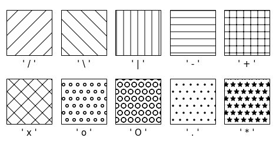
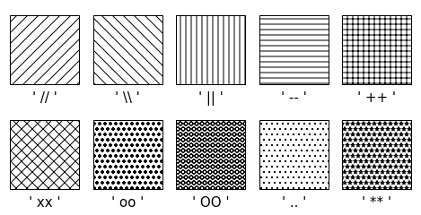
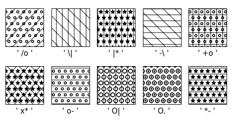

<!--more-->

## 线条样式

`matplotlib` 中一般通过 `linestyle` 或 `ls` 参数来设置线条样式，主要包括以下几种：

| 参数                      | 说明       |
| ------------------------- | ---------- |
| `-` 或 `solid`            | 实线       |
| `--` 或 `dashed`          | 虚线       |
| `-.` 或 `dashdot`         | 点划线     |
| `:` 或 `dotted`           | 点线       |
| `None` 或 `‘ ’ ` 或 `‘’ ` | 不绘制线条 |

## 标记样式

`matplotlib` 中一般通过 `marker` 参数来设置标记样式，主要包括以下几种：

| 参数            | 说明           |
| --------------- | -------------- |
| `o`             | 圆圈           |
| `.`             | 点             |
| `d` 和 `D`      | 菱形           |
| `s`             | 正方形         |
| `h` 和 `H`      | 六边形         |
| `*`             | 星号           |
| `_`             | 水平线         |
| `^` `v` `<` `>` | 上下左右三角形 |
| `8`             | 八边形         |
| `p`             | 五边形         |
| `,`             | 像素           |
| `+`             | 加号           |
| `\`             | 竖线           |
| `x`             | 叉号           |

## 颜色

`matplotlib` 中一般通过 `color` 或 `c` 参数来设置标记样式，主要包括以下几种：

| 参数          | 说明   |
| ------------- | ------ |
| blue `b`      | 蓝色   |
| green `g`     | 绿色   |
| red `r`       | 红色   |
| yellow `y`    | 黄色   |
| cyan-blue `c` | 青色   |
| black `k`     | 黑色   |
| magenta `m`   | 洋红色 |
| white `w`     | 白色   |

如果以上的颜色不够用，需要自定义颜色，可以使用下面两种方法：

- 使用 HTML 十六进制颜色字符串，例如 `#0F0F0F`
- 使用一个三元归一化的元组，例如 `(0.3, 0.4, 0.5)`

## 填充样式


```python
import matplotlib.pyplot as plt
from matplotlib.patches import Rectangle
```

`matplotlib` 中一般通过 `hatch` 参数来设置条形图的填充样式。以下是一些简单的填充样式：


```python
fig, axs = plt.subplots(2, 5, constrained_layout=True, figsize=(6.4, 3.2))

hatches = ['/', '\\', '|', '-', '+', 'x', 'o', 'O', '.', '*']


def hatches_plot(ax, h):
    ax.add_patch(Rectangle((0, 0), 2, 2, fill=False, hatch=h))
    ax.text(1, -0.5, f"' {h} '", size=15, ha="center")
    ax.axis('equal')
    ax.axis('off')

for ax, h in zip(axs.flat, hatches):
    hatches_plot(ax, h)
```


​    

​    


如果将参数值重复一遍，则会得到更密集的效果：


```python
fig, axs = plt.subplots(2, 5, constrained_layout=True, figsize=(6.4, 3.2))

hatches = ['//', '\\', '||', '--', '++', 'xx', 'oo', 'OO', '..', '**']

for ax, h in zip(axs.flat, hatches):
    hatches_plot(ax, h)
```


​    

​    


参数字符串也可以混合使用：


```python
fig, axs = plt.subplots(2, 5, constrained_layout=True, figsize=(6.4, 3.2))

hatches = ['/o', '\|', '|*', '-\\', '+o', 'x*', 'o-', 'O|', 'O.', '*-']

for ax, h in zip(axs.flat, hatches):
    hatches_plot(ax, h)
```


​    

​    

