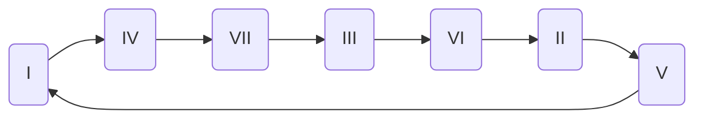

<!--more-->

按照三度音程关系或非三度音程关系，三个以上音的结合，称为**和弦**。

## 三和弦

按照三度音程关系重叠起来的三个音构成的和弦称为**三和弦**。

三和弦有四种：大三和弦、小三和弦、增三和弦、减三和弦。大、小三和弦是协和的，因此使用最多；增、减三和弦是不协和的，因此使用较少。

### 大三和弦

在大三和弦中，从根音到三音是大三度，从三音到五音是小三度。那么，从根音到五音是纯五度。

由基本音级构成的三和弦中，仅 I、IV、V 级和弦是大三和弦。在 C 调下，它们分别记作 C、F、G。

### 小三和弦

在小三和弦中，从根音到三音是小三度，从三音到五音是大三度。那么，从根音到五音是纯五度。

由基本音级构成的三和弦中，仅 II、III、VI 级和弦是小三和弦。在 C 调下，它们分别记作 Dm、Em、Am。

### 增三和弦

在增三和弦中，从根音到三音和从三音到五音都是小三度。那么，从根音到五音是增五度。

仅靠基本音级无法构成增三和弦。因此，增三和弦只能由小三和弦的五音升高半音构成。

### 减三和弦

在减三和弦中，从根音到三音和从三音到五音都是大三度。那么，从根音到五音是减五度。

由基本音级构成的三和弦中，仅 VII 级和弦是减三和弦。在 C 调下，它记作 Bo。

|  三和弦  |  三音  |  五音  |        命名        |     举例      |
| :------: | :----: | :----: | :----------------: | :-----------: |
| 大三和弦 | 大三度 | 纯五度 |         X          |    C、F、G    |
| 小三和弦 | 小三度 | 纯五度 |         Xm         |  Dm、Em、Am   |
| 增三和弦 | 小三度 | 增五度 | X+ (X+) |               |
| 减三和弦 | 大三度 | 减五度 | Xo (Xo) | Bo |

## 七和弦

按照三度音程关系重叠起来的四个音构成的和弦称为**七和弦**。

常用的七和弦有：大大七和弦（大七和弦）、大小七和弦、小小七和弦（小七和弦）、减小七和弦（半减七和弦）、减减七和弦（减七和弦）。所有的七和弦都是不协和和弦，因为它必然包括不协和音程七度音程。

### 大大七和弦

在大大七和弦中，根音到五音构成大三和弦，根音到七音是大七度。

由基本音级构成的七和弦中，仅 I、IV 级和弦是大大七和弦。在 C 调下，它们分别记作 Cmaj7、Fmaj7。

### 大小七和弦

在大小七和弦中，根音到五音构成大三和弦，根音到七音是小七度。

由基本音级构成的七和弦中，仅 V 级和弦是大小七和弦。在 C 调下，它记作 G7。

### 小小七和弦

在小小七和弦中，根音到五音构成小三和弦，根音到七音是小七度。

由基本音级构成的七和弦中，仅 II、III、VI 级和弦是小小七和弦。在 C 调下，它们分别记作 Dm7、Em7、Am7。

### 减小七和弦

在减小七和弦中，根音到五音构成减三和弦，根音到七音是小七度。

由基本音级构成的七和弦中，仅 VII 级和弦是减小七和弦。在 C 调下，它记作 Bm7(b5)。

### 减减七和弦

在减减七和弦中，根音到五音构成减三和弦，根音到七音是减七度。

仅靠基本音级无法构成减减七和弦。因此，减减七和弦只能由减小七和弦的七音降低半音构成。

|   七和弦   |  三音  |  五音  |  七音  |             命名             |                      举例                      |
| :--------: | :----: | :----: | :----: | :--------------------------: | :--------------------------------------------: |
| 大大七和弦 | 大三度 | 纯五度 | 大七度 |   Xmaj7 (Xmaj7)   |       Cmaj7、Fmaj7       |
| 大小七和弦 | 大三度 | 纯五度 | 小七度 |      X7 (X7)      |                 G7                  |
| 小小七和弦 | 小三度 | 纯五度 | 小七度 |     Xm7 (Xm7)     | Dm7、Em7、Am7 |
| 减小七和弦 | 小三度 | 减五度 | 小七度 | Xm7(b5) (Xm7(b5)) |               Bm7(b5)               |
| 减减七和弦 | 小三度 | 减五度 | 减七度 |   Xdim7 (Xdim7)   |                                                |

## 转位和弦

以根音为最低音的和弦称为**原位和弦**；反之，不以根音为最低音的和弦称为**转位和弦**。

转位和弦通过将和弦中的三音、五音（或七音）进行转位，使得和弦的根音不是和弦的最低音，从而产生不同的和声效果。

转位和弦的命名规则是，用 `/` 号将原位和弦名和转位和弦的最低音隔开。

### 三和弦的转位和弦

在三和弦中，除根音之外就是三音和五音，只有它们可以进行转位。以三音为低音的和弦称为**第一转位和弦**，以五音为低音的和弦称为**第二转位和弦**，以此类推。三和弦的第一转位和弦也叫**六和弦**，三和弦的第二转位和弦也叫**四六和弦**。

之所以称三和弦的第一转位和弦为六和弦，是因为根音与三音之间的音程发生了转位。在大三和弦中，根音与三音之间是大三度，转位后变成小六度；在小三和弦中，根音与三音之间是小三度，转位后变成大六度。之所以又称三和弦的第二转位和弦为四六和弦，是因为根音与五音之间从原来的纯五度，转位后变成纯四度。增三和弦和减三和弦的情况类似。

### 七和弦的转位和弦

在七和弦中，除根音之外还有三音、五音和七音。以三音为低音的七和弦称为**五六和弦**；以五音为低音的七和弦称为**三四和弦**，以七音为低音的七和弦称为**二和弦**。

之所以称七和弦的第一转位和弦为五六和弦，同样也是因为根音与三音之间的音程发生了转位，这里的“六度”也是因为三度的转位而来。不过三音和七音之间是五度，没有发生转位，所以合在一起叫“五六和弦”。同理，之所以称七和弦的第二转位和弦为三四和弦，也是因为根音和五音之间的音程发生了转位，这里的“四度”也是因为五度的转位而来。不过五音和七音之间是三度，没有发生转位，所以合在一起叫“三四和弦”。至于七和弦的第三转位和弦，因为根音和七音之间由原来的七度，转位后变成二度，所以叫“二和弦”。

## 柱式和弦和分解和弦

**柱式和弦**是将和弦中的所有音符同时演奏的方式，而**分解和弦**是将和弦中的各个音符按照一定的旋律演奏的方式。

柱式和弦通常会产生一种稳定、强烈的和声效果，可以很好地支撑旋律。柱式和弦在钢琴、吉他等乐器上经常使用，用于加强和弦的和声质感。

分解和弦通常会产生一种流动感和连贯感，使得和弦的每个音符更清晰地呈现出来，常用于装饰性伴奏和旋律的填充。

### 分解和弦的应用：强力和弦

在使用三和弦作为钢琴曲的伴奏时，通常会选择省略不弹三音，转而选择弹比根音高八度的音。这样只由根音和五音构成的和弦称为五和弦或**强力和弦**，例如 C2-G2-C3、G2-D3-G3 等，分别记作 C5、G5。

严格来说，强力和弦并不是和弦，因为它不符合和弦至少包含三个及以上音的要求。不过，五和弦由于没有决定和弦性质的三音，它几乎适用于各种音乐作品。

在钢琴演奏中使用强力和弦来伴奏，常常采用分解和弦的形式。根音决定和弦的性质；而五音则用于稳定和弦，使和弦更加饱满；最后再接一个高八度的根音，就使得音域更加辽阔宽广。

## 等和弦

等和弦和[等音程](../音程#等音程)类似，也是由于等音变化产生的。

例如 VII 级增三和弦 B+，实际上它的五音应该是 G。但是 VII 级三和弦的音名应该是 B-D-F，所以五音 G 就需要使用重升 F 来表示，这样就可以和音名 B-D-F 对应起来，与 B-D-G 形成等和弦。

## 调式中的和弦

> 学习本小节前，建议先了解[调式](../调式)一章和[调式中的音程](../音程#调式中的音程)一节。

如果以调式中的主音为根音构成和弦，会有怎样的规律呢？以自然大调的各音阶为根音构成三和弦为例，请看下表：

| 根音 | 号数 |   名称   |   类型   |
| :--: | :--: | :------: | :------: |
|  do  |  I   |  主和弦  | 大三和弦 |
|  re  |  II  | 上主和弦 | 小三和弦 |
|  mi  | III  |  中和弦  | 小三和弦 |
|  fa  |  IV  | 下属和弦 | 大三和弦 |
| sol  |  V   |  属和弦  | 大三和弦 |
|  la  |  VI  | 下中和弦 | 小三和弦 |
|  si  | VII  |  导和弦  | 减三和弦 |

由于 C 自然大调的第 I、V、VII 级和弦是大三和弦，此时我们统称其为**正三和弦**，而称其他的三和弦为**副三和弦**。

类似地，我们可以得到 a 自然小调的第 I、IV、V 级和弦是小三和弦，第 III、VI、VII 级和弦是大三和弦，第 II 级和弦是减三和弦。

对于七和弦来说，常用的有属七和弦和导七和弦。属七和弦 G7 是大小七和弦，导七和弦 Bm7(b5) 是减小七和弦，恰好都是由基本音级构成。

| 根音 | 号数 |   名称   |    类型    |
| :--: | :--: | :------: | :--------: |
|  do  |  I   |  主和弦  |  大七和弦  |
|  re  |  II  | 上主和弦 |  小七和弦  |
|  mi  | III  |  中和弦  |  小七和弦  |
|  fa  |  IV  | 下属和弦 |  大七和弦  |
| sol  |  V   |  属和弦  |  属七和弦  |
|  la  |  VI  | 下中和弦 |  小七和弦  |
|  si  | VII  |  导和弦  | 半减七和弦 |

在调式中，只需要考虑基本音级作为根音构成和弦的情况。因此，在和弦的记法中，就无必要特别指出和弦的音程关系了，只需要写出号数和名称即可。同时，有了调式的存在，我们在使用和弦时，通常只会选择构成调式的音作为和弦的音。

例如，C 大调的 I 级三和弦直接写作 I。这里省略了数字 3，且三和弦不需要特别强调这个音程关系是三度，直接简称为 I 级和弦即可。其一级转位和弦是六和弦，直接写作 I6 即可，而无须写作 C/E。同理，其二级转位和弦是四六和弦，直接写作 I64 即可，而无须写作 C/G。

七和弦则直接写作 I7 即可，而无须写作 Cmaj7。其一级转位和弦是五六和弦，直接写作 I65 即可，而无须写作 Cmaj7/E。同理，其二级转位和弦和三级转位和弦分别直接写作 I43 和 I2。

## 和弦进行

和弦进行是指在音乐作品中和弦按照一定的顺序和规律依次连接和转换的过程。它是音乐和声语言的重要组成部分，对音乐的风格、情感表达和结构发展都有着关键的作用。

一般来说，大多数音乐（特别是流行音乐）的和弦进行遵循如下规律：

- I 级和弦有让音乐开启或终止的功能。
  - IV 级和弦也有让音乐开启的功能。
- V 级属七和弦有强烈的使音乐回到 I 级和弦的倾向。

首先，I 级和弦之所以有让音乐开启的功能，是因为 I 级和弦的根音是调式的主音。在音乐的开头使用 I 级和弦，可以让听众很容易地识别出调式，从而为音乐的情感表达和结构发展奠定基础。

其次，IV 级和弦也有让音乐开启的功能，这是因为 IV 级和弦的五音一定是调式的主音（IV 级和弦的根音与 I 级和弦之间是纯四度，而 IV 级和弦的五音与根音之间又是纯五度，故得出此结论）。虽然它不像 I 级和弦那样具有强烈的稳定感，但它可以为音乐营造一种期待感和流动感。

注意到 I 级和弦有让音乐终止的功能，这一点很好理解，因为大多数音乐都以主音结束。那为什么 IV 级和弦没有让音乐终止的功能呢？因为它并不以主音为根音，主音只是作为其五音出现，用于过渡到其他和弦。

最后谈谈为什么 V 级属七和弦有强烈的使音乐回到 I 级和弦的倾向。我们以 C 大调为例，则其 V 级属七和弦为 G-B-D-F，其七音为 F，而再以 F 为根音的三和弦 F-A-C，其五音正好就是 C。这就从理论上说明了为什么 V 级属七和弦有强烈的使音乐回到 I 级和弦的倾向。

### 万能公式

基于上述分析，我们不难发现一个规律：每个属七和弦都有想过渡到比它小四级的和弦的倾向。例如 VI7 --> II、I7 --> IV 等等。即使在调式中，属七和弦只有 V 级和弦一个，其他七和弦也可以强行把自己当成是属七和弦，把自己过渡到比它小四级的和弦中去。基于此，一个大胆的想法是，从 I 级和弦开始，不断地回溯比其大四级的和弦，这样会得到怎样的一个和弦进行呢？

这样一来，就符合了前文提到的和弦进行的规律：开头是 I/IV 级和弦，结尾是 I 级和弦，倒数第二个是 V 级属七和弦。如果再往前回溯，则又回到了 I 级和弦！考虑到和弦进行的循环，完全可以将开头的 I 级和弦放在最后，组成一个 4736251 的和弦进行。

最后，注意到这里有一个 VII 级和弦，这是一个减三和弦，没有其他的三和弦协和。所以，将其替换成 V 级和弦，因为（C 调下）VII 级和弦是 B-D-F，而 V 级属七和弦是 G-B-D-F，二者只有根音不同，其他音都是一样的。这样，我们就得到了一个 4536251 的和弦进行，它被誉为和弦的**万能公式**。

使用和弦的万能公式，几乎可以为绝大多数歌曲，特别是流行音乐伴奏。

### 卡农

*Canon*《卡农》是法国作曲家 *J.S.Bach*（帕赫贝尔）创作的一首合唱曲，它以 15634125 或 15634145 的和弦进行为基础。两者的区别在于，前者的 125 中有小三和弦 II，而后者的 145 则都是大三和弦。将这一和弦进行反复地重复，就形成了一种独特的音乐效果。

如图所示，这里节选了《卡农》最开头的部分，正好符合 15634125 的和弦进行。仔细看每个和弦中的最下方音，这个《卡农》独有的逆向自然大调的音阶特色。具体来说，将奇数位置出现的和弦的根音下移八度，将偶数位置出现的和弦的三音下移八度或两个八度，使整个和弦的根音恰好形成 C4-B3-A3-G3-F3-E3-D3 的音阶。最后和弦进行至 G 和弦时，又将音阶升高回到 B3，但比主音 C4 低半音。这样，就形成了一个逐级递减而又回还悠长的旋律。
