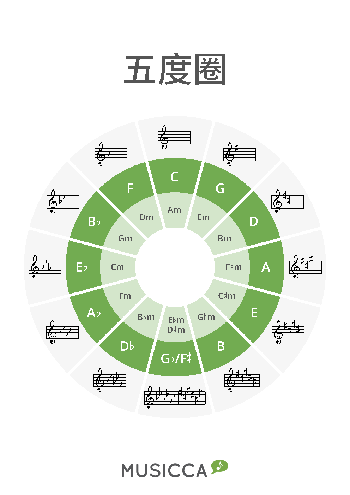

<!--more-->

**调性**是调的主音和调式类别的总称。确认了调性之后，才可以根据唱名（do-re-mi-fa-sol-la-si）确定音名（即在钢琴上的位置）。

在[调式](../调式)一章中，我们给出了**调**的定义：由基本音级所构成的音序列的音高位置。下面我们举例说明帮助回顾和理解这些概念。

“C 调”的中心语是“调”，C 是定语。所以它对应的应该是“调”这个概念，它只是规定了基本音级所构成的音序列的音高位置。具体来说，就是钢琴键盘上的 C-D-E-F-G-A-B 这七个音。换而言之，只要是这七个音，无论它们的次序如何，都可以称为“C 调”。所以，“C 调”是一个范围很大的概念。由 C 调中的音构成的调式都属于 C 调，例如 C 大调、a 小调、C 宫调、D 商调、E 角调、G 徵调、A 羽调等。

“C 大调”则是一个从属于 C 调的概念，它的中心语是“大调”，而大调是一种调式。C 是定语，它规定了调的主音的音高位置。所以，“C 大调”就是一种调性，是一个范围相较于调和调式都要更具体的概念。

## 大调调性

我们已经知道大调调式为“全全半全全全半”。那么，由十二平均律可知，任取一个音作为主音，可以得到 12 种不同的大调调性。命名的规则是：将主音所在音名作为主音，其余音名依次按照大调调性音阶序列进行命名。例如，将 C 作为主音，则 C 大调音阶为 C-D-E-F-G-A-B-C。

此外，如果发生了升降音，则该升降音的命名以正好凑满七个音名为准。例如，G 大调的音阶为 G-A-B-C-D-E-F#-G，其中 F# 的命名以正好凑满七个音名为准，而不是命名为 Gb，尽管 F# 和 Gb 是同一个音。

下表显示了基于十二平均律，以十二种不同的音作为主音，所形成的十二种大调调性。

| 主音  | 主音与 C 大调的音程关系 | 调性命名 | do 所在音名 |
| :---: | :---------------------: | :------: | :---------: |
|   C   |         纯一度          |    C     |     C4      |
| C#/Db |         小二度          | Db (C#)  |     Db4     |
|   D   |         大二度          |    D     |     D4      |
| D#/Eb |         小三度          |    Eb    |     Eb4     |
|   E   |         大三度          |    E     |     E4      |
|   F   |         纯四度          |    F     |     F4      |
| F#/Gb |      增四度/减五度      |  F#/Gb   |   F#4/Gb4   |
|   G   |         纯五度          |    G     |     G4      |
| G#/Ab |         小六度          |    Ab    |     Ab4     |
|   A   |         大六度          |    A     |     A4      |
| A#/Bb |         小七度          |    Bb    |     Bb3     |
|   B   |         大七度          |  B (Cb)  |     B3      |

### C 大调

以 C4 作为主音，则 C 大调音阶为 C-D-E-F-G-A-B-C。C 大调是唯一一个没有升降音的大调调性，所以在五线谱中什么都不需要标记。


X: 1
T: C 大调音阶
M: 4/4
L: 1
K: C
C | D | E | F | G | A | B | c ||


### G 大调

以 G4 作为主音，则 G 大调音阶为 G-A-B-C-D-E-F#-G。G 大调只有 F# 一个变化音，所以在五线谱中标记一个升号。这个升号标注在高音谱表中位于 F5 的位置。


X: 2
T: G 大调音阶
M: 4/4
L: 1
K: G
G | A | B | c | d | e | f | g ||


### F 大调

以 F4 作为主音，则 F 大调音阶为 F-G-A-Bb-C-D-E-F。F 大调有 Bb 一个变化音，所以在五线谱中标记一个降号。这个降号标注在高音谱表中位于 B4 的位置。


X: 3
T: F 大调音阶
M: 4/4
L: 1
K: F
F | G | A | B | c | d | e | f ||


### D 大调

以 D4 作为主音，则 D 大调音阶为 D-E-F#-G-A-B-C#-D。D 大调有 F# 和 C# 两个变化音，所以在五线谱中标记两个升号。这两个升号标注在高音谱表中位于 F5 和 C5 的位置。


X: 4
T: D 大调音阶
M: 4/4
L: 1
K: D
D | E | F | G | A | B | c | d ||


### Bb 大调

以 Bb3 作为主音，则 Bb 大调音阶为 Bb-C-D-Eb-F-G-A-Bb。Bb 大调有 Bb 和 Eb 两个变化音，所以在五线谱中标记两个降号。这两个降号标注在高音谱表中位于 B4 和 E5 的位置。


X: 5
T: Bb 大调音阶
M: 4/4
L: 1
K: Bb
B, | C | D | E | F | G | A | B ||


### A 大调

以 A4 作为主音，则 A 大调音阶为 A-B-C#-D-E-F#-G#-A。A 大调有 C#、F# 和 G# 三个变化音，所以在五线谱中标记三个升号。这三个升号标注在高音谱表中位于 C5、F5 和 G5 的位置。


X: 6
T: A 大调音阶
M: 4/4
L: 1
K: A
A | B | c | d | e | f | g | a ||


### Eb 大调

以 Eb4 作为主音，则 Eb 大调音阶为 Eb-F-G-Ab-Bb-C-Db-Eb。Eb 大调有 Eb、Ab 和 Bb 三个变化音，所以在五线谱中标记三个降号。这三个降号标注在高音谱表中位于 A4、B4 和 E5 的位置。


X: 7
T: Eb 大调音阶
M: 4/4
L: 1
K: Eb
E | F | G | A | B | c | d | e ||


### E 大调

以 E4 作为主音，则 E 大调音阶为 E-F#-G#-A-B-C#-D#-E。E 大调有 F#、G#、C# 和 D# 四个变化音，所以在五线谱中标记四个升号。这四个升号标注在高音谱表中位于 C5、D5、F5 和 G5 的位置。


X: 8
T: E 大调音阶
M: 4/4
L: 1
K: E
E | F | G | A | B | c | d | e ||


### Ab 大调

以 Ab4 作为主音，则 Ab 大调音阶为 Ab-Bb-C-Db-Eb-F-G-Bb。Ab 大调有 Ab、Bb、Db 和 Eb 四个变化音，所以在五线谱中标记四个降号。这四个降号标注在高音谱表中位于 A4、B4、D5 和 E5 的位置。


X: 9
T: Ab 大调音阶
M: 4/4
L: 1
K: Ab
A | B | c | d | e | f | g | a ||


### B 大调

以 B3 作为主音，则 B 大调音阶为 B-C#-D#-E-F#-G#-A#-B。B 大调有 C#、D#、F#、G# 和 A# 五个变化音，所以在五线谱中标记五个升号。这五个升号标注在高音谱表中位于 A4、C5、D5、F5 和 G5 的位置。


X: 10
T: B 大调音阶
M: 4/4
L: 1
K: B
B, | C | D | E | F | G | A | B ||


### Db 大调

以 Db4 作为主音，则 Db 大调音阶为 Db-Eb-F-Gb-Ab-Bb-C-Db。Db 大调有 Db、Eb、Gb、Ab 和 Bb 五个变化音，所以在五线谱中标记五个降号。这五个降号标注在高音谱表中位于 G4、A4、B4、D5 和 E5 的位置。


X: 11
T: Db 大调音阶
M: 4/4
L: 1
K: Db
D | E | F | G | A | B | c | d ||


### F# 大调

以 F#4 作为主音，则 F# 大调音阶为 F#-G#-A#-B-C#-D#-E#-F#。F# 大调有 F#、G#、A#、C#、D# 和 E# 六个变化音，所以在五线谱中标记六个升号。这六个升号标注在高音谱表中位于 A4、C5、D5、E5、F5 和 G5 的位置。


X: 12
T: F# 大调音阶
M: 4/4
L: 1
K: F#
F | G | A | B | c | d | e | f ||


### Gb 大调

以 Gb4 作为主音，则 Gb 大调音阶为 Gb-Ab-Bb-Cb-Db-Eb-F-Gb。Gb 大调有 Gb、Ab、Bb、Cb、Db 和 Eb 六个变化音，所以在五线谱中标记六个降号。这六个降号标注在高音谱表中位于 G4、A4、B4、C5、D5 和 E5 的位置。


X: 13
T: Gb 大调音阶
M: 4/4
L: 1
K: Gb
G | A | B | c | d | e | f | g ||




F# 大调和 Gb 大调是等音调，在音高上完全相同。



### C# 大调

以 C#4 作为主音，则 C# 大调音阶为 C#-D#-E#-F#-G#-A#-B#-C#。C# 大调相当于在 C 大调的基础上将所有的音都升高半音，所以在五线谱中标记七个升号。这七个升号标注在高音谱表中位于 A4、B4、C5、D5、E5、F5 和 G5 的位置。


X: 14
T: C# 大调音阶
M: 4/4
L: 1
K: C#
C | D | E | F | G | A | B | c ||


### Cb 大调

以 Cb4 作为主音，则 Cb 大调音阶为 Cb-Db-Eb-Fb-Gb-Ab-Bb-Cb。Cb 大调相当于在 C 大调的基础上将所有的音都降低半音，所以在五线谱中标记七个降号。这七个降号标注在高音谱表中位于 F4、G4、A4、B5、C5、D5 和 E5 的位置。


X: 15
T: Cb 大调音阶
M: 4/4
L: 1
K: Cb
C | D | E | F | G | A | B | c ||




若无特殊需要，一般不会使用 C# 大调和 Cb 大调来编写音乐。

实际上，C# 大调和 Db 大调是等音调，在音高上完全相同；同理，Cb 大调和 B 大调是等音调，在音高上完全相同。



## 小调调性

同理，以不同的音作为自然小调的主音，我们也可以得到十二种不同的小调调性。


X: 16
T: 所有小调音阶
M: 4/4
L: 1/4
K:C
V:1 treble nm="A小调"
[K:Amin] A, B, C D | E F G A ||
V:2 treble nm="E小调"
[K:Emin] E F G A | B c d e ||
V:3 treble nm="D小调"
[K:Dmin] D E F G | A B c d ||
V:4 treble nm="B小调"
[K:Bmin] B, C D E | F G A B ||
V:5 treble nm="G小调"
[K:Gmin] G A B c | d e f g ||
V:6 treble nm="F#小调"
[K:F#min] F G A B | c d e f ||
V:7 treble nm="C小调"
[K:Cmin] C D E F | G A B c ||
V:8 treble nm="C#小调"
[K:C#min] C D E F | G A B c ||
V:9 treble nm="F小调"
[K:Fmin] F G A B | c d e f ||
V:10 treble nm="G#小调"
[K:G#min] G A B c | d e f g ||
V:11 treble nm="Bb小调"
[K:Bbmin] B, C D E | F G A B ||
V:12 treble nm="D#小调"
[K:D#min] D E F G | A B c d ||
V:13 treble nm="Eb小调"
[K:Ebmin] E F G A | B c d e ||
V:14 treble nm="A#小调"
[K:A#min] A, B, C D | E F G A ||
V:15 treble nm="Ab小调"
[K:Abmin] A, B, C D | E F G A ||


> 类似地，这里 D# 小调和 Eb 小调是等音调，A# 小调和 Ab 小调是等音调。通常不使用 A# 小调和 Ab 小调来编写音乐。

| 主音  | 主音与 a 小调的音程关系 | 调性命名 | la 所在音名 |
| :---: | :---------------------: | :------: | :---------: |
|   A   |         纯一度          |    Am    |     A4      |
| A#/Bb |         小二度          |   Bbm    |     Bb3     |
|   B   |         大二度          |    Bm    |     B3      |
|   C   |         小三度          |    Cm    |     C4      |
| C#/Db |         大三度          |   C#m    |     Db4     |
|   D   |         纯四度          |    Dm    |     D4      |
| D#/Eb |      增四度/减五度      | D#m/Ebm  |   D#4/Eb4   |
|   E   |         纯五度          |    Em    |     E4      |
|   F   |         小六度          |    Fm    |     F4      |
| F#/Gb |         大六度          |   F#m    |     F#4     |
|   G   |         小七度          |    Gm    |     G4      |
| G#/Ab |         大七度          |   G#m    |     G#4     |

### 关系大小调

调号相同的大调和小调互称关系大小调。例如，C 大调与 a 小调互称关系大小调。构成关系大小调的音完全相同，只不过调式不同。两种调式的主音永远相差**小三度**，大调在上，小调在下。因此，在确定小调时，通常都是先找出它的关系大调，再将其主音降低小三度。

## 调性五度圈

在调性五度圈中，外圈表示大调，内圈表示小调。具有相同主音的不同的调式位于同一方向上。为了统一命名方式和五线谱的表示，规定以前七个调（C、G、D、A、E、B、F#）为主音的调性用升号 # 标记五线谱的升降，后五个调（Db、Ab、Eb、Bb、F）为主音调性用降号 b 标记五线谱的升降。

从五度圈的 12 点出发（即 C 大调 / A 小调的位置），顺时针旋转表示主音升高纯五度，逆时针旋转表示降低纯五度。而至于各调性的主音，除 B 大调和 Bb 大调外，其余各大调的主音均相对 C 大调升高。

## 转调

在音乐作品中，从一个调转换到另一个调，或从一种调式转换到另一种调式，称为**转调**。具体来说，通常包括以下几种情况：

1. 在谱表中，调号显式地发生了改变。这种情况肯定是发生了转调。
2. 有些音以临时变音记号的形式出现，这通常被称为**离调**。这种情况较难判断，因为有可能是[调式变音](../调式/#调式变音)。
3. 有些转调既不见调号改变，也不见临时升降号，但却发生了调式的转变。

对于发生调号改变的转调，还可以分为近关系转调和远关系转调两种情况。例如 C 大调和 G 大调之间只差一个升号，因此从 C 大调转到 G 大调称为向上近关系转调；C 大调和 F 大调之间只差一个降号，因此从 C 大调转到 F 大调称为向下近关系转调。一般来说，两个调共同的音越多，关系越近。

关系大小调的转调和同宫系统的转调，调号不变，只改变调式和主音，这属于近关系中的近关系，是特近关系。

而至于远关系转调，一个典型的例子是同主音的自然大小调的转调，如 C 大调和 c 小调，二者永远相差三个升降号。

## 移调

在音乐作品中，将一个调的音升高或降低若干度，称为**移调**。简单来说，只要能够将主音升高或降低若干度，就可以实现移调。

移调中面临的一个难题是在原调有临时变音记号的情况下，如何正确地使用相应的变音记号。
