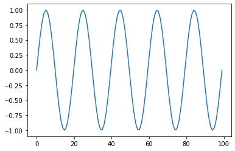
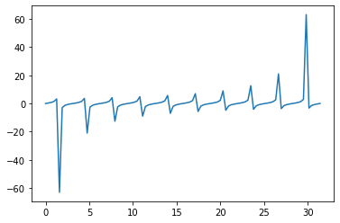

<!--more-->

**IPython** 是一种基于 **Python** 的交互式解释器，提供了强大的编辑和交互功能。

## `?`: 对象内省

在对象后面加上 `?`，可以打印出该对象的详细信息。例如一个列表对象，打印出该对象的类型、长度等信息。


```python
obj = [1, 2, 3]
obj?
```


    Type:        list
    String form: [1, 2, 3]
    Length:      3
    Docstring:  
    list() -> new empty list
    list(iterable) -> new list initialized from iterable's items
    


`??` 和 `?` 功能相似，不过 `??` 还可以查看函数或模块对象的源代码。


```python
def foo(num):
    x = num
    print(x)
```


```python
foo??
```


    Signature: foo(num)
    Docstring: <no docstring>
    Source:   
    def foo(num):
        x = num
        print(x)
    File:      ~/文档/Jupyter-Notebook/Python Basics/Advanced/<ipython-input-2-46f951045f2c>
    Type:      function
    


## `!`: 执行 Shell 命令

Shell 表示使用命令行文本与计算机操作系统交互的方式。在 **IPython** 中，Shell 命令前加上感叹号 `!` 就可以在 IPython Kernel 中直接执行。例如 ping 百度的 IP 地址：


```python
! ping -c 4 www.baidu.com
```

    PING www.a.shifen.com (36.152.44.95) 56(84) bytes of data.
    64 比特，来自 36.152.44.95 (36.152.44.95): icmp_seq=1 ttl=55 时间=43.3 毫秒
    64 比特，来自 36.152.44.95 (36.152.44.95): icmp_seq=2 ttl=55 时间=71.4 毫秒
    64 比特，来自 36.152.44.95 (36.152.44.95): icmp_seq=3 ttl=55 时间=73.3 毫秒
    64 比特，来自 36.152.44.95 (36.152.44.95): icmp_seq=4 ttl=55 时间=125 毫秒
    
    --- www.a.shifen.com ping 统计 ---
    已发送 4 个包， 已接收 4 个包, 0% 包丢失, 耗时 3003 毫秒
    rtt min/avg/max/mdev = 43.341/78.204/124.714/29.360 ms
    

## `%`: 魔法命令

魔法命令分为两种：

- Line magics: 只有一个百分号 `%` 表示只在本行有效
- Cell magics: 两个百分号 `%%` 表示在整个 Cell 单元有效

### run 运行脚本

在 **IPython** 会话环境中，`py` 文件可以通过 `%run` 命令当作 **Python** 程序直接运行。

当前文件夹下的 `src/` 目录下有一个 `test.py` 文件，我们来看看它的内容——可以直接用 `!` 执行 Shell 命令：


```python
! cat ./src/test.py
```

    print('Hello World!')

下面我们来执行这个 Python 脚本：


```python
%run ./src/test.py
```

    Hello World!
    

### timeit 测量代码运行时间

`%timeit` 可以测量一行代码的运行时间：


```python
%timeit sum([i**2 for i in range(1000)])
```

    242 µs ± 457 ns per loop (mean ± std. dev. of 7 runs, 1000 loops each)
    

`%%timeit` 可以测量一个 Cell 代码的运行时间：


```python
%%timeit
obj = []
for i in range(1000):
    obj.append(i**2)
sum(obj)
```

    290 µs ± 289 ns per loop (mean ± std. dev. of 7 runs, 1000 loops each)
    

### 科学计算与交互

在 notebook 中绘制图像时，使用 `%matplotlib inline` 命令可以将图表直接嵌入到 notebook 中，方便查看。


```python
%matplotlib inline
```


```python
import numpy as np
import matplotlib.pyplot as plt

plt.plot(np.sin(np.linspace(0, 10*np.pi, 100)))
```


    [<matplotlib.lines.Line2D at 0x7f86fb26cb38>]


    

    


`%pylab` 魔法命令可以使 numpy 和 matplotlib 中的科学计算功能生效，这些功能被称为基于向量和矩阵的高效操作，交互可视化特性。它能够让我们在控制台进行交互式计算和动态绘图。


```python
%pylab
```

    Using matplotlib backend: Qt5Agg
    Populating the interactive namespace from numpy and matplotlib
    


```python
x = linspace(0, 10*np.pi, 100)
plot(x, tan(x))
```


    [<matplotlib.lines.Line2D at 0x7f86f56c8358>]


    

    


### quickref 参考帮助


```python
%quickref
```

### Python 脚本操作

`%pycat <filename>` 用语法高亮显示一个 Python 脚本（不用加 `.py` 后缀名）。


```python
%pycat ./src/foo
```


    def foo():
        print('Hello World!')
    


`%load` 命令用于将脚本代码加载到当前 Cell。执行后，自动加载代码到当前 Cell 中。


```python
# %load ./src/foo
def foo():
    print('Hello World!')
```

### precision 浮点数精度

`%precision` 命令用来设置浮点数精度，可添加具体参数，无参数则默认精度。


```python
%precision 3
```


    '%.3f'


```python
from math import pi
pi
```


    3.142


### 变量与对象操作

`%who` 命令用于显示当前所有变量，你也可以指定显示变量的类型。


```python
%who
```

    foo	 obj	 pi	 x	 
    

`%whos` 命令同样用于显示当前变量，但提供的信息更加丰富。


```python
%whos
```

    Variable   Type        Data/Info
    --------------------------------
    foo        function    <function foo at 0x7f86f4107378>
    obj        list        n=3
    pi         float       3.141592653589793
    x          ndarray     100: 100 elems, type `float64`, 800 bytes
    

`%xdel` 命令用于删除变量，并尝试清楚其在IPython中的对象上的一切引用。


```python
%xdel x
```

`%reset -f` 命令用于删除定义的所有变量，如果不指定参数 `-f`，则需要确认后再重置。


```python
%reset -f
```

## 输入和输出

- `In` 对象是一个列表，按照顺序记录所有的命令
- `Out` 对象不是一个列表，而是一个字典，它将输入数字映射到相应的输出（如果有的话）


```python
In
```


    ['',
     "obj = [1, 2, 3]\nget_ipython().run_line_magic('pinfo', 'obj')",
     'def foo(num):\n    x = num\n    print(x)',
     "get_ipython().run_line_magic('pinfo2', 'foo')",
     "get_ipython().system(' ping -c 4 www.baidu.com')",
     "get_ipython().system(' cat ./src/test.py')",
     "get_ipython().run_line_magic('run', './src/test.py')",
     "get_ipython().run_line_magic('timeit', 'sum([i**2 for i in range(1000)])')",
     "get_ipython().run_cell_magic('timeit', '', 'obj = []\\nfor i in range(1000):\\n    obj.append(i**2)\\nsum(obj)\\n')",
     "get_ipython().run_line_magic('matplotlib', 'inline')",
     'import numpy as np\nimport matplotlib.pyplot as plt\n\nplt.plot(np.sin(np.linspace(0, 10*np.pi, 100)))',
     "get_ipython().run_line_magic('pylab', '')",
     'x = linspace(0, 10*np.pi, 100)\nplot(x, tan(x))',
     "get_ipython().run_line_magic('quickref', '')",
     "get_ipython().run_line_magic('pycat', './src/foo')",
     "# %load ./src/foo\ndef foo():\n    print('Hello World!')",
     "get_ipython().run_line_magic('precision', '3')",
     'from math import pi\npi',
     "get_ipython().run_line_magic('who', '')",
     "get_ipython().run_line_magic('whos', '')",
     "get_ipython().run_line_magic('xdel', 'x')",
     "get_ipython().run_line_magic('reset', '-f')",
     'In']


```python
Out
```


    {22: ['',
      "obj = [1, 2, 3]\nget_ipython().run_line_magic('pinfo', 'obj')",
      'def foo(num):\n    x = num\n    print(x)',
      "get_ipython().run_line_magic('pinfo2', 'foo')",
      "get_ipython().system(' ping -c 4 www.baidu.com')",
      "get_ipython().system(' cat ./src/test.py')",
      "get_ipython().run_line_magic('run', './src/test.py')",
      "get_ipython().run_line_magic('timeit', 'sum([i**2 for i in range(1000)])')",
      "get_ipython().run_cell_magic('timeit', '', 'obj = []\\nfor i in range(1000):\\n    obj.append(i**2)\\nsum(obj)\\n')",
      "get_ipython().run_line_magic('matplotlib', 'inline')",
      'import numpy as np\nimport matplotlib.pyplot as plt\n\nplt.plot(np.sin(np.linspace(0, 10*np.pi, 100)))',
      "get_ipython().run_line_magic('pylab', '')",
      'x = linspace(0, 10*np.pi, 100)\nplot(x, tan(x))',
      "get_ipython().run_line_magic('quickref', '')",
      "get_ipython().run_line_magic('pycat', './src/foo')",
      "# %load ./src/foo\ndef foo():\n    print('Hello World!')",
      "get_ipython().run_line_magic('precision', '3')",
      'from math import pi\npi',
      "get_ipython().run_line_magic('who', '')",
      "get_ipython().run_line_magic('whos', '')",
      "get_ipython().run_line_magic('xdel', 'x')",
      "get_ipython().run_line_magic('reset', '-f')",
      'In',
      'Out']}


