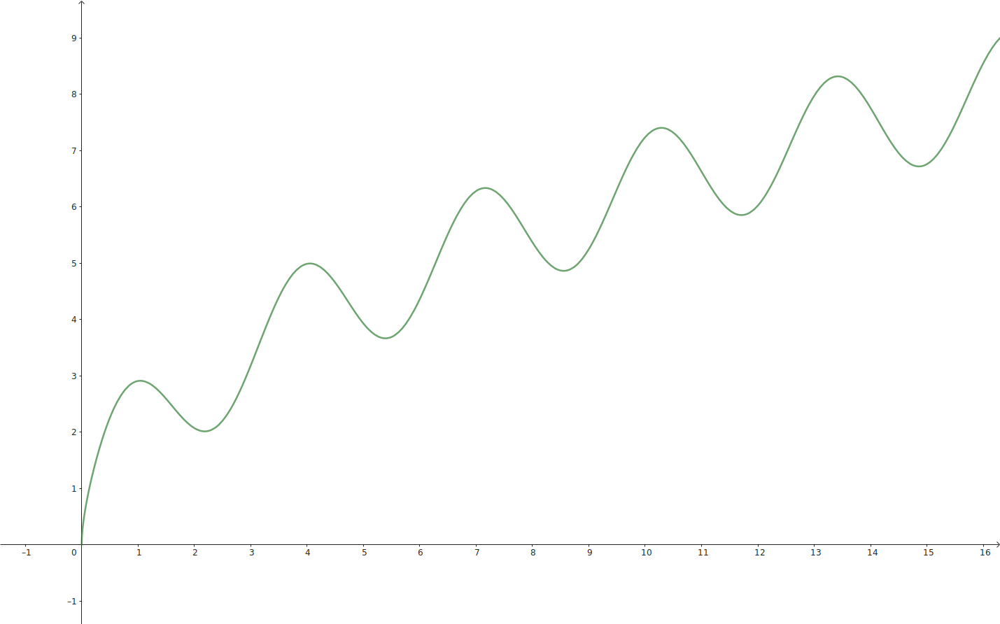

<!--more-->

从本讲开始，沈老师主要讲授爱情作为一种长期关系，如何来经营和维护。

在之前的课程中，沈老师谈了关于差异的问题，关于权责利一致的问题等等，这些都是为我们如何经营爱情这样一种长期关系提供了很好的铺垫。

然而，我们对于爱情关系的想象，总是停留在长期关系开始之前。童话故事中经常有王子和公主冲破重重艰难险阻，终于幸福地在一起了。可是究竟是怎么幸福地在一起，这个故事就不再告诉我们了。偶像剧也是同理，两个人在大结局都会幸福地在一起。可如果故事再往后续，你就会发现它变成了另外一个剧——家庭伦理剧。这里，沈老师甚至愿意称之为家庭狗血剧，是因为各种矛盾层出不穷，例如婆媳矛盾、婚后出轨等。

因此，这些社会现象传达出来的爱情其实是两个极端。在爱情刚开始的时候特别美好，特别激情；而一到后面，特别是进入婚姻之后，就变得鸡飞狗跳。

## 爱情新脚本：加法关系

沈老师反对上述对爱情的理解。沈老师认为，**在爱情新脚本中，过去是减法，现在是加法**。在爱情旧脚本中，我们一旦确认关系，就不会再分开，日子是一天天过，一天天减掉的。但是在爱情新脚本中，沈老师强调它是一个加法关系，每天都需要去经营爱情。

沈老师在这里引出了**爱情体验**的概念。爱情体验和爱情关系不同，爱情关系确立以后，依然需要不断地丰富爱情的体验。

## 错误方向一：用短期关系来处理长期关系

在爱情四象限理论中，沈老师讲过不论爱情从享乐型开始还是从互惠型开始，最终都是朝成长治愈型发展的，而不是停留在最一开始激情的阶段。沈老师在研究中发现，想要回到过去激情的阶段是非常艰难的。

沈老师在之前的课程谈到过爱情的序列理论，她认为爱情刚刚开始的时候双方相互的吸引靠的是激情。我们在刚刚碰到对方的时候，感觉心潮澎湃，一天不见就魂牵梦索，一牵小手就可以激动一宿。这就是激情，这真的是太美好了。

心理学里有一个非常重要的实验，被称之为吊桥理论。人在极度紧张时（如过吊桥）见到他人，会错把此时的心跳加快理解为对方使自己心动，故而滋生出爱情的情愫。

然而，爱情想要一直保持激情是非常非常艰难的。沈老师认为，激情之爱会消耗大量的能量。在长期关系里面，爱情往往不再是你所有生活的重点。长期关系会使得我们无法永远处在奔腾的河流之中，或者处在一个惊险的吊桥之上，因为这本身就不符合长期关系发展的要求。

我们在考虑长期关系的时候，还需要考虑安全感和确定性。瑞士心理学家佩瑞尔认为，我们在考虑长期关系的时候，一方面希望爱情提供一种超然的激情的体验，另一方面希望伴侣是一个稳定可靠的船锚，他能为我们提供安全感和稳定性。这两种需求本身是有冲突的，那么如何解决这两者之间的矛盾？沈老师认为，要让爱情保持新鲜感：

1. 用发展的眼光来看待爱情（成长治愈型关系）
2. 每天30分钟的爱情
3. 相处18个月后重点是互补

## 错误方向二：用亲情的逻辑来处理长期关系

我们常常说，时间长了，我们就左手握右手了，我们就变成亲人了。沈老师结合自身的实践，认为爱情想要转变成亲情其实挺不容易的。

沈老师认为，**亲情的确定性、长久性和稳定性远远高于爱情**。举一个最简单的例子，我们绝对不可能担心自己的妈妈某一天不再爱我了，因为血浓于水，而且我们也不需要用实践证明妈妈还是爱我的。

而爱情是可以变动的，配偶本身也是可以变动的，只是在古代变动的可能性很小。而在今天，这个变动其实是经常出现的。而如果你觉得爱情和亲情差不多，用亲情的逻辑处理爱情，你就会认为我不需要花费时间去经营爱情，因为反正都是固定不变的。这种观点很显然是违背了爱情本身的初衷。

沈老师还认为，用这种逻辑处理长期关系还会出现一个问题就是，我们会觉得在亲情里面大家都是很真实的，也会顺理成章地认为爱情当中也应当是这样，我就是这样的人，你就要接受这样的我。真实性对每个个体关系都会带来很大的冲击。

爱情刚开始时，很多人为了能够进入爱情，常常会有一些表演性的行为。例如，很多女性刚刚谈恋爱时，她的饭量会特别小。因为她一方面想维持自己的形象，另一方面她希望在对方面前展现出一种淑女的形象。可时间一长，一直要去保持这种表演性是非常艰难的，而且也必然会暴露出自己的真实性。然而，在爱情关系中，我们对于那个真实的你是否能够接受是有一个问号的。

## 长期关系经营的主动方式：创造闪亮的日子（仪式感）

沈老师在这里给出了一个具体的处理长期关系的方法——创造仪式感。研究发现，长期关系中爱情的成长并不是一条直线型的，它是起起伏伏的。在峰值处充满了激情，双方非常享受；但是这种激情不能持续很长时间，很快就跌到了谷值处，这个时候就需要仪式感，让感情升温，如此周而复始。因此，我们需要不断地创造仪式感，让爱情在起起伏伏中曲折发展，慢慢走向更高处。

我绘制了函数 \(f(x) = \sin {2x} + \sqrt {4x}\) 的图像，它可以形象地说明上述理论：

沈老师在这里给出了仪式感的概念：郑重其事地去做一些非必要的事情。仪式感其实和游戏差不多，最大的特点就是非必要性。如果是必要的事情，那么就不叫仪式感，而是两个人的责任。仪式感有如下几点重要意义：

1. 再现关系的承诺
2. 稀缺资源的交换

那么，仪式感应该如何创造呢？沈老师给了我们如下几种方法：

1. 模仿影视剧中的桥段
2. 商业社会的灵感（520）
3. 结合自身特色设计

## 问答

{}

是的。当对方反复问你要仪式感时，其实是对爱情的安全感不足。

沈老师建议，你也可以和你的女朋友慢慢讨论说，有的时候我没有做到你想要的这些东西，但并不意味着我不爱你，我觉得我还有别的事情对我们长期关系的发展是更重要的。当你做这个解释的时候，你会发现其实对方也是可以接受的。

其实，一个人对他所处的关系越没有安全感，这种索取的力量就会越来越重，我们是需要去理解的。但话说回来，如果一个人对爱如此得不自信，你需要仔细考虑一下她是不是你很合适的爱情伙伴。

{}

{}

长期关系相对来说是一个较为平稳的状态，而电视剧等需要矛盾和冲突，所以呈现平稳的长期关系的电视剧缺乏可看性。

沈老师认为，稳定而美好的长期关系很少被公开呈现，但并不代表不存在。

{}

{}

沈老师一直觉得她讲授的整门社会学爱情思维课程自始至终都在强调一件事：如何去平衡。沈老师在日常生活中看到太多的二元对立论，她认为二元对立对生活毫无帮助，我们要找到平衡。因此，沈老师不给大家答案，这恰恰就是你要去和对方协商的。

{}

{}

沈老师并不认为仪式感需要克制。

沈老师认为仪式感其实是有大有小的。沈老师举了他和丈夫的例子，疫情期间，她和丈夫组织了“夫妻夜话”活动，每天和丈夫夜聊半小时，并且在网络上直播。她认为这种半小时的夫妻聊天谈心也是仪式感，只不过是个小小的仪式感，很容易就能实现。而像旅游这种大的仪式感，需要提前做好攻略，双方需要协商。

实际上，仪式感很消耗创造力，一般不太可能多到对方受不了。

{}

{}

沈老师认为，有趣的灵魂恰恰就是做那些非必要事情特别有意思的感觉。

{}

{}

沈老师谈过，激情在将来的长期生活是会不断有的。其实那个激情的样子可能和以前不太一样，因为你不太可能和一个人生活10年，看到他还心潮澎湃。沈老师认为，**在长期关系中，激情依然存在，只不过频率和形态发生了变化**。

{}

{}

沈老师建议，如果你遇到了一个直男，就不要培养他的仪式感，你自己有仪式感就可以了。沈老师曾经强调，改变别人是最艰难的一件事情。如果想要仪式感，就自己先创造，不必急于改变别人。

{}

{}

沈老师认为，当我们用亲情的标准去要求爱情时，你会发现你实际上是希望你的丈夫像你爸爸那样来爱你的，但这是完全不可能的。实际上，亲情和爱情并不存在非此即彼的排序，丈夫爱女儿并不代表不爱妻子。

{}